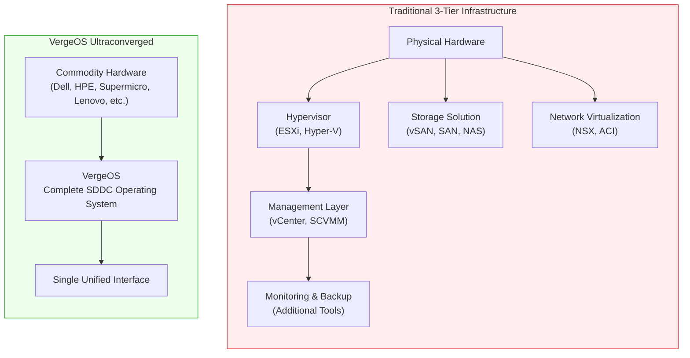
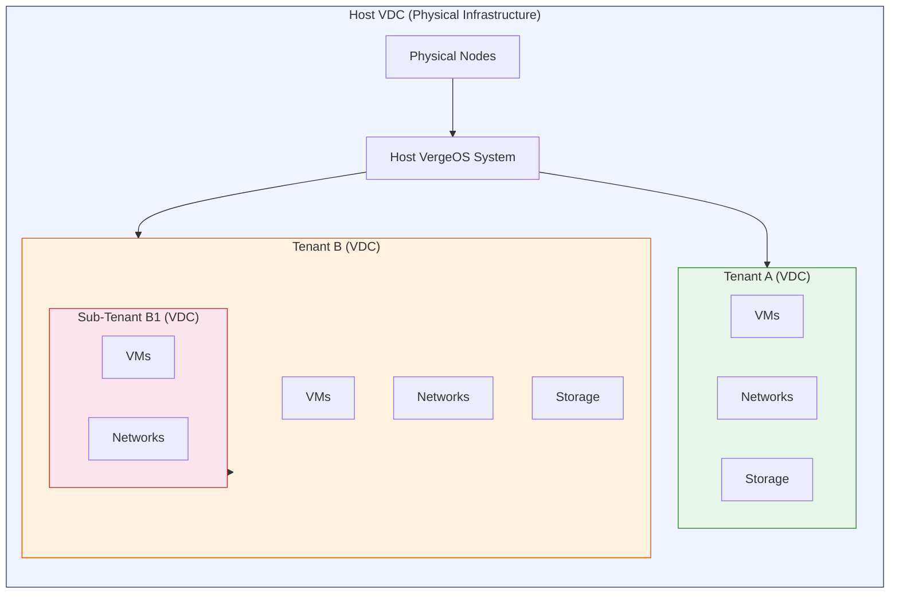

## The Ultraconverged Operating System

VergeOS is an **infrastructure operating system** that converges compute, storage, disaster recovery, networking, and private AI into a single unified platform. Unlike traditional virtualization solutions that require multiple separate components and management tools, VergeOS integrates all data center functions into one codebase -- a single install package that delivers a complete software-defined data center (SDDC).

At its core, every VergeOS installation becomes a **Virtual Data Center (VDC)** -- a portable encapsulation of compute, network, and storage resources that ensures isolation and provides autonomous management within a shared hardware environment.

A platform-to-platform mapping table appears at the end of this page; in-page Bridge callouts elsewhere in the course point back to it for a side-by-side view.

## Core Components

VergeOS is built on three tightly integrated pillars:

### VergeHV -- Compute Virtualization

VergeHV is the integrated **Type-1 hypervisor** at the heart of VergeOS, built on KVM. Unlike hypervisors that operate as separate layers, VergeHV runs in the same OS as storage and networking — there is no separate hypervisor product to install or license.

| Capability                | Details                                                                            |
| ------------------------- | ---------------------------------------------------------------------------------- |
| **Performance**           | Near bare-metal -- direct hardware access with minimal overhead                    |
| **Live Migration**        | Move running VMs between nodes without downtime                                    |
| **Hardware Acceleration** | Intel VT-x / AMD-V, GPU passthrough (NVIDIA vGPU), SR-IOV NICs                     |
| **Guest OS Support**      | Windows Server 2008 R2 -- 2022, major Linux distributions, FreeBSD, legacy systems |
| **VM Formats**            | Import from VMDK, VHD/VHDX, OVF/OVA, QCOW2, RAW (12+ formats)                      |

### VergeFS (vSAN) -- Distributed Storage

VergeFS is VergeOS's distributed **Virtual Storage Area Network** that automatically pools storage from all nodes in the cluster.

Key characteristics:

- **Tiered storage** -- Drives are organized into performance tiers (Tier 0 for NVMe metadata, Tiers 1–5 for workload data) assigned at install time
- **Global inline deduplication** -- Across the entire cluster, with the hashmap stored on NVMe for performance
- **Distributed mirror architecture** -- Data is replicated across nodes for resiliency during drive or node failures
- **Self-healing** -- Automatic recovery from hardware failures with continuous bit-rot detection
- **Natively immutable snapshots** -- Built-in ransomware protection at the infrastructure level

### VergeFabric -- Software-Defined Networking

VergeFabric is the integrated SDN layer — physical NIC aggregation, external connectivity, internal virtual networks with built-in DHCP/DNS/firewall/NAT, VPN, and the inter-node core fabric — with no separate network virtualization product to deploy.

**Network types in VergeOS:**

| Network Type             | Purpose                                                                          |
| ------------------------ | -------------------------------------------------------------------------------- |
| **Physical Networks**    | Aggregate physical NICs across nodes into logical networks                       |
| **External Networks**    | Connect to existing infrastructure (LANs, WANs, VLANs)                           |
| **Internal Networks**    | Software-defined L3 networks with built-in routing, DHCP, DNS, firewall, and NAT |
| **Core Fabric Networks** | Dedicated high-speed inter-node mesh requiring jumbo frames (MTU 9192+)          |

VergeFabric includes built-in firewall, VPN (WireGuard and IPsec), micro-segmentation, QoS traffic management, and network diagnostics -- all managed from the same UI.

## How VergeOS Differs from Traditional Infrastructure

### vs. Traditional 3-Tier Architecture

Traditional data centers separate compute (servers), storage (SAN/NAS), and networking (switches/routers) into distinct tiers, each managed independently:

| Aspect         | Traditional 3-Tier                                      | VergeOS                                    |
| -------------- | ------------------------------------------------------- | ------------------------------------------ |
| **Components** | Separate server, storage array, network hardware        | Single OS on commodity servers             |
| **Management** | Multiple interfaces and vendors                         | One UI, one API                            |
| **Scaling**    | Scale each tier independently (often forklift upgrades) | Add nodes -- resources scale automatically |
| **Licensing**  | Per-component, per-feature licenses                     | Single platform license                    |
| **Updates**    | Coordinate across multiple products                     | One update package for entire stack        |

### vs. Other HCI Platforms

VergeOS competes with platforms like VMware vSAN, Nutanix, and Azure Stack HCI, but takes a fundamentally different approach:

| Aspect            | VMware vSphere + vSAN                               | Nutanix                        | VergeOS                                     |
| ----------------- | --------------------------------------------------- | ------------------------------ | ------------------------------------------- |
| **Architecture**  | Separate hypervisor + storage + networking products | CVM-based storage on each node | Single unified OS -- no separate components |
| **Hypervisor**    | ESXi (proprietary)                                  | AHV (KVM-based) or ESXi        | VergeHV (KVM-based, integrated)             |
| **Storage**       | vSAN (separate from ESXi)                           | Nutanix AOS (runs as CVM)      | VergeFS (integrated into OS kernel)         |
| **Networking**    | NSX (separate product/license)                      | Flow (add-on)                  | VergeFabric (built-in)                      |
| **Multi-tenancy** | Limited (resource pools)                            | Prism Central projects         | Native VDCs with full isolation             |
| **Scaling model** | HCI only                                            | HCI only                       | HCI **and** UCI (independent scaling)       |
| **Licensing**     | Per-socket, per-feature                             | Per-node                       | Simplified per-platform                     |

A key differentiator is VergeOS's support for **Ultra Converged Infrastructure (UCI)** -- the ability to scale compute and storage independently using specialized node types. Most HCI platforms require compute and storage to scale together. VergeOS supports both HCI (balanced scaling) and UCI (independent scaling) from the same platform.

## Common Use Cases

### Data Center Consolidation

Replace multi-vendor infrastructure stacks with a single platform — one install, one UI, one update path — eliminating separate storage arrays, network appliances, and management tools.

### VMware Migration

VergeOS provides direct VMware VM import tools that can migrate entire VMware environments non-disruptively. Familiar concepts (hypervisor, distributed storage, virtual networking) map directly, reducing the learning curve for VMware-experienced teams.

### Cloud Service Providers (CSPs)

Native multi-tenancy with full VDC isolation, per-tenant billing, nested tenancy (tenants can create sub-tenants), and template-based provisioning make VergeOS ideal for service provider infrastructure.

### Edge Computing

Minimum two-node deployments with full HA support, small physical footprint, and centralized remote management enable VergeOS at edge locations with limited or no local IT staff.

### High-Performance Computing (HPC) and AI

GPU virtualization (NVIDIA vGPU), high-throughput VergeFS storage, and UCI's ability to create dedicated GPU compute clusters make VergeOS suitable for AI/ML workloads and analytics pipelines.

## The Virtual Data Center (VDC) Concept

Every VergeOS installation -- whether it spans two nodes or two hundred -- operates as a **Virtual Data Center**. A VDC is a complete, self-contained encapsulation of:

- **Compute resources** (CPU, memory, VMs)
- **Storage resources** (VergeFS volumes, snapshots)
- **Network resources** (internal networks, firewalls, routing)
- **Identity and access** (users, roles, permissions)

VDCs can be **nested**: a parent VDC can allocate a subset of its resources to create child VDCs (tenants), each of which operates as a fully independent environment with its own management interface, user accounts, and network isolation. This is not just resource partitioning -- each tenant is a complete Virtual Data Center with zero trust architecture.

## Hardware Flexibility

VergeOS runs on **commodity x86 hardware** from any major vendor:

- Dell, HPE, Supermicro, Cisco UCS, Lenovo, Intel, and others
- Any Intel and/or AMD server processors
- Mix different hardware generations within the same cluster
- No proprietary hardware requirements or vendor lock-in

This hardware independence means you can leverage existing server investments, negotiate competitive pricing across vendors, and avoid appliance-based lock-in.

## Summary

| Concept            | What It Means                                                                     |
| ------------------ | --------------------------------------------------------------------------------- |
| **VergeOS**        | A unified ultraconverged operating system -- one install, one UI, one API         |
| **VergeHV**        | Integrated Type-1 hypervisor (KVM-based) for compute virtualization               |
| **VergeFS / vSAN** | Distributed software-defined storage with tiered drives and global dedup          |
| **VergeFabric**    | Built-in software-defined networking with firewall, VPN, and micro-segmentation   |
| **VDC**            | Virtual Data Center -- the portable, nestable unit of isolation in VergeOS        |
| **HCI**            | Hyperconverged -- compute and storage scale together on each node                 |
| **UCI**            | Ultra Converged -- compute and storage scale independently with specialized nodes |

## Platform Mapping (VMware, Nutanix, VergeOS)

This is the canonical cross-platform map for the course. Bridge callouts in later modules summarize the row that matters for that page and link back here.

| Concept                | VMware                                                  | Nutanix                                              | VergeOS                                                              | Where covered                                          |
| ---------------------- | ------------------------------------------------------- | ---------------------------------------------------- | -------------------------------------------------------------------- | ------------------------------------------------------ |
| **Platform packaging** | ESXi + vCenter + vSAN + NSX (separate products)         | AHV + AOS Storage + Prism Element/Central + Flow     | VergeOS — single OS, single install, single update                   | This page                                              |
| **Hypervisor**         | ESXi (proprietary)                                      | AHV (KVM-based)                                      | VergeHV (KVM, integrated into the OS)                                | [VM Creation & Lifecycle](/training/06-virtual-machines/01-vm-creation-lifecycle/) |
| **Distributed storage** | vSAN — disk groups, storage policies, witness nodes     | DSF — runs in a CVM on every node, RF2/RF3 per container | VergeFS — kernel-native, 6 tiers, inline global dedup, no CVM        | [vSAN & VergeFS](/training/01-architecture/03-vsan-vergefs/), [Module 5](/training/05-storage/) |
| **Networking / SDN**   | NSX (add-on) + vDS for physical NICs                    | Flow (add-on, no built-in DHCP/DNS/routing)          | VergeFabric — built-in firewall, NAT, DHCP/DNS, VPN, micro-segmentation | [Core Fabric](/training/01-architecture/04-core-fabric/), [Module 4](/training/04-networking/) |
| **Multi-tenancy**      | vCloud Director / vRA / resource pools                  | Prism Self-Service Projects                          | Native VDCs — full network/storage/management encapsulation          | [Module 7](/training/07-multi-tenancy/)                         |
| **Per-node overhead**  | vCenter Appliance + vSAN overhead per host + NSX Manager | CVM per node (~20–32 GB RAM, 4–8 vCPU)               | None beyond 16 GB OS baseline; vSAN runs in the OS kernel            | [Hardware Requirements](/training/02-sizing-design/01-hardware-requirements/) |
| **Licensing model**    | Per-socket + per-feature                                | Per-node + add-on products                           | Single platform license                                              | —                                                      |

## Next Steps

Now that you understand what VergeOS is and its core components, the next topic explores the two deployment models in depth: **[HCI vs UCI →](/training/01-architecture/02-hci-vs-uci/)**
