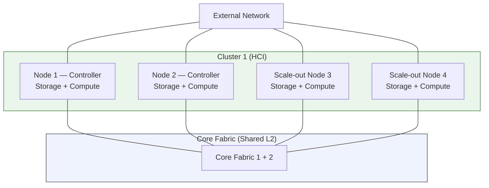
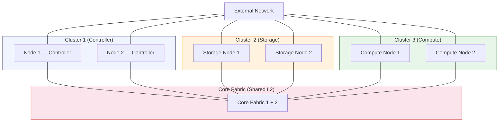
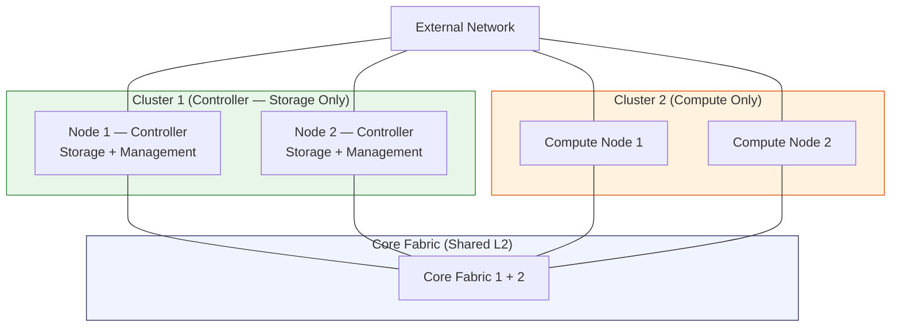
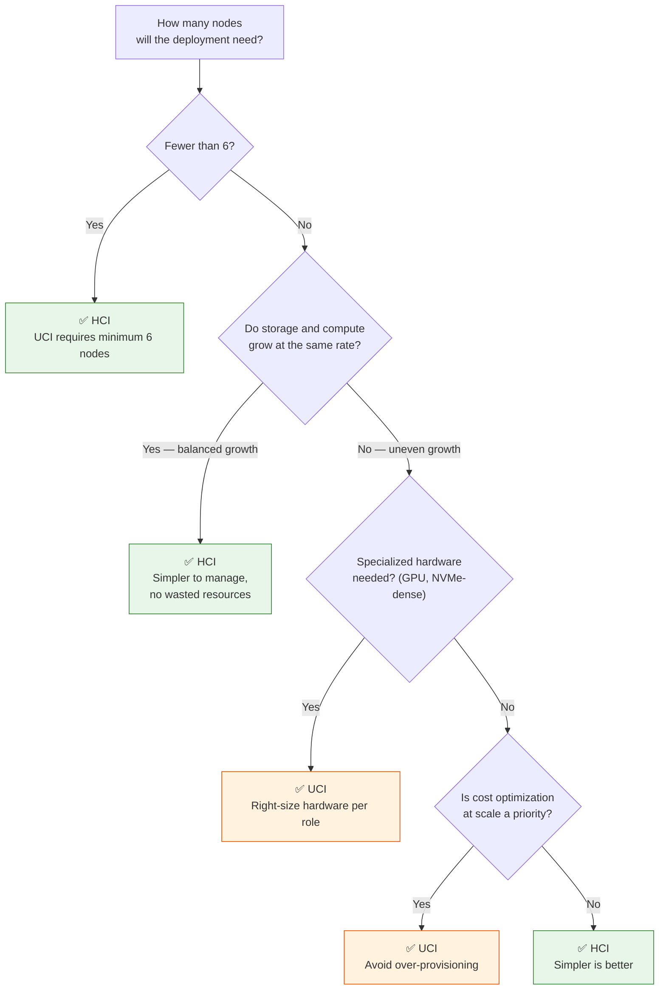

## Two Ways to Deploy VergeOS

VergeOS is unique among infrastructure platforms because it supports **two distinct deployment models** from the same software installation:

- **HCI (Hyperconverged Infrastructure)** -- Compute and storage run on every node. Resources scale together.
- **UCI (Ultra Converged Infrastructure)** -- Compute and storage run on dedicated, separate node types. Resources scale independently.

Most competing platforms (VMware vSAN, Nutanix) only support HCI. VergeOS gives you both options -- and you can even combine them within a single system.

## HCI: Hyperconverged Infrastructure

In an HCI deployment, every node in the cluster contributes **both** storage capacity and compute resources. When you need more of either, you add another node -- which adds both.

### How It Works

The most common starting point is a 2-node HCI cluster. Two controller nodes form a single cluster that handles storage (vSAN) and compute (VM workloads). Both nodes contribute Tier 0 and workload tier disks to the shared storage pool, and both nodes run virtual machines.

To grow, you add **scale-out nodes** to the same cluster. Each scale-out node joins via network auto-detection and immediately contributes additional storage and compute capacity.

### When to Choose HCI

| Scenario                           | Why HCI Works                                                  |
| ---------------------------------- | -------------------------------------------------------------- |
| **Small deployments** (2--8 nodes) | Minimal complexity, every node pulls double duty               |
| **Balanced workloads**             | When storage and compute demands grow at roughly the same rate |
| **Edge / remote sites**            | 2-node clusters with full HA and a small physical footprint    |
| **Evaluation and testing**         | Fastest path to a working VergeOS system                       |
| **Budget-conscious**               | Fewer total nodes needed for small-to-medium workloads         |

### Key Characteristics

- **Minimum**: 2 nodes (controller pair)
- **Scaling**: Add scale-out nodes to the same cluster
- **Node roles**: All nodes run storage **and** compute
- **Cluster count**: 1
- **Simplicity**: Easiest to deploy and manage

## UCI: Ultra Converged Infrastructure

UCI separates storage and compute onto **dedicated node types**, each in its own cluster. This lets you scale each resource tier independently -- add storage nodes when you need more capacity, or compute nodes when you need more CPU and RAM, without buying both.

### How It Works

A UCI deployment starts with the same 2-node controller pair, but the controllers manage the system without running production workloads or storing user data. Dedicated **storage nodes** form a second cluster that provides all vSAN capacity. Dedicated **compute nodes** form a third cluster that runs all VM workloads.

### When to Choose UCI

| Scenario                           | Why UCI Works                                                         |
| ---------------------------------- | --------------------------------------------------------------------- |
| **Large environments** (10+ nodes) | Independent scaling avoids over-provisioning                          |
| **Storage-heavy workloads**        | Add storage capacity without buying compute you don't need            |
| **Compute-heavy workloads**        | Add GPU or high-CPU nodes without buying storage you don't need       |
| **AI / HPC / GPU clusters**        | Dedicated compute cluster with GPU passthrough, separate from storage |
| **Cloud service providers**        | Optimize hardware spend per resource tier across many tenants         |
| **Predictable, uneven growth**     | Storage and compute demands grow at different rates                   |

### Key Characteristics

- **Minimum**: 6 nodes (2 controllers + 2 storage + 2 compute)
- **Scaling**: Add nodes to individual clusters independently
- **Node roles**: Each node has a single role (controller, storage, or compute)
- **Cluster count**: 3 (controller, storage, compute)
- **Flexibility**: Right-size hardware per role (NVMe-dense for storage, GPU-equipped for compute)

## Hybrid: The Middle Ground

VergeOS also supports a **hybrid** model that sits between pure HCI and full UCI. The most common hybrid pattern uses the controller nodes **exclusively for storage and system management** — they do not run production VM workloads. A separate cluster of dedicated compute nodes handles all VM execution.

This is a popular deployment model because it keeps the controller/storage layer lean and dedicated, while compute scales independently via its own cluster. The controllers provide vSAN storage to the compute nodes over the core fabric.

:::tip[Controller nodes don't have to run VMs]
In a hybrid deployment, controller nodes commonly serve only as storage and management nodes — no production VMs run on them. This reduces resource contention on the controllers and simplifies capacity planning: storage scales by adding nodes to the controller cluster, compute scales by adding nodes to the compute cluster.
:::

Alternatively, the controllers **can** also run VMs alongside storage if needed — this is useful in smaller environments where dedicating two nodes purely to storage feels wasteful. The hybrid model is flexible: controllers can provide storage-only, or storage + compute, depending on your requirements.

## HCI vs UCI Comparison

| Aspect                    | HCI                       | UCI                                         |
| ------------------------- | ------------------------- | ------------------------------------------- |
| **Minimum nodes**         | 2                         | 6                                           |
| **Cluster count**         | 1                         | 3                                           |
| **Node types**            | All nodes identical       | Controller, storage, compute                |
| **Storage scaling**       | Tied to compute           | Independent                                 |
| **Compute scaling**       | Tied to storage           | Independent                                 |
| **Hardware uniformity**   | All nodes have same specs | Nodes optimized per role                    |
| **Deployment complexity** | Lower                     | Higher                                      |
| **Cost at small scale**   | Lower (fewer nodes)       | Higher (minimum 6 nodes)                    |
| **Cost at large scale**   | Can over-provision        | Optimized spend per tier                    |
| **Best fit**              | Small-to-medium, balanced | Large, uneven growth, specialized workloads |

## Decision Framework

Use this flowchart to guide your deployment model recommendation:

### Quick Rules of Thumb

1. **Start with HCI** unless you have a specific reason to go UCI
2. **Consider UCI** when you need 10+ nodes or have specialized hardware requirements
3. **Hybrid** is a good stepping stone -- start HCI, add compute-only nodes later
4. You can **evolve** from HCI to hybrid to UCI as the environment grows

## Terraform Playground Examples

The VergeOS Terraform Playground includes example configurations for each deployment model, making it easy to test each topology:

| Model                      | Example File                                  | Nodes | Clusters |
| -------------------------- | --------------------------------------------- | ----- | -------- |
| **2-Node HCI**             | `examples/2-node-hci.tfvars`                  | 2     | 1        |
| **HCI + Scale-Out**        | `examples/4-node-hci.tfvars`                  | 4     | 1        |
| **Hybrid (HCI + Compute)** | `examples/4-node-hybrid-hci-2-cluster.tfvars` | 4     | 2        |
| **Full UCI**               | `examples/6-node-uci-3-cluster.tfvars`        | 6     | 3        |

Each example is a `.tfvars` file that you copy to `terraform.tfvars` and customize with your environment settings. The deployment model is controlled by boolean toggle variables:

- **HCI**: No toggles needed (default)
- **HCI + Scale-Out**: `create_scale_out_nodes = true`
- **Hybrid**: `create_compute_nodes = true`
- **UCI**: `create_storage_nodes = true` and `create_compute_nodes = true`

:::note[VMware Bridge]
VMware vSAN is HCI-only — every host contributes both storage and compute, and scaling storage independently means adding an external SAN/NAS, which breaks the HCI model. VergeOS UCI scales storage and compute separately within one platform: storage-only nodes contribute drives, compute-only nodes contribute CPU/RAM, all managed from the same UI.
:::

:::note[Nutanix Bridge]
Nutanix is HCI-only — every node runs a CVM and contributes both storage and compute, even storage-heavy nodes. VergeOS UCI removes that constraint, allowing pure storage clusters and pure compute clusters to coexist in a single system.
:::

## Single-Node Deployments

While VergeOS is designed for multi-node clusters, **single-node deployments** have valid use cases:

- **Bare-metal replacement** — Replace a traditional physical server with a single VergeOS node running multiple VMs, gaining the benefits of virtualization (snapshots, resource management, easy backup) without needing a second node
- **Edge sites** — A single node at a remote location where data is not critical locally (e.g., thin client host, local cache, signage) and can be replicated from a central site if needed
- **Development / lab** — A standalone system for testing and development

Single-node deployments still have **disk-level redundancy** — vSAN mirrors data across drives within the node, protecting against individual drive failures. However, there is **no node-level redundancy** — if the node itself fails, workloads are down until it is restored. Snapshots and off-site replication are strongly recommended.

## Summary

| Concept               | Key Takeaway                                                                                 |
| --------------------- | -------------------------------------------------------------------------------------------- |
| **HCI**               | Every node does everything. Simple, cost-effective at small scale.                           |
| **UCI**               | Dedicated roles per node. Flexible, cost-optimized at large scale.                           |
| **Hybrid**            | Controllers handle storage/management; compute scales separately. A practical middle ground. |
| **VergeOS advantage** | Same platform supports all three models -- no product changes needed.                        |

## Next Steps

Now that you understand HCI and UCI deployment models, the next topic covers the storage layer that powers both: **[vSAN / VergeFS →](/training/01-architecture/03-vsan-vergefs/)**
