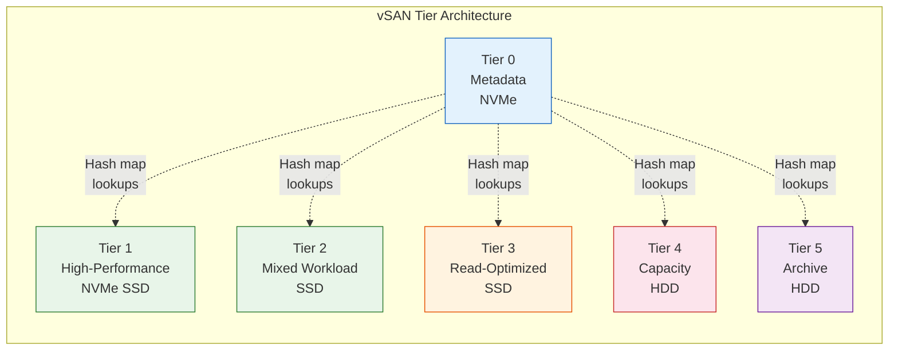
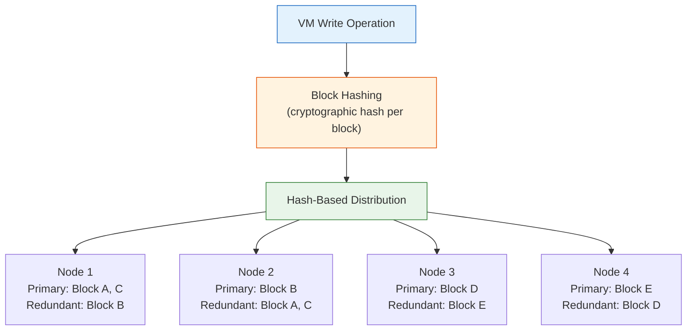
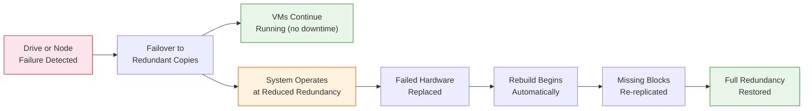

## What is vSAN / VergeFS?

**vSAN** (Virtual Storage Area Network), also known as **VergeFS**, is the software-defined distributed storage system built into every VergeOS deployment. It pools the physical (or virtual) drives across all storage-participating nodes into a single, shared storage resource for the entire system.

There is no external SAN, NAS, or third-party storage software required. vSAN is integrated directly into the VergeOS kernel and operates at the block level, providing storage for all VM disks, snapshots, ISO images, and system metadata.

Key characteristics:

- **Block-level architecture** — VM disks are divided into blocks, each identified by a cryptographic hash
- **Distributed across nodes** — Data blocks are spread across all storage-participating nodes in the cluster
- **Tiered storage** — Tier 0 is reserved for vSAN metadata; Tiers 1–5 are workload storage tiers that let you match media type to workload requirements
- **Inline deduplication** — Hash-based block identification enables automatic deduplication across all tiers
- **Self-healing** — Automatic failure detection, failover to redundant copies, and data rebuild via Journal Walks. Self-healing operates within the configured redundancy level (N+1 or N+2); failures that exceed redundancy (e.g., simultaneous loss of more nodes than the system can tolerate) may result in stuck repairs requiring manual intervention and support engagement

:::note[VMware Bridge]
VergeFS and VMware vSAN both pool local drives, but VergeFS uses 6 fixed tiers (0 = metadata, 1–5 = workload data) versus vSAN's cache + capacity model, performs inline dedup across all tiers by default (vSAN dedup is all-flash and cluster-level), and runs in HCI or UCI rather than HCI-only. VergeFS does not compress data at rest — compression applies only during site-sync replication — and redundancy is system-wide (N+1/N+2) instead of per-VM storage policy.
:::

:::note[Nutanix Bridge]
VergeFS and Nutanix DSF both pool local drives, but DSF runs as a user-space process inside a Controller VM (CVM) on each node while VergeFS runs natively in the OS kernel — no per-node CPU/RAM tax. VergeOS uses 6 fixed tiers with no automatic hot/cold movement, system-wide N+1/N+2 redundancy, always-on inline dedup, and supports both HCI and UCI; Nutanix uses ILM-driven hot/cold tiering, per-container Replication Factor, per-container dedup, and HCI-only scaling.
:::

## The Tier System

VergeOS vSAN organizes drives into **tiers** numbered 0 through 5. Each tier is designed for a different class of storage media and workload profile. During installation, each physical drive is assigned to a specific tier, and that assignment determines how the drive is used by the system.

### Tier 0: Metadata

- **Hardware**: High-endurance NVMe SSDs
- **Purpose**: Stores the vSAN filesystem index and internal metadata exclusively
- **Key requirement**: Controller nodes **must** have Tier 0 drives for vSAN metadata; scale-out and storage-only nodes do not require Tier 0
- **Best practice**: Use enterprise NVMe drives rated for 3 DWPD (Drive Writes Per Day) or equivalent (i.e. if you only need 500 GB for vSAN metadata, a larger 2 TB drive rated at 1 DWPD provides comparable total write endurance); maintain at least 30% free space on Tier 0

### Tiers 1–5: Workload Data

| Tier       | Hardware                 | Purpose                              | Typical Use Cases                                         |
| ---------- | ------------------------ | ------------------------------------ | --------------------------------------------------------- |
| **Tier 1** | High-endurance NVMe SSDs | Write-intensive workloads            | High-performance databases, transaction logs              |
| **Tier 2** | Mid-range SSDs           | Balanced read/write workloads        | General-purpose VMs, mixed applications, dev environments |
| **Tier 3** | Read-optimized SSDs      | Read-intensive workloads             | Content delivery, application repos, reference data       |
| **Tier 4** | High-capacity HDDs       | Less frequently accessed data        | File servers, backup targets                              |
| **Tier 5** | Archival-grade HDDs      | Cold storage and long-term retention | Compliance archives, backup archives                      |

Not every deployment uses all five workload tiers. A common production configuration might use only tier 1 (NVMe for performance-sensitive workloads) and tier 4 (HDD for capacity). The Terraform playground uses tier 0 and tier 1 only.

:::note[VMware Bridge]
VMware vSAN has cache + capacity tiers and uses per-VM storage policies (failures-to-tolerate, stripe width, erasure coding). VergeOS uses 6 explicit tiers and no per-VM policies — pick the tier at disk provisioning time, and redundancy (N+1/N+2) is set system-wide.
:::

:::note[Nutanix Bridge]
Nutanix AOS organizes data into storage containers within a storage pool and uses the Intelligent Tiering Engine (ILM) to move blocks between SSD and HDD based on access patterns. VergeOS does not move data between tiers — drives are assigned at install time and data stays where it was written, traded for explicit placement and predictable performance.
:::

## How Data is Distributed

vSAN uses a **hash-based distribution algorithm** to spread data blocks across all nodes in the cluster. Here is how it works:

### Block Creation and Hashing

1. When a VM writes data, vSAN divides the write into **data blocks**
2. Each block is assigned a **cryptographic hash** that serves as its unique identifier
3. The hash determines both the block's storage location and enables deduplication — if two blocks produce the same hash, only one copy is stored

### Cross-Node Distribution

Data blocks are distributed across multiple nodes in the cluster rather than stored on a single node. This design provides:

- **Balanced performance** — I/O load is spread across all storage-participating nodes
- **Fault tolerance** — No single node holds all copies of any dataset
- **Efficient scaling** — Adding a node automatically expands the storage pool and triggers rebalancing

### Read and Write Paths

**Reads:**

- The system looks up the block's location via the tier-0 hash map
- Reads prioritize the **primary copy** for efficiency
- If the VM is running on the same node as a redundant copy, vSAN reads the **local copy** to minimize network traffic
- If the primary copy is slow or unresponsive, vSAN automatically fails over to the redundant copy

**Writes:**

- New blocks are hashed and placed on the optimal node
- Both the **primary and redundant copies** are written simultaneously
- Write is only acknowledged after both copies are confirmed
- The tier-0 metadata is updated to track the new block's location

## Redundancy and Self-Healing

vSAN maintains multiple copies of every data block to protect against hardware failures. The redundancy level is configured at the system level and applies per tier.

### Redundancy Levels

| Feature                             | N+1 (RF2) — Default | N+2 (RF3) |
| ----------------------------------- | ------------------- | --------- |
| **Copies of data**                  | 2                   | 3         |
| **Simultaneous failures tolerated** | 1 node              | 2 nodes   |
| **Minimum controller nodes**        | 2                   | 3         |
| **Recommended nodes**               | 3                   | 5         |
| **Storage overhead** (before dedup) | ~2×                 | ~3×       |

- **N+1 (RF2)** is the default and is suitable for most production environments
- **N+2 (RF3)** is available for ultra-critical workloads or remote sites where hardware replacement is slow
- Redundancy level is typically set during installation and applies system-wide
- A failure only affects the tier where the failed drives reside — other tiers remain fully operational

### Self-Healing Process

When a node or drive fails, vSAN automatically fails over to redundant copies. The rebuild to restore full redundancy occurs after the failed hardware is replaced:

1. **Detection** — vSAN detects the failure automatically via Journal Walks
2. **Failover** — Reads and writes are redirected to redundant copies with no VM downtime
3. **Reduced redundancy** — The system continues operating but the affected tier is no longer fully redundant until the hardware is replaced
4. **Rebuild** — Once the failed drive or node is replaced, vSAN automatically re-replicates missing data blocks to restore full redundancy

:::note[VMware Bridge]
VMware vSAN waits a configurable timeout (60 minutes by default) and then rebuilds affected objects onto the remaining healthy hosts, governed by per-VM storage policies (FTT, stripe width). VergeOS waits for the failed drive or node to be replaced before rebuilding, with a single system-wide redundancy setting (N+1 or N+2) instead of per-VM policy.
:::

:::note[Nutanix Bridge]
Nutanix's Curator service detects failures and immediately redistributes data blocks across the remaining healthy nodes, with Replication Factor (RF2/RF3) configured per storage container. VergeOS waits for the failed hardware to be replaced before rebuilding, using a single system-wide N+1 or N+2 setting that applies to all data.
:::

## Drive Assignment in Practice

During VergeOS installation, each physical drive is assigned to a specific vSAN tier. The installer uses the `YC_DRIVE_LIST` and `YC_VSAN_TIER_LIST` variables (set interactively during installation) to map drives to tiers.

### Assignment Rules

- **Controller nodes** need at least one Tier 0 drive for metadata; scale-out and storage-only nodes do not require Tier 0
- Drives within the same tier should be of similar type and performance characteristics
- When scaling up (adding drives), add **equal drives across all nodes** in the cluster to maintain balanced distribution
- When scaling out (adding nodes), new nodes should match the existing cluster's hardware configuration (CPU, memory, disk layout)

### Example: 2-Node HCI Configuration

In the Terraform playground's simplest deployment, each controller node has:

| Drive           | Tier   | Purpose                                       |
| --------------- | ------ | --------------------------------------------- |
| 1× NVMe (small) | Tier 0 | Metadata — vSAN hash map and filesystem index |
| 1× NVMe (large) | Tier 1 | Workload data — VM disks, snapshots, ISOs     |

Both nodes contribute their drives to the same vSAN pool. With N+1 redundancy (default), every block written to tier 1 on node 1 has a redundant copy on node 2, and vice versa.

## Additional vSAN Features

### Inline Deduplication

Because every data block is identified by its cryptographic hash, vSAN automatically detects duplicate blocks. If two VMs (or two regions within the same VM disk) write identical data, only one copy of that block is stored. This operates inline — during the write path — with no separate deduplication job or schedule.

### Encryption

vSAN supports **AES-256 encryption at rest**, configured during initial installation. Encryption keys can be stored on USB drives (plugged into the first two controller nodes) or entered manually at boot time. All data across all tiers is encrypted transparently.

### Snapshots and Clones

vSAN's block-level architecture enables **space-efficient snapshots** — a snapshot records the hash map state at a point in time rather than copying data blocks. Clones similarly reference existing blocks, only consuming additional space when data diverges.

## Key Takeaways

| Concept               | Summary                                                          |
| --------------------- | ---------------------------------------------------------------- |
| **vSAN / VergeFS**    | Built-in distributed storage — no external SAN/NAS required      |
| **Tier 0**            | Metadata only (NVMe). Required on every storage node.            |
| **Tiers 1–5**         | Workload data, from high-performance NVMe to archival HDD        |
| **Data distribution** | Hash-based, spread across all storage nodes                      |
| **Redundancy**        | N+1 (2 copies, default) or N+2 (3 copies) — system-wide per tier |
| **Self-healing**      | Automatic failover and rebuild on failure                        |
| **Deduplication**     | Inline, hash-based, across all tiers                             |
| **Compression**       | Not at rest — only during site-sync replication                  |

## Next Steps

Now that you understand how VergeOS stores data, the next topic covers the network fabric that connects all nodes and carries vSAN replication traffic: **[Core Fabric & Networking →](/training/01-architecture/04-core-fabric/)**
