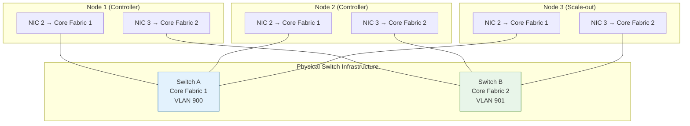
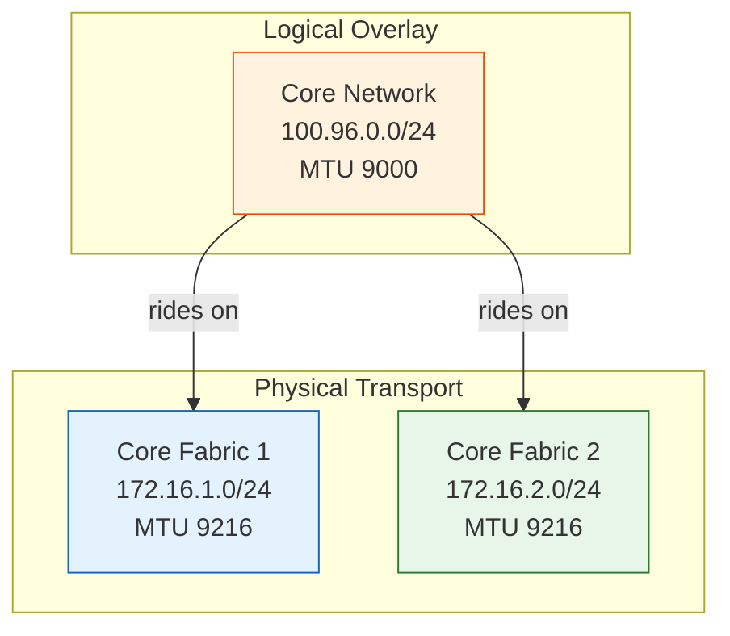
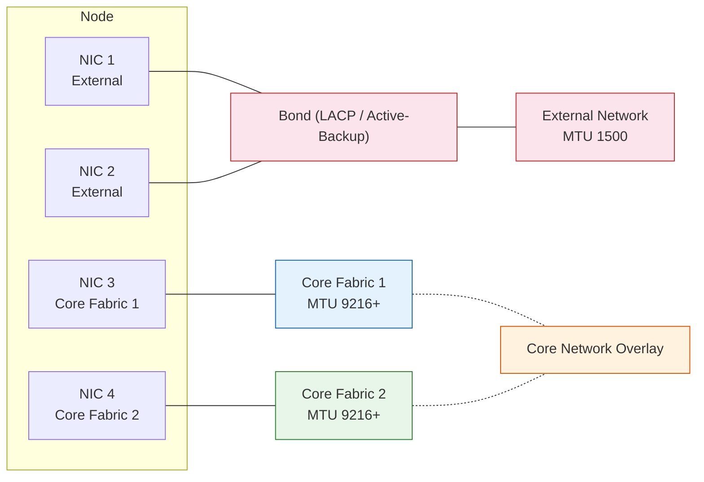
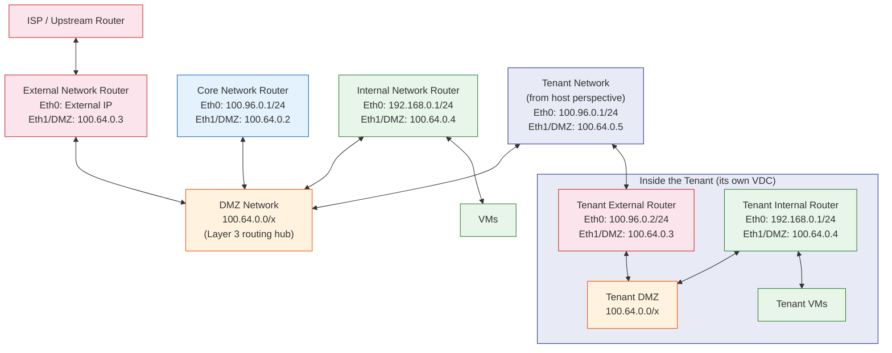

## What is the Core Fabric?

The **core fabric** is a private, high-speed network mesh that interconnects all nodes in a VergeOS system. It is the backbone of every VergeOS deployment — all internal cluster communication flows over this fabric. The core fabric is never exposed to external traffic.

Traffic types carried by the core fabric include:

- **vSAN replication** — Primary and redundant data block writes between storage-participating nodes
- **Cluster coordination** — Node health checks, leadership election, and system state synchronization
- **VM live migration** — Memory and CPU state transfer when moving running VMs between nodes
- **Control plane** — API calls, configuration updates, and management communication between VergeOS services

The core fabric is designed for **low latency and high throughput**. Because vSAN performance depends directly on the speed and reliability of inter-node communication, the core fabric is the most performance-critical network in a VergeOS system.

:::note[VMware Bridge]
In VMware, vMotion, vSAN replication, management, and other inter-node traffic each get their own VMkernel port group on a vDS, with VLANs and uplink failover policies per traffic type. The VergeOS core fabric carries all inter-node traffic over one redundant private mesh — no per-type port groups to plan.
:::

:::note[Nutanix Bridge]
Nutanix's CVM-to-CVM backplane network needs explicit VLAN/IP configuration for the backplane, CVM, and hypervisor management. The VergeOS core fabric is a private Layer 2 mesh with no IPs or VLANs — nodes discover each other automatically.
:::

## Dual-Switch Redundancy

For fault tolerance, the core fabric runs across **two independent physical networks** — referred to as **Core Fabric 1** and **Core Fabric 2** (or Core 1 / Core 2). Each fabric network is its own isolated Layer 2 broadcast domain.

Every node connects to **both** fabric networks. If one switch or cable path fails, the other fabric network maintains full inter-node connectivity with no interruption to vSAN replication, live migration, or cluster coordination.

### Key Design Rules

| Requirement          | Detail                                                                                                                                                              |
| -------------------- | ------------------------------------------------------------------------------------------------------------------------------------------------------------------- |
| **Isolation**        | Core Fabric 1 and Core Fabric 2 must be on their own dedicated Layer 2 networks, completely isolated from each other and from external traffic                      |
| **Jumbo frames**     | MTU 9216 or higher on all core fabric switch ports (9216 accommodates the 9000-byte payload plus VLAN tags, headers, and tenant overhead)                           |
| **Zero switch hops** | All nodes must be on the same switching fabric with no inter-switch hops in the core fabric path — additional hops introduce latency that degrades vSAN performance |
| **Port mode**        | Access ports (untagged, single VLAN per core fabric network)                                                                                                        |
| **Spanning tree**    | BPDU guard disabled on core fabric ports; portfast not recommended for core fabric links                                                                            |
| **Speed**            | 10 Gbps or higher recommended                                                                                                                                       |

> **Playground note:** The Terraform playground uses MTU 9142 for its virtual core fabric networks. Production deployments should use MTU 9216 or higher per the official VergeOS documentation.

## Core Network Overlay

On top of the two physical fabric networks, VergeOS creates a **virtual core network** — a logical overlay with the address range `100.96.0.0/24`. This core network provides each node with a stable internal IP address used by VergeOS services.

The relationship is:

- **Core Fabric 1 and Core Fabric 2** are the physical-layer transports (Layer 2 networks)
- **Core network (`100.96.0.0/24`)** is the logical overlay that rides on top of both fabric switches

The core network abstracts the underlying dual-path redundancy so that VergeOS services communicate using a single address per node, regardless of which physical fabric is active.

### IP Address Assignments

| Network           | Node 1              | Node 2              | Node 3+        |
| ----------------- | ------------------- | ------------------- | -------------- |
| **Core network**  | 100.96.0.2          | 100.96.0.3          | 100.96.0.(N+1) |
| **Core Fabric 1** | 172.16.1.1          | 172.16.1.2          | 172.16.1.N     |
| **Core Fabric 2** | 172.16.2.1          | 172.16.2.2          | 172.16.2.N     |
| **External**      | Static (configured) | Static (configured) | DHCP or static |

## Node Network Connections

A typical VergeOS node has **four network interfaces** — two for external and two for core fabric:

| NICs      | Connection       | Purpose                                                       |
| --------- | ---------------- | ------------------------------------------------------------- |
| NIC 1 + 2 | External network | Management UI/API access, user traffic, internet connectivity |
| NIC 3     | Core Fabric 1    | Primary path for all inter-node traffic                       |
| NIC 4     | Core Fabric 2    | Redundant path for all inter-node traffic                     |

The actual NIC device names vary by hardware (e.g., `eno1`, `enp3s0f0`, `eth0`). During installation, you select which physical NIC maps to each role.

The external NICs are typically **bonded** (LACP or active-backup) for redundancy. VergeOS supports both switch-based bonding (LACP) and its own **software-based bonding** — no switch configuration required. The two core fabric NICs remain dedicated and unbonded — each connected to its own independent switch.

## External Network vs. Core Fabric Separation

VergeOS enforces a strict separation between external-facing traffic and internal cluster traffic. These are two fundamentally different network domains:

### External Networks

- Connect VergeOS to existing LAN/WAN infrastructure
- Carry user-facing traffic: management UI access, VM workload connectivity, internet access
- Use standard MTU (1500) unless workloads require jumbo frames
- Configured as VLAN trunks (802.1Q tagged) to support multiple VLANs for tenant and workload separation
- Typically bonded (LACP or active-backup) for redundancy
- Can have multiple external networks per system (e.g., management VLAN, production VLAN, DMZ VLAN)

### Core Fabric Networks

- Completely private — never exposed to external traffic or users
- Carry all inter-node system traffic (vSAN, migration, coordination)
- Require jumbo frames (MTU 9216+) for storage efficiency
- Configured as access ports (untagged, single VLAN per fabric)
- Always two independent fabrics for redundancy
- Must have zero switch hops between nodes for low latency

### The DMZ Network

VergeOS automatically creates a **DMZ network** during installation. The DMZ serves as the central connection point for all virtual networks in the system. Every VergeOS cloud (whether the host system or a tenant) has exactly one DMZ network.

The DMZ provides **Layer 3 routing** between networks. Each network type (external, internal, core) has its own virtual router with one interface on its own network and one interface on the DMZ. When an internal network needs to reach an external network, traffic flows through the DMZ where network rules and firewall policies are applied at the routing boundary.

The DMZ uses the `100.64.0.x` address range. Each router connected to the DMZ gets an address on this subnet:

From the host's perspective, a tenant appears as another network connected to the DMZ. Inside, the tenant has its own complete networking stack — its own DMZ, external router, internal networks, and VMs — a fully nested Virtual Data Center.

:::note[VMware Bridge]
VergeFabric collapses what VMware splits across vDS port groups, NSX-T segments, and physical firewall: core fabric replaces VMkernel groups for vSAN/vMotion/management, external networks replace vDS uplinks for VM traffic, the DMZ network replaces NSX Edge router/firewall functions, and internal networks replace NSX-T segments with built-in DHCP/DNS/routing/firewall.
:::

:::note[Nutanix Bridge]
Nutanix relies on standard VLANs, the Flow add-on for micro-segmentation, and external appliances for routing/firewalling. VergeOS provides the equivalent natively: core fabric replaces the CVM backplane (no VLAN config), external networks replace VLAN-based uplinks, the DMZ network handles routing/firewalling, and internal networks bundle DHCP/DNS/routing/firewall.
:::

## Production Network Design Models

In production, VergeOS supports several network design models depending on the number of NICs per node and the external network requirements. All models maintain the dual core fabric for redundancy.

### 4-NIC Model (Recommended)

The standard production configuration uses 4 NICs per node:

| NIC   | Assignment                  | Configuration                         |
| ----- | --------------------------- | ------------------------------------- |
| NIC 1 | Core Fabric 1               | Access port, dedicated VLAN, MTU 9216 |
| NIC 2 | Core Fabric 2               | Access port, dedicated VLAN, MTU 9216 |
| NIC 3 | External 1 (bond primary)   | Trunk port, LACP, MTU 1500            |
| NIC 4 | External 2 (bond secondary) | Trunk port, LACP, MTU 1500            |

This provides full redundancy on both the core fabric (two independent paths) and external network (bonded pair).

### 2-NIC Model

A 2-NIC model combines core fabric and external traffic on the same physical ports using VLAN tagging:

| NIC   | Assignment                     | Configuration                                   |
| ----- | ------------------------------ | ----------------------------------------------- |
| NIC 1 | Core Fabric 1 + External VLANs | Native VLAN for core, tagged VLANs for external |
| NIC 2 | Core Fabric 2 + External VLANs | Native VLAN for core, tagged VLANs for external |

This model works well for **100 GbE network ports** where two high-bandwidth interfaces provide more than enough throughput for both core fabric and external traffic. It also suits edge sites and proof-of-concept deployments. VergeOS software bonding can be used in this model to provide external network redundancy across both NICs, while dual core fabric redundancy is maintained.

## How the Terraform Playground Models This

In the Terraform playground, the core fabric is modeled as two `vergeio_network` resources on the host VergeOS system:

- `core_fabric_1` — Layer 2 network, MTU 9142, no DHCP
- `core_fabric_2` — Layer 2 network, MTU 9142, no DHCP

Each node VM gets three NICs:

1. **NIC 1** → External network (management and user access)
2. **NIC 2** → Core Fabric 1
3. **NIC 3** → Core Fabric 2

The playground uses MTU 9142 (instead of the production-recommended 9216) because the virtual network infrastructure of the host system introduces additional overhead. The core network overlay (`100.96.0.0/24`) rides on top of both fabric networks, just as it does in production.

## Key Takeaways

| Concept                  | Summary                                                                                       |
| ------------------------ | --------------------------------------------------------------------------------------------- |
| **Core fabric**          | Private inter-node mesh — carries vSAN, migration, coordination, and control-plane traffic    |
| **Dual redundancy**      | Two independent fabric networks (Core 1 + Core 2) on separate Layer 2 domains                 |
| **MTU requirements**     | 9216+ in production (9142 in the playground) — jumbo frames are mandatory                     |
| **Core network overlay** | Logical `100.96.0.0/24` network riding on both fabric switches, providing stable internal IPs |
| **3 NICs per node**      | Minimum: 1 external + 2 core fabric. Production typically uses 4+ NICs with bonded external   |
| **Zero switch hops**     | Core fabric ports must be on the same switching fabric — no inter-switch hops allowed         |
| **Traffic isolation**    | Core fabric is never exposed to external traffic; external networks are completely separate   |
| **DMZ network**          | Auto-created Layer 3 routing hub connecting all virtual networks in the system                |

## Next Steps

Now that you understand how VergeOS nodes are interconnected, the next topic covers how those nodes are organized into clusters: **[Clusters & Node Types →](/training/01-architecture/05-clusters-nodes/)**
