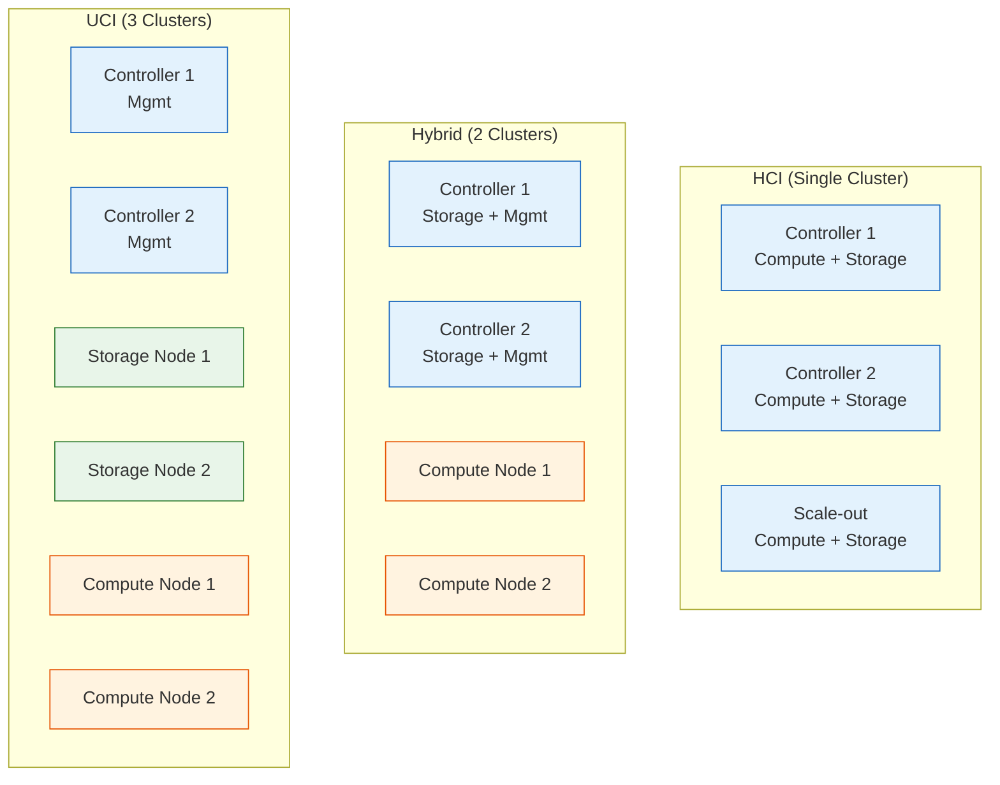
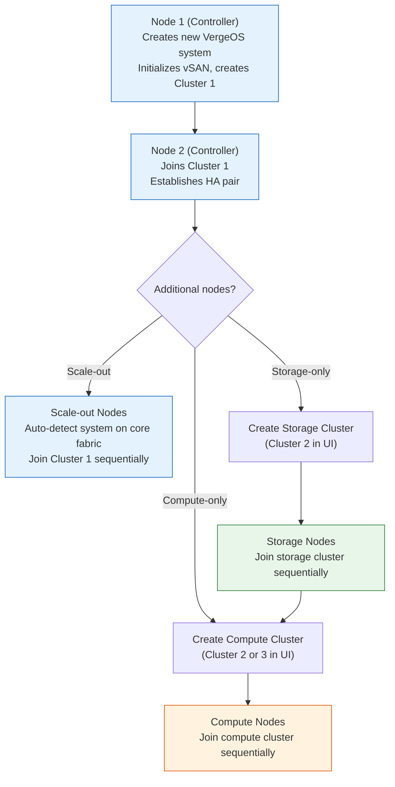
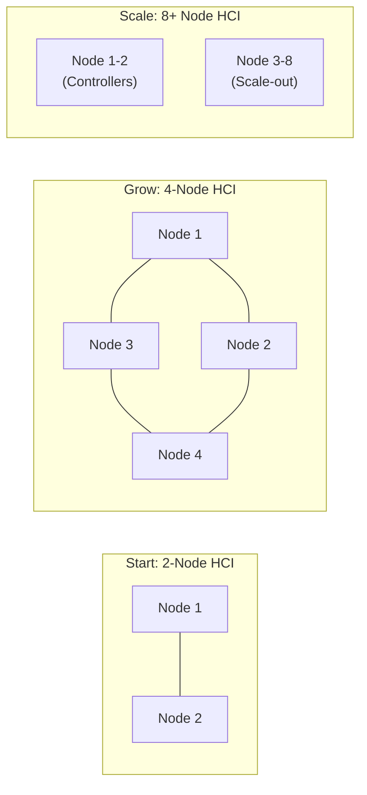
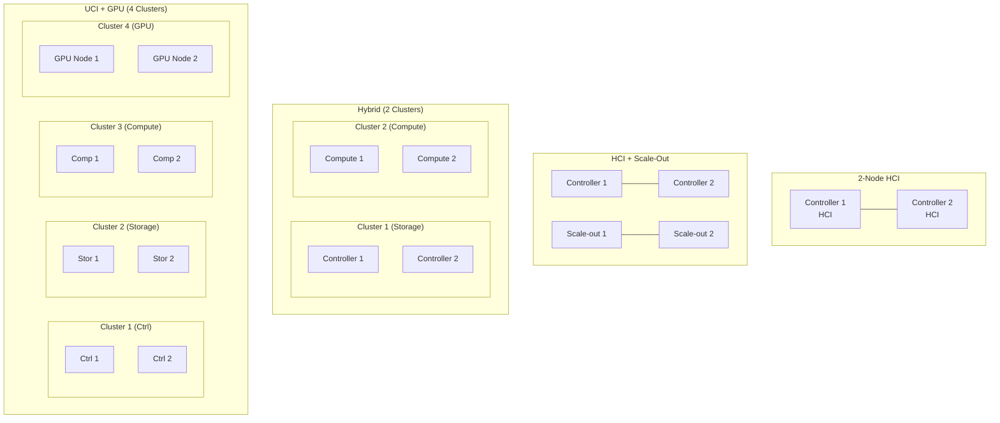

## What is a Cluster?

A **cluster** in VergeOS is a logical grouping of nodes with the same hardware characteristics, forming a resource pool presented as usable assets in the VergeOS user interface. Clusters enable efficient management, scaling, and high availability for virtualized workloads.

Every VergeOS system starts with at least one cluster — the initial two controller nodes form the first cluster during installation. From there, you can add nodes to the existing cluster or create additional clusters with different roles and hardware profiles.

### Why Clusters Matter

Clusters serve several purposes:

- **Compute isolation** — CPU, memory, and VM workloads are bound to a specific cluster. VMs run only on nodes within their assigned cluster (with optional failover to another cluster).
- **Shared storage pool** — vSAN tiers span across clusters into a single logical storage pool. A storage drive on Cluster 1 and a storage drive on Cluster 2 can both contribute to the same tier. Compute-only nodes access this shared storage over the core fabric.
- **Hardware optimization** — Different clusters can have different hardware profiles: high-memory nodes for databases, GPU-equipped nodes for rendering, NVMe-dense nodes for storage-intensive workloads
- **Independent scaling** — Add compute capacity to one cluster without affecting others; storage scales across the entire system

## Cluster Types

VergeOS supports three distinct cluster types that can be mixed and matched within a single system:

| Cluster Type       | Provides          | vSAN Participation                                 | Typical Use Case                                       |
| ------------------ | ----------------- | -------------------------------------------------- | ------------------------------------------------------ |
| **Combined (HCI)** | Compute + Storage | Yes — nodes contribute storage disks to vSAN tiers | General-purpose workloads, small-to-medium deployments |
| **Storage-Only**   | Storage only      | Yes — nodes contribute storage only                | Dedicated storage expansion in UCI architectures       |
| **Compute-Only**   | Compute only      | No — boot-only or PXE boot                         | High-compute workloads (ML, rendering, data analytics) |

**Common deployment examples:**

## Node Types

Every physical server in a VergeOS system is a **node**. Nodes differ in how they join the system, what role they play, and which cluster they belong to. VergeOS defines four node types:

### Controller Nodes

Every VergeOS system starts with at least two **controller nodes**. A third controller node is required for N+2 redundancy. They are special because:

- **Node 1** creates a brand-new VergeOS system. It initializes the vSAN, creates the first cluster, and runs post-install configuration (network setup, cluster creation for additional node types, etc.)
- **Node 2** joins the system created by Node 1 as the second controller, providing redundancy for all system management functions (N+1)
- **Node 3 (optional)** — a third controller node can be added for N+2 redundancy, allowing the system to tolerate two simultaneous node failures

Controller nodes always belong to **Cluster 1**. In an HCI topology, they provide both compute and storage. In a hybrid topology, they commonly provide **storage and management only** — no production VMs — while a separate compute cluster handles all workloads. In a full UCI topology, they manage the system but delegate storage and compute to dedicated clusters.

The first cluster must include at least two nodes with **Tier 0 storage** (metadata drives) — this is a hard requirement because Tier 0 holds the vSAN filesystem index and must be redundant.

### Scale-Out Nodes

Scale-out nodes expand an existing HCI cluster by adding more compute and storage capacity. Key characteristics:

- **Identical hardware** to the controller nodes in the cluster they join (same CPU generation, similar storage layout, matching NIC configuration)
- Join the existing cluster automatically via **network auto-detection** — the node discovers the VergeOS system on the core fabric and joins without manual cluster assignment
- Disks join the existing vSAN tiers automatically
- Contribute both compute (run VMs) and storage (vSAN participation)

Scale-out nodes are the simplest way to grow an HCI deployment — add a node and the cluster's compute and storage capacity increases proportionally.

### Storage-Only Nodes

Storage-only nodes are dedicated exclusively to expanding vSAN capacity. They:

- Contribute disks to vSAN tiers but do **not** run VM workloads
- Belong to a **storage-only cluster** (e.g., Cluster 2)
- Require creating the storage cluster in the VergeOS UI before adding the first storage node
- Are used in UCI architectures where storage and compute scale independently

### Compute-Only Nodes

Compute-only nodes provide processing power without participating in vSAN storage. They:

- Run VM workloads but have **no local vSAN storage** (boot-only disk or PXE boot)
- Belong to a **compute-only cluster** (e.g., Cluster 3)
- Require creating the compute cluster in the VergeOS UI before adding the first compute node
- Access storage over the core fabric from nodes in HCI or storage-only clusters

Compute-only nodes are ideal for workloads that need high CPU/RAM/GPU density without proportional storage growth — machine learning, rendering, data analytics, or VDI.

### Node Type Summary

| Node Type               | Role                          | Cluster    | vSAN                          | Runs VMs              | Join Method                      |
| ----------------------- | ----------------------------- | ---------- | ----------------------------- | --------------------- | -------------------------------- |
| **Controller (Node 1)** | Creates new system            | Cluster 1  | Yes (Tier 0 + workload tiers) | Yes (HCI) or No (UCI) | New system creation              |
| **Controller (Node 2)** | Joins as redundant controller | Cluster 1  | Yes (Tier 0 + workload tiers) | Yes (HCI) or No (UCI) | Joins Cluster 1                  |
| **Scale-out**           | Adds HCI capacity             | Cluster 1  | Yes (workload tiers)          | Yes                   | Auto-detect on core fabric       |
| **Storage-only**        | Dedicated storage expansion   | Cluster 2+ | Yes (workload tiers)          | No                    | Joins designated storage cluster |
| **Compute-only**        | Dedicated compute expansion   | Cluster 2+ | No (boot-only / PXE)          | Yes                   | Joins designated compute cluster |

:::note[Coming from VMware or Nutanix?]
Neither platform has a native concept of storage-only or compute-only members within a single cluster. VergeOS does, and it lets you type clusters for independent scaling.

| VergeOS node role | VMware vSphere closest analog | Nutanix closest analog |
| --- | --- | --- |
| Controller | ESXi host + vCenter services (no separate appliance) | First node in a cluster, but no separate CVM |
| Scale-out | Additional ESXi host joining a vSAN cluster | Additional node joining a Nutanix cluster |
| Storage-only | No native equivalent (vSAN witness is closest) | No equivalent — every Nutanix node runs a CVM and participates in compute |
| Compute-only | ESXi host with no local vSAN, mounting external storage (here, vSAN over the core fabric) | No direct equivalent |

VMware and Nutanix clusters are uniform; VergeOS clusters can be HCI, storage-only, or compute-only, and a system can mix multiple typed clusters.
:::

## How Nodes Join a System

The node joining process follows a strict sequence to prevent race conditions:

Key rules for node joining:

1. **Node 1 must complete installation** before Node 2 can join — Node 2 needs an existing system to connect to
2. **Nodes join sequentially** within a cluster — Node 3 after Node 2, Node 4 after Node 3, etc. — to prevent race conditions during cluster membership changes
3. **Storage clusters must exist** before storage nodes can join — create the cluster in the VergeOS UI first
4. **Compute clusters must exist** before compute nodes can join — same prerequisite
5. **If deploying both storage and compute clusters**, storage nodes should be added first so compute nodes can immediately access vSAN storage

## Cluster Numbering and Naming

Clusters are numbered starting from 1 and can be renamed in the VergeOS UI:

| Cluster Number | Default Role                                      | Typical Name                       |
| -------------- | ------------------------------------------------- | ---------------------------------- |
| Cluster 1      | HCI (controllers + optional scale-out)            | "HCI", "Default", or "Controllers" |
| Cluster 2      | Storage-only (if UCI) or Compute-only (if hybrid) | "Storage" or "Compute"             |
| Cluster 3      | Compute-only (in full UCI with 3 clusters)        | "Compute"                          |

In a full UCI deployment with 3 clusters:

- **Cluster 1**: Controllers (system management, Tier 0 metadata)
- **Cluster 2**: Storage nodes (all vSAN workload storage)
- **Cluster 3**: Compute nodes (all VM execution)

## Minimum Requirements and High Availability

| Requirement                   | Detail                                                                                                                       |
| ----------------------------- | ---------------------------------------------------------------------------------------------------------------------------- |
| **Minimum nodes per system**  | 2 (one controller pair)                                                                                                      |
| **Minimum nodes per cluster** | 2 (for redundancy during maintenance or failure)                                                                             |
| **Controller nodes**          | Minimum 2 per system (N+1 default); 3 required for N+2 redundancy — must have Tier 0 storage for vSAN metadata               |
| **HA behavior**               | If one node fails, its workloads migrate to the surviving node(s) in the same cluster                                        |
| **Maintenance mode**          | Nodes can be placed in maintenance mode; workloads are live-migrated to other nodes in the cluster before maintenance begins |

## Scaling

VergeOS systems scale from a minimum 2-node HCI cluster to multi-cluster deployments. A practical guideline is to keep all nodes within a single rack so the core fabric stays on the same switching plane — this maintains the low-latency, zero-hop requirement. The scaling strategy depends on your architecture:

### HCI Scaling (Simple)

Add scale-out nodes to Cluster 1. Each node adds both compute and storage proportionally.

**Best for**: Balanced growth where compute and storage needs increase together.

### UCI Scaling (Independent)

Add nodes to specific clusters based on which resource is the bottleneck:

- **Need more storage?** Add nodes to the storage cluster
- **Need more compute?** Add nodes to the compute cluster
- **Need more of both?** Add to both clusters independently

**Best for**: Workloads with unbalanced resource demands (e.g., heavy storage with light compute, or GPU-dense compute with modest storage).

### Best Practices for Scaling

- **Hardware consistency within clusters** — Use the same hardware specs for all nodes in a cluster. Mixing different hardware within a cluster can cause performance and reliability issues.
- **Plan for N+1 redundancy** — Size each cluster so that losing one node still leaves enough capacity for all workloads
- **Monitor before scaling** — Use VergeOS dashboard metrics (CPU utilization, RAM usage, vSAN capacity) to identify which resource needs expansion
- **Scale without downtime** — New nodes can be added to a running system without interrupting existing workloads

## Deployment Topology Examples

Common topologies that map to real-world deployment patterns:

| Topology                   | Nodes                                         | Clusters                                 | When to Use                                       |
| -------------------------- | --------------------------------------------- | ---------------------------------------- | ------------------------------------------------- |
| **2-Node HCI**             | 2 controllers                                 | 1 (HCI)                                  | Small sites, edge, PoC, basic evaluation          |
| **HCI + Scale-Out**        | 2 controllers + N scale-out                   | 1 (HCI)                                  | Growing HCI deployments needing balanced scaling  |
| **Hybrid (2 clusters)**    | 2 controllers + N compute                     | 2 (Storage + Compute)                    | Compute-heavy workloads with modest storage       |
| **UCI (3 clusters)**       | 2 controllers + N storage + M compute         | 3 (Controller + Storage + Compute)       | Independent compute/storage scaling               |
| **UCI + GPU (4 clusters)** | 2 controllers + N storage + M compute + G GPU | 4 (Controller + Storage + Compute + GPU) | AI/ML, rendering, or VDI with dedicated GPU nodes |

## Key Takeaways

| Concept                  | Summary                                                                                       |
| ------------------------ | --------------------------------------------------------------------------------------------- |
| **Cluster**              | Logical grouping of nodes with same hardware, forming a resource pool                         |
| **Three cluster types**  | HCI (compute + storage), Storage-only, Compute-only — mixable within one system               |
| **Four node types**      | Controller, Scale-out, Storage-only, Compute-only — each with a specific role and join method |
| **Minimum 2 nodes**      | Per cluster for redundancy; controllers require Tier 0 storage                                |
| **Sequential joining**   | Nodes join one at a time to prevent race conditions                                           |
| **Hardware consistency** | All nodes in a cluster should have matching hardware specifications                           |
| **Independent scaling**  | UCI architecture allows adding compute or storage capacity independently                      |
| **Scaling**              | Systems scale from 2-node HCI to multi-cluster deployments within a single switching plane    |

## Next Steps

You now understand how VergeOS organizes nodes into clusters and how different node types serve different roles. In the hands-on lab, you will explore these concepts using the Terraform playground: **[Lab: Architecture Exploration →](/training/01-architecture/lab/)**
