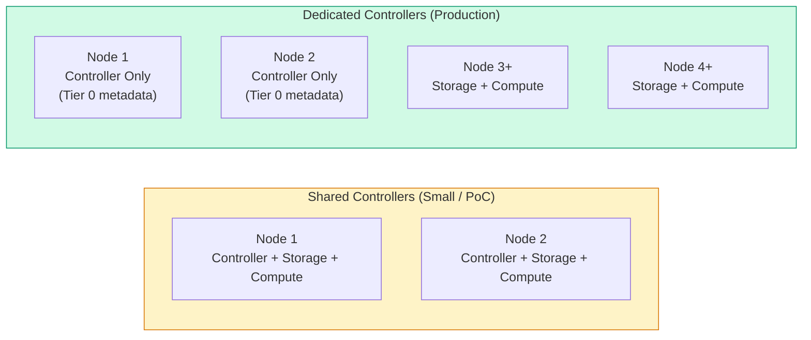

import { Card, CardGrid } from "@astrojs/starlight/components";

## Overview

Sizing a VergeOS deployment starts with understanding the hardware requirements for each node role. Because VergeOS is a complete infrastructure operating system -- not a collection of separate products -- its base overhead is remarkably low. There is no management appliance VM, no per-node controller VM, and no separate storage software to feed. The specifications below cover what VergeOS itself needs; you will add capacity on top for your workloads.

:::note[Coming from VMware or Nutanix?]
VergeOS has no management appliance and no per-node storage VM, so the 16 GB minimum RAM is the entire management-plane footprint per node.

| Platform | Per-node management/storage overhead |
| --- | --- |
| VMware vSphere + vSAN | vCenter (4 vCPU / 19 GB RAM minimum, central) + vSAN overhead per host + NSX Manager if used |
| Nutanix AOS | Controller VM per node, typically 20–32 GB RAM and 4–8 vCPUs reserved before any guest VM |
| VergeOS | None beyond the 16 GB base; vSAN runs in the OS kernel |
:::

## Generic Requirements (All Node Types)

Every node in a VergeOS cluster -- regardless of role -- must meet these baseline requirements:

| Component             | Minimum Specification                                                                                |
| --------------------- | ---------------------------------------------------------------------------------------------------- |
| **CPU**               | AMD or Intel x86-64 with hardware virtualization support (VT-x / AMD-V)                              |
| **RAM**               | 16 GB dedicated to VergeOS (additional RAM sized for workloads)                                      |
| **Remote Management** | IPMI, iDRAC, iLO, or equivalent out-of-band management                                               |
| **Disk Controller**   | NVMe direct-attached (preferred), or HBA / RAID controller in JBOD / IT mode -- **no hardware RAID** |
| **External NIC**      | 1 x 1 GbE (Intel, NVIDIA Mellanox, or Broadcom)                                                      |
| **Core Fabric NIC**   | 1 x 10 GbE (Intel, NVIDIA Mellanox, or Broadcom)                                                     |

:::caution[No Hardware RAID]
VergeOS manages data redundancy through its built-in vSAN (VergeFS). Hardware RAID controllers must be placed in **JBOD or IT mode** so that VergeOS can see and manage individual disks. Using RAID arrays hides disk health information and prevents VergeOS from performing its own data protection.
:::

### BIOS Settings Checklist

Before installation, verify these BIOS settings on every node:

- **Boot mode:** UEFI (required if all drives are NVMe)
- **Hardware-assisted virtualization:** Enabled (VT-x / AMD-V)
- **Hyper-threading / SMT:** Enabled
- **All processor cores:** Enabled
- **System clocks:** Synchronized across all nodes (within seconds)
- **Secure Boot:** Disabled

## Controller Nodes (Node 1 and Node 2)

The first two nodes in any VergeOS system are the **controller nodes**. They host the vSAN metadata (Tier 0), manage cluster orchestration, and serve as the system's management plane. Every VergeOS installation requires exactly two controller nodes for redundancy.

### Minimum Specifications

| Component           | Specification                     | Notes                                           |
| ------------------- | --------------------------------- | ----------------------------------------------- |
| **CPU**             | 1 x 2.7 GHz+                      | Higher clock speed benefits metadata operations |
| **RAM**             | 16 GB + 1 GB per 1 TB of storage  | The 1 GB/TB ratio is for vSAN metadata overhead |
| **Tier 0 Storage**  | 1 x Enterprise NVMe SSD (3+ DWPD) | Stores the vSAN hash map and filesystem index   |
| **Tier 0 Capacity** | 5 GB per 1 TB of usable capacity  | Dedicated metadata storage                      |

### Recommended Specifications

| Component           | Specification                     | Notes                                           |
| ------------------- | --------------------------------- | ----------------------------------------------- |
| **CPU**             | 1 x 3.0 GHz+                      | Improves metadata and orchestration performance |
| **Tier 0 Storage**  | 2 x Enterprise NVMe SSD (3+ DWPD) | Redundant metadata configuration                |
| **Tier 0 Capacity** | 10 GB per 1 TB of usable capacity | Additional headroom for metadata growth         |

:::tip[Tier 0 Is Metadata Only]
Tier 0 stores the vSAN hash map and filesystem index -- it is **not** a performance cache or a data tier. Sizing it correctly ensures fast lookups across the entire storage pool. The 3+ DWPD endurance requirement reflects the write-intensive nature of metadata updates.
:::

## Storage Nodes

Storage nodes participate in the vSAN and contribute disk capacity to the shared storage pool. In an HCI deployment, storage nodes also run workloads. In a UCI deployment, they may be dedicated exclusively to storage.

### Minimum Specifications

| Component                           | Specification                                     | Notes                                                                                                                                              |
| ----------------------------------- | ------------------------------------------------- | -------------------------------------------------------------------------------------------------------------------------------------------------- |
| **CPU**                             | 2.7 GHz+                                          | Handles vSAN I/O processing                                                                                                                        |
| **RAM**                             | 16 GB + 1 GB per 1 TB of raw storage              | Per-node; scales with disk capacity                                                                                                                |
| **Primary Storage**                 | 1 x Enterprise NVMe or SAS/SATA SSD per node      | For workload I/O (primary storage tier)                                                                                                            |
| **Capacity/Archive Tier (Tier 4+)** | Enterprise HDDs (optional)                        | For snapshots, archives, or file-based services; tier assignment is fixed at install time — VergeOS does not automatically move data between tiers |
| **Redundancy**                      | At least 2 nodes with matching disk configuration | Required for vSAN data redundancy                                                                                                                  |

### Recommended Specifications

| Component           | Specification                                     | Notes                                           |
| ------------------- | ------------------------------------------------- | ----------------------------------------------- |
| **CPU**             | 3.0 GHz+, 1 core per disk                         | Dedicated core per disk improves I/O throughput |
| **RAM**             | 1.5 GB per 1 TB of storage per node               | Better performance under heavy workloads        |
| **Primary Storage** | 2+ NVMe or SAS/SATA SSDs per node                 | More spindles = more IOPS                       |
| **Redundancy**      | At least 2 nodes with matching disk configuration | Required for vSAN data redundancy               |

### RAM Sizing Example

To illustrate the RAM calculation for a storage node:

```
Base VergeOS requirement:          16 GB
Storage overhead (8 TB raw x 1 GB): 8 GB
Workload VMs (example):           96 GB
─────────────────────────────────────────
Total RAM per node:              120 GB
```

At the recommended 1.5 GB/TB ratio, the storage overhead would be 12 GB instead of 8 GB, bringing the total to 124 GB.

## Compute-Only Nodes

Compute-only nodes run workloads but do **not** participate in the vSAN. They have no local storage requirements beyond a boot device (or can PXE boot). This makes them ideal for scaling CPU and RAM independently from storage in UCI and HCI+Compute architectures.

| Component      | Specification                                               |
| -------------- | ----------------------------------------------------------- |
| **CPU**        | Sized for workload requirements                             |
| **RAM**        | Sized for workload requirements (16 GB minimum for VergeOS) |
| **Storage**    | Boot device only (or PXE boot) -- no vSAN disks             |
| **Networking** | Same generic NIC requirements as all nodes                  |

Compute-only nodes are the simplest to size: determine the aggregate CPU and RAM your workloads need, divide by the per-node capacity, and round up to maintain N+1 availability.

## Networking Recommendations

The minimum networking configuration (1 GbE external + 1 x 10 GbE core) is suitable for small or proof-of-concept deployments. For production environments, follow these recommendations:

<CardGrid>
  <Card title="Core Fabric NICs" icon="rocket">
    **2 x 25/40/100 GbE** (Intel, NVIDIA Mellanox, or Broadcom). Dual NICs
    provide redundancy for the core fabric -- the high-speed mesh that carries
    vSAN replication, VM migration, and inter-node traffic. Jumbo frames (MTU
    9216+) are required on core fabric switches.
  </Card>
  <Card title="External NICs" icon="external">
    **2 x 10/25/40/100 GbE** (Intel, NVIDIA Mellanox, or Broadcom). Dual
    external NICs support bonding for redundancy and bandwidth to the upstream
    network. These carry management UI access and tenant external traffic.
  </Card>
</CardGrid>

### Supported NIC Vendors

VergeOS supports network adapters from three vendors:

- **Intel** -- Broad compatibility across different series
- **NVIDIA Mellanox** -- High-performance ConnectX series
- **Broadcom** -- Enterprise-grade NICs

:::caution
Consumer-grade or off-brand NICs are not supported. Using unsupported NICs may result in driver compatibility issues, poor performance, or system instability.
:::

## Maximum Supported Specifications

The following table outlines the maximum supported hardware specifications as of VergeOS version 4.12:

| Resource                          | Maximum | Notes                                        |
| --------------------------------- | ------- | -------------------------------------------- |
| **Nodes per system**              | 200     | Across all clusters                          |
| **Individual physical disk size** | 64 TB   | Per physical drive                           |
| **RAM per host**                  | 5 TB    | vSAN nodes require 1 GB RAM per 1 TB storage |
| **vDisk size**                    | 256 TB  | Per virtual disk                             |
| **Disks per VM**                  | 2,000   | Requires Virtio-SCSI interface               |
| **Clusters per system**           | 100     | Mix of compute, storage, and HCI clusters    |
| **Storage tiers per system**      | 5       | Tier 0 (metadata) through Tier 5 (archive)   |
| **vSAN fault domains per system** | 2       | Provides data redundancy                     |

These limits accommodate extremely large-scale deployments. Most production environments operate well within these boundaries.

## Storage Warnings and Considerations

### Consumer-Grade Disks

:::danger[Consumer-Grade Disks Not Supported]
VergeOS does **not** officially support consumer-grade disks. Only enterprise-grade storage devices should be used in production environments and backups of production data. Consumer-grade disks may be acceptable for test, development, or proof-of-concept environments where data loss is tolerable. Some consumer-grade devices may not function properly due to firmware limitations, non-standard command implementations, or compatibility issues with VergeOS.
:::

### Large HDD Considerations

HDDs larger than **8 TB** are not recommended outside of archive-specific environments. The concern is **rebuild time** -- when a large HDD fails, the vSAN must rebuild its data across remaining drives. With an 8 TB+ drive, this rebuild can take many hours, during which:

- **System performance is degraded** as rebuild I/O competes with production workloads
- **Availability risk increases** because a second drive failure during rebuild could cause data loss
- **The rebuild window grows** proportionally with drive size

For primary workload tiers, prefer smaller, faster SSDs. Reserve large HDDs for snapshot retention, archival storage, or file-based service tiers where rebuild time is an acceptable trade-off.

## Dedicated vs. Shared Controller Nodes

For production environments, VergeOS recommends **dedicated controller nodes** -- nodes that handle only the vSAN metadata (Tier 0) and system management, without running guest workloads or contributing to workload storage tiers.



| Approach                  | When to Use                    | Trade-off                                                         |
| ------------------------- | ------------------------------ | ----------------------------------------------------------------- |
| **Shared controllers**    | 2-node clusters, PoC, dev/test | Fewer nodes, but metadata I/O competes with workloads             |
| **Dedicated controllers** | Production, 4+ nodes           | Extra nodes, but metadata operations are isolated and predictable |

## Sizing Quick Reference

Use this quick-reference card when scoping a new deployment:

| Question                         | Guidance                                                                  |
| -------------------------------- | ------------------------------------------------------------------------- |
| How much RAM per storage node?   | 16 GB base + 1 GB per 1 TB raw (minimum) or 1.5 GB per 1 TB (recommended) |
| How many Tier 0 drives?          | 1 per controller (minimum), 2 per controller (recommended)                |
| How large should Tier 0 be?      | 5 GB per 1 TB usable (minimum), 10 GB per 1 TB usable (recommended)       |
| What DWPD for Tier 0?            | 3+ DWPD enterprise NVMe                                                   |
| How many cores per storage disk? | 1 core per disk (recommended)                                             |
| Minimum nodes for vSAN?          | 2 nodes with matching disk configuration                                  |
| Maximum nodes per system?        | 200                                                                       |
| Core fabric NIC speed?           | 10 GbE minimum; 25/100 GbE recommended                                    |

## Next Steps

Now that you understand the hardware requirements for each node role, continue to:

- **[Reference Architectures](/training/02-sizing-design/02-reference-architectures/)** -- See how these requirements map to real-world deployment topologies (HCI, HCI+Compute, UCI)
- **[Customer Scoping](/training/02-sizing-design/03-customer-scoping/)** -- Learn the methodology for translating customer workloads into hardware specifications
