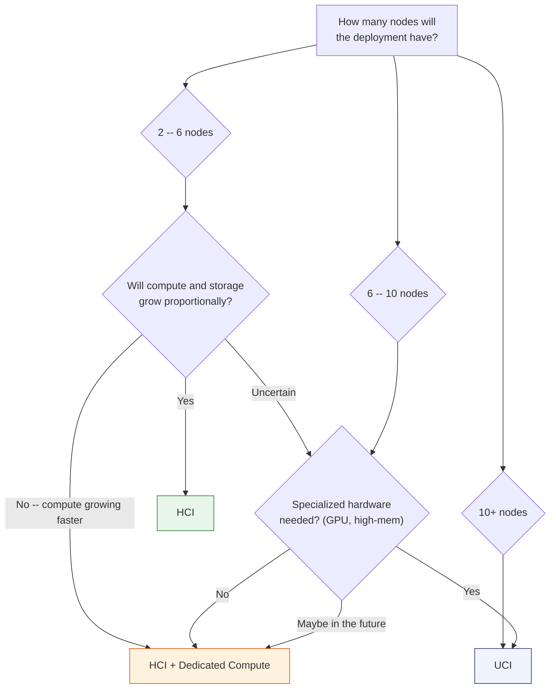
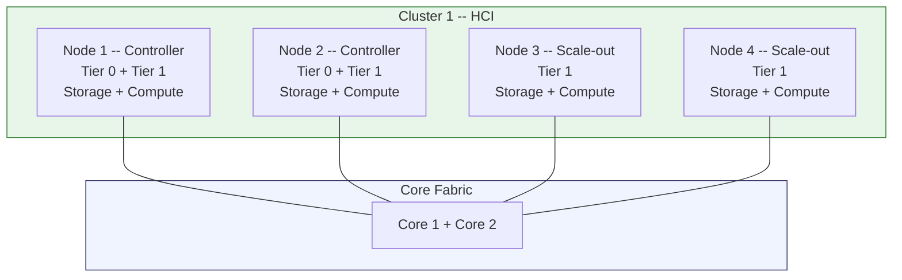
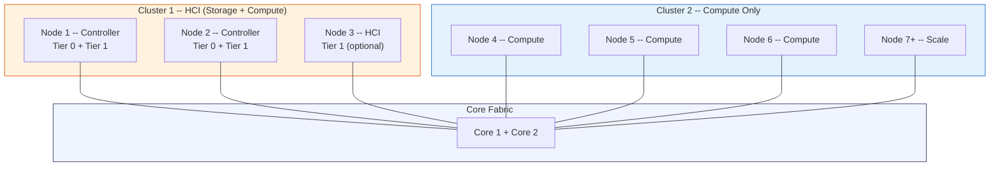
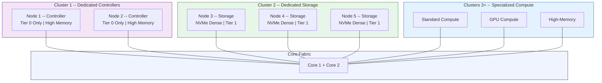
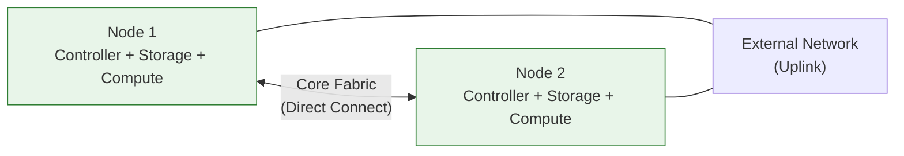

import { Card, CardGrid } from "@astrojs/starlight/components";

VergeOS supports three deployment architectures from the same software installation. Choosing the right one depends on node count, growth pattern, and workload specialization requirements. This page walks through each model, provides a decision framework, and covers two common real-world scenarios: edge deployments and cloud service provider (CSP) multi-tenant environments.

## Architecture Decision Tree

Use the following framework to guide your recommendation. The interactive version of this decision tree is available in the [VergeOS Reference Architecture documentation](https://docs.verge.io/reference-architecture/).

**Quick rules of thumb:**

1. **Start with HCI** unless you have a specific reason not to.
2. **Consider HCI + Compute** when compute demand outpaces storage growth (6--10 nodes).
3. **Choose UCI** for 10+ node environments, specialized hardware, or maximum performance isolation.
4. You can **evolve** from HCI to HCI + Compute to UCI as the environment grows -- the same VergeOS installation supports all three.

---

## Model 1: HCI (Hyperconverged Infrastructure)

**Node range:** 2--6 nodes | **Clusters:** 1

In an HCI deployment every node contributes **both** compute and storage. The two controller nodes carry Tier 0 (vSAN metadata) plus Tier 1 (workload) storage and run VMs. Scale-out nodes add Tier 1 storage and compute capacity to the same cluster.

### Advantages

- **Operational simplicity** -- single cluster, single hardware spec, unified management.
- **Predictable scaling** -- every node adds both storage and compute proportionally.
- **Lowest entry point** -- a 2-node cluster is the smallest VergeOS deployment possible.
- **Single hardware specification** simplifies procurement and spare-parts inventory.

### Limitations

- Cannot scale compute independently of storage (or vice versa).
- Limited hardware specialization -- all nodes share the same role.
- Recommended maximum of approximately 6 nodes before considering a second cluster.
- Potential resource contention on controller nodes running both metadata operations and VM workloads.

### Ideal Use Cases

| Scenario                              | Why HCI Works                                     |
| ------------------------------------- | ------------------------------------------------- |
| Small/medium deployments (2--6 nodes) | Minimal complexity, every node pulls double duty  |
| Balanced workloads                    | Storage and compute grow at roughly the same rate |
| Edge / remote sites                   | 2-node clusters with full HA and small footprint  |
| Evaluation and testing                | Fastest path to a working VergeOS system          |

---

## Model 2: HCI + Dedicated Compute

**Node range:** 6--10 nodes | **Clusters:** 2

This hybrid model extends an HCI foundation with a second cluster of **compute-only** nodes. The HCI cluster (Cluster 1) provides all storage via its controller and optional scale-out nodes. The compute cluster (Cluster 2) runs VM workloads without contributing any disks.

### Key Design Principles

<CardGrid>
  <Card title="Cluster 1 -- HCI (Combined)">
    - Always includes Nodes 1 & 2 with Tier 0 storage (controllers). - Can
    include additional HCI scale-out nodes for more storage and compute. - A
    cluster-level toggle controls whether this cluster also runs VM workloads. -
    All storage tiers exist in this cluster.
  </Card>
  <Card title="Cluster 2 -- Compute Only">
    - Pure compute -- maximum CPU and RAM available for VMs. - Scales
    independently based on compute demand. - Supports flexible,
    workload-optimized hardware (GPU nodes, high-memory nodes). - Storage I/O
    from compute nodes traverses the core fabric to Cluster 1.
  </Card>
</CardGrid>

### Advantages

- Independent compute scaling without buying unwanted storage.
- Maintains HCI operational simplicity for the storage layer.
- Cost-effective -- scale only the resource tier that is growing.
- Clear growth path to full UCI if needs evolve further.

### Limitations

- Storage I/O from compute nodes crosses the network (adequate core fabric bandwidth is essential).
- More complex than pure HCI (two clusters to manage instead of one).
- Requires a decision on whether the HCI cluster should also run workloads.

### Ideal Use Cases

| Scenario                         | Why HCI + Compute Works                             |
| -------------------------------- | --------------------------------------------------- |
| 6--10 node deployments           | Sweet spot for the two-cluster model                |
| Compute growth outpacing storage | Add CPU/RAM without expanding disks                 |
| GPU or specialized compute       | Dedicated compute cluster with passthrough hardware |
| Cost optimization                | Scale only what you need                            |

---

## Model 3: UCI (Ultra Converged Infrastructure)

**Node range:** 10+ nodes | **Clusters:** 3+

UCI completely separates controllers, storage, and compute into dedicated clusters. Each resource tier is independently scalable and uses hardware optimized for its role.

### Cluster Specialization

| Cluster                      | Role                                     | Optimized For                                         |
| ---------------------------- | ---------------------------------------- | ----------------------------------------------------- |
| **Cluster 1 -- Controllers** | Tier 0 metadata, API, cluster management | High memory (750 GB+), high-endurance NVMe for Tier 0 |
| **Cluster 2 -- Storage**     | All workload storage (Tier 1+)           | Maximum drive density, NVMe or SAS/SATA SSD           |
| **Clusters 3+ -- Compute**   | VM workloads, specialized hardware       | Standard, GPU, high-memory, or custom node types      |

### Advantages

- **Maximum performance** -- no resource contention between storage and compute.
- **Complete independent scaling** -- add storage without compute (or vice versa).
- **Hardware specialization** -- right-size hardware per role (NVMe-dense for storage, GPU-equipped for compute).
- **Workload isolation** -- different compute clusters for different workload types.
- **Optimal for large-scale and multi-tenant environments.**

### Limitations

- Highest operational complexity of all three architectures.
- Minimum 6 nodes (2 controllers + 2 storage + 2 compute).
- More complex capacity planning across three cluster types.
- Higher core fabric bandwidth requirements between clusters.
- Professional services recommended for initial deployment.

### Ideal Use Cases

| Scenario                              | Why UCI Works                                            |
| ------------------------------------- | -------------------------------------------------------- |
| 10+ node enterprise deployments       | Independent scaling avoids over-provisioning             |
| AI / HPC / GPU workloads              | Dedicated GPU compute clusters, separate from storage    |
| Cloud service providers               | Optimize hardware spend per resource tier across tenants |
| Storage-heavy or compute-heavy growth | Scale only what is growing                               |

---

## Architecture Comparison

| Aspect                   | HCI             | HCI + Compute           | UCI                                 |
| ------------------------ | --------------- | ----------------------- | ----------------------------------- |
| **Minimum nodes**        | 2               | 4 (2 HCI + 2 compute)   | 6 (2+2+2)                           |
| **Cluster count**        | 1               | 2                       | 3+                                  |
| **Performance**          | Good            | Better                  | Optimal                             |
| **Hardware flexibility** | Low             | Medium                  | Maximum                             |
| **Independent scaling**  | No              | Partial (compute only)  | Complete                            |
| **Specialization**       | None            | Compute only            | Full (controller, storage, compute) |
| **Complexity**           | Low             | Medium                  | High                                |
| **Resource efficiency**  | Variable        | Good                    | Maximum                             |
| **Best fit**             | Small, balanced | Mid-size, compute-heavy | Large, specialized                  |

---

## Edge Deployment Scenarios

Edge clusters are compact, 2-node VergeOS deployments designed for remote or branch office locations. They use low-power, small form factor hardware and are directly connected (no switches required for the core fabric).

### Typical Edge Configuration

- **2 nodes** directly connected via dual NICs (core fabric).
- Small form factor hardware (Intel NUC, SFF 1L PCs, or similar).
- 2 TB NVMe for workloads + 4 TB SSD for bulk storage per node.
- Full HA and redundancy despite the minimal footprint.

### Edge Management Models

VergeOS supports three edge management scenarios of increasing sophistication:

1. **Standalone with central management** -- 2-node clusters at each site, managed centrally via the **Sites** dashboard. Catalog Repositories distribute VM recipes from the management cluster to all edge sites.

2. **Centralized backup and DR** -- Same as above, plus a UCI cluster at the primary data center provides **Site Sync** replication, **ioGuardian** repair servers, and centralized snapshot storage for all branch offices.

3. **Multi-tier with archive** -- Adds a secondary archive cluster at a DR site for long-term retention using high-capacity HDDs, providing a complete 3-2-1 backup strategy.

### When to Recommend Edge

- Space or power constraints at remote sites.
- Applications that store data centrally but need local compute.
- Organizations managing 5--100+ distributed locations.
- Cost-sensitive branch office deployments.

---

## CSP / Multi-Tenant Scenarios

Cloud Service Providers leverage VergeOS multi-tenancy to deliver IaaS from shared infrastructure. Each tenant operates as an isolated Virtual Data Center (VDC) with its own UI, networks, storage, and access controls.

### Typical CSP Configuration

- **6-node UCI clusters** at primary data centers (high-density servers, 768 GB+ RAM per node).
- **Site Sync** between data centers for DR.
- **ioGuardian** repair servers for automatic block retrieval from remote sites.
- **Global inline deduplication** reduces storage consumption across replicated snapshots.
- **Tenant Recipes** automate provisioning of complete customer environments (tenant, networks, firewall rules, VMs, storage).

### CSP Growth Path

| Phase       | Deployment                                                 | Nodes                     |
| ----------- | ---------------------------------------------------------- | ------------------------- |
| **Phase 1** | 2 primary sites with DR via Site Sync                      | 6 per site                |
| **Phase 2** | Add 2-node edge clusters in new regions                    | 2 per region              |
| **Phase 3** | Scale out edge sites by adding clusters                    | 4--6 per scaled site      |
| **Phase 4** | Add dedicated storage clusters for S3-compatible offerings | 2+ storage nodes per site |

### Key VergeOS Features for CSPs

- **Multi-tenancy** with complete isolation between customer environments.
- **Self-service management** via web UI and API for tenant administrators.
- **Catalog Repositories** for centralized VM recipe management.
- **OpenID Authentication** integration with existing identity providers.
- **Tenant Recipes** for automated, repeatable customer onboarding.
- **S3-compatible storage** offerings via dedicated storage clusters and tenant recipes.

---

## Network Design Models Overview

The deployment architecture you choose influences your network design. VergeOS supports several network topologies, covered in detail in [Module 4: Networking](/training/04-networking/). Here is a brief overview to inform your architecture decision:

| Model                           | NICs per Node | Core Fabric            | External Network               | Best For                                   |
| ------------------------------- | ------------- | ---------------------- | ------------------------------ | ------------------------------------------ |
| **L2 Static + Dedicated Core**  | 4             | 2 dedicated L2         | Bonded L2 (LACP)               | Production environments, VMware migrations |
| **L3 Dynamic + Dedicated Core** | 4             | 2 dedicated L2         | BGP / OSPF / EIGRP advertised  | Large-scale, advanced segmentation         |
| **L3 Static + Dedicated Core**  | 4             | 2 dedicated L2         | Bonded L3 (static routes)      | Large-scale, Layer 3 switching             |
| **L2 Static (2 NICs)**          | 2             | 2 shared (VLAN tagged) | Shared with core (VLAN tagged) | Edge, PoC, small deployments               |

**Key requirements across all models:**

- Core fabric networks must be on **dedicated Layer 2 segments** (isolated from each other).
- Jumbo frames (**MTU 9216+**) on all core fabric switch ports.
- **Zero switch hops** between nodes on core fabric -- all nodes must connect to the same switching fabric.
- STP disabled on core fabric ports.

---

:::note[VMware Bridge]
VMware vSAN is HCI-only — every host contributes both storage and compute, and independent storage scaling means an external SAN/NAS, which breaks the HCI model. There is no VMware analog to VergeOS UCI; HCI + Compute is the closest, with compute-only ESXi hosts mounting shared vSAN over the network.
:::

:::note[Nutanix Bridge]
Nutanix is HCI-only — every node runs a CVM and contributes both storage and compute, even storage-heavy node profiles. VergeOS UCI builds pure storage clusters and pure compute clusters in one system, with no CVM overhead on any node type.
:::

## Summary

| Concept           | Key Takeaway                                                                           |
| ----------------- | -------------------------------------------------------------------------------------- |
| **HCI**           | Every node does everything. Simple, cost-effective at small scale. Start here.         |
| **HCI + Compute** | HCI foundation with independent compute scaling. The practical middle ground.          |
| **UCI**           | Dedicated roles per node. Maximum performance and flexibility at large scale.          |
| **Edge**          | 2-node direct-connect clusters for remote sites, centrally managed.                    |
| **CSP**           | Multi-tenant UCI deployments with Site Sync DR and tenant recipe automation.           |
| **Evolution**     | Same VergeOS installation supports all three models -- grow from HCI to UCI over time. |

## Next Steps

- **[Customer Scoping](/training/02-sizing-design/03-customer-scoping/)** -- Learn the requirements gathering methodology to translate customer needs into a specific architecture recommendation.
- **[Networking](/training/04-networking/)** -- Deep dive into network design models referenced above.
