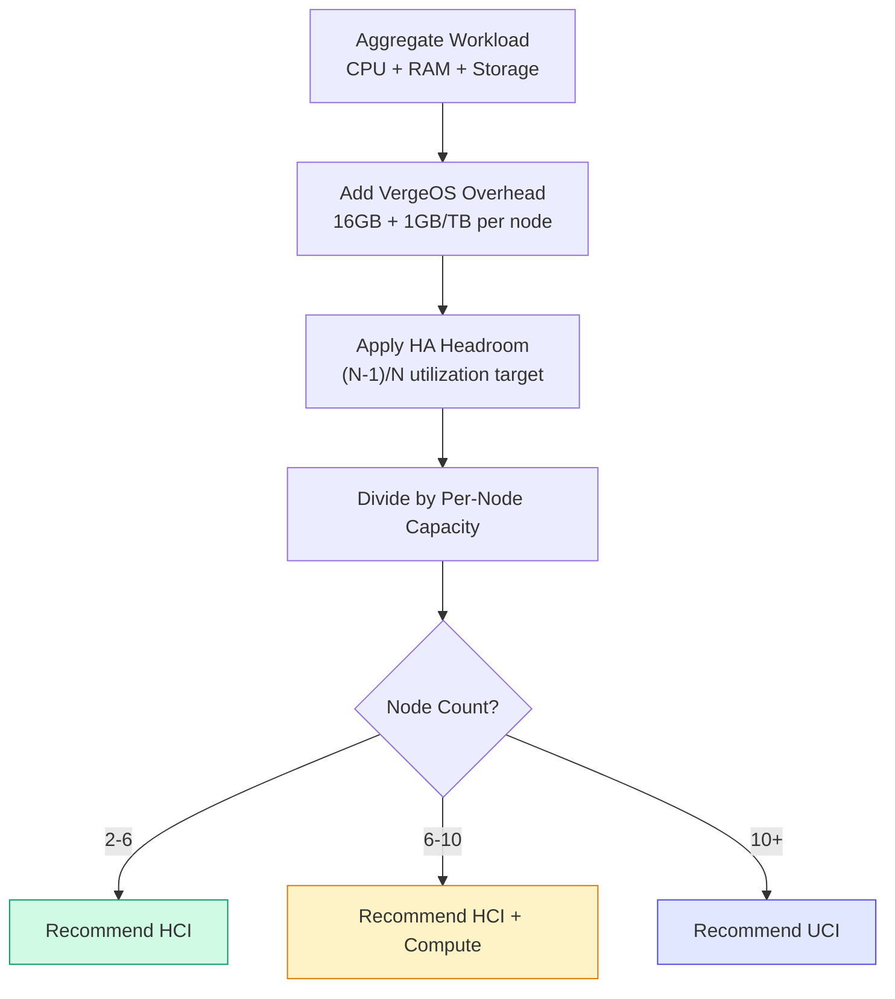

import { Card, CardGrid } from "@astrojs/starlight/components";

A well-scoped VergeOS deployment starts long before the first node is racked. This page provides a structured methodology for gathering customer requirements, translating workloads into VergeOS resource estimates, planning tenant node configurations, and selecting the right deployment topology. By the end of this process, you should have a complete set of documentation deliverables that any VergeOS engineer can use to execute the installation.

## Requirements Gathering Checklist

Every scoping engagement should begin by collecting the following information from the customer. Use this checklist as a conversation guide during discovery meetings.

### Current Workload Inventory

| Data Point                                | Why It Matters                                                                |
| ----------------------------------------- | ----------------------------------------------------------------------------- |
| **Total VM count**                        | Establishes the scale of the deployment and influences architecture selection |
| **Per-VM CPU cores**                      | Drives compute cluster sizing and identifies CPU-intensive outliers           |
| **Per-VM RAM allocation**                 | RAM is typically the constraining resource; determines node count             |
| **Per-VM storage (provisioned and used)** | Differentiates between thin-provisioned capacity and actual consumption       |
| **Storage IOPS / latency requirements**   | Identifies workloads that demand NVMe vs. those that tolerate SAS/SATA SSD    |
| **GPU or specialized hardware needs**     | Determines whether compute clusters need passthrough devices                  |
| **Operating system mix**                  | Windows, Linux, BSD — affects driver and integration planning                 |

### Growth Projections

- **6-month, 12-month, and 24-month forecasts** for VM count, CPU, RAM, and storage.
- **Growth pattern:** Does compute grow faster than storage, or proportionally? This directly influences the HCI vs. HCI + Compute vs. UCI decision.
- **Seasonal or burst patterns** — workloads with peak periods may need headroom that steady-state metrics do not reveal.

### Performance Requirements

- **IOPS targets** per workload tier (database, application, file services).
- **Latency requirements** — sub-millisecond for databases vs. general-purpose for file servers.
- **Throughput** — sequential read/write bandwidth for backup, media, or analytics workloads.

### Availability & DR Requirements

- **RPO (Recovery Point Objective):** How much data loss is acceptable? Drives snapshot frequency and site sync schedule.
- **RTO (Recovery Time Objective):** How quickly must services be restored? Influences whether tenants need multi-node HA or single-node with automatic failover.
- **N+1 expectations:** Can the cluster survive a full node failure with all workloads running? This ties directly to the RAM reservation decision.
- **DR site requirements:** Does the customer need site sync replication to a secondary location?

### Network Topology & Constraints

- **Existing switching infrastructure:** Brand, model, capabilities (MLAG, LACP, BGP).
- **Available NICs per node:** 2 vs. 4+ determines the network design model.
- **VLAN requirements:** How many isolated networks are needed? Are tenants on shared or dedicated VLANs?
- **Physical constraints:** Is all hardware in a single rack? Multiple racks? Multiple sites?
- **Core fabric latency:** All nodes must be on the same switching fabric with zero switch hops.

### Budget & Timeline

- **Hardware budget:** Influences server vendor selection and node count.
- **Licensing model:** Node-based — affects the cost optimization strategy.
- **Installation timeline:** Standard vs. phased rollout.

---

## Workload-to-Resource Translation

Once you have the customer's workload inventory, translate it into VergeOS resource requirements. VergeOS has significantly **less overhead** than traditional platforms — there is no Controller VM (CVM), no vCenter appliance, and no separate management plane consuming resources.

### Step 1: Aggregate Workload Totals

Sum the customer's workload requirements:

```
Total vCPU cores  = Σ (per-VM cores)
Total RAM (GB)    = Σ (per-VM RAM)
Total Storage (TB) = Σ (per-VM provisioned storage)
```

### Step 2: Add VergeOS System Overhead

VergeOS overhead is minimal but must be accounted for:

| Resource                            | Overhead                                                                |
| ----------------------------------- | ----------------------------------------------------------------------- |
| **RAM per vSAN node**               | 16 GB for VergeOS + 1 GB per 1 TB of raw storage on that node (minimum) |
| **RAM per vSAN node (recommended)** | 16 GB + 1.5 GB per 1 TB of raw storage                                  |
| **CPU per storage node**            | 1 core per disk (recommended)                                           |
| **Tier 0 storage**                  | 5–10 GB per 1 TB of usable capacity (controller nodes only)             |
| **Compute-only nodes**              | Only 16 GB for VergeOS; no storage overhead                             |

:::tip
VergeOS handles memory overhead for tenant nodes automatically. When you assign RAM to a tenant node, the **full amount** is available to the tenant's workloads. No additional manual overhead calculation is required.
:::

### Step 3: Account for HA Headroom

If the customer requires N+1 availability (the cluster can survive one node failure with all VMs running), you must ensure that the **remaining nodes** have enough aggregate CPU and RAM to absorb the failed node's workloads.

**Rule of thumb:** For an N-node cluster, each node should be provisioned to use no more than `(N-1)/N` of its total resources. For example, in a 4-node cluster, target 75% utilization per node.

### Step 4: Calculate Node Count

Divide the total resource requirements (including overhead and HA headroom) by the per-node capacity to determine the minimum number of nodes. Always round up and validate that the result fits within one of the three reference architectures:

- **2–6 nodes → HCI**
- **6–10 nodes → HCI + Dedicated Compute**
- **10+ nodes → UCI**



---

## Tenant Node Planning

For multi-tenant deployments (CSP, MSP, or internal departmental isolation), each tenant runs inside a Virtual Data Center (VDC) backed by one or more **tenant nodes**. Tenant nodes are virtual servers that simulate physical VergeOS nodes, providing compute, storage, and networking within an isolated environment.

### Single-Node vs. Multi-Node Tenants

**Single-node tenants** are the default and preferred starting point:

- Provide redundancy through automatic failover — if the physical host fails, the tenant node automatically restarts on another host.
- Simpler to manage and right-size.
- Can be scaled vertically (add cores/RAM) without disruption.
- Additional nodes can be added later, non-disruptively, as the tenant grows.

**Multi-node tenants** are needed when:

1. **Resource requirements exceed cluster maximums** — the `Max RAM per machine` and `Max cores per machine` cluster settings limit a single tenant node's size.
2. **Clustered applications** require workloads on different physical hosts (e.g., database primary/replica on separate nodes for HA).
3. **Mixed hardware capabilities** — the tenant needs both standard compute and GPU-equipped nodes, which live on different physical clusters.
4. **Regulatory requirements** mandate hardware separation between workload types.

### Right-Sizing Strategy

VergeOS tenants support **non-disruptive scaling** — you can add resources to existing nodes or add entirely new nodes without interrupting running workloads. The recommended approach:

1. **Provision for current or near-term needs** — do not over-allocate for speculative future growth.
2. **Scale organically** — increase tenant node resources as demand materializes.
3. **Max out existing nodes before adding new ones** — it is more efficient to increase a node from 32 GB to 64 GB than to add a second 32 GB node, unless application HA requires physical separation.

### Example Configurations

<CardGrid>
  <Card title="Small Single-Node" icon="laptop">
    **Scenario:** 3 VMs, no special requirements, cluster allows 64 GB / 16 cores max.

    **Config:** 1 tenant node — 16 GB RAM, 8 cores.

    **Scaling path:** Add RAM/cores to the existing node (up to 64 GB / 16 cores), then add a second node if needed.

  </Card>
  <Card title="Mid-Sized HA" icon="rocket">
    **Scenario:** Web farm with 4 web servers + 2 database servers requiring physical host separation.

    **Config:** 2 tenant nodes — 64 GB RAM, 12 cores each. HA Groups enforce anti-affinity so web/database instances run on different physical hosts.

    **Scaling path:** Increase node resources or add a third node for further workload distribution.

  </Card>
  <Card title="Mixed Workload with GPU" icon="setting">
    **Scenario:** Standard VMs + GPU-accelerated video rendering on different hardware clusters.

    **Config:** 4 tenant nodes — 2 on Standard cluster (64 GB each), 1 on vGPU cluster (64 GB), 1 on High-Performance cluster (48 GB).

    **Scaling path:** Scale each node independently based on its cluster's capabilities and workload demand.

  </Card>
  <Card title="Enterprise Distributed" icon="open-book">
    **Scenario:** Distributed analytics platform requiring 3 application servers on separate physical hosts + data processing nodes.

    **Config:** 4 tenant nodes — 3 × 64 GB / 12 cores (application + database per node with HA Group anti-affinity) + 1 × 32 GB / 8 cores (data processing).

    **Scaling path:** Add resources to existing nodes or add nodes for further physical separation.

  </Card>
</CardGrid>

---

## Topology Selection Decision Framework

With workload requirements gathered and resource translation complete, use the following criteria to make your architecture recommendation:

| Decision Criteria         | HCI                              | HCI + Compute                     | UCI                                       |
| ------------------------- | -------------------------------- | --------------------------------- | ----------------------------------------- |
| **Node count**            | 2–6                              | 6–10                              | 10+                                       |
| **Growth pattern**        | Proportional (compute ≈ storage) | Compute > storage                 | Either (fully independent)                |
| **Specialization**        | None needed                      | Some (GPU in compute cluster)     | Full (GPU, high-memory, storage-dense)    |
| **Complexity tolerance**  | Minimal IT staff                 | Moderate                          | Dedicated infrastructure team             |
| **Budget**                | Most cost-effective              | Moderate                          | Highest (but most efficient at scale)     |
| **Performance isolation** | Acceptable contention            | Compute isolated from storage I/O | Maximum — each role on dedicated hardware |

### Decision Checklist

1. **Is the node count under 6?** → Start with HCI unless there is a specific reason to separate compute.
2. **Is compute growing faster than storage?** → HCI + Compute lets you add cheap compute-only nodes.
3. **Are there GPU, high-memory, or other specialized hardware needs?** → UCI allows dedicated compute clusters per hardware type.
4. **Does the customer need to scale storage independently?** → UCI is the only model with a dedicated storage cluster.
5. **Is operational simplicity the top priority?** → HCI has the lowest management overhead.
6. **Can the environment evolve over time?** → Always. VergeOS supports transitioning from HCI → HCI + Compute → UCI by adding clusters to an existing system.

---

## RAM Reservation Decision

During installation, the engineer must decide the RAM reservation preference. This is a trade-off between **usable memory** and **N+1 HA enforcement**:

| Option                      | Behavior                                                                                                                                    | Best For                                                                                                        |
| --------------------------- | ------------------------------------------------------------------------------------------------------------------------------------------- | --------------------------------------------------------------------------------------------------------------- |
| **More Usable Memory**      | The system allows VMs to consume more of the available RAM, reducing the automatic reservation for failover headroom                        | Environments where maximizing per-node workload density is more important than guaranteed N+1 failover capacity |
| **More N+1 HA Enforcement** | The system reserves more RAM to ensure that if a node fails, the remaining nodes have guaranteed capacity to absorb all displaced workloads | Production environments with strict uptime SLAs where guaranteed failover is non-negotiable                     |

:::caution
This decision should be made **before** installation day. Discuss the trade-off with the customer during scoping and document the chosen preference in the installation plan.
:::

---

## Documentation Deliverables

A complete scoping engagement should produce the following documentation package, ready for the installation engineer:

### 1. Network Design Documentation

- **Layer 2 design drawing** — physical switches, VLANs, port assignments, MLAG/stacking configuration.
- **Layer 3 design drawing** — subnets, gateways, routing (BGP/OSPF if applicable), DNS servers.
- **A-B cable map** — every cable from every node to every switch, labeled with port identifiers.
- **Core fabric configuration** — dedicated VLANs for Core 1 and Core 2, MTU 9216+ confirmation, zero switch hops verification.

### 2. Rack Elevation

- Physical placement of every node, switch, PDU, and cable management.
- Power circuit assignments and redundancy mapping.

### 3. IP Allocation Plan

| Network         | Address               | Purpose                                |
| --------------- | --------------------- | -------------------------------------- |
| Management/UI   | `10.x.x.2/24`         | VergeOS web interface and API          |
| Gateway         | `10.x.x.1`            | Default gateway for external traffic   |
| Core Fabric 1   | VLAN 101 (auto)       | Inter-node storage and control traffic |
| Core Fabric 2   | VLAN 102 (auto)       | Redundant inter-node traffic           |
| IPMI            | `192.168.x.0/24`      | Out-of-band management                 |
| Tenant networks | Per-tenant allocation | Customer-specific subnets              |

### 4. Hardware Bill of Materials

- Server model, CPU, RAM, disk configuration per node.
- NIC types and speeds.
- Switch models and port counts.
- Tier 0 NVMe specifications (DWPD, capacity per TB of usable storage).

### 5. Installation Plan

- Chosen reference architecture (HCI, HCI + Compute, or UCI).
- Disk tier assignments per node.
- RAM reservation preference (usable memory vs. N+1 enforcement).
- Encryption decision (at-rest encryption yes/no, key storage plan).
- NTP server configuration.
- Admin credentials plan (password repository reference).

---

:::note[Coming from VMware or Nutanix?]
Both VMware and Nutanix scoping carry overhead VergeOS doesn't have. Plan accordingly when porting a sizing model.

| Platform | Scoping difference vs VergeOS |
| --- | --- |
| VMware vSphere + vSAN + NSX | Separate sizing exercises per product; vCenter appliance to size; per-feature licensing to optimize around. |
| Nutanix | Sizer tool plus a CVM on every node (20–32 GB RAM, 4–8 vCPU) before any guest workload. |
| VergeOS | One sizing pass. Flat 16 GB OS overhead + 1 GB per TB of storage; no CVM, no management appliance. |

Migrators from Nutanix often end up with fewer nodes for the same workload — or more VM headroom on the existing footprint.
:::

---

## Summary

| Phase                      | Output                                                                                                        |
| -------------------------- | ------------------------------------------------------------------------------------------------------------- |
| **Requirements gathering** | Completed checklist with workload inventory, growth projections, performance targets, and network constraints |
| **Resource translation**   | Total CPU, RAM, and storage with VergeOS overhead and HA headroom applied                                     |
| **Tenant planning**        | Single-node vs. multi-node decisions per tenant with example configurations                                   |
| **Topology selection**     | HCI, HCI + Compute, or UCI recommendation with justification                                                  |
| **RAM reservation**        | Documented preference — usable memory vs. N+1 enforcement                                                     |
| **Documentation package**  | Network drawings, rack elevation, IP plan, BOM, and installation plan                                         |

## Next Steps

- **[Hardware Requirements](/training/02-sizing-design/01-hardware-requirements/)** — Verify your node specifications against minimum and recommended requirements.
- **[Reference Architectures](/training/02-sizing-design/02-reference-architectures/)** — Review the detailed topology diagrams for your selected architecture.
- **[Module 3: Installation](/training/03-installation/)** — Proceed to installation preparation and execution.
