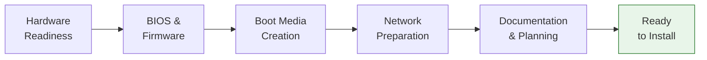
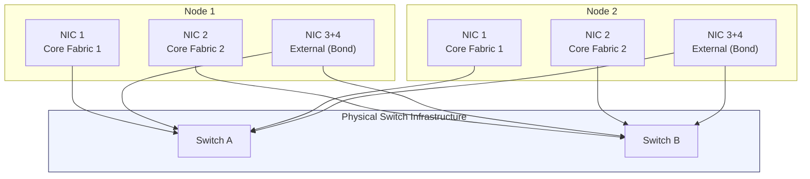

import { Card, CardGrid } from "@astrojs/starlight/components";

A successful VergeOS deployment starts well before the first USB drive is plugged in. This page covers every prerequisite you must verify -- from BIOS settings and disk controller modes to switch configuration and boot media preparation -- so that installation day proceeds smoothly and without surprises.

## Hardware Readiness

Before scheduling installation, confirm that all physical hardware is racked, cabled, and meets VergeOS requirements.

### CPU Requirements

- **64-bit processor** with hardware-assisted virtualization (Intel VT-x or AMD-V)
- All processor cores enabled in BIOS
- Hyperthreading enabled (recommended for workload density)

### Memory Requirements

- **Minimum 16 GB RAM per node** reserved for the VergeOS operating system
- **Additional 1 GB RAM per 1 TB of raw vSAN storage** on that node (e.g., a node with 4 TB of raw storage needs at least 20 GB total)
- Plan for workload RAM on top of the OS reservation

### Disk Controller Configuration

The disk controller is one of the most common sources of installation problems. VergeOS requires direct access to every individual drive -- it does not work with hardware RAID arrays.

| Controller Type            | Requirement                                                             |
| -------------------------- | ----------------------------------------------------------------------- |
| **HBA (Host Bus Adapter)** | Preferred -- passes drives directly to the OS                           |
| **RAID Controller**        | Must be set to **JBOD / IT mode** (passthrough) -- no RAID arrays       |
| **NVMe Drives**            | Verify the controller supports booting from NVMe if all drives are NVMe |

:::caution[Common Pitfall]
If drives are configured in a RAID array (even RAID 0), the VergeOS installer will see a single virtual disk instead of individual drives. This prevents proper vSAN tier assignment. Always verify JBOD mode before installation day.
:::

### Remote Management (IPMI)

- IPMI / iDRAC / iLO ports patched, configured, and tested on every node
- Latest IPMI firmware installed (recommended)
- Remote console capability verified -- critical for troubleshooting licensing or boot issues during installation

### Power

- Redundant power supplies connected and configured (recommended for production)
- UPS protection for all nodes and network switches

## BIOS Configuration

Every node must have its BIOS configured consistently before installation begins. Inconsistent BIOS settings across nodes are a common cause of installation delays.

| Setting                     | Required Value                                         | Notes                                                        |
| --------------------------- | ------------------------------------------------------ | ------------------------------------------------------------ |
| **Boot Mode**               | UEFI (preferred) or Legacy/Dual                        | **UEFI is required if all drives are NVMe**                  |
| **Hardware Virtualization** | Enabled (VT-x / AMD-V)                                 | Required for VergeHV hypervisor operation                    |
| **Hyperthreading**          | Enabled                                                | Recommended for workload density                             |
| **All Processor Cores**     | Enabled                                                | Do not disable cores to "save power"                         |
| **Secure Boot**             | **Disabled**                                           | VergeOS implements its own boot integrity verification       |
| **System Clocks**           | Set correctly (all nodes within seconds of each other) | Node 1 controls NTP for the entire system after installation |

### Why Secure Boot Must Be Disabled

VergeOS does not use traditional UEFI Secure Boot. Instead, VergeOS implements its **own boot integrity verification** that prevents tampered images from booting. This approach provides practical tamper protection without the limitations of UEFI Secure Boot (which requires operating systems to be signed with keys registered in the firmware -- a process controlled by a small number of certificate authorities).

The key difference:

- **UEFI Secure Boot** operates at the firmware level and blocks unsigned operating systems entirely
- **VergeOS Boot Integrity** validates the VergeOS image during boot and refuses to complete if the image has been modified or tampered with

For production environments, this provides equivalent practical security. Any attempt to modify VergeOS system files will be detected and prevent boot. Physical security controls should complement software-level integrity verification.

### Hardware Burn-In

Before installation, complete a hardware burn-in to identify early failures:

- Verify all drives are visible in BIOS
- Confirm all NICs are detected and showing expected MAC addresses
- Run vendor diagnostics (Dell BIST, HPE Insight Diagnostics, etc.) if available
- Verify MAC addresses match your documentation

## Boot Media Creation

The VergeOS installation is delivered as a single ISO image containing all packages for the complete system (hypervisor, storage, networking, and management). You will need a bootable USB drive for each node being installed.

:::note
Contact VergeOS support or your account team for the ISO download link. The ISO is not publicly available.
:::

### Windows -- Rufus

1. Download and launch [Rufus](https://rufus.ie/en/)
2. Insert a USB drive (it will be overwritten)
3. Select your USB device under **Device**
4. Click **Select** and choose the VergeOS ISO
5. Click **Start**
6. **When prompted, select DD mode** -- this is critical

:::caution[DD Mode is Mandatory]
Rufus defaults to ISO mode, but you **must select DD mode** for VergeOS. Selecting ISO mode will result in an **unbootable USB drive**. This is the single most common boot media mistake.
:::

### macOS -- BalenaEtcher

1. Download and install [BalenaEtcher](https://www.balena.io/etcher/)
2. Insert a USB drive (it will be overwritten)
3. Click **Flash from file** and select the VergeOS ISO
4. Select the target USB disk (verify you have the correct drive selected)
5. Click **Flash!** to start the process

### Linux -- USB Image Writer

1. Navigate to the downloaded ISO file in your file browser
2. Right-click the ISO and choose **Make bootable USB stick** (or use `dd` from the command line)
3. Select the USB drive as the target
4. Authenticate and write the image

### Testing Boot Media

Always test your boot media before installation day:

- Boot a test node (or one of the production nodes) from the USB
- Verify the VergeOS installer loads into memory and reaches the installation menu
- You can safely cancel the installer without making any changes to the system

## Network Preparation

Network configuration is the most complex pre-installation task. VergeOS requires two distinct network types, and the physical switches must be configured before installation begins.

### Network Architecture Overview

### Core Fabric Network

The core fabric is a private, high-speed network carrying vSAN storage traffic, cluster coordination, and VM migration. It is the backbone of the VergeOS system.

**Switch port requirements for core fabric:**

| Setting           | Value                                                          | Rationale                                           |
| ----------------- | -------------------------------------------------------------- | --------------------------------------------------- |
| **Port Mode**     | Access (untagged, single VLAN)                                 | One VLAN per core network                           |
| **VLAN**          | Dedicated, isolated VLANs (e.g., 900 for Core1, 901 for Core2) | Must be isolated from ALL other traffic             |
| **MTU**           | **9216** (jumbo frames)                                        | Required for storage efficiency and tenant overhead |
| **Spanning Tree** | Disabled on core ports                                         | Not needed for dedicated point-to-point core links  |
| **Speed**         | 10 Gbps or higher                                              | Minimum recommendation for production               |

:::caution[Critical: Do Not Bond Core Fabric NICs]
Port bonding (LAG/LACP) must **not** be used on core fabric networks. VergeOS builds redundancy by using two separate core fabric networks (Core1 and Core2) on separate switches. Bonding would interfere with this built-in redundancy model.
:::

**Each core switch must use a dedicated VLAN** -- for example, VLAN 900 for Core Fabric 1 and VLAN 901 for Core Fabric 2. These VLANs must be completely isolated from external traffic.

### External Network

External networks connect VMs and workloads to users, the internet, and existing infrastructure.

**Switch port requirements for external networks:**

| Setting       | Value                                 | Rationale                              |
| ------------- | ------------------------------------- | -------------------------------------- |
| **Port Mode** | Trunk (multiple VLANs)                | Supports management and workload VLANs |
| **VLANs**     | Management + workload VLANs as needed | Trunk only the VLANs required          |
| **MTU**       | 1500 (standard)                       | Unless workloads require jumbo frames  |
| **Bonding**   | LACP or Active-Backup (optional)      | Recommended for redundancy             |

### NIC Identification

Before installation, map every physical NIC to its intended role:

- **Minimum:** 2 NICs per node on separate switches (for core fabric redundancy)
- **Recommended:** 4+ NICs per node (2 core + 2 external for bonding)
- Document the MAC address and physical port location of each NIC
- Verify SFP modules are supported by both the NIC and the switch

### IP Address Planning

Allocate and document the following before installation:

- **UI/Management IP address** (static, CIDR format -- e.g., `10.0.0.2/24`)
- **Default gateway** IP address (test that it is reachable/pingable)
- **DNS server** addresses (at least one, two recommended)
- **Core fabric VLANs** (two dedicated VLANs, documented)
- **External network VLANs** (management + any workload VLANs)

## Documentation Requirements

Thorough documentation before installation prevents delays and simplifies troubleshooting. Prepare the following:

<CardGrid>
  <Card title="A-B Cable Map" icon="document">
    Document which NIC on each node connects to which switch and port. Label
    both ends of every cable.
  </Card>
  <Card title="Rack Elevation" icon="document">
    Record the physical position of each node, switch, and PDU in the rack.
  </Card>
  <Card title="Network Design Drawings" icon="document">
    Layer 2 (VLAN assignments, trunk/access ports) and Layer 3 (IP subnets,
    gateways, routing) diagrams.
  </Card>
  <Card title="IP Allocation Spreadsheet" icon="document">
    All IP addresses, CIDR masks, gateways, DNS servers, and VLAN IDs in one
    reference document.
  </Card>
</CardGrid>

## Planning Decisions

Several decisions must be made before installation because they cannot be easily changed afterward:

### Encryption (Not Reversible)

VergeOS supports **AES-256 at-rest encryption** for the vSAN. This decision is made during installation and **cannot be changed post-install** -- switching from encrypted to unencrypted (or vice versa) requires a full reinstall.

If enabling encryption:

- Prepare an encryption key passphrase (8--64 characters)
- Prepare a **USB drive per node** to store the encryption key (highly recommended)
- Store the passphrase securely in your password management system

### RAM Reservation Preference

During installation planning, decide between two approaches:

| Approach               | Trade-Off                                                                       |
| ---------------------- | ------------------------------------------------------------------------------- |
| **More Usable Memory** | Allocate more RAM to workloads, accepting slightly reduced HA failover capacity |
| **Stricter N+1 HA**    | Reserve more RAM for failover scenarios, reducing available workload memory     |

This setting is configurable post-install but should be planned in advance to match your SLA requirements.

### Installation Timeline

- **Estimated time:** 4--8 hours depending on node count and configuration complexity
- Schedule a maintenance window with stakeholders
- Ensure IPMI/remote access and on-site personnel are available for the entire window
- Have VergeOS support contact information ready

## Pre-Installation Final Checks (24 Hours Before)

Within 24 hours of the scheduled installation, perform these final verifications:

- [ ] All hardware physically installed, powered, and passing burn-in
- [ ] All network cables connected and passing a "tug test"
- [ ] Switch configurations complete, tested, and saved (`write mem`)
- [ ] IPMI accessible on all nodes
- [ ] Required IP addresses available and not conflicting with existing infrastructure
- [ ] Jumbo frames (MTU 9216+) verified on core fabric switch ports
- [ ] Boot media tested and ready
- [ ] All drives visible in BIOS on every node
- [ ] All NICs visible in BIOS on every node
- [ ] MAC addresses confirmed against documentation
- [ ] Date/time correct in BIOS on all nodes
- [ ] Virtualization settings enabled on all nodes
- [ ] No conflicting DHCP servers on the management network (if using DHCP)

## Summary

| Category          | Key Items                                                                                        |
| ----------------- | ------------------------------------------------------------------------------------------------ |
| **Hardware**      | 64-bit CPU with VT-x/AMD-V, 16 GB+ RAM, HBA or JBOD mode, IPMI configured                        |
| **BIOS**          | UEFI (required for all-NVMe), virtualization enabled, Secure Boot disabled, clocks synchronized  |
| **Boot Media**    | ISO from VergeOS support, Rufus (DD mode) or BalenaEtcher, tested before install day             |
| **Network**       | Core fabric: dedicated VLANs, MTU 9216, no bonding. External: trunk ports, optional LACP bonding |
| **Documentation** | Cable map, rack elevation, network diagrams, IP allocation spreadsheet                           |
| **Decisions**     | Encryption (yes/no, not reversible), RAM reservation preference, installation timeline           |

## Next Steps

With all prerequisites verified and documentation in hand, you are ready to proceed to the controller installation: **[Controller Installation →](/training/03-installation/02-controller-installation/)**
