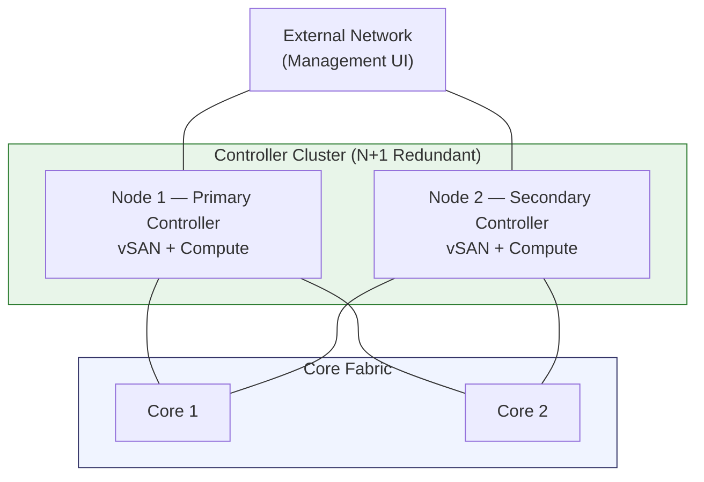

import { Card, CardGrid } from "@astrojs/starlight/components";

Installing the two controller nodes is the core of every VergeOS deployment. Node 1 bootstraps a brand-new system -- setting the system name, admin account, networking, licensing, encryption, and storage tiers. Node 2 joins the existing system and mirrors those settings, giving you an immediately redundant cluster. This page walks through both installations in detail.

## Installation Flow Overview

```mermaid
graph LR
    A["Boot Node 1<br/>from USB"] --> B["Standard Install →<br/>Controller → New"]
    B --> C["System &<br/>Network Config"]
    C --> D["License &<br/>Encryption"]
    D --> E["Disk Selection<br/>& Tier Assignment"]
    E --> F["Reboot &<br/>Verify Node 1"]
    F --> G["Boot Node 2<br/>from USB"]
    G --> H["Standard Install →<br/>Controller → Join"]
    H --> I["Auto-Detect<br/>Networks"]
    I --> J["Match Encryption<br/>& Tiers"]
    J --> K["Reboot &<br/>Verify Cluster"]

    style F fill:#e8f5e9,stroke:#2e7d32
    style K fill:#e8f5e9,stroke:#2e7d32
```

---

## Node 1: Primary Controller Installation

Node 1 creates the VergeOS system. Every configuration choice you make here establishes the baseline that Node 2 and all subsequent nodes will follow.

:::caution[Destructive Operation]
VergeOS is installed as a complete operating system on each node. Selected drives are formatted and **all existing data on those drives will be lost**. Double-check drive selections before confirming.
:::

### Stage 1: Boot and Installation Type

1. **Boot from USB** -- Insert the VergeOS installation media and boot the server. The full installer loads into memory; loading time varies by media speed.
2. **Select "Install (Standard)"** -- This is the default. Non-standard options should only be used when working directly with VergeOS Support.
3. **Select "Controller"** -- The first two nodes in any system must be controller nodes.
4. **Select "Yes"** to confirm this is a **New Install** (new vSAN).

### Stage 2: Time and Identity

5. **NTP configuration** -- Enter a space-delimited list of NTP servers (e.g., `pool.ntp.org time.google.com`), or accept the defaults.
6. **Date and time** -- Carefully confirm the current date and time. Node 1 controls NTP for the entire system after installation, so accuracy here is critical.

   :::caution[Time Matters]
   An incorrect date or time can cause vSAN operational problems. Verify both carefully -- especially the date, which is easy to overlook.
   :::

7. **System name** -- Enter a descriptive name for your VergeOS system (e.g., "Production HCI Cluster"). This name appears in the dashboard, alerts, reports, and site-sync configurations. It can be changed post-install in System Settings.

### Stage 3: Admin Account

8. **Administrator username** -- Accept the default (`admin`) or enter a custom username.
9. **Password** -- Enter a strong password (minimum 8 characters). Store it in your password repository immediately.
10. **Email address** -- Enter the admin email. This is used for password resets and receiving subscription alerts. An email address is required during installation.

### Stage 4: Network Interface Configuration

This is where your pre-installation NIC documentation pays off. You will configure every detected NIC on the node.

#### Core Network Interfaces

11. **Select Core1 NIC** -- Choose the physical NIC connected to your Core Fabric 1 switch.
12. **Configure Core1 settings:**
    - **Name** -- A descriptive name (e.g., the switch hostname or your naming convention)
    - **MTU** -- Default is 9192; must match the physical switch MTU (jumbo frames)
    - **Core** -- Leave set to **"Yes"**
    - **VLAN** -- Enter the Core1 VLAN ID, or leave blank/0 for PVID (untagged) ports

13. **Select Core2 NIC** -- Choose the physical NIC connected to your Core Fabric 2 switch.
14. **Configure Core2 settings** -- Same pattern as Core1 but using the Core2 VLAN ID.

:::tip[Keyboard Navigation]
In the installer, `[Tab]` moves between action items (Finish/Edit/Cancel), not between fields. Press `[Enter]` to toggle edit mode on a field. When edit mode is OFF, use arrow keys to move between fields.
:::

#### External Network Interface

15. **Select External NIC(s)** -- Choose the NIC(s) connected to your external/management switch. Port bonding (LACP) is supported here for redundancy.
16. **Configure External settings:**
    - **Name** -- Descriptive name for the external network
    - **MTU** -- Typically 1500 (standard Ethernet)
    - **Core** -- Change to **"No"**
    - **VLAN** -- Enter the management VLAN ID if applicable (PVID preferred)
    - **IP address** -- Static address in CIDR format (e.g., `10.0.0.2/24`), or enter `dhcp` for DHCP (test/evaluation only)
    - **Gateway** -- Default gateway IP address
    - **DNS** -- DNS server addresses

17. **Configure remaining NICs** -- Any unused or unplugged NICs should still be assigned a name (e.g., "unused") during installation. Select **[Done]** when all NICs are configured.

:::note
Port bonding (LAG/LACP) should **not** be used for Core Fabric networks. VergeOS builds redundancy through multiple separate core networks on separate switches. Bonding is appropriate only for external network interfaces.
:::

### Stage 5: License Configuration

18. **Select license server** -- Choose between Production or Trial/NFR server.
19. **Enter credentials** -- Provide the license username and password from your VergeOS account team. Store these securely.

### Stage 6: Storage Configuration

#### vSAN Encryption

20. **Enable or disable encryption** -- VergeOS supports AES-256 at-rest encryption for the vSAN.
    - If enabling, enter an encryption key passphrase (8--64 characters)
    - Optionally write the encryption key to a **USB drive** (highly recommended for production)
    - Verify the correct USB device is selected before confirming

:::caution[Encryption Is Permanent]
Encryption selection is **not reversible** post-install. Changing from encrypted to unencrypted (or vice versa) requires a full system reinstall. Make this decision carefully.
:::

#### Disk Selection and Tier Assignment

21. **Select vSAN drives** -- All detected drives are displayed and selected by default (marked with an asterisk). Deselect any drives that should be excluded:
    - Removable devices (USB drives)
    - Drives dedicated to storing an encryption key
    - Any drive not intended for vSAN use

22. **Assign storage tiers** -- The installer auto-detects a tier for each drive. Select **"Yes"** to review and optionally change tier assignments:
    - **Tier 0** -- Metadata storage (NVMe, high write endurance recommended, 5--10 GB per 1 TB usable vSAN)
    - **Tier 1** -- High-performance, write-intensive workloads (high-endurance NVMe)
    - **Tier 2** -- Mixed workloads, general-purpose VMs (mid-range SSD)
    - **Tier 3** -- Read-optimized workloads (read-optimized SSD)
    - **Tier 4** -- Capacity / infrequently accessed data (HDD)
    - **Tier 5** -- Archive / cold storage (archival HDD)

Select **[Done]** when tier assignments are correct.

:::note[Tier 0 Is Metadata Only]
Tier 0 stores the vSAN hash map and filesystem index. It is not a performance cache and does not store workload data. NVMe drives with high write endurance (3+ DWPD) are recommended.
:::

#### Swap Configuration

23. **Select swap tier** -- Choose which storage tier to use for swap space. Avoid Tier 0 drives when possible; select the next fastest tier. Never select HDD drives for swap unless the node contains only HDDs.
24. **Enter swap per drive** -- Specify swap in MB per drive (e.g., `2048` across 8 drives = 16 GB total). Generally, no more than **16 GB of swap per node** should be configured.
25. **Confirm** the swap summary and select **"Yes"**.

### Stage 7: Finalization and Reboot

26. The installer formats each selected drive (large drives may take several minutes) and initializes the vSAN.
27. When installation completes, **remove the USB media** and press **[Enter]** to reboot.

### Node 1 Verification

After reboot, verify the primary controller is healthy before proceeding to Node 2:

| Check                 | Expected Result                                                                  |
| --------------------- | -------------------------------------------------------------------------------- |
| **Console screen**    | Blue VergeOS user menu appears                                                   |
| **UI access**         | Navigate to the configured IP address in a browser; login with admin credentials |
| **Status indicators** | All indicators green on the main dashboard                                       |
| **vSAN health**       | vSAN mounted and healthy (shown on dashboard)                                    |

:::tip
If the node does not boot correctly, press `Esc` at the console to get a command prompt. Type `yb-install` to resume or `yb-install --restart` to start the installation over.
:::

---

## Node 2: Secondary Controller Installation

Node 2 joins the system created by Node 1. The installer will auto-detect most network configuration, making this process faster than Node 1.

:::note
The primary controller (Node 1) must be **fully installed and booted** before starting the Node 2 installation. Do not begin Node 2 until you have verified Node 1 is healthy.
:::

### Installation Steps

1. **Boot from USB** -- Insert the VergeOS installation media on the second server and boot.
2. **Select "Standard Install"** (default).
3. **Select "Controller"** (default).
4. **Select "No"** -- This is NOT a new install. You are joining the system already created on Node 1.

   :::caution
   If you select "Yes" here, the installer will create a **separate, independent system** instead of joining Node 1's cluster. This is the most common Node 2 installation mistake.
   :::

5. **Enter admin credentials** -- Provide the admin username and password created during the Node 1 installation.
6. **Automatic network detection** -- Select **"Yes"** to auto-detect network configuration. The installer will discover both core networks from Node 1. This is the recommended approach as it avoids manual network misconfiguration.
7. **Verify detected networks** -- For each detected core network, review the displayed configuration and press **[Enter]** to confirm.
8. **Configure encryption** -- Encryption settings **must match** Node 1. If Node 1 uses encryption, Node 2 must also use encryption with the same passphrase.
9. **Select vSAN drives and assign tiers** -- Drive and tier selections should match the pattern established on Node 1 (same tier assignments for equivalent drive types).
10. **Configure swap** -- Match the swap configuration from Node 1.
11. When the installer finishes, **remove the USB media** and press **[Enter]** to reboot.

### Node 2 Verification

| Check               | Expected Result                                                                 |
| ------------------- | ------------------------------------------------------------------------------- |
| **Console screen**  | Blue VergeOS user menu appears                                                  |
| **UI login**        | Access the same IP address used for Node 1; both nodes visible in the dashboard |
| **Node status**     | Both nodes show healthy (green) status in the Nodes dashboard                   |
| **vSAN redundancy** | vSAN shows redundant status (N+1) with both nodes contributing storage          |

---

## N+2 Redundancy (Optional Third Controller)

Two controller nodes provide the default **N+1 redundancy** -- two copies of every data block. For environments requiring higher resilience, VergeOS also supports **N+2 redundancy** with three controller nodes, maintaining three copies of each data block.

To configure N+2:

1. Install a third controller node following the same Node 2 process (join existing system)
2. Adding a third controller node to achieve N+2 redundancy should be performed in coordination with VergeOS Support, as the process and requirements may vary by version

:::caution
Changing between N+1 and N+2 on an existing system requires a full data rebalancing process that can involve **significant downtime**, especially on systems with large data volumes. This change should only be performed in coordination with VergeOS Support.
:::

---

## Installation Decision Summary

<CardGrid>
  <Card title="Irreversible Decisions" icon="warning">
    **Encryption** (Yes/No) cannot be changed after installation without a full
    reinstall. Decide before you begin.
  </Card>
  <Card title="Changeable Post-Install" icon="approve-check">
    System name, admin credentials, email, swap configuration, and network names
    can all be modified through the UI after installation.
  </Card>
  <Card title="Must Match Across Nodes" icon="list-format">
    Encryption settings and tier assignment patterns must be consistent between
    Node 1 and Node 2 (and all subsequent controller nodes).
  </Card>
  <Card title="Troubleshooting" icon="setting">
    Press `Esc` for a command prompt. Use `yb-install` to resume or `yb-install
    --restart` to restart the installation.
  </Card>
</CardGrid>

---

## Quick Reference: Installer Navigation

| Step                | Node 1 Selection   | Node 2 Selection                    |
| ------------------- | ------------------ | ----------------------------------- |
| Install type        | Standard Install   | Standard Install                    |
| Role                | Controller         | Controller                          |
| New install?        | **Yes** (new vSAN) | **No** (join existing)              |
| NTP / Time          | Configure manually | Not prompted (inherits from Node 1) |
| System name         | Enter name         | Not prompted (inherits from Node 1) |
| Admin account       | Create new         | Enter existing credentials          |
| Network config      | Manual per-NIC     | Auto-detect recommended             |
| License             | Enter credentials  | Not prompted (inherits from Node 1) |
| Encryption          | Choose Yes/No      | Must match Node 1                   |
| Disk/tier selection | Full selection     | Must match Node 1 pattern           |
| Swap                | Configure          | Configure (match Node 1)            |

## Next Steps

With both controller nodes installed and verified, you can proceed to add additional capacity:

- **[Adding Nodes →](/training/03-installation/03-adding-nodes/)** -- Scale-out, compute-only, and storage-only node installation
- **[Post-Installation Verification →](/training/03-installation/04-post-install-verification/)** -- Complete system health checks and configuration tasks
