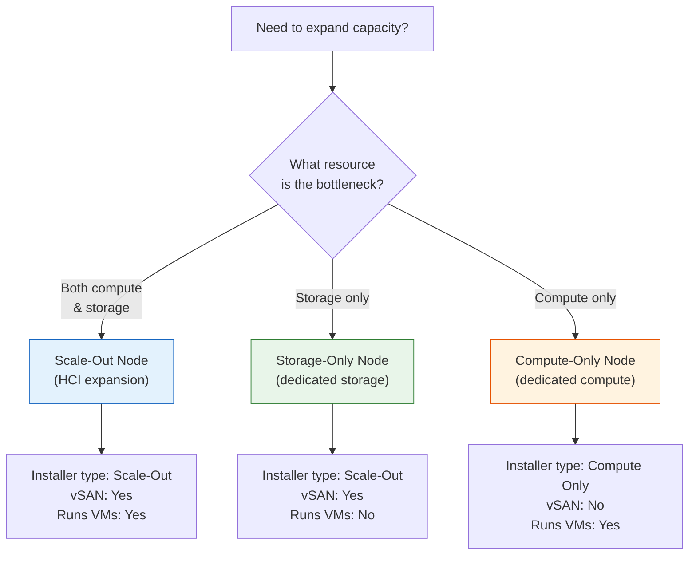
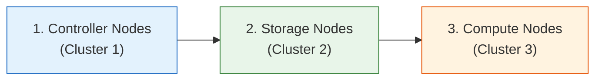

import { Card, CardGrid } from "@astrojs/starlight/components";

## Overview

Once your two-node controller cluster is operational, VergeOS supports three methods for expanding capacity: **scale-out nodes** (add both compute and storage to an existing HCI cluster), **storage-only nodes** (dedicated storage expansion), and **compute-only nodes** (dedicated compute expansion). Each node type follows a streamlined USB installer workflow that auto-detects the existing system on the core fabric.

This page covers the prerequisites, installation steps, and verification procedures for all three node types.

## Prerequisites

Before adding any node to your VergeOS system, ensure the following conditions are met:

| Requirement                    | Detail                                                                                                                                                     |
| ------------------------------ | ---------------------------------------------------------------------------------------------------------------------------------------------------------- |
| **Operational 2-node cluster** | The primary and secondary controller nodes from the [Installation Guide](/training/03-installation/02-controller-installation/) must be fully installed and healthy |
| **Network readiness**          | VLANs, physical NIC assignments, and core fabric cabling must match the configuration documented during initial setup                                      |
| **Matching hardware**          | Scale-out and storage-only nodes should have identical hardware specifications (CPU, storage, NICs, RAM) to existing nodes in the target cluster           |
| **USB installer**              | VergeOS installer media matching the version running on your existing cluster                                                                              |
| **Cluster created in UI**      | If adding a **new cluster type** (storage-only or compute-only) for the first time, create the cluster in the VergeOS UI **before** booting the installer  |

:::caution[Create Clusters Before Installing Nodes]
If this is the first storage-only or compute-only node you are adding, you **must** create the corresponding cluster in the VergeOS UI first:

1. Navigate to **System → Clusters**
2. Click **New Cluster**
3. Select the cluster type: **Storage** (for storage-only nodes) or **Compute** (for compute-only nodes)
4. Save the cluster configuration

The installer cannot add a node to a cluster that does not yet exist.
:::

## Node Type Comparison

Understanding the differences between node types helps you choose the right expansion strategy:

| Feature                           | Scale-Out                           | Storage-Only                        | Compute-Only                 |
| --------------------------------- | ----------------------------------- | ----------------------------------- | ---------------------------- |
| **Installer selection**           | "Scale-Out"                         | "Scale-Out"                         | "Compute Only"               |
| **vSAN participation**            | Yes — disks added to existing tiers | Yes — disks added to existing tiers | No — boot drive only         |
| **Runs VM workloads**             | Yes                                 | No                                  | Yes                          |
| **Requires cluster pre-creation** | No (joins existing HCI cluster)     | Yes (if first storage node)         | Yes (if first compute node)  |
| **Typical use case**              | Balanced HCI growth                 | UCI storage expansion               | GPU/ML/VDI compute expansion |

## Scale-Out Node Installation

Scale-out nodes are the simplest way to expand an HCI cluster. They add both compute and storage capacity proportionally, using hardware identical to the existing controller nodes.

### Installation Steps

1. **Boot from the VergeOS USB installer**
   - Insert the USB installer into the server designated as the scale-out node
   - Reboot and select the USB drive as the boot device from the BIOS/UEFI boot menu

2. **Select node type → "Scale-Out"**
   - When the installer presents the node type menu, select **Scale-Out**
   - This tells the installer to join an existing cluster with both compute and storage roles

3. **Enter admin credentials**
   - Provide the admin username and password created during the primary controller installation
   - These credentials authenticate the new node against the existing system

4. **Network auto-detection**
   - The installer auto-detects the core fabric configuration by listening for UDP packets from existing nodes
   - Verify that detected NICs match your documented cable map

   :::tip
   The installer may prompt you to identify which NIC is used for the **External** network if it cannot auto-detect. Have your NIC-to-port mapping documentation ready.
   :::

5. **Cluster selection** (if multiple clusters exist)
   - If your system has more than one cluster, the installer prompts you to select which cluster this node should join
   - Select the node in the target cluster that this new node most closely resembles in hardware

6. **vSAN disk configuration**
   - The installer displays detected disks and their proposed tier assignments
   - Confirm that storage tiers match the existing cluster configuration — **uniformity is critical**
   - Review and finalize disk selections

7. **Complete installation**
   - The installer formats drives, installs VergeOS, and integrates the node into the cluster
   - The node reboots automatically when installation completes
   - Remove the USB installer media when prompted

8. **Verify in the UI**
   - Log into the VergeOS web UI
   - Navigate to **System → Nodes** and confirm the new node appears with an operational status
   - Check **System → vSAN** to verify new disks are integrated and tiers are healthy

:::note
After the node joins, the vSAN will redistribute data to include the new disks. Tier status may show **yellow** during the rebuild phase — this is normal. Wait for all tiers to return to **green** before adding another node or performing maintenance.
:::

## Storage-Only Node Installation

Storage-only nodes expand vSAN capacity without adding compute resources. They are used in UCI (Unified Compute Infrastructure) architectures where storage and compute scale independently.

### Pre-Installation: Create Storage Cluster

If this is your **first** storage-only node, create the storage cluster in the UI:

1. Navigate to **System → Clusters**
2. Click **New Cluster**
3. Select **Storage** as the cluster type
4. Save the configuration

### Installation Steps

The storage-only node installation uses the **same "Scale-Out" installer option** as a regular scale-out node. The key difference is that the node joins a storage-only cluster instead of an HCI cluster.

1. **Boot from USB installer** — same as scale-out
2. **Select node type → "Scale-Out"** — the installer uses "Scale-Out" for both HCI and storage-only nodes
3. **Enter admin credentials** — authenticate against the existing system
4. **Network auto-detection** — verify NIC assignments
5. **Cluster selection** — select the **storage cluster** you created in the UI; select the node this new node most closely resembles
6. **vSAN disk configuration** — confirm tier assignments match the storage cluster's intended configuration
7. **Complete installation** — drives are formatted, VergeOS is installed, and the node reboots
8. **Verify in the UI** — confirm the node appears under the correct storage cluster on the Nodes page

:::tip
Because storage-only nodes use the "Scale-Out" installer option, the differentiator is the **cluster you select** during step 5. The cluster type (storage-only) determines the node's role in the system.
:::

## Compute-Only Node Installation

Compute-only nodes provide additional CPU, RAM, and optionally GPU resources without participating in vSAN storage. They are ideal for workloads that need high processing power — machine learning, rendering, VDI, or data analytics.

### Pre-Installation: Create Compute Cluster

If this is your **first** compute-only node, create the compute cluster in the UI:

1. Navigate to **System → Clusters**
2. Click **New Cluster**
3. Select **Compute** as the cluster type
4. Save the configuration

### Installation Steps

1. **Boot from USB installer** — same as other node types
2. **Select node type → "Compute Only"** — this is a distinct installer option, different from "Scale-Out"
3. **Enter admin credentials** — authenticate against the existing system
4. **Network auto-detection** — verify NIC assignments
5. **Cluster selection** (optional) — if prompted, select the **compute cluster** and the node this new node most closely resembles
6. **Complete installation** — the installer configures network settings and installs VergeOS **without configuring local storage for vSAN**. Only the boot drive is formatted. The node reboots automatically.
7. **Verify in the UI** — confirm the node appears under the correct compute cluster on the Nodes page

:::note
Compute-only nodes have **no vSAN disk configuration step**. They access storage over the core fabric from nodes in HCI or storage-only clusters. This is the key difference from scale-out and storage-only installations.
:::

## Installation Order Best Practices

When deploying a multi-cluster system (UCI architecture), follow this recommended order:

1. **Install controller nodes first** — they form the foundation cluster with Tier 0 metadata storage
2. **Add storage nodes second** — ensures vSAN storage capacity is available before compute nodes need it
3. **Add compute nodes last** — they can immediately access storage over the core fabric

Within any cluster, **add nodes sequentially** — wait for each node to complete installation and appear healthy in the UI before starting the next. This prevents race conditions during cluster membership changes.

## Troubleshooting

If issues arise during any node installation:

| Action                   | Command                | Description                                         |
| ------------------------ | ---------------------- | --------------------------------------------------- |
| **Cancel installer**     | Press `Esc`            | Drops to a command prompt                           |
| **Resume installation**  | `yb-install`           | Picks up where the installer left off               |
| **Restart from scratch** | `yb-install --restart` | Resets and restarts the entire installation process |

### Common Issues

**Node not appearing in the UI after reboot:**

- Verify network connectivity — ensure core fabric NICs are properly cabled
- Check that the USB installer version matches the VergeOS version running on the controllers
- Review node installation logs via the console

**vSAN tier stays yellow for extended time:**

- This is normal during data redistribution — monitor progress in **System → vSAN**
- Ensure sufficient bandwidth between nodes on the core fabric
- Contact VergeOS support if rebuild stalls beyond expected timeframes

**Installer cannot auto-detect network:**

- Verify core fabric switch ports are configured correctly (jumbo frames, STP disabled)
- Check physical cabling matches the documented NIC-to-port mapping
- Try manual network configuration if auto-detection fails repeatedly

**"No clusters available" during cluster selection:**

- Ensure you created the target cluster (Storage or Compute) in the UI before booting the installer
- Verify the cluster type matches the installer node type

## Verification Checklist

After adding any node, confirm the following:

- [ ] Node appears on the **System → Nodes** page with an operational status
- [ ] Node shows the correct cluster assignment
- [ ] For scale-out/storage nodes: **System → vSAN** shows all new disks with correct tier assignments
- [ ] For scale-out/storage nodes: vSAN tiers return to **green** (healthy) status after rebuild completes
- [ ] Core fabric connectivity confirmed: **Node Diagnostics → Fabric Configuration** reports `confirmed: true` for all paths
- [ ] No error events in the system log related to the new node

:::note[VMware Bridge]
Adding a host to a vSphere cluster requires per-host configuration in vCenter before joining. VergeOS nodes auto-detect on the core fabric, and a single USB installer covers controller, scale-out, storage-only, and compute-only roles.

| VergeOS node type | Closest VMware analog |
| --- | --- |
| Scale-out | Adding an ESXi host to a vSAN-enabled cluster |
| Storage-only | No equivalent — vSphere clusters don't support storage-only hosts |
| Compute-only | ESXi host with no local vSAN, mounting shared external storage |
:::

:::note[Nutanix Bridge]
Nutanix nodes always run a CVM and always contribute both compute and storage — no equivalent to VergeOS storage-only or compute-only roles, and scaling adds Foundation imaging plus Prism configuration on top of the join.

| VergeOS node type | Closest Nutanix analog |
| --- | --- |
| Scale-out | Adding a node via Foundation or `cluster add` |
| Storage-only | No equivalent — every Nutanix node runs a CVM and participates in compute |
| Compute-only | No direct equivalent (compute-heavy profile still runs a CVM and contributes storage) |
:::

## Key Takeaways

| Concept                     | Summary                                                                                           |
| --------------------------- | ------------------------------------------------------------------------------------------------- |
| **Three node types**        | Scale-out (HCI), storage-only, and compute-only — each with a specific role                       |
| **Single installer**        | One USB installer media handles all node types via menu selection                                 |
| **Auto-detection**          | Nodes discover the system on the core fabric automatically                                        |
| **Cluster pre-creation**    | Storage and compute clusters must be created in the UI before adding the first node of that type  |
| **Sequential installation** | Add nodes one at a time within a cluster to prevent race conditions                               |
| **Storage before compute**  | In UCI deployments, add storage nodes before compute nodes                                        |
| **vSAN rebuild**            | After adding storage-contributing nodes, wait for vSAN tiers to return to green before proceeding |

## Next Steps

With your nodes added and verified, proceed to post-installation verification to confirm overall system health: **[Post-Installation Verification →](/training/03-installation/04-post-install-verification/)**
