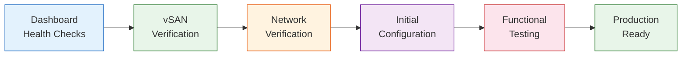

import { Card, CardGrid } from "@astrojs/starlight/components";

## Why Post-Installation Verification Matters

A successful VergeOS installation is only half the story. Before declaring your system production-ready, you need to systematically verify that every component — nodes, storage, networking, and configuration — is operating correctly. Skipping this step risks discovering issues under load when they are far more disruptive to diagnose and resolve.

This page walks through the complete post-installation verification process: dashboard health checks, vSAN validation, network redundancy testing, initial system configuration, and a final functional smoke test.

## Step 1: Dashboard Health Checks

The VergeOS Main Dashboard is your single pane of glass for system health. Immediately after installation, log in to the web UI and verify the following:

### Accessing the Dashboard

1. Open a web browser and navigate to the system's configured IP address (e.g., `https://10.0.0.2`)
2. Log in using the admin credentials created during installation
3. The Main Dashboard loads as the home page

### What to Check

| Indicator           | Expected State                               | Where to Look                       |
| ------------------- | -------------------------------------------- | ----------------------------------- |
| **Node status**     | All nodes "Running" with green status        | Nodes tile on Main Dashboard        |
| **VergeOS version** | All nodes showing the same version           | Nodes tile or System > Updates      |
| **Pending reboots** | None                                         | Node status indicators              |
| **CPU utilization** | Low / idle baseline                          | Dashboard CPU tile                  |
| **RAM utilization** | Within expected range (system overhead only) | Dashboard RAM tile                  |
| **Temperature**     | Normal operating range                       | Node details page                   |
| **Dashboard logs**  | No unexpected errors or warnings             | Logs section at bottom of Dashboard |

:::tip[Baseline Documentation]
Record the idle-state metrics (CPU, RAM, temperature) immediately after installation. These baseline values become your reference point for future health checks, capacity planning, and troubleshooting.
:::

### Checking Individual Nodes

Navigate to **Infrastructure > Nodes** and double-click each node to verify:

- **Status:** Running (green)
- **Version:** Matches expected VergeOS version
- **Uptime:** Consistent with installation timeline
- **No pending reboot** messages

If any node shows a yellow or red status, investigate the specific warnings or errors before proceeding.

## Step 2: vSAN Verification

The vSAN is the backbone of your VergeOS storage infrastructure. After installation, confirm that all tiers are healthy and configured as planned.

### Verifying Tier Health

Navigate to **Infrastructure > vSAN** to view the storage tier dashboard:

| Check                   | Expected Result                                                   |
| ----------------------- | ----------------------------------------------------------------- |
| **Tier status**         | All configured tiers show green/healthy status                    |
| **Disk count per tier** | Matches the number of physical disks assigned during installation |
| **Redundancy status**   | Confirmed — data is mirrored across nodes                         |
| **Capacity**            | Total raw capacity matches expected disk totals                   |
| **Deduplication**       | Active (ratio will be minimal on a fresh system)                  |

### Understanding Tier Layout

Recall that VergeOS storage tiers are assigned at install time and do not change:

- **Tier 0** — Metadata only (vSAN hash map and filesystem index). Stored on high-endurance NVMe drives. This is **not** a performance cache tier.
- **Tiers 1–5** — Workload data tiers. Tier assignment is permanent — VergeOS does **not** automatically move blocks between tiers.

Verify that your tier assignments match your installation planning documentation. If a disk was assigned to the wrong tier, it must be corrected before workloads are deployed (this may require reformatting the disk).

### Checking Drive Health

Within the vSAN dashboard, review individual drive status:

- All drives should show as **Online** and healthy
- No SMART warnings or errors should be present
- Drive serial numbers should match your hardware inventory documentation

:::caution[Drive Count Mismatch]
If the vSAN shows fewer drives than expected, check that all drives are visible in the node BIOS and that the disk controller is properly configured in JBOD/IT mode. Drives behind a RAID controller in RAID mode will not be visible to VergeOS.
:::

## Step 3: Network Verification

Network verification confirms that both the internal core fabric and external connectivity are functioning correctly with proper redundancy.

### Core Fabric Connectivity

The core fabric is the high-speed inter-node network that carries vSAN traffic, VM migration, and internal cluster communication. To verify:

1. Navigate to **Infrastructure > Nodes**, then select each node individually
2. Open **Diagnostics > Fabric Configuration**
3. Confirm that all paths on all nodes show `confirmed: true`

### Testing Core Fabric Redundancy

VergeOS uses two independent core networks (Core1 and Core2) for redundancy. To validate failover:

1. **Simulate a Core1 failure** by physically disconnecting a cable or powering down one core switch
2. In the VergeOS UI, navigate to **Nodes** and wait several minutes
3. Verify all nodes remain in "Running" (green) status
4. Restore the failed link, then repeat the test on Core2

:::caution[Core Fabric VLAN Isolation]
Core fabric VLANs must be completely isolated from all other traffic, including other VergeOS systems on the same physical infrastructure. Each VergeOS system must use unique and exclusive VLAN IDs for its core networks. Coordinate VLAN assignments with your network team and consult the Implementation Guide for any VLAN reservation requirements.
:::

### Verifying Core Network Isolation

Each physical core network must operate on its own isolated switch or dedicated VLAN. Verify that:

- Core1 and Core2 are on separate physical switches or separate VLANs
- No other VergeOS systems share these core network VLANs
- Jumbo frames (MTU 9216+) are confirmed on the switch ports

### External Network Verification

Confirm external/management connectivity:

1. **UI access** — Verify the web UI is reachable from the management network
2. **Gateway reachability** — From a node, confirm the default gateway responds
3. **DNS resolution** — Verify DNS servers are resolving correctly
4. **External redundancy** — Simulate a network cable disconnect on Node 1 and confirm the UI remains accessible through Node 2

## Step 4: Initial Configuration

With health checks complete, configure the system settings that prepare your environment for production workloads. VergeOS provides a [New System Configuration Checklist](https://docs.verge.io/product-guide/intro/new-system-configuration/) in the Product Guide — the key items are summarized below.

### Review Cluster Settings

Navigate to **Infrastructure > Clusters**, double-click your cluster, and select **Edit**. Key settings to review:

<CardGrid>
  <Card title="Target Max RAM %" icon="setting">
    Default is **80%**. This is the maximum percentage of physical RAM a node
    should use under normal conditions. During failover, this limit may be
    temporarily exceeded. Lower values provide more N+1 HA headroom; higher
    values maximize usable memory.
  </Card>
  <Card title="Default CPU Type" icon="laptop">
    Auto-detected during installation. Verify it matches your actual CPU
    hardware. If you plan cross-cluster migration, set this to the lowest common
    CPU type across clusters.
  </Card>
  <Card title="Max RAM per Machine" icon="rocket">
    Sets the maximum RAM for a single VM or tenant node. Recommended: no more
    than 70–80% of your smallest node's physical RAM to ensure workloads can
    always migrate during maintenance or failover.
  </Card>
  <Card title="Storage Buffer per Node" icon="document">
    Default is **2 GB**. When spare RAM is available, increasing this value can
    significantly improve vSAN read/write performance.
  </Card>
</CardGrid>

:::tip[Cluster Settings Require Reboots]
Most cluster setting changes require a node reboot to take effect. Make all your initial adjustments before deploying production workloads to avoid unnecessary maintenance windows later.
:::

### Verify Licensing and Updates

1. Navigate to **System > Updates**
2. Confirm the system is activated and licensed
3. Click **Check for Updates** and install any available updates
4. Verify the system is running the latest version

### Configure SMTP

SMTP configuration is essential for receiving email alerts and reports:

1. Navigate to **System > SMTP**
2. Configure your SMTP server settings (server address, port, authentication)
3. Send a test email to verify delivery

### Register a Server Certificate

The default self-signed certificate should be replaced with a CA-issued certificate for production systems:

1. Navigate to **System > Certificates**
2. Upload or generate a trusted certificate
3. This ensures browser trust and enables secure integrations with external platforms

### Set Up Alert Subscriptions

VergeOS uses **Subscriptions** to deliver alerts and reports via email. Create both on-demand (triggered) and scheduled subscriptions:

**Recommended on-demand subscriptions:**

- Main Dashboard status warnings and errors
- Storage tier high-usage alerts (80% warning, 90% critical)
- Drive warnings or errors
- Update packages available

**Recommended scheduled subscriptions:**

- System dashboard summary (daily)
- vSAN tier dashboard (weekly)
- System snapshots inventory (daily)

Navigate to **System > Subscriptions > New** to create each subscription. See the [Subscriptions Guide](https://docs.verge.io/product-guide/system/subscriptions-overview/) for detailed configuration options.

### Configure Site Syncs (If DR is Planned)

If disaster recovery is part of your deployment plan, configure site syncs to replicate your system to a secondary VergeOS site. This should be set up before production workloads are deployed so that the initial baseline sync completes while the system is relatively empty.

### Verify System Snapshot Settings

By default, VergeOS performs regular full system snapshots. Review and customize the schedule:

1. Navigate to **System > Snapshots**
2. Verify automatic snapshot schedules are configured
3. Adjust frequency and retention to align with your organization's RPO requirements

### Configure Authentication

For production environments, consider:

- **MFA (Multi-Factor Authentication):** Strongly recommended for all admin accounts
- **External identity providers:** Configure Google SSO, Microsoft Entra ID, or other providers as authorization sources
- **Password complexity:** Review and adjust requirements in Advanced Settings

## Step 5: Final Functional Testing

The last step before declaring the system production-ready is a hands-on smoke test that exercises core functionality end-to-end.

### Deploy a Test VM

1. Navigate to **Machines > Virtual Machines > New**
2. Create a small test VM (1 vCPU, 1 GB RAM, 10 GB disk)
3. Use a lightweight OS image (e.g., a minimal Linux ISO)
4. Power on the VM and verify it boots successfully

### Verify Network Connectivity

From within the test VM:

1. Ping the default gateway
2. Test DNS resolution (e.g., `nslookup docs.verge.io`)
3. Verify internet access if applicable to your network design
4. Confirm the VM can communicate as expected based on your network topology

### Test Snapshot and Restore

1. Take a snapshot of the test VM
2. Make a visible change inside the VM (create a file, change a setting)
3. Restore the VM from the snapshot
4. Verify the change is reverted — confirming snapshot integrity

### Test VM Migration (Multi-Node Clusters)

If your cluster has more than two nodes:

1. Note which node the test VM is running on
2. Initiate a live migration to another node
3. Verify the VM remains accessible during and after migration
4. Confirm the VM is now running on the target node

### Clean Up

After successful testing:

1. Power off and delete the test VM
2. Remove any test snapshots
3. Document the verification results

## Post-Verification Checklist

Use this summary checklist to confirm all verification steps are complete:

| Category      | Verification Item                           | Status |
| ------------- | ------------------------------------------- | ------ |
| **Dashboard** | All nodes running, green status             | ☐      |
| **Dashboard** | No errors or warnings in logs               | ☐      |
| **Dashboard** | Correct VergeOS version on all nodes        | ☐      |
| **vSAN**      | All tiers healthy, correct disk counts      | ☐      |
| **vSAN**      | Redundancy confirmed across nodes           | ☐      |
| **vSAN**      | Capacity matches planning docs              | ☐      |
| **Network**   | Core fabric paths confirmed on all nodes    | ☐      |
| **Network**   | Core fabric redundancy tested               | ☐      |
| **Network**   | External connectivity verified              | ☐      |
| **Network**   | External redundancy tested                  | ☐      |
| **Config**    | Cluster settings reviewed (RAM %, CPU type) | ☐      |
| **Config**    | System licensed and updated                 | ☐      |
| **Config**    | SMTP configured and tested                  | ☐      |
| **Config**    | Alert subscriptions created                 | ☐      |
| **Config**    | System snapshots configured                 | ☐      |
| **Config**    | Site syncs configured (if applicable)       | ☐      |
| **Config**    | Authentication/MFA configured               | ☐      |
| **Testing**   | Test VM deployed and booted                 | ☐      |
| **Testing**   | Network connectivity from VM verified       | ☐      |
| **Testing**   | Snapshot and restore tested                 | ☐      |
| **Testing**   | Test VM cleaned up                          | ☐      |

## Next Steps

With post-installation verification complete, your VergeOS system is ready for production workloads. The recommended next steps are:

- **Update network documentation** with final configuration details
- **Plan tenant creation** and resource allocation (see [Module 7: Multi-Tenancy](/training/07-multi-tenancy/))
- **Deploy production VMs** and workloads (see [Module 6: Virtual Machines](/training/06-virtual-machines/))
- **Schedule regular health checks** to maintain system health over time

Continue to the hands-on lab to practice a complete installation workflow: **[Lab: 2-Node Installation →](/training/03-installation/lab/)**
