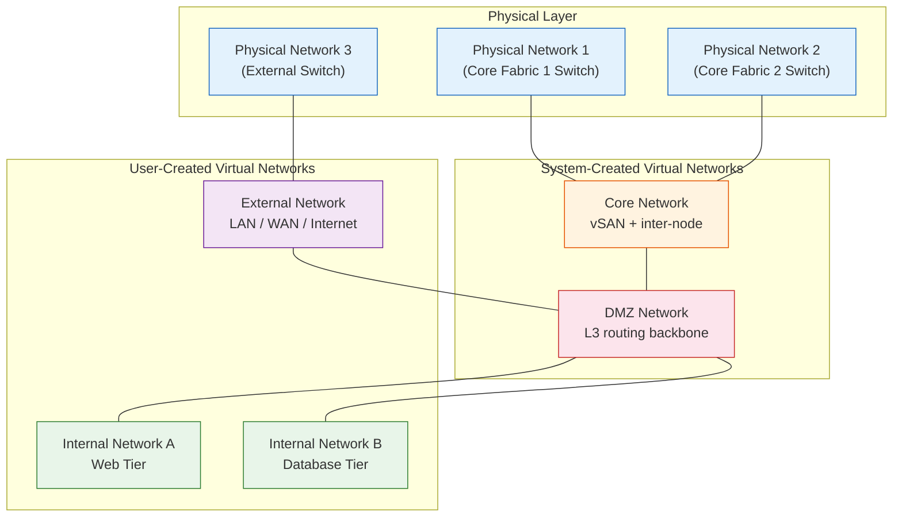

import { Card, CardGrid } from "@astrojs/starlight/components";

## VergeFabric: Integrated SDN

**VergeFabric** is the software-defined networking (SDN) layer built directly into VergeOS. Unlike traditional virtualization platforms that require separate SDN products (VMware NSX, Nutanix Flow), VergeFabric is native to the platform — there is no additional product to license, deploy, or manage.

VergeFabric provides:

- **On-demand virtual networks** — Create and destroy networks instantly from the UI or API, with no physical switch changes required
- **Embedded IP administration** — DHCP, DNS, routing, and firewall functionality built into every network
- **Micro-segmentation** — Enforce security at the tenant level or down to individual VMs with dedicated internal networks
- **Distributed Firewall (DFW)** — Granular security rules applied inside the network, beyond traditional perimeter-based controls
- **Dynamic routing** — BGP and OSPF support for advanced enterprise networking
- **API-first networking** — Fully programmable via REST APIs and IaC tools like Terraform
- **Self-service networking** — Tenants and developers can deploy, modify, and manage virtual networks without infrastructure team intervention
- **VPN integration** — Site-to-site and client VPN access using WireGuard or IPsec

This integrated approach means that every VergeOS deployment — from a two-node edge cluster to a multi-site MSP platform — gets the full SDN stack out of the box.

## The Five Network Types

VergeOS uses five distinct network types, each serving a specific role in the system architecture. Understanding these types is essential for designing, deploying, and troubleshooting VergeOS environments.

### Physical Networks

A **physical network** represents an isolated Layer 2 connection to physical switch infrastructure. Physical networks are configured during VergeOS installation and map directly to the physical NICs and switches in your environment.

Key characteristics:

- **Configured at install time** — Physical networks are defined during the VergeOS installation process and represent the actual cabling and switch port assignments
- **"Switch" suffix** — The system automatically appends "Switch" to the user-supplied name (e.g., a network named "PXE" becomes "PXE Switch")
- **One per isolated L2 domain** — Each physical network corresponds to a distinct Layer 2 broadcast domain on your switching infrastructure
- **Typical count** — A standard 4-NIC deployment has 4 physical networks: Core Fabric 1, Core Fabric 2, External 1 (bond primary), and External 2 (bond secondary)

Physical networks are the foundation that all other network types build upon. You do not create VMs on physical networks directly — they serve as the transport layer for virtual networks.

### Core Network

The **core network** is a virtual network created automatically during VergeOS installation. It handles all vSAN replication and inter-node communication, running across two physical networks (Core Fabric 1 and Core Fabric 2) for redundancy.

Key characteristics:

- **Auto-created** — Generated during installation; also created automatically for each tenant
- **Dual-path redundancy** — Rides on two independent physical networks (Core Fabric 1 and Core Fabric 2) on separate Layer 2 domains
- **Jumbo frames required** — Physical NICs require a minimum MTU of 9000; switch ports must be configured to at least 9216 to accommodate framing overhead
- **Zero switch hops** — All nodes must be on the same switching fabric with no inter-switch hops, keeping latency below 0.05ms
- **Address range** — The core fabric overlay uses internally managed addresses that are not user-configurable
- **No LAG/bonding** — Do not configure LAG or port bonding on core fabric interfaces; the core fabric implements its own application-layer redundancy across both physical paths, and adding LAG will interfere with this mechanism
- **Traffic types** — vSAN replication, VM live migration, cluster coordination, and control-plane communication

The core network is never exposed to external traffic. It is the most performance-critical network in a VergeOS system because vSAN throughput depends directly on inter-node communication speed. For a deep dive into the core fabric, see [Module 1: Core Fabric & Networking](/training/01-architecture/04-core-fabric/).

### DMZ Network

The **DMZ network** is a virtual network created automatically during VergeOS installation (and during tenant creation). It serves as the central connection point — the Layer 3 routing backbone — for all networks in the system.

Key characteristics:

- **Auto-created** — One DMZ network exists at the physical host level, and each tenant gets its own DMZ network
- **Layer 3 routing hub** — All inter-network communication passes through the DMZ, whether between internal networks, from internal to external, or between tenants
- **Firewall enforcement point** — Network rules applied at the DMZ control traffic flow between all connected networks
- **One per cloud** — Every VergeOS cloud (host system or tenant) has exactly one DMZ network

The DMZ is the architectural backbone that makes VergeOS networking work. When an internal network needs to reach another internal network or an external network, traffic routes through the DMZ. This centralized routing model enables fine-grained security policies at the network boundary.

### External Networks

An **external network** interfaces VergeOS with networks outside the system — your company LAN, a direct WAN connection, the internet, or any pre-existing network infrastructure.

Key characteristics:

- **At least one required** — Every VergeOS system needs at least one external network for management access and upstream connectivity
- **Multiple supported** — A single system can have multiple external networks, each with its own physical connection or VLAN
- **VLAN-capable** — Multiple external networks can share a single physical connection using dedicated VLAN IDs
- **Created during or after install** — The first external network is typically configured during installation; additional networks can be added at any time
- **Layer 2 type options** — vLAN, Bond, Bond Slave, none, or vxLAN depending on your topology
- **IP address type options** — Static, Dynamic (DHCP), BGP/OSPF, or None (Layer 2 only)

External networks connect to the DMZ, which then routes traffic to and from internal networks. This architecture means that workload traffic never touches physical switch infrastructure directly — it always passes through the VergeOS SDN layer where security rules can be applied.

### Internal Networks

An **internal network** is a virtual network created within VergeOS (from the UI or via the API). Internal networks are where your workloads — VMs and containers — actually live.

Key characteristics:

- **Default-secure** — When created, no traffic can flow in or out until network rules explicitly permit it
- **Unlimited quantity** — Create as many internal networks as needed, each fully isolated from the others
- **Built-in services** — Every internal network can have its own DHCP server, DNS server, gateway, and firewall rules
- **Layer 3 or Layer 2** — Layer 3 networks include full IP administration from VergeOS; Layer 2 networks delegate IP management to a third-party appliance (e.g., virtual firewall/router)
- **Tenant self-service** — Tenants can create and manage their own internal networks within their Virtual Data Center (VDC)
- **Overlapping subnets allowed** — Multiple internal networks can use the same subnet (e.g., `192.168.1.0/24`) because each network is isolated by default

Internal networks connect to the DMZ for inter-network routing and external access. The default-secure model means that a newly created internal network is completely isolated — you must add routing rules to enable communication with other networks.

### Maintenance Network (Optional)

A special **external network** type intended for IPMI or out-of-band management access to physical nodes and optional PXE boot. A maintenance network can be created during installation or added afterward. It provides a dedicated management path separate from production traffic.

## Built-in Network Services

Every VergeOS network (internal and external) can leverage the same set of built-in services — DHCP, DNS, routing, firewall, NAT, and VPN — replacing the external appliances and add-on products typically required in traditional virtualization environments.

<CardGrid>
  <Card title="DHCP Server" icon="sun">
    Dynamic or sequential IP assignment with configurable start/stop ranges,
    lease management, and domain name settings. DHCP release/renew available
    from the network diagnostics tool.
  </Card>
  <Card title="DNS Server" icon="document">
    Built-in DNS with zones, views, host registration, and record management.
    Each network can serve as its own DNS authority.
  </Card>
  <Card title="Routing" icon="right-arrow">
    Static route rules direct traffic between VergeOS networks and out to
    external networks. Dynamic routing via BGP and OSPF available for enterprise
    environments.
  </Card>
  <Card title="Firewall" icon="warning">
    Accept, drop, or reject packets based on defined criteria. Stateful packet
    inspection with granular rules applied at any network level.
  </Card>
  <Card title="NAT / PAT" icon="random">
    Map external-to-internal and internal-to-internal IP addresses and ports.
    Most commonly used to conserve external IP addresses.
  </Card>
  <Card title="QoS & Rate Limiting" icon="setting">
    Bandwidth prioritization and rate limiting to prevent resource contention
    and ensure fair usage across networks and tenants.
  </Card>
  <Card title="Port Mirroring" icon="list-format">
    Replicate a network's traffic to a VM NIC for deep packet inspection,
    analysis, or compliance monitoring.
  </Card>
  <Card title="VPN" icon="approve-check-circle">
    Site-to-site and client VPN access using WireGuard or IPsec. Secure remote
    access without external VPN appliances.
  </Card>
</CardGrid>

## How Traffic Flows

Understanding the traffic flow through VergeOS is critical for troubleshooting and network design. Traffic follows a predictable path through the network type hierarchy:

```mermaid
graph LR
    VM["VM Workload"]
    INT["Internal Network<br/>(DHCP, DNS, FW)"]
    DMZ["DMZ Network<br/>(L3 routing)"]
    EXT["External Network<br/>(LAN/WAN)"]
    PHY["Physical Network<br/>(Switch)"]
    UP["Upstream<br/>Infrastructure"]

    VM -->|"VM NIC"| INT
    INT -->|"Routing rule"| DMZ
    DMZ -->|"NAT / route"| EXT
    EXT -->|"VLAN / bond"| PHY
    PHY -->|"Physical cable"| UP

    style VM fill:#e8f5e9,stroke:#2e7d32
    style INT fill:#e8f5e9,stroke:#2e7d32
    style DMZ fill:#fce4ec,stroke:#c62828
    style EXT fill:#f3e5f5,stroke:#6a1b9a
    style PHY fill:#e3f2fd,stroke:#1565c0
    style UP fill:#f5f5f5,stroke:#616161
```

**Outbound traffic flow (VM → Internet):**

1. **VM** sends a packet to its gateway (the internal network)
2. **Internal network** evaluates firewall rules and forwards permitted traffic to the DMZ
3. **DMZ** applies routing rules and NAT, then forwards to the appropriate external network
4. **External network** maps to the physical network via VLAN tagging or bonded interfaces
5. **Physical network** delivers the packet to the upstream switch infrastructure

**Inbound traffic flow (Internet → VM):**

The reverse path applies. Traffic arrives at the physical network, enters the external network, routes through the DMZ (where NAT translates the destination), and reaches the internal network where firewall rules determine if the packet is delivered to the VM.

**Inter-network traffic (VM on Network A → VM on Network B):**

Traffic between two internal networks also passes through the DMZ. Network A routes to the DMZ, the DMZ evaluates rules and routes to Network B, and Network B delivers to the destination VM. This provides a consistent security enforcement point for all inter-network communication.

## Layer 2 vs. Layer 3 Networks

VergeOS supports both Layer 2 and Layer 3 virtual networks, each suited to different use cases:

| Feature              | Layer 3 Network                                | Layer 2 Network                                              |
| -------------------- | ---------------------------------------------- | ------------------------------------------------------------ |
| **IP management**    | VergeOS manages DHCP, DNS, routing, firewall   | Third-party appliance manages IP-level services              |
| **Network services** | Full built-in stack (DHCP, DNS, routing, FW)   | Cross-node routing via DMZ only                              |
| **Use case**         | Standard VM workloads, tenant networks         | Virtual firewall/router appliances, bridged physical devices |
| **Security**         | VergeOS firewall rules                         | Delegated to third-party appliance                           |
| **Configuration**    | IP address, subnet, gateway defined in VergeOS | No IP configuration in VergeOS                               |

Most deployments use **Layer 3 networks** for the majority of workloads, as they provide the full benefit of VergeFabric's integrated services. Layer 2 networks are used when you need to bridge to physical infrastructure or when a third-party virtual appliance must handle IP-level functions.

## Tenant Networking

VergeOS networking extends directly into the multi-tenant model. When a new tenant is created:

1. A **virtual physical network** is automatically created to encapsulate all of the tenant's traffic — from the tenant's perspective, this is their physical network
2. A **core network** is created for the tenant's internal cluster communication
3. A **DMZ network** is created as the tenant's routing backbone
4. The tenant is assigned one or more **external IP addresses**, with traffic routed through an external network on the host

From there, tenants can create a virtually unlimited number of internal networks within their own environment. They have full self-service control over DHCP, DNS, routing, firewall rules, and network segmentation — without requiring host-level access.

Layer 2 external access can also be configured so a tenant has its own dedicated WAN connection or a dedicated VLAN on the host's external connection.

:::note[VMware Bridge]
VMware splits networking across vDS (Layer 2 port groups, VLAN tagging), NSX-T (micro-segmentation, distributed firewall, overlays), and physical routers/firewalls (NAT, inter-VLAN routing). VergeFabric collapses that into one stack: physical networks for NIC aggregation, core for inter-node, external networks for upstream, DMZ for routing/firewall, and internal networks with DHCP/DNS/firewall built in.
:::

:::note[Nutanix Bridge]
Nutanix uses AHV's Open vSwitch for VM connectivity and VLANs, with Flow (separately licensed) for micro-segmentation and external DHCP/DNS/routers/firewalls for everything else. VergeOS provides the equivalent natively — physical and core networks replace OVS bridges and the CVM backplane, the DMZ network handles Layer 3 routing, and internal networks bundle DHCP/DNS/routing/firewall that would need Flow plus external services on Nutanix.
:::

## Key Takeaways

| Concept               | Summary                                                                                                                 |
| --------------------- | ----------------------------------------------------------------------------------------------------------------------- |
| **VergeFabric**       | Integrated SDN — no separate product to license or deploy. Full networking stack built into every VergeOS installation. |
| **Physical networks** | Layer 2 representations of physical switch connections, configured at install time, named with "Switch" suffix          |
| **Core network**      | Auto-created virtual network for vSAN and inter-node traffic, runs on dual physical fabrics for redundancy              |
| **DMZ network**       | Auto-created Layer 3 routing backbone, one per cloud/tenant, central point for all inter-network communication          |
| **External networks** | Interface with upstream LAN/WAN/Internet, VLAN-capable, support static/DHCP/BGP addressing                              |
| **Internal networks** | User-created virtual networks for workloads, default-secure, unlimited quantity, built-in DHCP/DNS/FW                   |
| **Traffic flow**      | VM → Internal → DMZ → External → Physical → Upstream (consistent path for all traffic)                                  |
| **Tenant networking** | Full self-service network stack per tenant with isolated DMZ, internal networks, and firewall rules                     |

## Next Steps

Now that you understand the VergeOS network types and how traffic flows through the system, the next topic covers how to connect VergeOS to your upstream infrastructure: **[External Networks →](/training/04-networking/02-external-networks/)**
