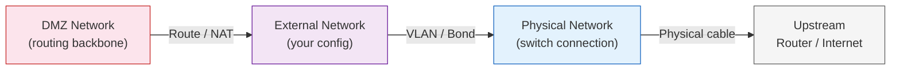
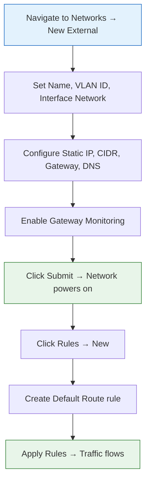

import { Card, CardGrid } from "@astrojs/starlight/components";

## What Are External Networks?

External networks are the bridge between your VergeOS environment and the outside world. They connect VergeOS to upstream physical infrastructure — your corporate LAN, WAN connections, the Internet, or any network that exists outside of VergeOS.

Every VergeOS system requires at least one external network, which is typically created during initial installation. After installation, you can create additional external networks to support multiple uplinks, VLANs, separate management networks, or tenant-dedicated WAN connections.

External networks sit between **physical networks** (Layer 2 switch connections) and the **DMZ** (the Layer 3 routing backbone). Traffic flowing from VMs to the Internet must pass through an external network to reach the physical infrastructure.

## Creating an External Network

To create a new external network, navigate to **Networks → New External** in the VergeOS UI. The creation form covers three major areas: network identity, Layer 2 configuration, and IP addressing.

### Network Identity

| Field           | Description                                                                                                      |
| --------------- | ---------------------------------------------------------------------------------------------------------------- |
| **Name**        | A descriptive name (e.g., `WAN1`, `MGMT-LAN`). Spaces are not permitted.                                         |
| **Description** | Optional notes for future administration.                                                                        |
| **HA Group**    | Assign to a high-availability group so the system distributes network instances across different physical nodes. |

### Layer 2 Configuration

The **Layer 2 Type** determines how the external network connects to the physical infrastructure:

| Layer 2 Type   | Use Case                                                                           |
| -------------- | ---------------------------------------------------------------------------------- |
| **vLAN**       | Most common — tags traffic with an 802.1Q VLAN ID on the selected physical network |
| **Bond**       | Active-backup bond across multiple physical networks for NIC redundancy            |
| **Bond Slave** | Secondary interface in a bonded pair (supports LAG group)                          |
| **none**       | Direct connect with no VLAN tagging — used for untagged/native VLAN connections    |
| **vxLAN**      | VXLAN overlay — specify a VXLAN Network Identifier (VNI) in the Layer 2 ID field   |

After selecting the Layer 2 type:

- **Layer 2 ID** — Enter the VLAN or VXLAN ID (if applicable)
- **MTU** — Typically `1500` for external networks (advanced users may adjust for jumbo frames)
- **Interface Network** — Select the physical network this external maps to (e.g., `External Switch`). Selecting another external network here enables **Q-in-Q** (VLAN inside VLAN) configurations.

### IP Address Configuration

The **IP Address Type** determines how the external network's router obtains its address:

| IP Address Type | Description                                                                                              |
| --------------- | -------------------------------------------------------------------------------------------------------- |
| **Static**      | Manually specify IP, network CIDR, gateway, and DNS. Most common for production deployments.             |
| **Dynamic**     | Obtain an address via DHCP. Limited to a single address — suited for small test or archive systems only. |
| **BGP/OSPF**    | Dynamic routing protocol integration for enterprise environments.                                        |
| **None**        | Layer 2-only connection with no IP assignment on the VergeOS router.                                     |

For **static** configurations, provide:

- **IP Address** — The address for this network's router (e.g., `192.168.212.2`)
- **Network Address** — The subnet in CIDR format (e.g., `192.168.212.0/24`)
- **DNS Servers** — Comma-separated list (e.g., `10.10.25.3, 10.10.25.4`)
- **Gateway Monitoring** — Recommended. Enables detection of upstream connectivity loss so VergeOS can respond to failures.

## VLAN Configuration

VLANs are the most common Layer 2 configuration for external networks. Each external network can be mapped to a specific 802.1Q VLAN ID on a physical network, enabling network segmentation without additional physical cabling.

**Example:** Create an external network named `WAN1` on VLAN 50:

1. Navigate to **Networks → New External**
2. Set **Name** to `WAN1`
3. Set **Layer 2 Type** to `vLAN`
4. Set **Layer 2 ID** to `50`
5. Set **Interface Network** to `External Switch`
6. Configure IP addressing (static or dynamic)
7. Click **Submit**

### Q-in-Q (VLAN Inside VLAN)

For environments that require double-tagging (e.g., service provider edge), select an **external network** (rather than a physical network) as the **Interface Network**. This stacks a second VLAN tag on top of the existing one, creating a Q-in-Q tunnel.

## Bonded Interfaces

Bonding creates an **active-backup** configuration across VLAN-tagged physical networks, providing NIC redundancy for external connectivity. This is especially recommended for bare-metal installations limited to two NICs per node, where both NICs carry core fabric traffic and the external connection must share those same physical interfaces via VLANs.

### Creating a Bonded External Network

1. Navigate to the external network's **Edit** settings
2. Set **Layer 2 Type** to `vLAN` and enter the appropriate VLAN ID
3. Enable the **Bonding** checkbox
4. Under **Bond Interfaces**, select the physical networks to participate:
   - Select specific fabrics (e.g., `core-fabric-1 Switch`, `core-fabric-2 Switch`), or
   - Select **All** to bond across all available interfaces
5. Click **Submit**

### Testing Bond Failover

After configuring a bond, validate failover behavior:

1. Navigate to the external network dashboard and select **NICs**
2. Physically disconnect one network cable
3. Verify the UI shows the disconnected NIC as **Down**
4. Confirm external connectivity is maintained through the backup NIC
5. Reconnect the cable and verify the NIC returns to **Up** status

:::caution
Always verify core network redundancy is in place before disconnecting any network cable. Perform bond failover testing with local console or IPMI access available as a fallback.
:::

## The Default Routing Rule

After creating an external network, **traffic will not flow until you add a default routing rule**. This is a critical post-creation step that is easy to overlook.

To add the default route:

1. From the external network dashboard, click **Rules**
2. Click **New**
3. Configure the rule:
   - **Name:** `default route`
   - **Action:** `Route`
   - **Direction:** `Outgoing`
   - **Source:** `Any`
   - **Destination:** `Default`
   - **Target Type:** `IP/Custom`
   - **Target IP:** Your upstream gateway (e.g., `192.168.212.1`)
4. Click **Submit**, then **Apply Rules**

Without this rule, the external network will be running but unable to route traffic to the upstream gateway.

## HA Groups

HA Groups provide high availability for external networks by distributing network instances across different physical nodes. When two or more networks are assigned to the same HA Group, the system ensures they run on separate nodes — so a single node failure does not take down all external connectivity.

To configure:

1. When creating or editing an external network, set the **HA Group** field to a group name
2. Assign the same group name to related external networks
3. Optionally set a **Preferred Node** or **Failover Cluster** for finer placement control

## DHCP Server Configuration

External networks can run a built-in DHCP server to assign addresses to clients on the network (e.g., tenants, VMs with direct external access, or PXE-booting nodes).

| Setting                  | Description                                                               |
| ------------------------ | ------------------------------------------------------------------------- |
| **Domain Name**          | Optional domain name for the DHCP scope                                   |
| **Gateway**              | The default gateway advertised to DHCP clients                            |
| **Hostname**             | Hostname for this network's router                                        |
| **Dynamic DHCP**         | Enable to specify a DHCP start/stop address range for dynamic allocation  |
| **Sequential Addresses** | When enabled, assigns addresses consecutively rather than pseudo-randomly |

## Additional Network Options

<CardGrid>
  <Card title="Cluster Affinity" icon="laptop">
    Optionally pin the network to a specific **cluster** and **failover
    cluster** to control where the VNet runs in multi-cluster environments.
  </Card>
  <Card title="PXE Boot" icon="setting">
    Enable PXE boot on the external network if VergeOS nodes will PXE boot from
    this network. Disabled by default.
  </Card>
  <Card title="On Power Loss" icon="warning">
    Controls behavior after a physical node power loss or tenant power cycle:
    **Last State** (restore previous state), **Leave Off**, or **Power On**.
  </Card>
  <Card title="Rate Limiting" icon="right-arrow">
    Enable rate limiting on routing to throttle overall network traffic.
    Configure the rate limit value, rate type (packets/sec, MB/day, bytes/hour,
    etc.), and burst allowance.
  </Card>
  <Card title="Statistics Tracking" icon="document">
    **Track Statistics for All Rules** enables automatic packet/byte counting on
    every rule. **Track DMZ Statistics** monitors total traffic between this
    network and the DMZ.
  </Card>
  <Card title="DNS Configuration" icon="list-format">
    Choose **Disabled** (no DNS), **Bind** (authoritative DNS), or **Simple**
    (DNS forwarding without local records).
  </Card>
</CardGrid>

## Walkthrough: Creating a Complete External Network

This end-to-end example creates a VLAN-tagged external network with a static IP and default route.

**Step-by-step:**

1. **Navigate** to **Networks → New External**
2. **Name:** `WAN1`
3. **Layer 2 Type:** `vLAN`, **Layer 2 ID:** `50`
4. **MTU:** `1500`
5. **Interface Network:** `External Switch`
6. **IP Address Type:** `Static`
7. **IP Address:** `192.168.212.2`
8. **Network Address:** `192.168.212.0/24`
9. **DNS:** `10.10.25.3, 10.10.25.4`
10. **Gateway Monitoring:** Enabled
11. Click **Submit** — wait for the network to show **Running**
12. Click **Rules → New**
13. **Rule Name:** `default route`, **Action:** `Route`, **Direction:** `Outgoing`
14. **Destination:** `Default`, **Target Type:** `IP/Custom`, **Target IP:** `192.168.212.1`
15. Click **Submit**, then **Apply Rules**

Your external network is now operational and routing traffic to the upstream gateway.

## Multiple External Networks

Production deployments often use more than one external network:

- **Separate WAN and LAN** — Dedicate one external for Internet access and another for corporate LAN connectivity
- **Management network** — Isolate management traffic (IPMI, UI access) on its own external and VLAN
- **Tenant-dedicated externals** — Provide tenants with their own VLAN or Layer 2 external for direct upstream access
- **Redundant ISP connections** — Multiple externals connected to different upstream providers for failover

Each external network can be mapped to the same or different physical networks, using different VLANs, IP ranges, and routing rules.

:::note[VMware Bridge]
VMware external connectivity uses vDS uplinks + per-VLAN port groups, with upstream routing on physical routers or NSX-T Edge Tier-0 gateways and HA via NSX Edge clusters. VergeOS external networks combine all of that into one form: Layer 2 Type for VLAN tagging, built-in route rules for static routes, bonded interfaces for NIC teaming, HA Groups for failover, and per-network rate limiting.
:::

:::note[Nutanix Bridge]
Nutanix AHV external connectivity relies on OVS bridges per node, with VLANs assigned per VM NIC and upstream routing/NAT/DHCP handled by external infrastructure. VergeOS sets VLANs at the network level, includes DHCP/DNS/NAT/routing on every external network, uses checkbox-based active-backup bonding instead of OVS bond config, and monitors gateway health automatically.
:::

## Key Takeaways

| Concept                | Summary                                                                                           |
| ---------------------- | ------------------------------------------------------------------------------------------------- |
| **Purpose**            | External networks connect VergeOS to upstream LAN, WAN, and Internet infrastructure               |
| **Layer 2 types**      | vLAN (most common), Bond, Bond Slave, none (direct connect), vxLAN                                |
| **IP types**           | Static, Dynamic/DHCP, BGP/OSPF, None (Layer 2 only)                                               |
| **Default route**      | Required after creation — without it, the network runs but cannot route traffic                   |
| **Bonding**            | Active-backup across physical networks for NIC redundancy; recommended for 2-NIC bare-metal nodes |
| **HA Groups**          | Distribute network instances across nodes for high availability                                   |
| **Gateway monitoring** | Detect upstream connectivity loss — always recommended for production                             |
| **DHCP**               | Optional built-in DHCP server with dynamic or sequential address assignment                       |
| **Q-in-Q**             | Double VLAN tagging by selecting an external (not physical) as the interface network              |

## Next Steps

With external networks connecting VergeOS to upstream infrastructure, the next topic covers how to build isolated virtual networks for your workloads: **[Internal Networks & DHCP/DNS →](/training/04-networking/03-internal-networks/)**
