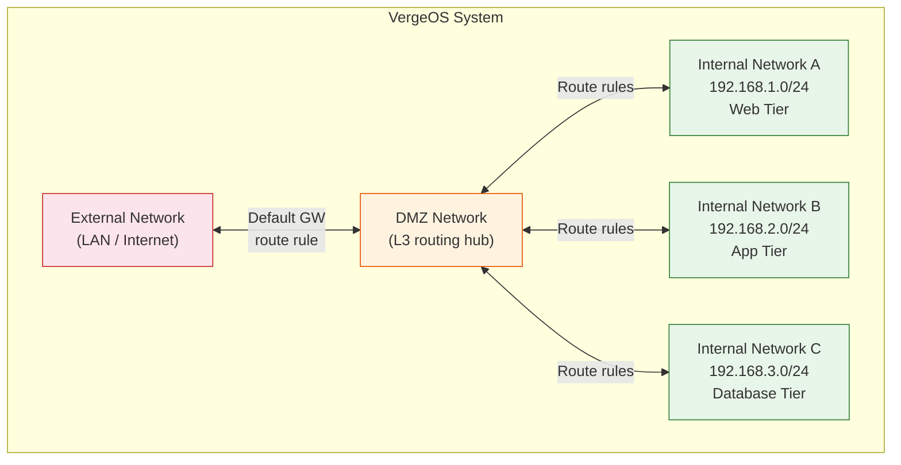
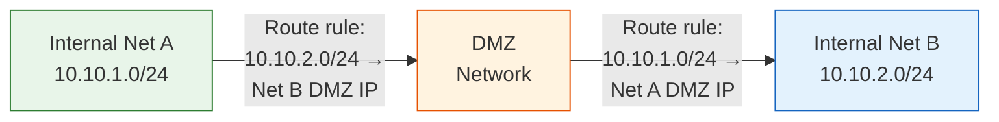

import { Card, CardGrid } from "@astrojs/starlight/components";

## What Are Internal Networks?

**Internal networks** are virtual networks created within VergeOS — from the UI or via the API — that provide isolated Layer 2/Layer 3 segments for VM workloads. They are the primary building block for application networking and workload segmentation.

Every internal network is **default-secure**: when first created, no traffic flows in or out until you explicitly add network rules to permit it. This zero-trust starting point means every internal network is a self-contained security boundary from the moment it exists.

Internal networks can be created as one of two types:

| Type                      | IP Address Type Setting | Capabilities                                                                                                             |
| ------------------------- | ----------------------- | ------------------------------------------------------------------------------------------------------------------------ |
| **Layer 3** (recommended) | Static                  | Full network management — DHCP, DNS, routing, firewall, rate limiting — all managed within VergeOS                       |
| **Layer 2**               | None                    | VergeOS manages connectivity up to Layer 2; IP-level services (DHCP, DNS, routing) are handled by third-party appliances |

Layer 3 internal networks are the standard choice for most workloads. The remainder of this page focuses on Layer 3 network capabilities.

## Creating an Internal Network

To create a new internal network:

1. Navigate to **Networks → Dashboard** and click the **Internals** quick-link
2. Click **New Internal** from the left menu
3. Configure the essential settings:

| Setting              | Description                                                                                                         |
| -------------------- | ------------------------------------------------------------------------------------------------------------------- |
| **Name**             | Required; spaces are not permitted                                                                                  |
| **Description**      | Optional descriptive text                                                                                           |
| **HA Group**         | Assigns the network to a high-availability group — the system runs grouped networks across different physical nodes |
| **Cluster**          | Select the cluster to run the network, or leave at Default                                                          |
| **Failover Cluster** | Defines a backup cluster if the primary is unavailable                                                              |
| **Preferred Node**   | Specifies a first-choice node for this network                                                                      |
| **Port Mirroring**   | Off (default), North/South (router traffic only), or East/West (all traffic including VM-to-VM)                     |
| **IP Address Type**  | **Static** for Layer 3 (recommended) or **None** for Layer 2                                                        |
| **Default Gateway**  | Select an external network to auto-create a routing rule for internet access                                        |
| **On Power Loss**    | Last State, Leave Off, or Power On                                                                                  |

### Default Addressing

By default, a new Layer 3 internal network is assigned:

- **Network segment:** `192.168.0.0/24`
- **Router IP address:** `192.168.0.1`

Since each internal network runs as a separate VXLAN overlay, multiple internal networks can share the same address range if they remain behind NAT (never directly routed to each other). However, if you plan to route between internal networks, each **must** have a unique CIDR range.

To change the default addressing, check the **Advanced Options** checkbox during creation to modify the network CIDR and router IP.

## Built-in DHCP

Every Layer 3 internal network includes a built-in DHCP server, enabled by default. The DHCP server is powered by **dnsmasq** running inside the network container, providing lightweight and reliable address management.

### Dynamic vs. Sequential Assignment

VergeOS supports two DHCP address assignment strategies:

| Mode                  | How It Works                                                                                                                                      | Best For                                                                       |
| --------------------- | ------------------------------------------------------------------------------------------------------------------------------------------------- | ------------------------------------------------------------------------------ |
| **Dynamic (default)** | IP is chosen based on a hash of the client's MAC address, greatly increasing the chances a client receives the same IP after lease expiry/renewal | Most workloads — provides pseudo-stable addressing without static reservations |
| **Sequential**        | Addresses are assigned in order from the start of the DHCP scope                                                                                  | Environments where predictable IP ordering is desired                          |

### DHCP Configuration Options

When DHCP is enabled, the following settings are available:

| Setting                       | Description                                                                            |
| ----------------------------- | -------------------------------------------------------------------------------------- |
| **Domain Name**               | Sets the DNS domain name for guest VMs (FQDN)                                          |
| **Gateway**                   | Overrides the default gateway sent to DHCP clients (defaults to the network router IP) |
| **Dynamic DHCP**              | Enable/disable dynamic address assignment (disable to only serve static reservations)  |
| **DHCP Start Address**        | Beginning of the dynamic address scope                                                 |
| **DHCP Stop Address**         | End of the dynamic address scope                                                       |
| **DHCP Sequential Addresses** | Toggle sequential mode (default is hash-based dynamic)                                 |

### Static DHCP Reservations

For VMs that need a guaranteed stable IP address, create a **static DHCP entry** that binds a MAC address to a specific IP:

**Method 1 — Convert an existing dynamic lease:**

1. From the Network Dashboard, click **IP Addresses**
2. Find the dynamic entry and double-click it
3. Change the **Type** to **Static**
4. Click **Submit**

**Method 2 — Create a new static entry:**

1. From the Network Dashboard, click **New** in the left menu
2. Set **Type** to **Static**
3. Enter the desired **IP Address**, the VM's **MAC Address**, and a **Hostname**
4. Click **Submit**

:::tip
Static DHCP reservations are preferred over manually configuring IP addresses inside the guest OS. They keep addressing centralized in the VergeOS network and ensure the VM always gets the correct IP through standard DHCP negotiation.
:::

### DHCP Diagnostics

If a VM is not receiving an IP address, use the built-in diagnostics:

1. Navigate to the network dashboard → **Diagnostics**
2. Select **DHCP Release/Renew** from the Query dropdown to force a lease cycle
3. Use **ARP Scan** to discover active devices on the network
4. Check the **IP Addresses** list on the network dashboard to verify lease status

## Built-in DNS

Every Layer 3 internal network provides DNS services to connected VMs. VergeOS offers multiple DNS modes, selected during network creation:

| DNS Mode             | Description                                                                                                     |
| -------------------- | --------------------------------------------------------------------------------------------------------------- |
| **Simple** (default) | Runs a forwarding DNS server; if no forwarding servers are listed, the default gateway network's DNS is used    |
| **Bind**             | Runs a full-featured BIND DNS server with authoritative zone hosting, DNS views, and split-horizon capabilities |
| **Other Network**    | Forwards DNS requests to another VergeOS network and auto-creates A records for DHCP clients                    |
| **Disabled**         | No DNS server runs, but the DNS server list is still offered to DHCP clients                                    |

### Simple DNS (Default)

Simple DNS is a forwarding resolver — it accepts DNS queries from VMs and forwards them to upstream DNS servers. This is sufficient for most workloads that simply need internet name resolution.

You can configure a **DNS server list** on the network to define specific upstream resolvers. If no list is provided, the network uses whatever DNS servers are configured on the default gateway network.

VMs configured with DHCP automatically receive DNS configuration from the network — no manual DNS setup is needed inside the guest OS.

### Authoritative DNS with BIND

For advanced DNS requirements — hosting your own zones, split-horizon configurations, or serving as the authoritative nameserver for a domain — enable **Bind** mode. This provides:

- **DNS Views** — Control how the server responds based on client IP (e.g., internal vs. external clients)
- **DNS Zones** — Host authoritative records for one or more domains
- **Record Management** — Full support for A, AAAA, CNAME, MX, TXT, NS, SRV, and other record types
- **Zone Transfers** — Primary/secondary configurations for DNS redundancy
- **Split-Horizon DNS** — Serve different IP addresses to internal vs. external clients for the same hostname

DNS views are configured at **Networks → DNS Views → New**, where you define match-client rules, recursion settings, and zone associations. Zones are created within views, and records are managed per zone.

### DNS Diagnostics

Test DNS resolution from the network's diagnostics interface:

1. Navigate to the network dashboard → **Diagnostics**
2. Select **DNS Lookup** from the Query dropdown
3. Enter a **Host** (URL) and select a **Query Type** (A, AAAA, MX, etc.)
4. Optionally specify a **DNS Server** to override the default
5. Click **Send** — a successful lookup returns the resolved IP address

## Inter-Network Routing via the DMZ

The **DMZ network** is the Layer 3 routing backbone of every VergeOS cloud. Every internal and external network connects to the DMZ, making it the central point through which all cross-network traffic flows.

### Default Gateway Rule

For an internal network to reach the internet (or any external network), it needs a **default gateway route rule**. When you select an external network in the **Default Gateway** field during network creation, VergeOS automatically creates this rule. If you skip that step, create the rule manually:

1. Navigate to the internal network dashboard → **Rules**
2. Click **New** from the left menu
3. Configure the rule:
   - **Name:** `Default Gateway`
   - **Action:** Route
   - **Direction:** Outgoing
   - **Type (Target):** Other Network DMZ IP
   - **Target Network:** Select your external network
4. Click **Submit**, then click **Apply Rules** from the network dashboard

### Routing Between Internal Networks

To allow two internal networks to communicate directly, you need route rules on **both** networks pointing to each other through the DMZ:

On each network, create a static route rule:

- **Action:** Route
- **Direction:** Outgoing
- **Protocol:** ANY
- **Destination Type:** Custom — enter the other network's CIDR (e.g., `10.10.2.0/24`)
- **Target Type:** Other Network DMZ IP
- **Target Network:** Select the destination network

Then add a corresponding **firewall accept rule** (Action: Accept, Direction: Incoming) on each network to permit the routed traffic. Remember: internal networks are default-secure, so without an explicit accept rule, routed traffic will be dropped.

## Tenant Self-Service Networking

A key behavior of VergeOS internal networking is **tenant self-service**. When a tenant (Virtual Data Center) is provisioned:

- The tenant automatically receives its own **DMZ network** as a routing backbone
- Tenant administrators can create **unlimited internal networks** within their environment
- Each tenant network is fully isolated — tenants cannot see or access other tenants' networks
- Tenants manage their own DHCP, DNS, firewall rules, and routing without requiring host-level intervention

This architecture makes VergeOS ideal for **managed service providers (MSPs)** and **multi-tenant enterprise environments** where each business unit or customer needs autonomous network management within a shared infrastructure.

## Network Monitoring Options

Internal networks provide several built-in monitoring features:

| Feature                            | Description                                                                                |
| ---------------------------------- | ------------------------------------------------------------------------------------------ |
| **Monitor Gateway**                | Continuous ping of the gateway with uptime, quality, and latency history on the dashboard  |
| **Track Statistics For All Rules** | Tracks total packets/bytes per rule for all rules on the network                           |
| **Track DMZ Statistics**           | Tracks packets/bytes flowing from this network through the DMZ                             |
| **Trace/Debug Rules**              | Traces all traffic through the firewall for diagnostic purposes                            |
| **Rate Limiting**                  | Throttle the network router with configurable rate, type (e.g., MB/s), and burst allowance |

:::note[Coming from VMware or Nutanix?]
A VergeOS internal network is a single object that bundles segment + router + DHCP + DNS + default-deny firewall. Both VMware and Nutanix break those services out across multiple products or external infrastructure.

| Platform | What "isolated virtual network" means |
| --- | --- |
| VMware NSX-T | Segment + Tier-1 gateway + DHCP profile/relay + DFW rules, managed across separate NSX Manager sections |
| Nutanix AHV | Virtual switch + VLAN, plus the Flow add-on for micro-segmentation; DHCP/DNS typically external |
| VergeOS | One internal network object with DHCP, DNS, routing, and default-secure firewall. The DMZ network replaces the Tier-0/Tier-1 hierarchy for inter-network routing. |
:::

## Best Practices

<CardGrid>
  <Card title="Naming Conventions">
    Use descriptive, consistent names without spaces (e.g., `web-tier`,
    `db-prod`, `dev-lab-01`). Names should identify the purpose and environment
    at a glance.
  </Card>
  <Card title="CIDR Planning">
    Plan your address ranges before deployment. Use unique CIDRs for any
    networks that will be routed to each other. Document your IP allocation
    scheme to avoid overlaps as the environment grows.
  </Card>
  <Card title="Segmentation Strategy">
    Create separate internal networks for each application tier or security zone
    (web, app, database). Use firewall rules to control traffic between tiers —
    allow only the ports and protocols each tier actually needs.
  </Card>
  <Card title="Use DHCP Reservations">
    Prefer static DHCP reservations over manually assigned IPs in the guest OS.
    This keeps IP management centralized in VergeOS and ensures VMs always
    receive the correct address through standard DHCP.
  </Card>
</CardGrid>

## Key Takeaways

| Concept                 | Summary                                                                                      |
| ----------------------- | -------------------------------------------------------------------------------------------- |
| **Default-secure**      | Internal networks block all traffic until rules explicitly permit it — zero-trust by default |
| **Layer 3 recommended** | Static IP type enables built-in DHCP, DNS, routing, firewall, and rate limiting              |
| **DHCP modes**          | Dynamic (MAC hash for pseudo-stable IPs) or Sequential (ordered assignment)                  |
| **DNS modes**           | Simple (forwarding), Bind (authoritative with views/zones), Other Network, or Disabled       |
| **DMZ routing**         | All cross-network traffic flows through the DMZ; route rules define paths between networks   |
| **Tenant self-service** | Tenants create and manage their own internal networks autonomously                           |
| **Static reservations** | Bind a MAC address to a specific IP for guaranteed stable addressing                         |

## Next Steps

With internal networks configured, the next topic covers how to secure and control traffic flow with firewall rules, NAT, and VLANs: **[Firewall Rules, NAT & VLANs →](/training/04-networking/04-firewall-nat-vlans/)**
