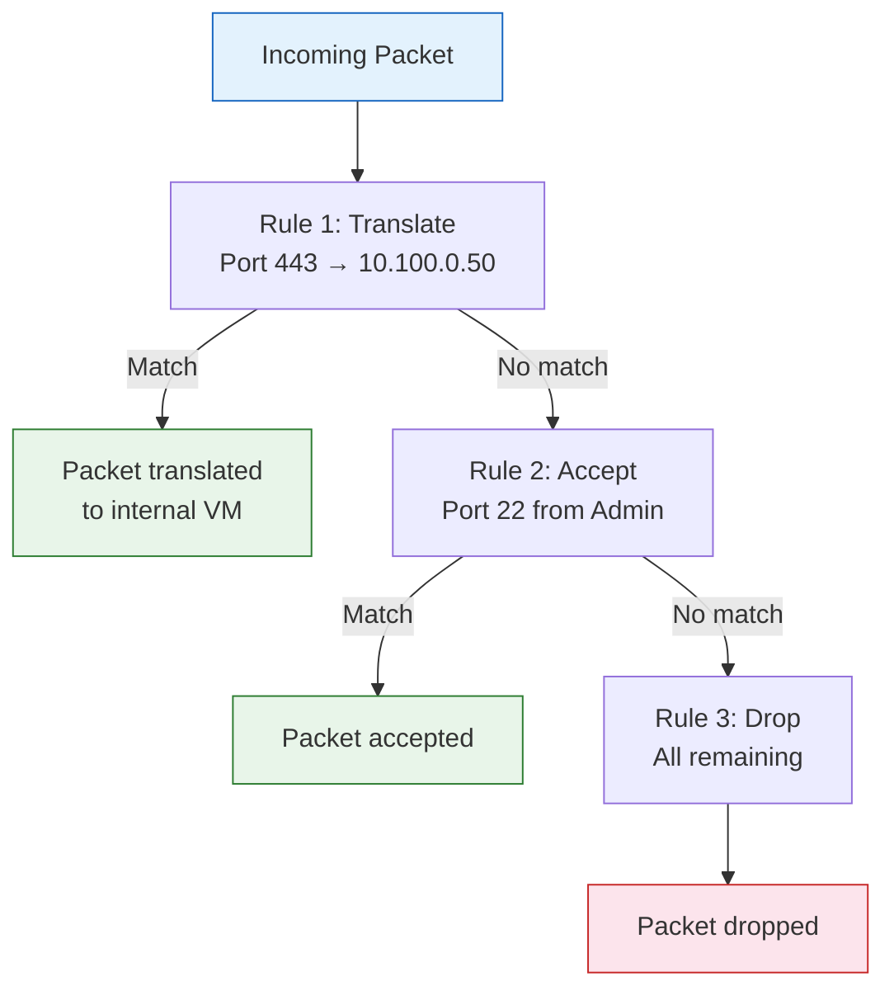
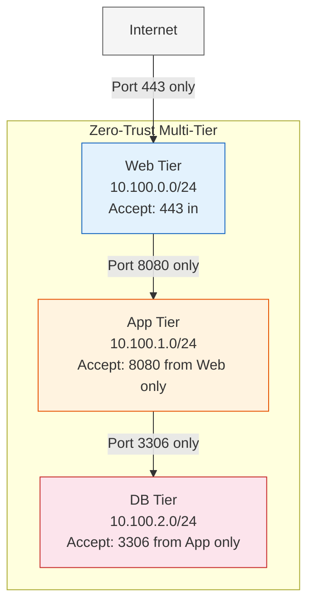

import { Card, CardGrid } from "@astrojs/starlight/components";

## Network Rules Overview

**Network rules** are the central control mechanism for all traffic flowing through a VergeOS network. They replace the functionality traditionally provided by separate firewalls, routers, and switches — all managed from a single rule list on each network.

Every external, internal, and VPN network in VergeOS has its own rule set. Rules define what traffic is allowed, blocked, translated, or routed. Because internal networks are **default-secure** (no traffic flows until rules permit it), understanding rules is essential for building functional, secure network topologies.

Rules are accessed from any network's dashboard by clicking **Rules** in the left menu.

## Rule Types

VergeOS supports three rule actions, each serving a distinct purpose:

### Firewall Rules (Accept / Drop / Reject)

Firewall rules control which packets are allowed to pass through the network:

| Action     | Behavior                                                                                               |
| ---------- | ------------------------------------------------------------------------------------------------------ |
| **Accept** | Allow packets matching the defined criteria to pass through                                            |
| **Drop**   | Silently discard matching packets — the sender receives no response                                    |
| **Reject** | Discard matching packets and send an ICMP "destination unreachable" back to the source (when possible) |

Use **Accept** rules to explicitly permit traffic that should be allowed. Use **Drop** for most blocking scenarios (silent discard prevents reconnaissance). Use **Reject** when you want the sender to immediately know the connection was refused.

### NAT/PAT Rules (Translate)

**Translate** rules provide Network Address Translation (NAT) and Port Address Translation (PAT). Common uses include:

- **SNAT (Source NAT)** — Hide internal VM addresses behind a single external IP for outbound Internet access
- **DNAT (Destination NAT)** — Map an external IP/port to an internal VM's IP/port for inbound service access (e.g., publishing a web server)
- **1:1 NAT** — Map a full external IP to a full internal IP (all ports)
- **Port forwarding** — Translate a specific external port to a different internal port

NAT rules use the **Translate** action with **Incoming** direction for DNAT and **Outgoing** direction for SNAT.

### Static Route Rules (Route)

**Route** rules define how traffic exits a network. The most common use is the **default gateway** rule that sends all outbound traffic through the DMZ to an external network. Route rules can also define specific paths for inter-network communication.

## Rule Processing Order

Rules are processed **top-to-bottom**. The first matching rule wins — once a packet matches a rule, no further rules are evaluated for that packet.

**Order matters.** Consider this example:

1. **NAT rule** — Translate incoming traffic on port 443 to internal VM `10.100.0.50:443`
2. **Firewall rule** — Drop incoming traffic on port 443

If these rules are reversed (drop first, then NAT), the traffic will be dropped before the NAT rule ever sees it. Always place NAT/Translate rules **above** related firewall rules when they need to process traffic first.

To change rule order, select a rule from the rule list and use the **Move** option to reposition it.



## Rule Parameters

Every rule is configured with a consistent set of parameters:

| Parameter       | Description                                                               |
| --------------- | ------------------------------------------------------------------------- |
| **Name**        | Descriptive label for administration (e.g., `Allow HTTPS`, `SNAT to WAN`) |
| **Action**      | Accept, Drop, Reject, Route, or Translate                                 |
| **Protocol**    | TCP, UDP, ICMP, or ANY                                                    |
| **Direction**   | Incoming or Outgoing                                                      |
| **Interface**   | Specific interface or Any                                                 |
| **Source**      | Where traffic originates — see Address Selectors below                    |
| **Destination** | Where traffic is addressed to go                                          |
| **Target**      | Where to actually direct traffic (used with Route and Translate actions)  |
| **Pin**         | Optionally pin the rule to the Top or Bottom of the rule list             |

### Port Filtering

For TCP and UDP protocols, you can specify:

- A **single port** (e.g., `443`)
- A **port range** (e.g., `8000-8999`)
- Multiple ports using separate rules

### Connection Tracking State

Advanced rules can filter on connection state (New, Established, Related, Invalid) for stateful packet inspection.

## Address Selectors

The **Source**, **Destination**, and **Target** fields use address selectors — flexible options for specifying where traffic comes from or goes to:

| Selector                  | Description                                                                 |
| ------------------------- | --------------------------------------------------------------------------- |
| **Alias**                 | Select a named alias (a group of IPs/CIDRs) defined on this network         |
| **Any/None**              | Match any address — no filter applied                                       |
| **Custom**                | Enter a specific IP, CIDR, or IP range (e.g., `192.168.1.50-192.168.1.100`) |
| **Default**               | Helper for route rules — defines the default route (0.0.0.0/0)              |
| **My IP Addresses**       | Select an IP defined on this network (virtual IPs, static IPs, aliases)     |
| **My Network Address**    | This network's entire subnet                                                |
| **My Router IP**          | This network's router IP (single address)                                   |
| **Other IP Address**      | Select a specific IP from a different network                               |
| **Other Network Address** | Select another network's entire subnet                                      |
| **Other Router IP**       | Select another network's router IP                                          |
| **Other Network DMZ IP**  | Select the DMZ-side IP of another network (used for inter-network routing)  |

:::tip
Use the **helper selectors** (My IP, Other Network DMZ IP, etc.) instead of hardcoding IP addresses. Helper selectors automatically update if network addresses change, and they enable rules to work correctly when cloned into recipes or tenant templates.
:::

## Network Aliases

**Aliases** let you group multiple IP addresses or CIDR ranges into a named set, then reference that set in rules. This simplifies management when the same group of addresses appears in multiple rules.

To create an alias:

1. Navigate to **Networks → Aliases → New**
2. Enter a **Name** (e.g., `Web-Servers`, `Trusted-Admins`)
3. Define the **Address Set** — enter IPs/CIDRs as a pipe-delimited list (e.g., `10.10.10.10|10.200.10.0/24`) or add entries individually
4. Set **Publishing Scope**: **Private** (this cloud only) or **Global** (available to tenants)
5. Click **Submit**

When creating rules, set the Source or Destination **Type** to **Alias** and select the desired alias from the dropdown.

:::caution
After modifying an alias, you must click **Apply Rules** on every network that uses it for the changes to take effect.
:::

## Rate Limiting (Traffic Throttle)

Individual rules can have **throttling** enabled to limit traffic rate. When creating or editing a rule, check **Enable Throttle** and configure:

- **Rate** — The numeric rate value
- **Rate Type** — Units such as packets/second, MB/day, bytes/hour, etc.
- **Burst** — Burst allowance above the rate limit

Rate limiting can also be applied at the **network level** (on the network's router) to throttle all traffic flowing through the network, not just specific rules.

## Rule Diagnostics

VergeOS provides three levels of rule-level diagnostics:

### Track Rule Statistics

Enable the **Track Rule Statistics** checkbox on any rule to count packets and bytes processed by that rule. Statistics are viewable from the rule list, enabling you to see which rules are actively handling traffic and how much.

For network-wide tracking, enable **Track Statistics For All Rules** in the network settings to automatically track every rule.

### Trace / Debug Rule

Enable **Trace/Debug Rule** on a specific rule to trace all packets that match it. This is invaluable for troubleshooting — you can see exactly which packets are hitting a rule and whether they are being accepted, dropped, or translated.

### Low-Level Inspection

For advanced diagnostics, connect to the network's console and run:

```bash
nft list ruleset
```

This displays the full **nftables** ruleset as configured by VergeOS, showing the actual kernel-level rules in effect. This is useful for support engineers diagnosing complex rule interaction issues.

## Creating Rules: Walkthrough

This example creates a common rule set for an internal network that needs Internet access and an inbound web server:

**Step 1: Default Route (outbound Internet access)**

1. Navigate to the internal network → **Rules → New**
2. **Name:** `Default Gateway`, **Action:** Route, **Direction:** Outgoing
3. **Destination:** Default, **Target:** Other Network DMZ IP → select your external network
4. Submit and Apply Rules

**Step 2: SNAT (hide internal IPs behind external IP)**

1. **Name:** `SNAT Outbound`, **Action:** Translate, **Direction:** Outgoing
2. **Source:** My Network Address, **Target:** Other Network DMZ IP → select external network
3. Pin to **Top** (SNAT must process before firewall rules)
4. Submit and Apply Rules

**Step 3: DNAT (publish web server)**

1. **Name:** `DNAT HTTPS`, **Action:** Translate, **Protocol:** TCP, **Direction:** Incoming
2. **Destination:** My IP Addresses → select the external IP, **Port:** 443
3. **Target:** Custom → `10.100.0.50` (internal web server), **Port:** 443
4. Submit and Apply Rules

**Step 4: Accept inbound HTTPS**

1. **Name:** `Allow HTTPS`, **Action:** Accept, **Protocol:** TCP, **Direction:** Incoming
2. **Destination Port:** 443
3. Submit and Apply Rules

:::caution
Always click **Apply Rules** after creating or modifying rules. Rules are staged until applied — they do not take effect until you explicitly apply them.
:::

## VLAN Trunking

VLANs in VergeOS are configured at the **external network** level using 802.1Q tagging. Each external network can be mapped to a specific VLAN ID on a physical network, enabling traffic segmentation without additional physical cabling.

### Creating a VLAN-Tagged External Network

1. Navigate to **Networks → New External**
2. Set **Layer 2 Type** to `vLAN`
3. Enter the **Layer 2 ID** (the 802.1Q VLAN ID, e.g., `100`)
4. Select the **Interface Network** (the physical network this VLAN rides on)
5. Configure IP addressing and submit

Multiple external networks can use different VLAN IDs on the same physical network, providing logical separation for management, production, DMZ, and tenant traffic.

### Q-in-Q (Double Tagging)

For service provider environments that require double VLAN tagging, select an **external network** (not a physical network) as the Interface Network. This stacks a second VLAN tag on top of the existing one.

## VPN Overview

VergeOS includes built-in VPN connectivity using two protocols:

<CardGrid>
  <Card title="WireGuard" icon="shield">
    Modern, high-performance VPN protocol with ChaCha20-Poly1305 cryptography and
    minimal configuration overhead. Recommended for most VPN use cases.
  </Card>
  <Card title="IPsec" icon="setting">
    Industry-standard VPN protocol provided for environments that must interface
    with third-party IPsec devices (Cisco, pfSense, etc.).
  </Card>
</CardGrid>

### WireGuard Use Cases

- **Site-to-site between VergeOS systems** — Connect two VergeOS installations over an encrypted tunnel. Each side creates a WireGuard interface and configures the other as a peer using public key exchange.
- **Site-to-site with third-party peers** — Connect a VergeOS system to any WireGuard-compatible endpoint.
- **Remote user access** — Provide secure VPN access for individual users. VergeOS can auto-generate peer configuration files for download to WireGuard client software (Windows, macOS, Linux, mobile).

WireGuard is attached to a VergeOS network (typically an internal network that has access to all resources the VPN should reach). After creating the interface and peer definitions, click **Apply Rules** to activate the auto-generated firewall and routing rules.

### IPsec Use Cases

- **Third-party device connectivity** — Connect to Cisco, pfSense, FortiGate, or other IPsec-capable devices at remote sites.
- **Tenant VPN** — Configure an IPsec tunnel within a tenant for site-to-site connectivity to the tenant's remote infrastructure.

IPsec configuration involves creating a **VPN Network**, configuring **Phase 1** (IKE negotiation) and **Phase 2** (encryption/tunnel parameters), then applying the auto-generated firewall rules.

:::tip
WireGuard is recommended over IPsec whenever possible. It provides better performance, simpler configuration, and is less vulnerable to security misconfigurations.
:::

## Micro-Segmentation

Micro-segmentation is a security strategy that divides the network into isolated segments, each with its own security controls. VergeOS is purpose-built for this approach:

### How VergeOS Enables Micro-Segmentation

1. **Internal networks as segments** — Each internal network is an isolated security boundary by default. Create separate networks for web, app, database, management, and development tiers.

2. **Granular firewall rules** — Define per-rule traffic policies specifying protocol, port, source, destination, and direction. Only permit the exact traffic each tier needs.

3. **Network aliases for policy groups** — Group related IPs into aliases (e.g., `Web-Servers`, `DB-Clients`) and reference them in rules for consistent policy enforcement.

4. **Tenant isolation** — Each tenant (VDC) operates with its own DMZ and internal networks, providing full network encapsulation between tenants.

5. **Port mirroring for visibility** — Monitor traffic on any network segment for security analysis without disrupting production.

6. **VPN for encrypted paths** — Use WireGuard or IPsec between sensitive network segments for defense-in-depth.

### Zero-Trust Design Pattern



Each tier is a separate internal network with explicit rules. The web tier accepts only HTTPS from the Internet. The app tier accepts only port 8080 from the web tier. The database tier accepts only port 3306 from the app tier. No other traffic is permitted — all paths are explicitly defined.

:::note[VMware Bridge]
VMware splits firewall and NAT across NSX-T DFW (micro-segmentation at the vNIC), NSX-T Edge (NAT and Tier-0/Tier-1 static routing), and vDS port groups (VLAN). VergeOS unifies these into per-network rule lists: firewall rules replace DFW, translate rules replace NSX Edge NAT, route rules replace Tier-0/Tier-1 static routes, rule ordering replaces NSX policy categories, and WireGuard VPN ships in-platform.
:::

:::note[Nutanix Bridge]
Nutanix needs the Flow add-on for micro-segmentation, OVS bridge config for VLANs, and external infrastructure for NAT/routing/VPN. VergeOS includes firewall rules, NAT/PAT rules, route rules, WireGuard/IPsec VPN, address aliases, and per-rule rate limiting and statistics built into each network.
:::

## Key Takeaways

| Concept                | Summary                                                                                                   |
| ---------------------- | --------------------------------------------------------------------------------------------------------- |
| **Rule types**         | Accept/Drop/Reject (firewall), Translate (NAT/PAT), Route (static routes)                                 |
| **Processing order**   | Top-to-bottom — first match wins; order NAT before related firewall rules                                 |
| **Address selectors**  | Use helpers (My IP, Other Network DMZ IP) instead of hardcoded IPs for portability                        |
| **Aliases**            | Named groups of IPs/CIDRs for consistent policy management across multiple rules                          |
| **Rate limiting**      | Per-rule throttle or network-wide rate limiting on the router                                             |
| **Diagnostics**        | Track Statistics per rule, Trace/Debug for packet-level inspection, `nft list ruleset` for low-level view |
| **VLANs**              | 802.1Q tagging set per external network; Q-in-Q via external-as-interface                                 |
| **VPN**                | WireGuard (recommended) for site-to-site and remote access; IPsec for third-party compatibility           |
| **Micro-segmentation** | Separate internal networks per tier + least-privilege rules = zero-trust architecture                     |

## Next Steps

With firewall rules, NAT, VLANs, and VPN configured, explore the hands-on lab to put these concepts into practice: **[Lab: Network Configuration →](/training/04-networking/lab/)**
