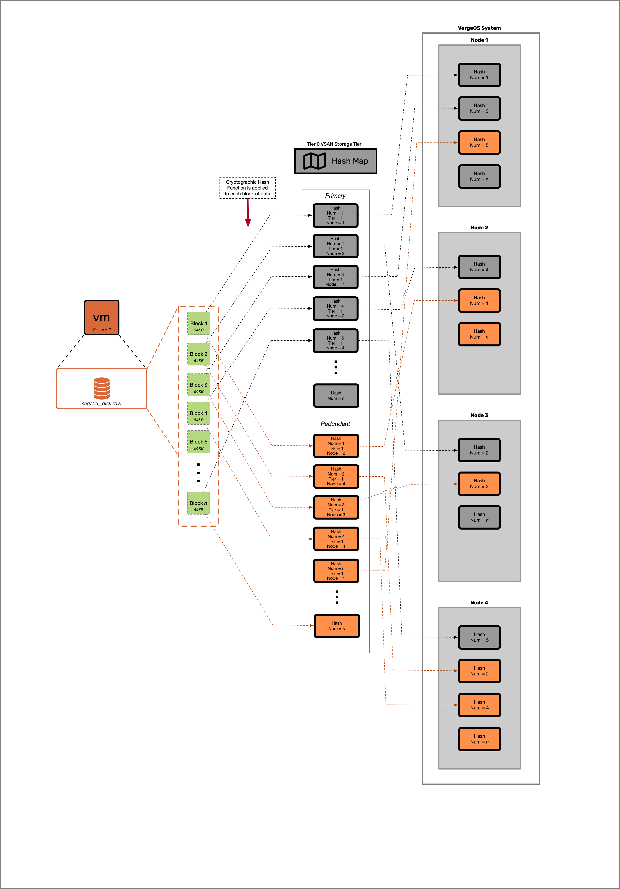
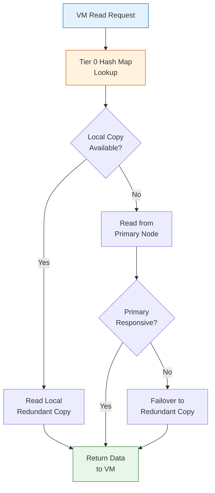
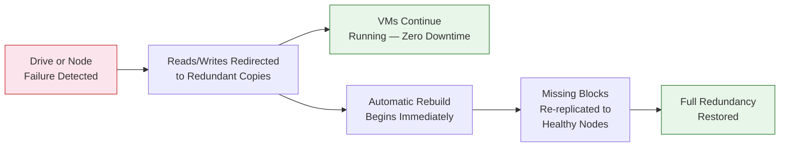

## VergeFS: Storage in the Kernel

Module 1 introduced vSAN concepts at a high level. This page goes deeper into the internal architecture — how blocks are hashed and distributed, how reads and writes flow through the system, and how features like deduplication, encryption, and snapshots are implemented at the block level.

## Block-Level Architecture

At the heart of VergeFS is a **block-level storage engine**. Every piece of data written to the vSAN — whether it is a VM disk, a snapshot, an ISO image, or system metadata — is divided into **data blocks**. Each block is assigned a **cryptographic hash** that serves as its unique identifier throughout the system.

This hash is the foundation for nearly every vSAN feature:

- **Distribution** — The hash determines which nodes store the block's primary and redundant copies
- **Deduplication** — Identical blocks produce identical hashes, so only one copy is stored
- **Integrity** — The hash validates block contents, enabling continuous bit-rot detection
- **Location tracking** — The Tier 0 hash map maps every hash to its physical location across the cluster

### The Hash Map and Tier 0

Every block's location is tracked in the **vSAN hash map** — a data structure stored exclusively on **Tier 0** drives (high-endurance NVMe SSDs). The hash map records:

- The cryptographic hash of each block
- The physical node and drive where the primary copy resides
- The physical node and drive where the redundant copy (or copies) reside
- Reference counts tracking how many objects use each block
- Version and integrity metadata

**Tier 0 is exclusively a metadata tier.** It stores the hash map and the vSAN filesystem index. It is **not** a performance cache, and it does **not** store workload data. Because every read and write operation begins with a hash map lookup on Tier 0, the performance of your Tier 0 drives directly impacts overall system responsiveness.

:::caution[Tier 0 is Metadata Only]
Tier 0 does **not** function as a performance cache or hot-data tier. It stores only the vSAN hash map and filesystem index. Workload data resides on Tiers 1–5. Always use enterprise NVMe drives rated for 3 DWPD or equivalent for Tier 0 and maintain at least 30% free space.
:::

### How the Hash Map Works

The following diagram illustrates how VM data flows through the vSAN block-level architecture:

The process works as follows:

1. A VM writes data to its virtual disk
2. VergeFS divides the write into data blocks
3. Each block is assigned a cryptographic hash
4. The hash map on Tier 0 is consulted to determine placement
5. The block is written to both a primary node and a redundant node
6. The hash map is updated with the block's location metadata

## Hash-Based Data Distribution

vSAN distributes data blocks across all storage-participating nodes using a **hash-based distribution algorithm**. This ensures balanced I/O load, fault tolerance, and efficient scaling.

### Write Path

When a VM writes data:

1. VergeFS divides the data into blocks and computes a cryptographic hash for each
2. The hash is checked against the hash map — if an identical hash already exists, the block is **deduplicated** (no new data written, only the reference count incremented)
3. For new blocks, the distribution algorithm selects a **primary node** and a **redundant node**
4. Both copies are written **simultaneously** over the Core Fabric network
5. The write is **only acknowledged after both copies are confirmed** — ensuring data durability before the VM receives a write-complete signal
6. The Tier 0 hash map is updated to record the new block's locations

### Read Path

When a VM reads data:

1. The hash map on Tier 0 is consulted to locate the requested block
2. The system **prioritizes reading from the primary copy**
3. If a redundant copy exists on the **same node as the requesting VM**, VergeFS reads the **local copy** to minimize network traffic (read-local-prefer)
4. If the primary copy is slow or unresponsive, VergeFS automatically **fails over to the redundant copy** — transparently, with no VM disruption

### Cross-Node Distribution

Data blocks are distributed across **all storage-participating nodes** within each tier. This design provides:

- **Balanced performance** — I/O load is spread across all nodes, preventing hot spots
- **Fault tolerance** — No single node holds all copies of any dataset
- **Efficient scaling** — Adding a node automatically expands the storage pool and triggers rebalancing
- **Parallel I/O** — Multiple nodes serve data simultaneously, increasing aggregate throughput

## Inline Global Deduplication

VergeOS vSAN performs **inline, global deduplication** that is always on and requires zero configuration. Because every data block is identified by its cryptographic hash, deduplication is a natural consequence of the architecture:

1. When a new block is written, its hash is computed
2. The hash map is checked — if an identical hash already exists, the block is a duplicate
3. For duplicate blocks, only the **reference count** is incremented — no additional storage is consumed
4. This operates **inline** (during the write path), not as a background job

Deduplication works **across all VMs, all tiers, and all data types** in the system. Common scenarios where deduplication delivers significant space savings include:

- Multiple VMs running the same operating system (shared OS blocks)
- Template-based VM deployments (cloned base images)
- Development environments with similar configurations
- Backup snapshots with minimal data change between iterations

Deduplication ratios are visible in the VergeOS storage dashboard, typically showing the effective capacity savings across each tier.

:::note[VMware Bridge]
VMware vSAN dedup is all-flash-only and explicitly enabled alongside compression as a combined feature, operating at cluster level. VergeOS dedup is always-on across all tier types (NVMe, SSD, HDD), inline at the block level via cryptographic hashes, with no setting to toggle.
:::

## Compression

VergeOS vSAN does **not** compress data at rest. Unlike platforms that apply inline compression to stored blocks, VergeFS stores data in its original form on disk.

**Compression is only applied during site-sync replication** — when data is transmitted between VergeOS sites over the network. In this context, compression reduces bandwidth consumption during WAN transfers without impacting local storage performance.

This design choice keeps the local I/O path simple and fast. Deduplication (described above) provides the primary space-efficiency benefit for stored data.

## AES-256 Encryption at Rest

vSAN supports **AES-256 encryption at rest**, configured during the initial VergeOS installation. Key details:

| Aspect                   | Detail                                                 |
| ------------------------ | ------------------------------------------------------ |
| **Algorithm**            | AES-256                                                |
| **When configured**      | During initial installation only                       |
| **Reversibility**        | Not reversible after installation                      |
| **Scope**                | All data across all tiers is encrypted transparently   |
| **Key storage option 1** | USB drives plugged into the first two controller nodes |
| **Key storage option 2** | Manual password entry at each system boot              |

Encryption is transparent to VMs and applications — they read and write data normally while VergeFS handles encryption and decryption at the block level. The encryption configuration applies system-wide; you cannot encrypt some tiers and leave others unencrypted.

To verify encryption status: navigate to **Nodes > Node 1 > Drives**, double-click the first drive, and check the **Encrypted** checkbox.

## Redundancy Models

vSAN maintains multiple copies of every data block to protect against hardware failures. Redundancy is configured at the **system level** and applies **per tier** — not per VM or per storage container.

| Feature                             | N+1 (RF2) — Default | N+2 (RF3) |
| ----------------------------------- | ------------------- | --------- |
| **Copies of data**                  | 2                   | 3         |
| **Simultaneous failures tolerated** | 1 node              | 2 nodes   |
| **Minimum controller nodes**        | 2                   | 3         |
| **Recommended nodes**               | 3                   | 5         |
| **Storage overhead** (before dedup) | ~2x                 | ~3x       |

**N+1 (RF2)** is the default and suits most production environments. It maintains two copies of every block across different nodes, tolerating one simultaneous node failure.

**N+2 (RF3)** maintains three copies across three or more nodes, tolerating two simultaneous failures. This is designed for ultra-critical workloads or remote/edge sites where replacement hardware cannot arrive quickly.

A failure only affects the **tier where the failed drives reside** — other tiers remain fully operational. For example, in an N+2 system, if Tier 1 drives fail on two nodes and a Tier 4 drive fails on a third node, the cluster remains operational with no data loss.

:::tip[Repair Server]
For additional protection beyond the configured redundancy level, a **Repair Server** can be configured to automatically retrieve missing data blocks from a sync destination if failures exceed the configured redundancy level — potentially avoiding a full snapshot rollback.
:::

## Self-Healing

When a node or drive fails, vSAN automatically detects the failure and begins recovery without manual intervention:

The self-healing process:

1. **Detection** — vSAN continuously monitors drive and node health. Failures are detected automatically.
2. **Failover** — Reads and writes are immediately redirected to redundant copies. VMs experience no downtime.
3. **Rebuild** — Missing data blocks are re-replicated from surviving copies to remaining healthy nodes. This happens in the background while workloads continue running.
4. **Restoration** — Once all blocks are re-replicated, the tier returns to its configured redundancy level.

### Data Integrity

Beyond failure recovery, vSAN performs **continuous bit-rot detection** using hash validation. Each block's stored hash is periodically verified against its contents. If corruption is detected, the block is automatically repaired from a valid redundant copy.

## Space-Efficient Snapshots and Clones

vSAN's block-level architecture enables **space-efficient snapshots** that consume minimal additional storage:

- A snapshot records the **hash map state at a point in time** — it does not copy data blocks
- Blocks referenced by a snapshot are retained even if the original VM deletes them (reference counting)
- Clones work similarly — they reference the same underlying blocks, only consuming additional space when data diverges (copy-on-write)
- Snapshots are **natively immutable** — once taken, the snapshot's block references cannot be modified, providing built-in ransomware protection

### Deletion and Garbage Collection

When a VM, drive, or snapshot is deleted:

1. References to the relevant blocks are removed from the hash map
2. Reference counts on each affected block are decremented
3. Blocks with zero references are marked for reclamation by the **vSAN Walk** background process
4. Physical storage space is freed during the next garbage collection cycle

This is why storage space may not decrease immediately after a deletion — actual reclamation happens asynchronously during background vSAN operations.

## Key Takeaways

| Concept                | Summary                                                                                   |
| ---------------------- | ----------------------------------------------------------------------------------------- |
| **VergeFS**            | Kernel-native distributed storage — no external SAN/NAS, no CVM overhead                  |
| **Block architecture** | All data divided into blocks, each identified by cryptographic hash                       |
| **Tier 0**             | Metadata only (hash map + filesystem index). Not a cache. Required on every storage node. |
| **Distribution**       | Hash-based, spread across all storage-participating nodes per tier                        |
| **Deduplication**      | Inline, always-on, global across all tiers — zero configuration                           |
| **Compression**        | Not at rest — only during site-sync replication                                           |
| **Encryption**         | AES-256 at rest, configured at install, not reversible                                    |
| **Redundancy**         | N+1 (2 copies, default) or N+2 (3 copies) — system-wide per tier                          |
| **Self-healing**       | Automatic failover and rebuild on failure, continuous bit-rot detection                   |
| **Snapshots**          | Hash map point-in-time records, natively immutable, space-efficient                       |

## Next Steps

Now that you understand the internal architecture of vSAN, the next topic covers how the tier system works in practice — configuring tiers, assigning drives, planning capacity, and scaling storage: **[Storage Tiers](/training/05-storage/02-storage-tiers/)**
