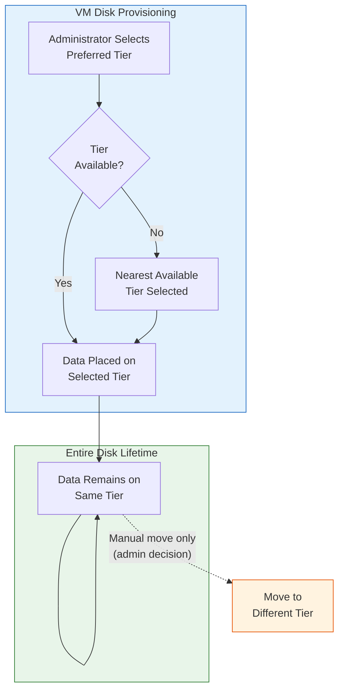
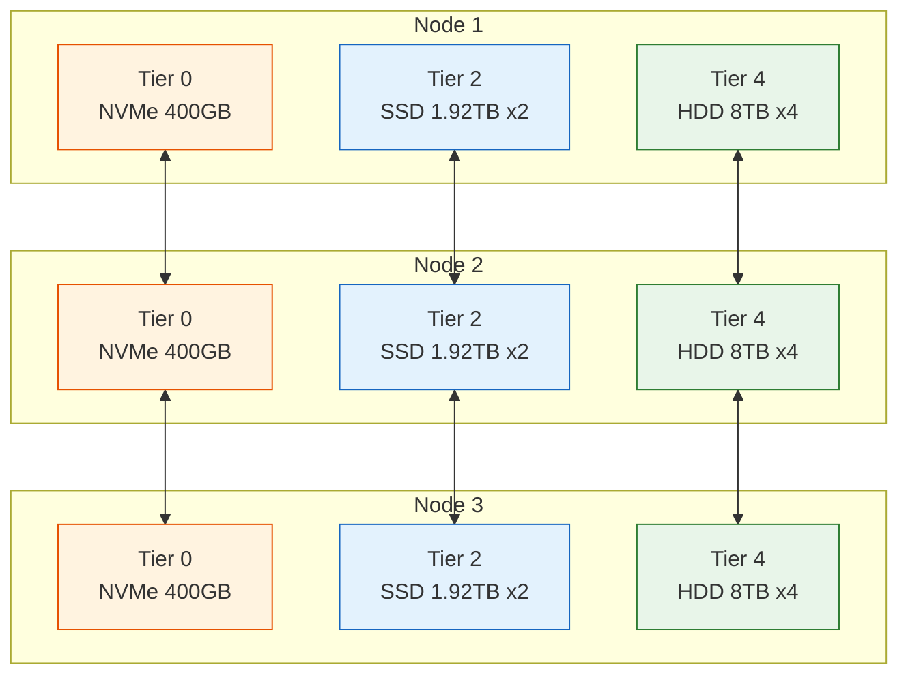

import { Card, CardGrid } from "@astrojs/starlight/components";

## The 6-Tier Storage Model

VergeOS vSAN organizes physical storage into up to **six tiers (0–5)**, each designed for a specific class of workload or data type. This tiered architecture allows organizations to balance performance, capacity, and cost by provisioning VM virtual disks on the most appropriate tier for their workload profile.

<CardGrid>
  <Card title="Tier 0 — Metadata" icon="seti:lock">
    vSAN hash map and filesystem index. Required on every storage node. Not a
    cache — exclusively metadata.
  </Card>
  <Card title="Tiers 1–3 — Performance" icon="seti:db">
    NVMe and SSD tiers for write-intensive, mixed, and read-optimized workloads
    respectively.
  </Card>
  <Card title="Tiers 4–5 — Capacity" icon="seti:folder">
    HDD tiers for file servers, backup targets, compliance archives, and cold
    storage.
  </Card>
</CardGrid>

Unlike storage platforms that use a single pool with background data movement, VergeOS gives administrators explicit control over where data lives. You choose the tier when you provision a VM disk, and the data stays on that tier for the life of the virtual disk.

## Tier Specifications

The following table summarizes each tier's hardware type, purpose, and typical use cases:

| Tier  | Media Type               | Purpose                    | Typical Use Cases                                              |
| ----- | ------------------------ | -------------------------- | -------------------------------------------------------------- |
| **0** | High-endurance NVMe      | vSAN metadata              | Hash map, filesystem index — required on every storage node    |
| **1** | High-endurance NVMe SSDs | Write-intensive workloads  | High-performance databases, transaction logs, write-heavy apps |
| **2** | Mid-range SSDs           | Mixed read/write workloads | General-purpose VMs, mixed application workloads, dev/test     |
| **3** | Read-optimized SSDs      | Read-intensive workloads   | Content delivery, application repositories, reference data     |
| **4** | High-capacity HDDs       | Bulk capacity              | File servers, backup targets, infrequently accessed data       |
| **5** | Archival-grade HDDs      | Cold storage / archive     | Compliance archives, long-term retention, regulatory data      |

### Tier 0: The Metadata Tier

Tier 0 deserves special attention because it is fundamentally different from the workload tiers. It stores **only** the vSAN hash map and filesystem index — the data structures that track which blocks exist, where they are located, and how many objects reference them.

**Sizing guideline:** Allocate approximately **5 GB of Tier 0 capacity per 1 TB of usable storage** (minimum) or **10 GB per 1 TB** (recommended) across your workload tiers. Use enterprise NVMe drives rated for **3 DWPD or equivalent (i.e. TBW)**. Always maintain at least **30% free space** on Tier 0 to avoid metadata pressure.

**Hardware requirements:** Use enterprise-grade NVMe drives with a minimum of **3 DWPD** (Drive Writes Per Day) endurance. Consumer NVMe drives are not supported for Tier 0 in production environments.

### Workload Tiers (1–5)

Tiers 1 through 5 store actual VM data. Not every deployment needs all five workload tiers — many production environments use just two or three. The tier numbers are a ranking system: lower numbers indicate higher performance (and typically higher cost per GB), while higher numbers indicate higher capacity (at lower cost per GB).

**Common deployment patterns:**

- **All-flash:** Tier 0 (metadata) + Tier 1 or 2 (all VM workloads)
- **Hybrid:** Tier 0 (metadata) + Tier 2 (performance VMs) + Tier 4 (file servers, backups)
- **Multi-tier:** Tier 0 (metadata) + Tier 1 (databases) + Tier 2 (general VMs) + Tier 4 (file shares) + Tier 5 (archive)

### Preferred Tier Behavior

When creating or modifying a VM virtual disk, you set a **Preferred Tier**. Most deployments leave this at the system default, which is configurable under **System > System Settings > Default VM Drive Tier**. If the specified tier does not exist in the cluster:

- **Higher tier requested than available:** The system selects the next higher (slower) tier. For example, requesting Tier 3 in a system with Tier 1 and Tier 4 results in placement on Tier 4.
- **Lower tier requested than available:** The system selects the next lower (faster) tier. For example, requesting Tier 3 in a system with Tier 1 and Tier 2 results in placement on Tier 2.

This fallback behavior ensures VMs can always be provisioned, even if the exact requested tier is not present.

## No Automatic Tiering

This is one of the most important concepts to understand about VergeOS storage:

:::danger[Critical Concept: No Automatic Data Movement]
VergeOS does **NOT** automatically move data blocks between tiers. There is no hot/cold tiering engine, no background migration process, and no policy-driven data movement. Data stays on the tier where it is provisioned for the life of the virtual disk. Tier assignment is an administrative decision made at provisioning time.
:::

This design is intentional and offers several advantages:

- **Predictable performance** — Workloads get consistent I/O characteristics because their data never migrates to slower media unexpectedly
- **Simple capacity planning** — Each tier's capacity is consumed only by explicitly provisioned workloads
- **No background overhead** — No tiering engine consuming CPU, memory, or I/O bandwidth to analyze and move data
- **Clear cost modeling** — Storage costs map directly to provisioned tiers

To change a workload's tier placement, an administrator must manually move the VM's virtual disk to a different tier. This is a deliberate operational decision, not an automated process.

## Drive Assignment Rules

Properly assigning physical drives to tiers is essential for a healthy vSAN. Follow these rules when configuring storage:

### Rule 1: Controller Nodes Need Tier 0

Controller nodes must have at least one Tier 0 drive. Tier 0 holds the vSAN hash map and filesystem index (metadata), which is managed by the controller nodes. Scale-out and storage-only nodes contribute workload tiers (1–5) but do not require Tier 0 drives.

### Rule 2: Consistent Drives Within a Tier

All drives within a tier should be of **similar type, capacity, and performance**. If you add a drive of a different size to an existing tier, the tier will only be able to use the capacity of the **smallest drive** in the tier. Mixing NVMe and SATA drives in the same tier is not recommended.

### Rule 3: Equal Drive Counts Across Nodes

For balanced data distribution and optimal performance, each storage node should have the **same number of drives per tier**. For example, if Node 1 has two Tier 2 drives, Node 2 should also have two Tier 2 drives of the same type and capacity.

### Rule 4: Cross-Node Distribution Per Tier

Each tier spans **all storage-participating nodes**. Block distribution, redundancy copies, and I/O load balancing operate independently within each tier. This means:

- A failure on Tier 4 drives does not impact Tier 1 or Tier 2
- Each tier maintains its own redundancy level (N+1 or N+2)
- Capacity and performance scale independently per tier

## Scaling Storage

vSAN supports two scaling approaches, and each tier can be scaled independently:

### Vertical Scaling (Scale Up)

Add more drives to existing nodes within a tier. This increases the capacity and aggregate throughput of that tier without adding new hardware.

**Key requirements for scaling up:**

- Ensure the vSAN has at least **30% free capacity** before adding drives (unless you are doubling the drive count)
- New drives must match the type, capacity, and performance of existing drives in the tier
- Add the same number of drives to **each storage node** to maintain balanced distribution
- Take a system snapshot before beginning the scale-up process
- Follow the [vSAN Scale Up SOP](/product-guide/operations/vsan-scale-up-sop/) for the complete procedure

### Horizontal Scaling (Scale Out)

Add new nodes to the cluster. This increases capacity, compute resources, and aggregate I/O bandwidth simultaneously.

**Key requirements for scaling out:**

- New nodes should have the **same drive configuration** as existing nodes for each tier
- Network connectivity (Core Fabric) must be verified before adding the node
- The new node is installed via USB and joins the existing cluster
- After joining, vSAN automatically begins distributing data to the new node
- Follow the [vSAN Scale Out Guide](/implementation-guide/scale-out-nodes/) for the complete procedure

### Scaling Decision Matrix

| Factor                   | Scale Up (Add Drives)    | Scale Out (Add Nodes)      |
| ------------------------ | ------------------------ | -------------------------- |
| **Capacity increase**    | Per-tier only            | All tiers + compute        |
| **Performance increase** | Moderate (more spindles) | Significant (more nodes)   |
| **Compute resources**    | No change                | Additional CPU + RAM       |
| **Failure domain**       | No change                | Better distribution        |
| **Complexity**           | Lower                    | Higher                     |
| **Typical use case**     | Running low on one tier  | Need more overall capacity |

## Capacity Planning

Proactive capacity planning prevents performance degradation and ensures the vSAN operates within healthy parameters.

### Recommended Free Space Thresholds

| Tier          | Minimum Free Space | Rationale                                                       |
| ------------- | ------------------ | --------------------------------------------------------------- |
| **Tier 0**    | 10%+               | Metadata pressure impacts all I/O operations system-wide        |
| **Tiers 1–3** | 20–30%             | Performance tiers need headroom for dedup operations and writes |
| **Tiers 4–5** | 15–20%             | Capacity tiers need headroom for snapshot retention             |

### Key Metrics to Monitor

Track these metrics in the VergeOS storage dashboard to maintain healthy tier operations:

- **Capacity utilization per tier** — Trend over time to predict when scaling is needed
- **I/O performance (IOPS and latency)** — Identify tiers that may be bottlenecking workloads
- **Deduplication ratios** — Understand effective vs. raw capacity savings per tier
- **Drive error rates** — Early warning for impending drive failures
- **Rebuild status** — Monitor self-healing progress after drive replacements

### RAM Requirements

vSAN requires dedicated RAM for storage operations. Plan for **1 GB of RAM per 1 TB of raw storage** (minimum) or **1.5 GB per 1 TB** (recommended) on each storage-participating node. This RAM is consumed by the VergeOS host and is not available to VMs.

## Integration with Snapshots and Clones

Storage tiers interact with vSAN's snapshot and clone capabilities in important ways:

- **Snapshots are tier-aware** — A snapshot of a VM with a Tier 2 disk references blocks on Tier 2. The snapshot metadata is recorded on Tier 0, but the data blocks remain on their original tier.
- **Clones reference the same tier** — When you clone a VM, the clone initially references the same data blocks on the same tier. New writes from the clone consume space on the same tier as the original.
- **Deduplication operates per tier** — The hash-based dedup engine works across all data within each tier, providing space savings that are tracked and reported independently per tier.
- **Replication is bandwidth-optimized** — During site-sync replication, only unique blocks are transmitted (dedup-aware), and compression is applied to the transfer stream to reduce WAN bandwidth.

:::note[Coming from VMware or Nutanix?]
Both vSAN and Nutanix move data between tiers automatically. VergeOS doesn't — placement is explicit at provisioning time.

| Platform | Tier model | Data movement |
| --- | --- | --- |
| VMware vSAN | Two-tier: cache (flash) + capacity (flash or HDD). SPBM policies place data per VM. | Automatic between cache and capacity. |
| Nutanix AOS | ILM hot/cold tiering between SSD and HDD. | Automatic, based on access patterns. |
| VergeOS vSAN | Six explicit tiers (0 = metadata, 1–5 = workload data). | None — data stays on the tier it was provisioned to. |

Trade-off: predictable performance (no surprise demotions) at the cost of administrator-driven placement.
:::

## Key Takeaways

| Concept                  | Summary                                                                                |
| ------------------------ | -------------------------------------------------------------------------------------- |
| **6 tiers (0–5)**        | Tier 0 = metadata only; Tiers 1–3 = performance (NVMe/SSD); Tiers 4–5 = capacity (HDD) |
| **No automatic tiering** | Data stays on the provisioned tier — no hot/cold migration engine                      |
| **Preferred tier**       | Set per VM disk; falls back to nearest available tier if requested tier is absent      |
| **Drive rules**          | Similar drives per tier, equal counts across nodes, controller nodes need Tier 0       |
| **Scaling**              | Vertical (add drives) or horizontal (add nodes) — each tier scales independently       |
| **Capacity planning**    | 30%+ free on Tier 0, 20–30% on workload tiers, 1 GB RAM per 1 TB raw storage           |
| **Snapshot integration** | Snapshots are tier-aware; dedup operates per tier; replication is bandwidth-optimized  |

## Next Steps

With an understanding of how storage tiers are organized and managed, the next topic covers file-level storage access: **[NAS Service & Shares](/training/05-storage/03-nas-shares/)**
