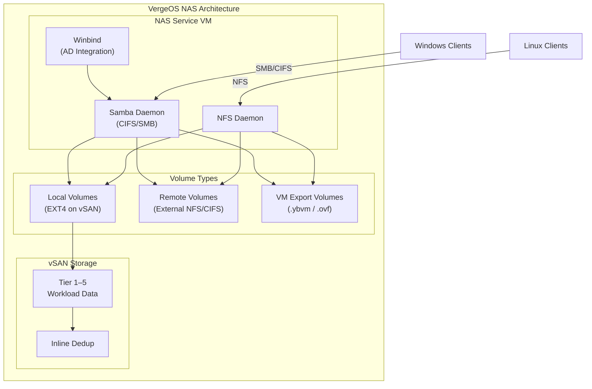

import { Card, CardGrid } from "@astrojs/starlight/components";

## What is the VergeOS NAS?

The VergeOS **NAS (Network Attached Storage)** service provides file-level storage and access within a VergeOS environment. Unlike traditional NAS appliances that require dedicated hardware, the VergeOS NAS runs as a **VM-based service** — a purpose-built virtual machine deployed from a standard recipe. This architecture means file services inherit all the benefits of the VergeOS platform: vSAN deduplication, snapshots, high availability, and multi-tenancy.

Each VergeOS system or tenant can run its own NAS service instance, providing isolated file storage with independent configuration, security policies, and share definitions.

### Key Capabilities

<CardGrid>
  <Card title="Local Volumes" icon="document">
    Store files directly on vSAN, benefiting from inline deduplication and
    tiered storage placement
  </Card>
  <Card title="Remote Volumes" icon="external">
    Mount external NFS or CIFS file systems and present them as local resources
    within VergeOS
  </Card>
  <Card title="CIFS/SMB & NFS Shares" icon="open-book">
    Expose volumes to clients via industry-standard file sharing protocols with
    granular access controls
  </Card>
  <Card title="VM Export Volumes" icon="rocket">
    Export VM snapshots in portable formats for third-party backup or compliance
    workflows
  </Card>
</CardGrid>

## NAS Architecture

The NAS service is not a kernel-level feature — it runs as a **dedicated virtual machine** provisioned from the built-in NAS VM Recipe. This VM hosts the Samba (CIFS/SMB) and NFS daemons, manages volume mounts, and handles authentication.

**Key architectural points:**

- **Each system/tenant can run one or more NAS service instances** — each instance is an independent VM with its own IP address and network placement
- **Resource allocation** — default 4 cores / 4 GB RAM, adjustable for heavier workloads (antivirus scanning, frequent syncs)
- **Network placement** — the NAS VM connects to an internal or external network, making shares accessible to clients on that network
- **Volumes are independent** — each volume has its own settings for encryption, max size, snapshot profile, preferred storage tier, and sharing configuration

## Setup Path

Setting up a NAS follows a clear sequence:

1. **Add a NAS Service** — deploy the NAS VM Recipe from **NAS → NAS Services → New**
2. **(Optional) Integrate with Active Directory** — join the NAS to a Windows AD domain for centralized authentication
3. **Create Volumes** — local volumes for vSAN-backed storage, remote volumes for external mounts, or VM export volumes
4. **Create Shares** — expose volumes via CIFS and/or NFS with per-share access controls
5. **(Optional) Configure Volume Snapshots** — set up snapshot profiles for automated point-in-time protection

### Creating a NAS Service

When creating a NAS service, you configure:

| Setting             | Description                                                               |
| ------------------- | ------------------------------------------------------------------------- |
| **Name**            | Must be unique among all VMs in this VergeOS cloud                        |
| **Cores / RAM**     | Default 4 cores / 4 GB — increase for heavy antivirus or sync workloads   |
| **Network**         | Internal or external network the NAS will be accessible on                |
| **IP Address Type** | DHCP (recommended with static reservation) or Static                      |
| **Hostname**        | Computer name (appears in AD if domain-joined); best to match the VM name |
| **Domain**          | Required for CIFS/Samba — defaults to "workgroup" if left blank           |
| **Timezone / NTP**  | Defaults to system settings; critical for AD Kerberos authentication      |

After submitting, power on the NAS service and verify it reaches **Online** status on the NAS Service dashboard.

## Local Volumes

Local volumes are EXT4 file systems stored within the VergeOS vSAN. They consume vSAN storage and benefit from inline deduplication, encryption (if enabled at the vSAN level), and tiered placement.

### Creating a Local Volume

Navigate to **NAS → Volumes → New** and configure:

- **NAS Service** — select which NAS instance hosts this volume
- **Name** — no spaces permitted
- **Filesystem Type** — select **Local Volume (EXT4)**
- **Encrypt Volume** — optional AES-XTS encryption (set at creation; cannot be changed later). Requires an encryption key that must be provided each time the volume comes online
- **Max Size** — hard capacity limit; volume becomes read-only when reached
- **Discard** — enabled by default; reclaims deleted space back to vSAN
- **Read Only** — prevents writes to the volume
- **Automatically Mount Snapshots** — makes snapshots browsable for self-service file restores
- **Owner / Group** — volume directory ownership
- **Snapshot Profile** — automated snapshot schedule
- **Preferred Tier** — which vSAN tier this volume's data targets

Once created, the volume appears on the NAS Service dashboard. Files can be browsed via the **Browse** option, and the volume must be exposed through shares for client access.

## CIFS/SMB Shares

CIFS (Common Internet File System) shares provide file access for Windows, macOS, and Linux clients using the SMB protocol. Multiple shares can be created on a single volume with different security settings.

### Creating a CIFS Share

Navigate to **NAS → Volumes**, select a volume, then **CIFS Shares → New**:

| Setting                            | Description                                               |
| ---------------------------------- | --------------------------------------------------------- |
| **Name**                           | Share name visible to clients                             |
| **Share Path**                     | Subdirectory within the volume (blank = entire volume)    |
| **Valid Users**                    | Restrict access to specific users (one per line)          |
| **Valid Groups**                   | Restrict access to specific groups (one per line)         |
| **Allowed Hosts**                  | IP, hostname, domain, netgroup, or subnet (one per line)  |
| **Denied Hosts**                   | Explicitly block specific hosts                           |
| **Read Only**                      | Deny write operations                                     |
| **Browseable**                     | Show in network share listings (disabled by default)      |
| **Admin Users**                    | Users with full administrative access to the share        |
| **Force User / Force Group**       | Override connecting user identity for all file operations |
| **Advanced Configuration Options** | Raw Samba parameters for special-case scenarios           |

:::tip[Best Practice]
When deploying CIFS shares in an AD environment, use **Valid Groups** to control access through AD security groups rather than individual user lists. This simplifies administration as group membership changes in AD automatically propagate to share access.
:::

## NFS Shares

NFS (Network File System) shares provide file access primarily for Linux and Unix clients. NFS shares are configured per-volume and offer fine-grained control over host access and identity mapping.

### Creating an NFS Share

Navigate to **NAS → Volumes**, select a volume, then **NFS Shares → New**:

| Setting                          | Description                                                                                                      |
| -------------------------------- | ---------------------------------------------------------------------------------------------------------------- |
| **Name**                         | Share identifier                                                                                                 |
| **Share Path**                   | Subdirectory within the volume (blank = entire volume)                                                           |
| **Allow Everyone**               | Grant access to all hosts                                                                                        |
| **Allowed Hosts**                | IP, FQDN, or wildcard (e.g., `*.companyabc.com`)                                                                 |
| **Data Access**                  | Read Only or Read and Write                                                                                      |
| **User/Group Squashing**         | **No Squashing** (default), **Squash Root** (map root to anonymous), **Squash All** (map all users to anonymous) |
| **Anonymous User ID / Group ID** | UID/GID assigned to anonymous connections                                                                        |
| **Asynchronous**                 | Improves performance but risks data loss on unclean server restart                                               |
| **No ACLs**                      | Disable access control lists                                                                                     |

:::caution[Async Mode]
The **Asynchronous** option significantly improves NFS write performance by allowing the server to respond before data is committed to disk. However, an unclean restart (power loss, crash) can result in data corruption. Only enable this for workloads where performance outweighs the risk — never for databases or transaction logs.
:::

## Remote Volumes

Remote volumes mount **external** NFS or CIFS file systems into the VergeOS NAS, making them accessible as if they were local. This is useful for:

- **Data migration** — syncing data from legacy storage into VergeOS
- **Backup ingestion** — one-time or recurring imports from external systems
- **Hybrid access** — presenting external storage to VergeOS VMs alongside local volumes

### Remote CIFS Volume

- **Filesystem Type** — Remote CIFS
- **Remote Mount Target** — UNC path (e.g., `//10.10.2.2/fshare` or `//file-01/corp`)
- **Username / Password** — credentials for the remote share
- **SMB Protocol Version** — auto-detect (default) or explicit version selection
- **Mount Options** — advanced CIFS parameters
- **Read Only** — mount as read-only

### Remote NFS Volume

- **Filesystem Type** — Remote NFS
- **Remote Mount Target** — NFS path (e.g., `server01:/export/svrdata`)
- **NFS Protocol Version** — auto-detect (default) or explicit version
- **Mount Options** — advanced NFS parameters
- **Read Only** — mount as read-only

After creation, verify the volume status shows **Online** on the volume dashboard. If mounting fails, check the **Logs** section at the bottom of the dashboard for error details.

:::tip[Volume Syncs]
Remote volumes can be paired with **volume syncs** to automatically copy data from an external source into a local volume on a schedule. This is particularly useful for migrating file server data into VergeOS incrementally.
:::

## VM Export Volumes

The **Verge.io VM Export** volume type provides a controlled way to export VM snapshots for third-party backup, compliance, or portability purposes.

### How VM Exports Work

1. **Enable export on each VM** — edit VM settings and check **Allow Export**
2. **Create a VM Export volume** — select **Verge.io VM Export** as the filesystem type
3. **Run the export** — manually trigger or automate with Tasks and Schedule Triggers
4. **Access the exports** — share the export volume via CIFS or NFS, or sync it to external storage via a remote volume

Each export produces timestamped folders containing VM snapshots. Export formats include:

- **`.ybvm`** — VergeOS-native JSON-based format
- **`.ovf`** — Open Virtualization Format for broad compatibility

### Quiesced Exports

For application-consistent exports, VMs must have the **VergeOS Guest Agent** installed. The guest agent coordinates with the operating system (VSS on Windows) to flush buffers and freeze the filesystem before the snapshot is taken.

### Automation

VM exports are commonly automated using:

- **Tasks** — define the export action
- **Schedule Triggers** — set the recurring schedule (daily, weekly, etc.)
- **Volume Syncs** — replicate export data to an external NAS appliance via a mounted remote volume

:::tip[Compliance Workflows]
VM Export volumes are particularly useful for organizations that must maintain backup copies on storage they own outside of VergeOS, whether for regulatory compliance, audit requirements, or integration with existing enterprise backup software like Veeam or Commvault.
:::

## Active Directory Integration

For environments with Windows Active Directory, the NAS service can join an AD domain using **Winbind**. This enables AD users and groups to authenticate against CIFS shares without maintaining separate credentials on the NAS.

### Joining a Domain

1. Navigate to the NAS Service dashboard
2. Select **Edit CIFS Settings**
3. Configure the following:

| Setting                    | Description                                                |
| -------------------------- | ---------------------------------------------------------- |
| **Guest User Mapping**     | How to handle invalid credentials (reject, treat as guest) |
| **Workgroup**              | Short-form domain name (e.g., `COMPANYNAME`)               |
| **Realm**                  | Long-form domain name (e.g., `companyname.local`)          |
| **Server Type**            | Set to **Member**                                          |
| **AD Username / Password** | Domain admin with object creation rights                   |

4. Wait for the join to complete — the **AD Status** will show **Joined** on the NAS Service dashboard

### Verifying AD Integration

After joining, verify with the **Winbind** diagnostic tool (NAS dashboard → **Diagnostics** → **Winbind**):

- `wbinfo -t` — test trust relationship with the domain
- `wbinfo -u` — list domain users
- `wbinfo -g` — list domain groups

### Troubleshooting AD Join Failures

Common causes of join failures:

- **Network connectivity** — the NAS VM must be able to reach the domain controller (verify with Ping diagnostic)
- **DNS resolution** — the NAS must resolve the domain name (verify with DNS Lookup diagnostic)
- **Time synchronization** — Kerberos requires clocks within 5 minutes (verify with Date/Time diagnostic)
- **Incorrect Workgroup/Realm** — use `whoami` on a domain member to confirm the short-form, and `systeminfo` for the full domain
- **Permissions** — the AD account must have rights to create computer objects in the target OU
- **OU existence** — if specified, the Organizational Unit must already exist in AD

:::note[VMware Bridge]
File-level storage on VMware typically means a dedicated NAS appliance (NetApp/Synology/QNAP) on NFS/CIFS datastores, vSAN File Services (vSAN 7+), or a Windows File Server VM. VergeOS NAS deploys as a single VM recipe with built-in vSAN integration, dedup, and snapshot support, using the same Samba/Winbind AD approach as vSAN File Services.
:::

:::note[Nutanix Bridge]
VergeOS NAS and Nutanix Files (formerly AFS) both serve CIFS/SMB and NFS within the platform with AD integration, but the deployment shape differs. Nutanix Files uses 3+ FSVMs for HA and ILM-driven SSD/HDD tiering; VergeOS NAS is a single VM per system/tenant (HA from the underlying cluster), placed on a preferred tier with no automatic data movement, scaled by adjusting VM resources or adding instances.
:::

## Getting Started Path

For a new VergeOS deployment requiring file-level storage:

1. **Deploy the NAS service** from the NAS VM Recipe — configure network, IP, and hostname
2. **Join Active Directory** if your environment uses Windows AD for identity management
3. **Create local volumes** for vSAN-backed file storage — set max size, preferred tier, and snapshot profile
4. **Create CIFS and/or NFS shares** on each volume with appropriate access controls
5. **Test client connectivity** — mount shares from Windows (`net use`) and Linux (`mount -t nfs` / `mount -t cifs`)
6. **(Optional) Set up remote volumes** to integrate with external storage systems
7. **(Optional) Configure VM export volumes** for third-party backup compliance

## Summary

The VergeOS NAS service transforms file-level storage from a separate infrastructure concern into an integrated platform feature. By running as a VM recipe on the same vSAN that hosts all other workloads, the NAS benefits from deduplication, snapshots, and the full VergeOS operational model — while providing the CIFS/SMB and NFS interfaces that clients and applications expect.

| Volume Type      | Storage Location    | Use Case                                                 |
| ---------------- | ------------------- | -------------------------------------------------------- |
| **Local (EXT4)** | VergeOS vSAN        | General file storage, home directories, application data |
| **Remote CIFS**  | External SMB share  | Data migration, backup ingestion, hybrid access          |
| **Remote NFS**   | External NFS export | Data migration, legacy integration                       |
| **VM Export**    | VergeOS vSAN        | Third-party backup, compliance, VM portability           |
