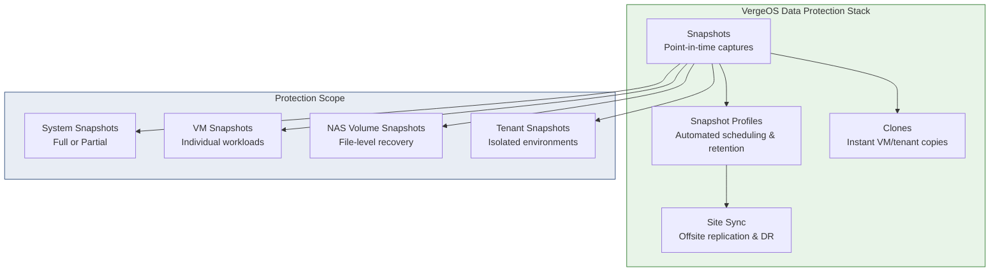
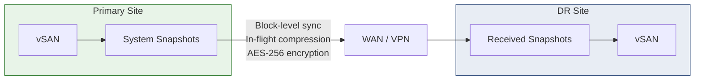

import { Card, CardGrid } from "@astrojs/starlight/components";

## Built-In Data Protection

This page covers VergeOS snapshot mechanics (block-level vs delta-disk chains), quiesced snapshots for application-consistent recovery, snapshot profiles for retention scheduling, clones, site sync replication, and recovery procedures. Every VergeOS installation includes these capabilities — snapshots, automated scheduling, offsite replication, and granular recovery — managed from the same UI as compute, storage, and networking.

## Snapshot Architecture

VergeOS snapshots leverage the **VergeFS hash-based architecture** to deliver nearly instant, space-efficient, point-in-time captures. Because VergeFS already stores data as deduplicated 64KB blocks identified by cryptographic hashes, a snapshot is simply a **frozen copy of the hash map** at a specific moment -- it records which hashes (blocks) made up each file and VM disk at that instant.

### Why Snapshots Are Space-Efficient

When a snapshot is taken, no data is copied. The snapshot references the same underlying blocks as the live data. Storage consumption only grows as the live data diverges from the snapshot -- new or modified blocks are written to new locations, while the snapshot continues to reference the original blocks. This means:

- **Instant creation** -- capturing a hash map reference is nearly instantaneous regardless of data size
- **Minimal initial overhead** -- a fresh snapshot consumes almost no additional space
- **Gradual growth** -- storage usage increases proportionally to the rate of data change over time
- **Deduplication preserved** -- identical blocks across snapshots and live data are stored only once

:::caution[Storage Planning]
While snapshots are initially space-efficient, long-term retention of many snapshots with high data churn can significantly increase vSAN usage. Monitor storage utilization regularly and align retention policies with your available capacity.
:::

### Natively Immutable

VergeOS snapshots are **natively immutable** -- once captured, the referenced blocks cannot be modified by any workload. This provides inherent protection against ransomware and accidental data corruption, because malware running inside a VM cannot reach back into the vSAN to alter snapshot data. VergeOS also supports an explicit **Immutable flag** on system snapshots that prevents deletion by any user (including administrators) until the snapshot is unlocked and a mandatory waiting period expires.

## Snapshot Scope

VergeOS supports snapshots at four distinct levels, each serving different recovery objectives:

### System Snapshots

System snapshots capture your **entire VergeOS environment** -- all VMs, tenants, NAS volumes, networks, and system configuration -- in a single operation.

| Type                       | What It Captures                                  | Restore Options                                                                   | Use Case                                           |
| -------------------------- | ------------------------------------------------- | --------------------------------------------------------------------------------- | -------------------------------------------------- |
| **Full**                   | Everything in the system                          | Full system restore, or selective restore of individual VMs, tenants, NAS volumes | System-wide protection, DR recovery points         |
| **Partial (Include Tags)** | Only VMs/tenants/volumes matching specified tags  | Restore included objects                                                          | Higher-frequency protection for critical workloads |
| **Partial (Exclude Tags)** | Everything except objects matching specified tags | Restore included objects                                                          | Exclude transient or non-critical workloads        |

Full system snapshots are the foundation of VergeOS data protection and are **required for full-system recovery**. Partial snapshots complement full snapshots by allowing specific workloads to have their own replication cadence and retention policy without expanding system-wide retention.

:::tip
Default settings on a new VergeOS system are pre-configured to take Full system snapshots at multiple intervals -- hourly (retained 3 hours), daily at midnight (retained 3 days), and daily at noon (retained 1 day).
:::

### VM Snapshots

Individual VM snapshots provide **per-workload protection** with the ability to quiesce the guest filesystem for application-consistent captures.

| Snapshot Method             | Quiesced Option        | Typical Use Case                                      |
| --------------------------- | ---------------------- | ----------------------------------------------------- |
| **Full System Snapshot**    | No (crash-consistent)  | Broad system-wide DR coverage                         |
| **Partial System Snapshot** | Yes (via quiesce tags) | Higher-frequency or longer-retention for selected VMs |
| **Individual VM Snapshot**  | Yes (if selected)      | Per-VM protection, ad-hoc before maintenance          |

### NAS Volume Snapshots

NAS volume snapshots provide **file-level recovery** for CIFS/SMB and NFS shares. Volume snapshots support quiesced capture and can be scheduled independently from system snapshots using dedicated snapshot profiles.

### Tenant Snapshots

Each tenant operates as an independent Virtual Data Center. Tenants can be restored from the parent system's snapshot, and tenants can also run their **own independent snapshot schedules** within their isolated environment.

## Quiesced Snapshots

A quiesced snapshot provides an **application-consistent** capture by temporarily freezing filesystem I/O and flushing write buffers before the snapshot is taken. For Windows VMs, VSS (Volume Shadow Copy Service) writers are also invoked, ensuring that VSS-aware applications like SQL Server, Exchange, and Active Directory prepare their data for consistent backup.

### Requirements

- The **VergeOS Guest Agent** must be installed and registered on the VM
- Linux VMs: the agent freezes the filesystem (fsfreeze)
- Windows VMs: the agent triggers VSS writers in addition to filesystem freeze

### Where Quiescing Is Available

| Context                     | How to Enable                                                                      |
| --------------------------- | ---------------------------------------------------------------------------------- |
| **Manual VM snapshot**      | Select the _Quiesce_ checkbox when taking the snapshot                             |
| **Scheduled VM snapshot**   | Enable _Quiesce Snapshots_ in the VM's assigned snapshot profile                   |
| **Partial system snapshot** | Assign _Quiesce Tags_ in the profile period -- VMs with matching tags are quiesced |
| **Full system snapshot**    | Not available -- full system snapshots are always crash-consistent                 |

:::note[Coming from VMware or Nutanix?]
All three platforms quiesce via a guest agent. VergeOS scopes it differently.

| Platform | Guest agent | Scope of quiescing |
| --- | --- | --- |
| VMware | VMware Tools + VSS provider | Per VM during snapshot |
| Nutanix | Nutanix Guest Tools (NGT), enabled per VM in Prism | Per VM during snapshot |
| VergeOS | Built-in guest agent (Linux fsfreeze + Windows VSS) | VM-level, partial system, and NAS volume snapshots — same workflow |
:::

## Clones

A clone creates a **new VM instance from a snapshot** that references the same underlying data blocks as the original. Because VergeFS uses content-addressable storage, cloning is nearly instantaneous -- no data needs to be copied. The clone shares deduplicated blocks with the source until the two diverge.

### Clone Options

| Option                     | Description                                                        |
| -------------------------- | ------------------------------------------------------------------ |
| **Restore to New**         | Creates a new VM from a snapshot, leaving the original untouched   |
| **Preserve MAC Addresses** | Keeps the same MAC addresses (use with caution to avoid conflicts) |
| **Preserve Device UUIDs**  | Maintains device identifiers from the source VM                    |
| **Cross-Cluster**          | Clone to a different compute cluster                               |

### Common Clone Use Cases

- **Test/dev environments** -- spin up a production copy for testing without impacting the original
- **Pre-upgrade validation** -- clone a VM, apply the upgrade to the clone, verify before touching production
- **Data recovery** -- clone a snapshot to a new VM, mount its drives on another VM to extract specific files without restoring over the source
- **Template creation** -- snapshot a golden image, clone it repeatedly for rapid provisioning

:::tip
To avoid network conflicts when running both source and clone simultaneously, power on the clone on an isolated internal network, or let VergeOS generate new MAC addresses (the default behavior).
:::

## Snapshot Profiles

Snapshot profiles provide **automated scheduling and retention management**. A profile contains one or more **periods**, each defining a snapshot frequency and retention duration.

### Default Profiles

VergeOS ships with several pre-configured profiles:

| Profile                  | Schedule                                                                                       |
| ------------------------ | ---------------------------------------------------------------------------------------------- |
| **System Snapshots**     | Hourly (retained 3 hours), daily at midnight (retained 3 days), daily at noon (retained 1 day) |
| **SOX (Sarbanes-Oxley)** | Yearly (7 years), monthly (1 year), weekly (31 days), daily (7 days)                           |
| **HIPAA**                | Yearly (indefinite), monthly (1 year), weekly (31 days), daily (7 days)                        |
| **NAS Volume Syncs**     | Daily at 6 PM (retained 3 days)                                                                |

### Profile Period Configuration

Each period within a profile defines:

- **Frequency** -- Hourly, Daily, Weekly, Monthly, Yearly, or Custom (one-time)
- **Retention** -- How long to keep snapshots (Days, Hours, Years, or Forever)
- **Minimum Snapshots** -- Ensures a minimum number of snapshots are always available, even past expiration
- **Snapshot Type** (system snapshots only) -- Full, Partial Include Tags, or Partial Exclude Tags
- **Quiesce Tags** (partial snapshots only) -- Tag-based quiescing for selected VMs
- **Immutable flag** (system snapshots only) -- Prevents deletion until unlocked with mandatory waiting period
- **Max Tier for Storing Snapshot** (VM/volume snapshots) -- Controls the highest storage tier allowed for snapshot data

### Assigning Profiles

Profiles can be assigned to:

- **System snapshots** -- Navigate to **System > System Snapshots > Set Snapshot Profile**
- **Individual VMs** -- Edit the VM and select a profile in the _Snapshot Profile_ field
- **NAS volumes** -- Assign during volume creation or edit

## Site Sync & Disaster Recovery

Site sync replicates **system snapshots to a remote VergeOS system**, providing offsite backup, disaster recovery, and migration capabilities.

### Key Features

<CardGrid>
  <Card title="Block-Level Sync" icon="rocket">
    Only changed blocks are transferred between sites, minimizing bandwidth
    usage and transfer times.
  </Card>
  <Card title="In-Flight Compression" icon="seti:zip">
    Data is compressed during transfer to further reduce bandwidth requirements.
    Note: VergeOS does not compress data at rest -- compression is applied only
    during site sync replication.
  </Card>
  <Card title="AES-256 Encryption" icon="seti:lock">
    All replication traffic is automatically encrypted in transit.
  </Card>
  <Card title="Repair Server (ioGuardian)" icon="heart">
    Sync sites can serve as automatic inline healing sources after multiple
    concurrent drive failures or power events.
  </Card>
</CardGrid>

### How Site Sync Works

1. **Network configuration** -- PAT rules translate incoming sync traffic to the vSAN (pre-created since VergeOS 4.13.x on both Core and External networks)
2. **Incoming sync** -- The receiving site creates an incoming sync definition to accept connections
3. **Outgoing sync** -- The sending site creates an outgoing sync that targets the receiving site
4. **Snapshot selection** -- Configure which snapshot profile periods should auto-sync and set remote retention
5. **Scheduling** -- Syncs can run on a schedule, be queued, or triggered manually
6. **Repair server** -- Optionally configure the sync target as an ioGuardian repair source

### What Can Be Recovered at the DR Site

From received snapshots at the remote site, you can:

- **Restore the entire system** -- Bring up a complete copy of the source environment
- **Restore individual tenants** -- Recover specific tenant environments
- **Restore individual VMs** -- Extract and power on specific workloads
- **Sync back** -- Retrieve snapshots back to the source site for local data recovery after a disaster

### Partial Snapshots and Site Sync

Both full and partial system snapshots can be used with site sync. This enables strategies such as:

- Syncing high-priority VMs more frequently to a DR site
- Retaining specific workloads longer at the remote site without expanding system-wide retention
- Replicating different workload subsets to different remote locations

## Recovery Scenarios

| Scenario                           | Recommended Approach                                             |
| ---------------------------------- | ---------------------------------------------------------------- |
| **Failed OS/application upgrade**  | Restore VM from individual or system snapshot                    |
| **Ransomware attack**              | Restore from immutable system snapshot (pre-infection)           |
| **Accidental file deletion**       | Restore files from NAS volume snapshot                           |
| **Hardware failure (single node)** | HA fails over VMs; no snapshot restore needed                    |
| **Complete site loss**             | Restore entire system from site sync at DR site                  |
| **Configuration error**            | Restore system from most recent system snapshot                  |
| **Dev/test environment needed**    | Clone VM from snapshot to isolated network                       |
| **Compliance audit**               | Retrieve historical data from long-retention SOX/HIPAA snapshots |

## Getting Started

Follow this recommended path to configure data protection for a new VergeOS deployment:

1. **Review default system snapshot profile** -- Navigate to **System > System Snapshots > View Snapshot Profile** and adjust the default schedule to match your RPO requirements
2. **Install guest agents** -- Deploy the VergeOS guest agent to critical VMs that require application-consistent (quiesced) snapshots
3. **Assign VM-level profiles** -- For workloads needing per-VM scheduling, edit each VM and assign an appropriate snapshot profile
4. **Configure partial snapshots** -- Tag critical VMs and add partial snapshot periods to your system profile for higher-frequency protection
5. **Set up site sync** -- Configure outgoing sync to a remote VergeOS system for offsite DR
6. **Test recovery** -- Validate your strategy by restoring a VM from snapshot and testing a site sync failover
7. **Enable immutable snapshots** -- For ransomware protection, mark critical snapshot periods as immutable with appropriate retention
