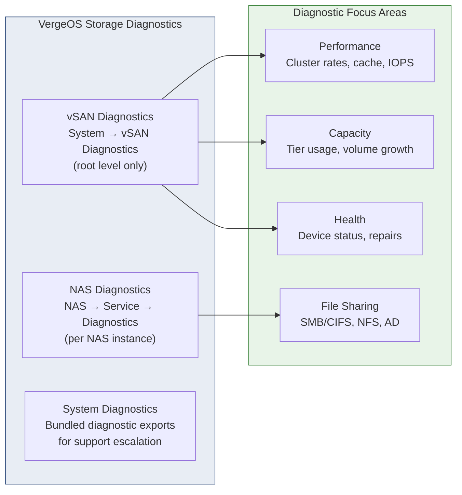
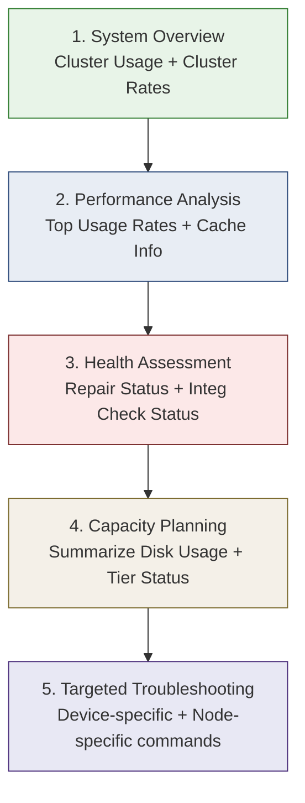

import { Card, CardGrid } from "@astrojs/starlight/components";

## Why Storage Monitoring Matters

Storage is the foundation of every workload in VergeOS. A degraded drive, a full tier, or an unnoticed integrity error can cascade into VM performance issues, failed snapshots, and tenant complaints. VergeOS provides **built-in diagnostic tools at two levels** -- vSAN diagnostics for the distributed block-level storage engine, and NAS diagnostics for each file-sharing service instance -- so you can detect, diagnose, and resolve issues before they impact production.



## vSAN Diagnostics

The vSAN Diagnostics interface provides real-time access to the VergeFS storage engine's internal state. Every `vcmd` operation can be executed through the UI or via SSH on a controller node.

### Accessing vSAN Diagnostics

1. Navigate to **System → vSAN Diagnostics** from the top menu
2. Alternatively: from the Main Dashboard, click the **vSAN Tiers** count box → **vSAN Diagnostics** in the left menu
3. Select a command from the **Query** dropdown, configure parameters on the right, and click **Send →**

:::tip[Show Command]
Enable **"Show Command"** to reveal the exact `vcmd` syntax being executed. This is useful for scripting, SSH automation, or including in support tickets.
:::

:::caution[Root-Level Only]
vSAN Diagnostics are only available at the root/parent level. Tenants do not have access to vSAN diagnostic tools -- they must request diagnostics through the provider.
:::

### vcmd Command Reference

The `vcmd` utility is the CLI interface to the vSAN engine. Every command available in the UI dropdown maps to a `vcmd` invocation.

#### Cluster & Performance Commands

| Command                 | CLI Syntax              | Purpose                                    |
| ----------------------- | ----------------------- | ------------------------------------------ |
| **Get Cluster Rates**   | `vcmd cluster rates`    | Cluster-wide throughput and IOPS metrics   |
| **Get Cluster Usage**   | `vcmd cluster usage`    | Overall storage utilization and capacity   |
| **Get Top Usage Rates** | `vcmd usage top-rates`  | Identify top consumers of storage I/O      |
| **Get Usage**           | `vcmd usage show`       | Comprehensive vSAN usage statistics        |
| **Get Cache Info**      | `vcmd cache info`       | Cache hit/miss ratios and memory usage     |
| **Get Read Ahead**      | `vcmd readahead status` | Read-ahead caching configuration and stats |
| **Get Current Master**  | `vcmd master current`   | Identify the current vSAN master node      |

#### Device & Node Commands

| Command                  | CLI Syntax                | Purpose                               |
| ------------------------ | ------------------------- | ------------------------------------- |
| **Get Device List**      | `vcmd devices list`       | All storage devices in the vSAN       |
| **Get Device Status**    | `vcmd device status [ID]` | Health and state of a specific device |
| **Get Device Usage**     | `vcmd device usage [ID]`  | Per-device utilization and wear data  |
| **Get Node List**        | `vcmd nodes list`         | All nodes participating in the vSAN   |
| **Get Node Info**        | `vcmd node info [ID]`     | Detailed info for a specific node     |
| **Get Node Device List** | `vcmd node devices [ID]`  | Devices attached to a specific node   |

#### Tier & Volume Commands

| Command                  | CLI Syntax               | Purpose                              |
| ------------------------ | ------------------------ | ------------------------------------ |
| **Get Tier Status**      | `vcmd tier status`       | Health and capacity per storage tier |
| **Get Tier Device Maps** | `vcmd tier device-maps`  | How devices map across tiers         |
| **Get Tier Node Maps**   | `vcmd tier node-maps`    | How tiers distribute across nodes    |
| **Get Volume Usage**     | `vcmd volume usage [ID]` | Per-volume storage consumption       |
| **Summarize Disk Usage** | `vcmd usage summarize`   | Cluster-wide disk usage summary      |

#### Integrity & Repair Commands

| Command                    | CLI Syntax                    | Purpose                              |
| -------------------------- | ----------------------------- | ------------------------------------ |
| **Integ Check**            | `vcmd integcheck start`       | Start a full integrity check         |
| **Integ Check Device**     | `vcmd integcheck device [ID]` | Integrity check on a specific device |
| **Get Integ Check Status** | `vcmd integcheck status`      | Progress/results of integrity checks |
| **Get Repair Status**      | `vcmd repair status`          | Active repair and rebuild operations |
| **Get Sync List**          | `vcmd sync list`              | Synchronization operation status     |

#### File System & Configuration Commands

| Command                 | CLI Syntax                   | Purpose                              |
| ----------------------- | ---------------------------- | ------------------------------------ |
| **Find Inode**          | `vcmd find --inode=[NUM]`    | Locate a specific inode for analysis |
| **Get Path from Inode** | `vcmd path from-inode [NUM]` | Resolve an inode number to a path    |
| **Get File Status**     | `vcmd file status [PATH]`    | Replication and integrity of a file  |
| **Get Fuse Info**       | `vcmd fuse info`             | FUSE mount and operation details     |
| **Get Journal Status**  | `vcmd journal status`        | Write-ahead journal state            |
| **Get Running Conf**    | `vcmd config show`           | Current running vSAN configuration   |
| **Get Clients**         | `vcmd clients list`          | Active vSAN client connections       |

## Health Monitoring Workflow

Follow this systematic approach when investigating storage health -- start broad and drill down to specific components.



### Step-by-Step Workflow

1. **System Overview** -- Run `Get Cluster Usage` and `Get Cluster Rates` to understand overall health, capacity, and throughput
2. **Performance Analysis** -- Check `Get Top Usage Rates` to find hot volumes, then `Get Cache Info` for cache hit ratios
3. **Health Assessment** -- Verify `Get Repair Status` shows all zeros (no active repairs) and `Get Integ Check Status` for recent results
4. **Capacity Planning** -- Use `Summarize Disk Usage` for a cluster-wide view and `Get Tier Status` for per-tier capacity
5. **Targeted Troubleshooting** -- Drill into specific devices (`Get Device Status`) or nodes (`Get Node Info`) based on findings

## Troubleshooting Patterns

### Performance Issues

**Symptoms:** High VM latency, slow snapshot operations, tenant complaints about disk speed.

1. Check **Get Cluster Rates** for aggregate throughput -- are rates lower than baseline?
2. Review **Get Cache Info** -- low hit ratios indicate working set exceeds available cache
3. Examine **Get Top Usage Rates** to identify which volumes are consuming the most I/O
4. Check **Get Device Usage** on individual drives for uneven load distribution
5. Verify **Get Journal Status** -- a backed-up journal indicates sustained write pressure

:::note[Storage Throttling]
VergeOS applies graduated I/O throttling based on capacity usage: normal operation below 91%, light throttling (10ms added) at 91–95%, and critical throttling (50ms added) above 96%. Check tier usage if performance suddenly degrades.
:::

### Capacity Issues

**Symptoms:** "Low space" alerts, inability to create snapshots, slow writes due to throttling.

1. Run **Get Cluster Usage** and **Summarize Disk Usage** for overall space analysis
2. Check **Get Tier Status** for per-tier capacity -- a single full tier can cause issues even if others have space
3. Use **Get Volume Usage** on the largest volumes to identify growth candidates
4. Review snapshot retention policies -- old snapshots referencing changed blocks consume significant space

### Data Integrity Concerns

**Symptoms:** Checksum warnings in logs, suspected corruption after hardware events.

1. Check **Get Integ Check Status** for recent integrity check results
2. Review **Get Repair Status** for any active data reconstruction
3. Use **Get File Status** on specific files to verify their replication state
4. If needed, run **Integ Check** to initiate a full scan (schedule during maintenance windows)

:::caution[Integrity Check Impact]
Full integrity checks can significantly impact system performance. Always schedule them during maintenance windows and monitor system load during execution.
:::

### Cluster Health Issues

**Symptoms:** Node offline alerts, unexpected master failover, split-brain concerns.

1. Verify **Get Current Master** to confirm which node leads the vSAN
2. Check **Get Node List** and **Get Node Info** for each node's status
3. Review **Get Sync List** for out-of-sync replicas that indicate a node was temporarily disconnected
4. Examine **Get Clients** for unexpected connection patterns

### Device Problems

**Symptoms:** SMART warnings, individual drive errors, uneven performance across nodes.

1. Run **Get Device List** and **Get Device Status** to identify degraded or failed devices
2. Check **Get Node Device List** for the affected node's full device inventory
3. Run **Integ Check Device** on suspected drives
4. Cross-reference with SMART data in the System Diagnostics bundle (`smart/*.txt` files)

## Preventive Maintenance

Proactive monitoring prevents surprises. Establish a regular cadence for these checks:

<CardGrid>
  <Card title="Daily" icon="sun">
    - Review cluster usage and tier capacity - Check for active repairs (should
    be zero in steady state) - Verify no storage-related alerts in the dashboard
  </Card>
  <Card title="Weekly" icon="star">
    - Run cluster rates to establish performance baselines - Review top usage
    rates for growth trends - Check cache hit ratios and tune if needed
  </Card>
  <Card title="Monthly" icon="rocket">
    - Schedule integrity checks during maintenance windows - Review device
    health and SMART data - Analyze capacity trends for procurement planning
  </Card>
</CardGrid>

## Fibre Channel Integration

VergeOS vSAN supports **Fibre Channel (FC) LUNs as storage devices** within its tiered architecture, enabling integration with existing SAN infrastructure.

### Key Principles

- **FC LUNs are treated identically to physical disks** -- VergeOS makes no distinction once they are assigned to a tier
- **Each node must receive its own unique LUNs** -- do not present the same LUN to multiple nodes (unlike traditional shared-storage clustering)
- **Tier 0 still requires physical NVMe/SSD drives** in the nodes for metadata storage
- **Disable RAID and automatic tiering** on the SAN for LUNs used by VergeOS -- vSAN handles redundancy natively
- **Active/passive multipath** with 7-second failover timeout; VergeOS automatically selects the optimal path

### When to Use FC vs. Physical Disks

Verge recommends **physical disks directly attached to nodes** for most deployments. FC integration is appropriate when you have existing SAN investments or specific compliance requirements. Physical disks provide simpler configuration, better performance (no SAN overhead), fewer failure points, and lower cost.

:::note[Core Network Bandwidth]
vSAN uses the core network for data replication. If your FC SAN supports 32 Gb but your core network is 25 Gb, write throughput will be constrained by the core network. Ensure core network bandwidth meets or exceeds SAN bandwidth for write-intensive workloads.
:::

## NAS Diagnostics

Each NAS service instance has its own diagnostic interface, separate from vSAN diagnostics. NAS diagnostics focus on file-sharing protocols, network connectivity, and authentication.

### Accessing NAS Diagnostics

1. Navigate to **NAS → List** from the top menu
2. Double-click the desired NAS service
3. Click **Diagnostics** in the left menu
4. Select a command from the **Diagnostics Query** dropdown and click **Send →**

### Key NAS Diagnostic Commands

| Category             | Commands                                          | Purpose                                              |
| -------------------- | ------------------------------------------------- | ---------------------------------------------------- |
| **SMB/CIFS**         | `smbstatus`, `testparm`, `smbclient -L localhost` | Active connections, config validation, share listing |
| **NFS**              | `exportfs -v`, `rpcinfo -p`, `showmount -e`       | Export list, RPC services, mount verification        |
| **Active Directory** | `wbinfo -t`, `wbinfo -u`, `wbinfo -g`             | Trust check, domain users, domain groups             |
| **Network**          | Ping, Trace Route, ARP Scan, DNS Lookup           | Connectivity, routing, neighbor discovery            |
| **Performance**      | Top CPU Usage, Top Network Usage, TCP Dump        | Resource utilization and traffic analysis            |
| **Logging**          | Logs (journalctl, samba logs)                     | Error analysis and event monitoring                  |

### NAS Health Monitoring Workflow

1. **Service Status** -- Check Services and protocol-specific status (Samba/NFS)
2. **Network Connectivity** -- Verify with Ping and interface configuration
3. **Authentication** -- Test Users, Groups, and Winbind (for AD environments)
4. **Performance** -- Monitor Top CPU Usage and Top Network Usage
5. **Logs** -- Review service logs for errors or warnings

## Common NAS Issues & Resolutions

### Windows: Unable to Connect to CIFS Shares

**Cause:** Windows 10/11 and Server 2016+ disable insecure guest logons by default, blocking access to shares that allow anonymous access.

**Fix:** Enable insecure guest logons via Group Policy:

1. Open `gpedit.msc` → **Computer Configuration → Administrative Templates → Network → Lanman Workstation**
2. Set **Enable insecure guest logons** to **Enabled**
3. Restart the Windows device

### macOS: SMB Connection Failures

**Cause:** macOS defaults may conflict with the server's SMB protocol version or lack Apple-specific extensions.

**Fix (client-side):** Force SMB3 in `/etc/nsmb.conf`:

```ini
[default]
smb_neg=smb3_only
```

Clear the SMB cache (`sudo rm -rf /var/db/samba/* /var/db/smb/*`) and restart.

**Fix (server-side):** Add Apple/Samba fruit module settings under **NAS → CIFS → Advanced Configuration Options**:

```ini
ea support = yes
vfs objects = fruit streams_xattr
fruit:metadata = stream
fruit:model = MacSamba
fruit:veto_appledouble = no
fruit:nfs_aces = no
fruit:posix_rename = yes
fruit:zero_file_id = yes
fruit:wipe_intentionally_left_blank_rfork = yes
fruit:delete_empty_adfiles = yes
```

### Permission Denied on CIFS Shares

**Cause:** Incorrect user/group permissions or share configuration.

**Fix:**

1. Verify user has access in the NAS service's user list
2. Check share settings: ensure **Browseable** is enabled and the user is in the **Valid Users** list
3. If using **Force User** or **Force Group** options, confirm the forced identity has the correct filesystem permissions

### Slow CIFS Performance

**Cause:** SMB protocol version mismatch, network issues, or suboptimal configuration.

**Fix:**

1. Verify network stability with the NAS Diagnostics **Ping** and **Trace Route** commands
2. Check the SMB protocol version under **NAS → Volumes → Advanced Configuration Options** -- ensure SMB2 or SMB3 is in use
3. Monitor with **Top Network Usage** in NAS Diagnostics for bandwidth saturation
4. Contact VergeOS Support for advanced Samba tuning parameters if standard optimizations are insufficient

:::note[VMware Bridge]
VergeOS vSAN Diagnostics is the analog of vCenter's vSAN Health Service, with `vcmd` mapping loosely to `esxcli vsan` and `cmmds-tool` — but available on any controller node without PowerCLI or the MOB. NAS diagnostics run inside each NAS service VM, similar to troubleshooting a dedicated NFS/CIFS appliance.
:::

:::note[Nutanix Bridge]
vSAN Diagnostics parallels Prism's Storage dashboard and `ncli` — `vcmd cluster usage` ↔ `ncli storage-pool list`, `vcmd tier status` ↔ Prism's tier views, and VergeOS integrity checks parallel Nutanix's scrubbing framework. NAS diagnostics run inside the NAS service VM rather than through Prism's Files interface — closer to SSH-ing into a Nutanix Files FSVM for direct Samba/NFS work.
:::

## Getting Started

<CardGrid>
  <Card title="Explore vSAN Diagnostics" icon="magnifier">
    Navigate to **System → vSAN Diagnostics**, run **Get Cluster Usage** and
    **Get Cluster Rates** to establish your baseline. Enable "Show Command" to
    learn the `vcmd` syntax.
  </Card>
  <Card title="Check NAS Health" icon="list-format">
    Open each NAS service's Diagnostics page. Run **Samba** to see active
    connections and **NFS** to verify exports. Review **Logs** for recent
    errors.
  </Card>
  <Card title="Review the Diagnostics Guide" icon="open-book">
    Read the full [vSAN Diagnostics
    Guide](https://docs.verge.io/product-guide/storage/vsan-diagnostics/) and
    [NAS Diagnostics
    Guide](https://docs.verge.io/product-guide/nas/nas-diagnostics/) in the
    official docs.
  </Card>
</CardGrid>
