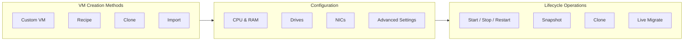
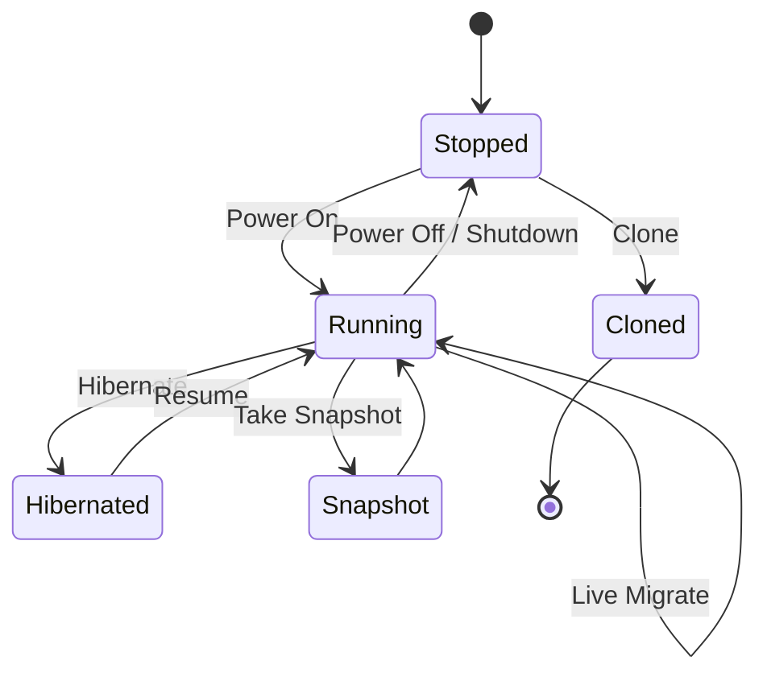

import { Card, CardGrid } from "@astrojs/starlight/components";

## Overview

Virtual machines are the primary workload unit in VergeOS. The VergeOS UI provides a streamlined workflow for creating VMs, attaching storage and networking, and managing the full lifecycle -- from first boot through snapshots, clones, and live migration. Whether you are building a single test server or deploying hundreds of production workloads, the process follows the same consistent pattern.

VergeOS offers four methods for creating a VM:

| Method        | Description                                                 | Use Case                                           |
| ------------- | ----------------------------------------------------------- | -------------------------------------------------- |
| **Custom VM** | Blank VM with no drives or NICs -- you configure everything | Full control over hardware configuration           |
| **Recipe**    | Pre-built golden-image template with guided questions       | Standardized, repeatable deployments               |
| **Clone**     | Copy of an existing VM with new MAC addresses               | Quick duplication of running workloads             |
| **Import**    | From OVF/OVA, VMX, VMDK, VHDX, or QCOW2 files               | Migration from VMware, Hyper-V, or other platforms |

## Creating a Custom VM

A custom VM is created as a blank shell -- no drives, no NICs, no OS. This gives you full control over every aspect of the hardware configuration before installing a guest operating system.

### Walkthrough

1. From the **Cloud Dashboard**, click **Machines** > **Virtual Machines**.
2. Click **New** from the left menu.
3. Select **-- Custom --** from the options list.
4. Click **Next** and configure the VM fields (see the field reference below).
5. Click **Submit** to create the VM.
6. Add **drives** and **NICs** from the VM dashboard (detailed in the sections below).
7. **Power on** the VM and install a guest OS from an ISO or import disk.

:::tip[Getting Started Quickly]
If you just want a working VM fast, use a **Recipe** instead of Custom. Recipes include pre-configured drives, NICs, and an OS image -- you just answer a few questions (cores, RAM, network, storage tier) and the VM is ready to boot.
:::

## VM Field Reference

When creating or editing a VM, the following fields control its hardware configuration:

| Field                | Description                           | Recommendation                                                         |
| -------------------- | ------------------------------------- | ---------------------------------------------------------------------- |
| **Name**             | Unique identifier for the VM          | Use descriptive, consistent naming                                     |
| **CPU Cores**        | Number of virtual CPU cores           | Start conservatively; increase as needed                               |
| **RAM (MB)**         | Memory allocation in megabytes        | Start conservatively with RAM allocation and scale based on monitoring |
| **OS Family**        | Windows, Linux, or FreeBSD            | Affects QEMU flags and performance optimization                        |
| **Machine Type**     | Q35 (modern) or i440FX (legacy)       | **Q35** is recommended for all new VMs                                 |
| **UEFI**             | Enable UEFI boot firmware             | Required for Secure Boot and modern OS features                        |
| **Secure Boot**      | Validates boot chain signatures       | Enable for Windows Server 2016+ and hardened Linux                     |
| **QEMU Guest Agent** | Host-to-guest communication channel   | **Always enable** -- required for quiesced snapshots                   |
| **Video**            | Display adapter (VirtIO, std, cirrus) | **VirtIO** for best performance                                        |
| **Console**          | VNC, SPICE, or Serial                 | SPICE for desktop; VNC for general use                                 |
| **Boot Order**       | Priority of boot devices              | Set OS drive to order 0                                                |
| **HA Group**         | High-availability placement group     | Keeps related VMs on separate nodes                                    |
| **Preferred Node**   | Pin VM to a specific node             | Use sparingly -- limits failover flexibility                           |
| **Snapshot Profile** | Automated snapshot schedule           | Assign for per-VM backup beyond system snapshots                       |
| **RTC Base**         | UTC or Local Time                     | UTC for Linux; configure Windows to use UTC or set to Local Time       |
| **Allow Hotplug**    | Enable drive/NIC hot-plug             | Enabled by default -- leave on                                         |

:::note[VMware Bridge]
The VergeOS VM creation form maps closely to vSphere's **Edit Settings** dialog: Machine Type Q35 corresponds to a newer virtual hardware version, and the Guest Agent replaces VMware Tools for quiesced snapshots, IP reporting, and graceful shutdown. VMs are created as empty shells; drives and NICs are added as separate objects.
:::

## Adding Drives

Drives are added to the VM after creation. From the **VM Dashboard**, click **Drives** > **New** (or use the **New Drive** shortcut on the left menu).

### Drive Media Types

| Media Type         | Description                                                                   |
| ------------------ | ----------------------------------------------------------------------------- |
| **Disk**           | Empty virtual disk (thin-provisioned)                                         |
| **CD-ROM**         | Read-only ISO media for OS installation                                       |
| **Clone Disk**     | Duplicate of an existing `.raw` disk in the same cloud                        |
| **Import Disk**    | Create from uploaded disk images (`.vmdk`, `.qcow2`, `.vhd`, `.vhdx`, `.raw`) |
| **Non-Persistent** | Reverts to a golden image on every boot (ideal for VDI)                       |
| **EFI Disk**       | Auto-generated UEFI firmware disk (system-managed)                            |

### Drive Interface Types

| Interface                              | Performance | Notes                                                                                                                                                     |
| -------------------------------------- | ----------- | --------------------------------------------------------------------------------------------------------------------------------------------------------- |
| **Virtio-SCSI**                        | Excellent   | **Recommended for all new VMs.** Supports hot-plug, TRIM/discard, and online resize. Linux includes drivers natively; Windows requires VirtIO driver ISO. |
| **Virtio-SCSI (Dedicated Controller)** | Excellent   | Use when mixing drives across different storage tiers within the same VM.                                                                                 |
| **Virtio (Legacy)**                    | Maximum I/O | Highest raw throughput but lacks SCSI features like TRIM.                                                                                                 |
| **SATA (AHCI)**                        | Good        | Q35 machine type only. Broad guest OS compatibility.                                                                                                      |
| **IDE**                                | Basic       | i440FX machine type only. Legacy compatibility.                                                                                                           |
| **LSI**                                | Good        | VMware compatibility mode.                                                                                                                                |

### Preferred Tier

Every disk drive is assigned a **preferred tier** that determines which vSAN storage tier holds its data. Select based on your workload requirements:

- **Tier 1** (NVMe) -- Highest performance for databases and latency-sensitive workloads
- **Tier 2** (SSD) -- Good balance of performance and capacity
- **Tier 3** (SSD/HDD) -- General-purpose storage
- **Tier 4–5** (HDD/Archive) -- Capacity-optimized for cold data

:::tip
VergeOS uses **thin provisioning** -- allocating a generous disk size does not consume space until the guest actually writes data. It is often better to over-allocate initially rather than needing to expand later.
:::

## Adding NICs

From the VM Dashboard, click **NICs** > **New** to add a network interface.

### NIC Configuration Fields

| Field           | Description                                                    |
| --------------- | -------------------------------------------------------------- |
| **Name**        | Optional label (recommended if multiple NICs)                  |
| **Interface**   | **Virtio** (recommended), Intel E1000, AMD PCnet, Realtek 8139 |
| **Network**     | Target virtual network (internal or external)                  |
| **MAC Address** | Auto-generated or manually specified                           |
| **Enabled**     | Toggle NIC on/off without deleting                             |
| **Asset**       | Unique identifier for use in recipes                           |

:::tip
**Virtio** provides the best network performance. Linux includes VirtIO drivers natively. For Windows, install drivers from the [VirtIO driver ISO](https://fedorapeople.org/groups/virt/virtio-win/direct-downloads/stable-virtio/virtio-win.iso) or use the VergeOS custom Windows ISOs which bundle them.
:::

## Hot-Plug Capabilities

VergeOS supports modifying certain VM hardware while the VM is running, controlled by the **Allow Hotplug** setting (enabled by default).

### What Can Be Hot-Plugged

| Resource         | Hot-Plug? | Notes                                                  |
| ---------------- | --------- | ------------------------------------------------------ |
| **Drives**       | Yes       | Guest OS must support hot-add; Virtio-SCSI recommended |
| **NICs**         | Yes       | Widely supported by modern guest operating systems     |
| **Drive Resize** | Yes       | Virtio-SCSI drives can be expanded without power cycle |

### What Requires a Power Cycle

| Resource         | Notes                                                 |
| ---------------- | ----------------------------------------------------- |
| **RAM**          | Memory changes always require VM power off and on     |
| **CPU Cores**    | Core count changes always require a power cycle       |
| **Console Type** | VNC/SPICE/Serial changes take effect on next power on |
| **Video Card**   | Video adapter changes require power cycle             |
| **Machine Type** | Chipset changes require power cycle                   |
| **UEFI/BIOS**    | Boot mode changes require power cycle                 |

:::note[Nutanix Bridge]
Nutanix AHV has similar hot-plug constraints — disks and NICs can be added/removed live, but CPU and memory changes require a power cycle. VergeOS **tenant nodes** (not VMs) support live CPU/RAM changes without a restart, similar to Acropolis Dynamic Scheduling at the node level.
:::

## Creating a VM from a Clone

Cloning creates a new VM instance as a copy of an existing VM. This is useful for quickly duplicating workloads, creating test environments, or scaling out identical servers.

### Clone Options

| Option                     | Default           | Description                                                                                    |
| -------------------------- | ----------------- | ---------------------------------------------------------------------------------------------- |
| **VM Name**                | `<original>clone` | Rename as desired                                                                              |
| **Preserve MAC Addresses** | Off               | Creates new MACs (safe for same-network operation)                                             |
| **Preserve Device UUIDs**  | Off               | Creates new UUIDs (enable only if application requires it)                                     |
| **Quiesce File System**    | Off               | Freezes filesystem and flushes buffers for application-consistent clone (requires Guest Agent) |

### Clone Walkthrough

1. Navigate to **Machines** > **Virtual Machines** > **New**.
2. Select **--Clone--** from the options list.
3. Select the source VM from the available list.
4. Click **Next**, configure clone options, and click **Submit**.

:::caution
Running a clone on the same network as the original with **Preserve MAC Addresses** enabled will cause network conflicts. Always verify that MAC addresses and IP configurations are unique before powering on the clone.
:::

## Lifecycle Operations

Once a VM is created and configured, the following operations are available from the VM Dashboard:

| Operation        | Description                                           |
| ---------------- | ----------------------------------------------------- |
| **Power On**     | Start the VM                                          |
| **Power Off**    | Immediate power cut (use Shutdown for graceful stop)  |
| **Shutdown**     | ACPI-initiated graceful shutdown via guest OS         |
| **Restart**      | Graceful reboot                                       |
| **Hibernate**    | Save VM state to disk and stop (resume to same state) |
| **Snapshot**     | Create a point-in-time backup (manual or scheduled)   |
| **Clone**        | Create a copy of the VM                               |
| **Live Migrate** | Move a running VM to another node with zero downtime  |

### Snapshot Methods

VergeOS provides three levels of VM snapshot protection:

| Method                      | Scope                      | Quiesce Support   | Use Case                                   |
| --------------------------- | -------------------------- | ----------------- | ------------------------------------------ |
| **Full System Snapshot**    | All VMs, tenants, settings | No                | System-wide DR recovery points             |
| **Partial System Snapshot** | Tagged VMs/tenants only    | Yes (by tag)      | Higher frequency for selected workloads    |
| **Individual VM Snapshot**  | Single VM                  | Yes (if selected) | Per-VM protection, pre-maintenance backups |

**Quiesced snapshots** freeze the guest filesystem and flush write buffers before capture, providing application-consistent backups. On Windows VMs, VSS writers are invoked for VSS-aware applications. The **Guest Agent must be installed and registered** for quiesced snapshots to work.

### Live Migration

Live migration moves a running VM from one physical node to another with no downtime. This is essential for:

- **Planned maintenance** -- Evacuate VMs before taking a node offline
- **Load balancing** -- Redistribute workloads across the cluster
- **Hardware upgrades** -- Move VMs off a node before replacing components

VergeOS handles live migration automatically during maintenance operations, or you can trigger it manually from the VM Dashboard.

## Guest Agent

The **QEMU Guest Agent** is a lightweight service installed inside the guest OS that enables host-to-guest communication. It is critical for production VMs.

### Guest Agent Benefits

- **Quiesced snapshots** -- Application-consistent backups with filesystem freeze
- **IP address reporting** -- Guest IP and hostname visible on VM dashboard
- **Graceful shutdown** -- Reliable power-off without ACPI dependency
- **VSS integration** -- Windows Volume Shadow Copy for database-consistent snapshots

### Installation

| Platform          | Installation Command                                                                                                                                                             |
| ----------------- | -------------------------------------------------------------------------------------------------------------------------------------------------------------------------------- |
| **Debian/Ubuntu** | `apt-get install qemu-guest-agent`                                                                                                                                               |
| **RHEL/CentOS**   | `yum install qemu-guest-agent`                                                                                                                                                   |
| **Windows**       | Install `virtio-win-guest-tools.exe` from the [VirtIO driver package](https://fedorapeople.org/groups/virt/virtio-win/direct-downloads/stable-virtio/virtio-win-guest-tools.exe) |

After installation, verify the agent is connected by checking the **Guest Agent** checkbox on the VM Dashboard -- a version number will appear next to it when successfully connected.

## Best Practices

<CardGrid>
  <Card title="Right-Size RAM" icon="warning">
    Start conservatively with RAM allocation and scale up based on actual
    workload monitoring.
  </Card>
  <Card title="Use Virtio Everywhere" icon="rocket">
    Select **Virtio-SCSI** for drives and **Virtio** for NICs. These
    para-virtualized drivers deliver near-native performance. Install VirtIO
    drivers on Windows before switching interfaces.
  </Card>
  <Card title="Always Enable Guest Agent" icon="approve-check">
    The Guest Agent enables quiesced snapshots, IP reporting, and graceful
    shutdown. Install it on every production VM immediately after OS setup.
  </Card>
  <Card title="Disable Power Saving in Guest" icon="setting">
    Guest OS power-saving features provide no benefit in a virtual environment
    and can cause performance issues. Use a **Performance** power profile within
    the guest.
  </Card>
</CardGrid>

## Getting Started Path

1. **Create a custom VM** with 2 cores, 4 GB RAM, Q35 machine type, UEFI enabled, Guest Agent enabled
2. **Add a Virtio-SCSI disk** (50 GB on your preferred tier) and a **CD-ROM** with an OS ISO
3. **Add a Virtio NIC** connected to your internal network
4. **Power on** and install the guest OS
5. **Install the Guest Agent** inside the guest
6. **Take a snapshot** as your first recovery point
7. **Test lifecycle operations** -- restart, clone, and migrate the VM
