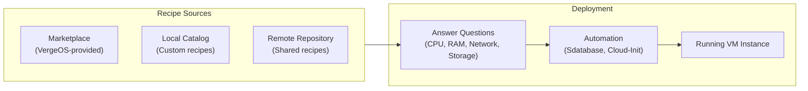
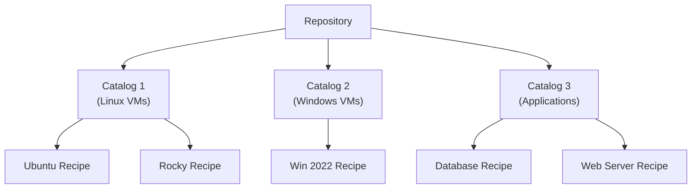

import { Card, CardGrid } from "@astrojs/starlight/components";

## Overview

Manually configuring every virtual machine from scratch is time-consuming and error-prone. VergeOS **recipes** solve this by providing customizable golden-image templates that standardize VM provisioning while still allowing per-instance customization. Combined with the built-in **Marketplace catalog**, recipes let you deploy production-ready VMs in minutes -- from Ubuntu servers to Windows evaluation environments -- with consistent configurations every time.



A recipe consists of three components:

1. **Base VM** -- A generalized virtual machine that serves as the golden image (template)
2. **Questions** -- Input fields organized into sections that collect per-instance customization values (cores, RAM, hostname, network config, credentials)
3. **Automation** -- Behind-the-scenes database operations and cloud-init/Cloudbase-init scripts that configure the VM during first boot

## The Marketplace Catalog

Every VergeOS system ships with the **Marketplace** -- a remote, VergeOS-provided repository of pre-built VM recipes ready for immediate use. The Marketplace is automatically available at install time and its catalogs are set to `scope=global`, making them accessible to all tenants as well.

### Accessing the Marketplace

1. Navigate to **Machines** > **Virtual Machines** from the left menu.
2. Click **New**.
3. In the **Select Type** panel on the left, choose **Marketplace** (or a specific catalog like "Operating Systems (Marketplace)" or "Applications (Marketplace)").
4. Select a recipe from the list and click **Next** to begin answering questions.

### Available Operating System Recipes

The Marketplace includes recipes for a wide range of operating systems:

| Category            | Available Recipes                                                                  |
| ------------------- | ---------------------------------------------------------------------------------- |
| **Ubuntu**          | Server 18.04 (Bionic), 20.04 (Focal), 22.04 (Jammy), 24.04 (Noble) -- LTS releases |
| **RHEL-Compatible** | Rocky Linux 8 & 9, AlmaLinux 8 & 9, CentOS 7, CentOS Stream 8                      |
| **Debian**          | Debian 10 (Buster), Debian 11 (Bullseye)                                           |
| **Fedora**          | Fedora 35, 36, 37, 38                                                              |
| **Amazon**          | Amazon Linux 2 LTS                                                                 |
| **Windows**         | Windows Server 2019 Evaluation, 2022 Evaluation, 2025 Evaluation                   |

:::tip
Linux recipes use **cloud-init** with pre-built cloud images downloaded during provisioning. Windows recipes use **Cloudbase-init** with evaluation ISOs and automated unattended setup. Both approaches produce a fully configured, bootable VM without manual OS installation.
:::

## Using a Marketplace Recipe

Deploying a VM from a Marketplace recipe follows a guided question-and-answer workflow. Here is a typical walkthrough using an Ubuntu Server recipe:

### Step-by-Step Walkthrough

1. **Navigate** to **Machines** > **Virtual Machines** > **New**.
2. **Select** the recipe (e.g., "Ubuntu Server 24.04 (Noble Numbat)") from the Marketplace catalog.
3. **Answer the questions** presented in each section:

#### VM Instance Settings

| Variable               | Display Name                        | Description                          |
| ---------------------- | ----------------------------------- | ------------------------------------ |
| `YB_CPU_CORES`         | Cores                               | Number of virtual CPU cores          |
| `YB_RAM`               | RAM                                 | Memory allocation (MB)               |
| `YB_HOSTNAME`          | Hostname                            | Guest OS hostname                    |
| `SELECT_CREATE_UEFI`   | Enable UEFI                         | UEFI boot mode (recommended)         |
| `YB_DISABLE_CLOUDINIT` | Disable Cloud-init after first boot | Options: `true`, `false`, or `purge` |

#### Networking Settings

| Variable                       | Display Name     | Description                    |
| ------------------------------ | ---------------- | ------------------------------ |
| `YB_IP_ADDR_TYPE`              | IP Address Type  | `dhcp` or `static`             |
| `YB_NIC_ETH0_EXTERNAL_GATEWAY` | Network          | Target network for primary NIC |
| `YB_NIC_ETH0_IP_ADDR`          | IP Address       | Static IP (if static selected) |
| `YB_NIC_ETH0_CIDR`             | Subnet Mask CIDR | e.g., `/24`                    |
| `YB_NIC_ETH0_GW`               | Default Gateway  | Gateway IP address             |
| `YB_NIC_ETH0_NS`               | Nameservers      | Comma-separated DNS servers    |

#### Storage Settings

| Variable           | Display Name  | Description                 |
| ------------------ | ------------- | --------------------------- |
| `YB_DRIVE_OS_SIZE` | OS Drive Size | Disk size in GB             |
| `SELECT_OS_TIER`   | OS Drive Tier | Preferred vSAN storage tier |

#### User Account

| Variable      | Display Name | Description            |
| ------------- | ------------ | ---------------------- |
| `YB_USER`     | User Name    | Initial admin username |
| `YB_PASSWORD` | Password     | Initial admin password |

4. **Click Submit** to create the VM.
5. The recipe automation runs -- creating drives, downloading cloud images, configuring cloud-init files, and setting the machine type.
6. **Power on** the VM. Cloud-init runs on first boot to apply your configuration (hostname, users, network, packages).

## Recipe Questions and Variables

Recipe questions are the building blocks that make recipes customizable. Each question captures a value that is stored as a variable and can be referenced in cloud-init scripts, database operations, or VM configuration.

### Question Fields

| Field                | Purpose                                                                                                                             |
| -------------------- | ----------------------------------------------------------------------------------------------------------------------------------- |
| **Section**          | Groups related questions on the input form (e.g., "Instance Settings", "Networking")                                                |
| **Name**             | Variable name referenced in scripts (alphanumeric only, no spaces)                                                                  |
| **Type**             | How data is collected: String, Number, Password, Boolean, List, Hidden, RAM, Disk Size, Network, Cluster, Database Create/Edit/Find |
| **Order ID**         | Display order within the section                                                                                                    |
| **Display**          | Label shown to the user on the input form                                                                                           |
| **Default Value**    | Pre-populated answer                                                                                                                |
| **Regex Validation** | Regular expression to validate input                                                                                                |
| **Placeholder Text** | Greyed hint text showing expected format                                                                                            |
| **Tooltip Text**     | Popup help on hover                                                                                                                 |
| **Note Text**        | Help text displayed below the input field                                                                                           |
| **On Change**        | JavaScript to show/hide other questions dynamically                                                                                 |

### Auto-Generated Questions

When you create a recipe from a base VM, VergeOS automatically generates questions for each of the VM's drives (e.g., `YB_DRIVE_1_SIZE`, `YB_DRIVE_2_SERIAL`, `YB_DRIVE_3_NONPERSISTENT`). Some auto-generated questions are disabled by default -- enable them from the Questions list if needed.

## Sdatabase Automation

Behind every Marketplace recipe, a set of **Sdatabase-type questions** perform automated operations during VM provisioning. These questions interact directly with the VergeOS database API to create resources, download images, and configure hardware -- without requiring any manual intervention from the user.

### Common Sdatabase Operations

| Variable                  | Operation                                                    |
| ------------------------- | ------------------------------------------------------------ |
| `CREATE_OS_DRIVE`         | Creates the OS virtual disk with the specified size and tier |
| `YB_DOWNLOAD_WINDOWS_ISO` | Downloads the Windows ISO from a specified URL               |
| `YB_DOWNLOAD_VIRTIO`      | Downloads the VirtIO driver ISO for Windows guests           |
| `YB_CREATE_VIRTIO_CD_DL`  | Creates a virtual CD-ROM and attaches the VirtIO ISO         |
| `GET_CLUSTER_CPU`         | Queries the cluster for available CPU model information      |
| `CHANGE_CLUSTER_CPU`      | Sets the VM's CPU type to match the cluster                  |
| `EDIT_MACHINE_TYPE`       | Adjusts the VM machine type (e.g., Q35) post-creation        |

These operations use the same REST API that is available to administrators and automation tools. Recipe authors can add custom Sdatabase questions to automate any operation exposed by the VergeOS API -- creating networks, registering DNS entries, setting firewall rules, and more.

:::note[Coming from VMware or Nutanix?]
A VergeOS recipe bundles template + customization + provisioning automation. Both VMware and Nutanix split those responsibilities across multiple products.

| Platform | Closest equivalent |
| --- | --- |
| VMware | VM Templates + Customization Specs, with Aria Automation (formerly vRealize) for full orchestration |
| Nutanix | Image Management for OS images + Calm (separately licensed) for blueprint provisioning |
| VergeOS | Recipes — template, guided questions, cloud-init, drive creation, and API operations in one self-contained package |
:::

## Cloud-Init Integration (Linux)

VergeOS integrates with **cloud-init**, the industry-standard tool for customizing Linux VMs during first boot. Recipes leverage cloud-init to apply hostname, user accounts, network configuration, package installation, and custom scripts -- all driven by the recipe question variables.

### How It Works

1. The VM's **Cloud-init Datasource** field is set to **Config Drive v2**.
2. VergeOS creates a virtual drive containing two files:
   - **`user_data`** -- Scripts and configuration directives executed on first boot
   - **`meta_data.json`** -- Instance metadata (hostname, UUID, availability zone)
3. Recipe question variables are substituted into these files using template syntax.
4. On first boot, cloud-init reads the Config Drive and applies the configuration.

### Template Variables

Recipe variables are injected into cloud-init files using the `${VARIABLE_NAME}` syntax:

```json
{
  "availability_zone": "${YB_CLUSTER_NAME}",
  "name": "${YB_NAME}",
  "uuid": "${YB_UUID}",
  "hostname": "${YB_NAME}",
  "yb": {ALL_VARIABLES}
}
```

The `{ALL_VARIABLES}` token expands to include every question variable as a JSON object, making all recipe answers available to cloud-init scripts.

### User Data Formats

The `user_data` file supports multiple script formats, determined by the first line:

| Format                  | First Line      | Use Case                                                     |
| ----------------------- | --------------- | ------------------------------------------------------------ |
| **Cloud-config (YAML)** | `#cloud-config` | Declarative configuration (users, packages, files, runcmd)   |
| **Shell script**        | `#!/bin/bash`   | Arbitrary shell commands                                     |
| **PowerShell**          | `#ps1`          | PowerShell scripts (primarily for Cloudbase-init on Windows) |
| **Batch**               | `rem cmd`       | Windows batch scripts (Cloudbase-init)                       |

#### Example: Cloud-Config YAML

```yaml
#cloud-config
hostname: ${YB_HOSTNAME}
users:
  - name: ${YB_USER}
    sudo: ALL=(ALL) NOPASSWD:ALL
    shell: /bin/bash
    lock_passwd: false
    passwd: ${YB_PASSWORD_HASH}
packages:
  - qemu-guest-agent
  - curl
runcmd:
  - systemctl enable --now qemu-guest-agent
```

### Online Cloud Images

Linux recipes can download pre-built cloud images directly from distribution mirrors. This is configured through hidden recipe questions:

- **`OS_DL_URL`** (type: Hidden) -- Downloads and caches the image locally (e.g., `https://cloud-images.ubuntu.com/releases/noble/release/ubuntu-24.04-server-cloudimg-amd64-disk-kvm.img`)
- **`OS_URL`** (type: Hidden) -- Streams the image over the web without local caching

These cloud images come pre-installed with cloud-init, so the recipe only needs to provide the `user_data` and `meta_data.json` files for customization.

## Cloudbase-Init (Windows)

For Windows VMs, VergeOS uses **Cloudbase-init** -- the Windows equivalent of cloud-init. Cloudbase-init reads the same Config Drive v2 datasource and executes PowerShell or batch scripts during first boot.

### Setup Process

1. Install the [Cloudbase-init client](https://cloudbase.it/cloudbase-init/#download) in the Windows template VM.
2. Sysprep the VM using the Cloudbase-init unattend options.
3. Set the VM's **Cloud-init Datasource** to **Config Drive v2**.
4. Create recipe questions for Windows-specific options (license key, RDP, VirtIO drivers).

### Windows Recipe Automation

Windows Marketplace recipes automate the entire provisioning chain:

1. Download the Windows evaluation ISO via Sdatabase
2. Download the VirtIO driver ISO
3. Create virtual CD-ROM drives and attach both ISOs
4. Configure the machine type and UEFI settings
5. On first boot, Cloudbase-init applies hostname, admin credentials, RDP settings, and network configuration

:::caution
After cloud-init or Cloudbase-init has completed its work, **remove the cloud-init files** from the VM -- especially if any scripting contained passwords or other sensitive information.
:::

## Creating Custom Recipes

When Marketplace recipes do not meet your needs, you can create custom recipes from any existing VM.

### Workflow

1. **Build a base VM** -- Install the OS, applications, and configuration you want as your golden image. Generalize the VM (remove machine-specific data, install cloud-init or Cloudbase-init).
2. **Create the recipe** -- Navigate to **Virtual Machines** > **New VM Recipe**.
   - If no local catalog exists, you will be prompted to create one first.
3. **Configure recipe fields:**

| Field                            | Description                                                          |
| -------------------------------- | -------------------------------------------------------------------- |
| **Name**                         | Descriptive name for the recipe                                      |
| **Description**                  | Documentation and guidelines                                         |
| **Icon**                         | Font Awesome icon for visual identification                          |
| **Catalog**                      | Organizational container for the recipe                              |
| **Virtual Machine**              | The base template VM                                                 |
| **Version**                      | Starts at 1.0.0, auto-increments on changes (1.0.0-1, 1.0.0-2, etc.) |
| **Use Asset for Question Names** | Names drive/NIC questions by asset number instead of ordinal         |
| **Version Dependencies**         | VergeOS features required for the recipe to function                 |

4. **Define questions** -- Add sections and questions to collect per-instance input. Configure validation, defaults, tooltips, and conditional show/hide logic.
5. **Configure cloud-init files** -- Write `user_data` and `meta_data.json` templates referencing your question variables.
6. **Simulate the recipe** -- Click **Simulate Recipe** from the recipe dashboard to test the input form, validate fields, and preview the generated answer files.
7. **Publish** -- The recipe becomes available in its catalog for creating new VMs.

### Modifying and Republishing

When you change a recipe, it must be **republished** for the changes to take effect. The recipe dashboard displays a notification with a **Republish** link. After republishing, remote systems and tenants are notified that an update is available.

### Recipe Instances

A VM created from a recipe is an **instance** of that recipe until it is deleted or detached. You can view all instances from the recipe dashboard. A recipe cannot be deleted while it has associated instances.

## Recipe Exchange

VergeOS supports sharing recipes between systems and tenants through a repository and catalog architecture.



### Sharing with Tenants

1. Set the catalog's **Publishing Scope** to **Tenant** (or **Global** for external access).
2. In the tenant UI, navigate to the **Service Provider** repository and click **Refresh**.
3. Double-click the catalog to browse recipes.
4. Select recipes and click **Download/Update** to make them available locally.

### Sharing with Remote Systems

1. Create an **API user** on the sharing system with List and Read permissions on the catalog.
2. On the receiving system, create a **Remote Repository** pointing to the sharing system's URL with the API user credentials.
3. Click **Refresh** to pull catalog listings. Download recipes for local use.

### Publishing Scopes

| Scope       | Visibility                                                  |
| ----------- | ----------------------------------------------------------- |
| **Private** | Only the local VergeOS cloud                                |
| **None**    | Disabled -- not available anywhere                          |
| **Tenant**  | Local cloud and its direct tenants                          |
| **Global**  | Local cloud, tenants, and remote systems (with credentials) |

## Best Practices

<CardGrid>
  <Card title="Start with Marketplace" icon="rocket">
    Use Marketplace recipes as a starting point. Clone them to a local catalog
    and customize rather than building from scratch -- this saves time and
    ensures you inherit tested configurations.
  </Card>
  <Card title="Simulate Before Publishing" icon="approve-check">
    Always simulate a recipe before making it available to users. Verify that
    field validation works, conditional logic behaves correctly, and generated
    cloud-init files contain the expected values.
  </Card>
  <Card title="Version Your Recipes" icon="document">
    Use meaningful version numbers and update them when making significant
    changes. Remote systems and tenants are notified of updates, so clear
    versioning helps track what has changed.
  </Card>
  <Card title="Clean Up Sensitive Data" icon="warning">
    Remove cloud-init files after first boot, especially if they contain
    passwords or credentials. Consider using the `YB_DISABLE_CLOUDINIT` option
    to purge cloud-init data after initial configuration.
  </Card>
</CardGrid>
