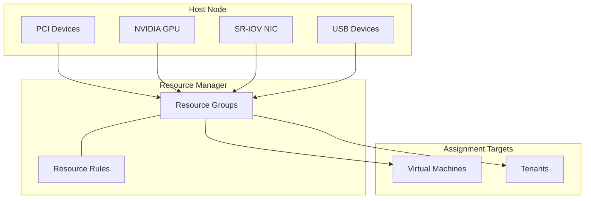

import { Card, CardGrid } from "@astrojs/starlight/components";

## Overview

VergeOS supports multiple forms of device passthrough, allowing virtual machines to directly access physical hardware attached to host nodes. This enables workloads that require bare-metal device access -- GPU-accelerated rendering, AI/ML training, hardware security keys, high-performance networking -- while still benefiting from VergeOS orchestration, snapshots, and multi-tenancy.

All passthrough types share a common architecture built on **resource groups** and **resource rules**, providing a consistent management experience regardless of the device type.

## BIOS Prerequisites

Before configuring any PCI-based passthrough (one-to-one PCI, NVIDIA vGPU, or SR-IOV), the server BIOS must have hardware virtualization and IOMMU support enabled:

| Vendor    | Required Settings                                            |
| --------- | ------------------------------------------------------------ |
| **Intel** | **VT-d** and **VT-x** enabled; **SR-IOV** enabled            |
| **AMD**   | **AMD-Vi / AMD-V** and **IOMMU** enabled; **SR-IOV** enabled |

:::tip
BIOS setting names vary across vendors. Look for terms like _Virtualization Technology_, _PCI Passthrough_, _IOMMU_, or _PCIe ACS_. Consult your hardware vendor documentation if settings are not immediately obvious.
:::

### IOMMU Grouping

All PCI devices within the same **IOMMU group** are passed through together -- a single IOMMU group cannot be split among different guests. Common examples of shared IOMMU groups include:

- A GPU and its companion audio controller
- Both ports of a dual-port NIC
- Multiple devices sharing a PCI riser card on the same slot

You can view IOMMU group membership in the VergeOS UI at **Infrastructure > Resources > PCI Devices**. Click the **IOMMU** column heading to sort and identify grouped devices.

:::caution[Critical Host Devices]
**Never** pass through boot devices, primary system controllers, or core fabric network controllers. Passing through a host-critical device makes it unavailable to the host and can render individual nodes or the entire system unstable. Always verify you have **IPMI or physical console access** before making passthrough changes.
:::

## Resource Groups & Resource Rules

VergeOS uses a two-layer abstraction for all device passthrough:

### Resource Groups

A **resource group** is a named pool of one or more physical (or virtual-function) devices of the same type. When you attach a device to a VM or tenant, you select the resource group -- the system automatically assigns an available device from the pool when the VM powers on.

Resource group types:

- **PCI** -- one-to-one exclusive passthrough
- **NVIDIA vGPU** -- shared virtual GPU slices
- **SR-IOV NIC** -- virtual function network adapters
- **USB** -- USB device passthrough

### Resource Rules

**Resource rules** define the filter criteria that determine which physical devices belong to a resource group. Each rule can match on attributes like device name, vendor, slot, serial number, and more. Available filter fields vary by device type.

| Creation Method    | Description                                                                                         |
| ------------------ | --------------------------------------------------------------------------------------------------- |
| **Auto-generated** | Select a device and click **Make Resource** -- the system creates rules automatically (recommended) |
| **Manual**         | Create rules via **Infrastructure > Resources > Rules > New** with custom filter expressions        |

Filter operators include: Equal, Not Equal, Less/Greater Than, Begins With, Ends With, Contains (case-sensitive or insensitive), and Regex.

## Types of Device Passthrough

### One-to-One PCI Passthrough

One-to-one PCI passthrough dedicates a single physical PCI device to a single VM at a time. The guest operating system sees and controls the device as if it were physically attached.

**Common use cases:** dedicated GPUs for rendering, specialized HBAs, FPGA accelerators, or any device requiring direct hardware access.

#### Configuration Walkthrough

**Host side:**

1. Navigate to **Infrastructure > Resources** (Resource Manager dashboard).
2. Click **PCI Devices** to list all detected devices across nodes.
3. Select the target device(s) and click **Make Resource**.
4. Choose an existing PCI resource group or create a new one (Type: **PCI**).
5. Reboot the associated node(s) if prompted (use **Maintenance Mode** to avoid workload disruption).

**VM side:**

1. Open the target VM dashboard (**Virtual Machines > List > select VM**).
2. Click **Devices > New**.
3. Set Type to **PCI**, select the resource group, and specify the device count.
4. Click **Submit**, then **restart** the VM to attach the device.
5. Install any required guest drivers from the hardware vendor.

:::note[Migration Limitation]
VMs with one-to-one PCI passthrough devices **cannot be live-migrated** between nodes. The VM is pinned to the node where the physical device resides. Plan node maintenance accordingly -- the VM must be shut down and restarted on another node with an equivalent device available in the same resource group.
:::

### NVIDIA vGPU (Virtual GPU)

NVIDIA vGPU technology slices a single physical NVIDIA GPU into multiple virtual GPUs, allowing several VMs to share one piece of GPU hardware simultaneously. This is ideal for VDI deployments, AI/ML inference, and GPU-accelerated applications where full device dedication is not required.

**Key advantages over one-to-one GPU passthrough:**

- Multiple VMs share a single physical GPU
- **Supports live migration (experimental)** -- vGPU VMs can move between nodes without downtime (experimental feature as of 4.13+)
- Flexible sizing through NVIDIA vGPU profiles (varying amounts of framebuffer per VM)

:::caution[Licensing]
NVIDIA GRID licensing is required for vGPU. Obtain licenses from the [NVIDIA Licensing Portal](https://nvidia.com/en-us/data-center/resources/vgpu-evaluation) or register for an evaluation.
:::

:::note[AMD GPUs]
vGPU is an **NVIDIA-only** feature. AMD GPUs are not supported for virtual GPU slicing in VergeOS. AMD GPUs can still be used via one-to-one PCI passthrough.
:::

#### Configuration Walkthrough

**Host side:**

1. Obtain the appropriate **NVIDIA Linux-KVM bundle driver** for your GPU hardware from the NVIDIA licensing portal.
2. Upload the driver bundle to the **VergeOS vSAN** (System > Files or drag-and-drop upload).
3. Navigate to **Infrastructure > Resources** and click **PCI Devices**, then filter for Type = **Display controller** to view compatible physical GPUs.
4. Select the target GPU(s) and click **Make Resource**.
5. Choose an existing NVIDIA vGPU resource group or create a new one (Type: **NVIDIA vGPU**).
6. During resource group creation, select the **vGPU profile** (determines framebuffer allocation per VM).
7. Reboot the associated node(s) if prompted.

:::tip[Checking Supported Drivers]
In the VergeOS UI, navigate to **Resource Manager > Groups > New**, set Type to _NVIDIA vGPU_, and click the button to view compatible third-party drivers. Use the most recent driver compatible with your hardware.
:::

**VM side:**

1. Open the target VM dashboard and click **Devices > New**.
2. Set Type to **NVIDIA vGPU** and select the resource group.
3. Click **Submit** and **restart** the VM.
4. Install the **NVIDIA GRID guest driver** inside the VM (matching the host driver branch).
5. Configure the NVIDIA license server address within the guest OS.

### SR-IOV Virtual Function NICs

Single Root I/O Virtualization (SR-IOV) creates multiple **virtual functions (VFs)** from a single physical, SR-IOV-capable network adapter. Each VF behaves as an independent NIC that can be assigned to a VM, delivering near-native network performance by bypassing the software network stack.

**Common use cases:** latency-sensitive workloads, high-throughput data pipelines, NFV (network function virtualization), and scenarios requiring direct NIC access.

:::note
VergeOS provides built-in virtualized network adapters with full portability, redundancy, and orchestration features. SR-IOV VF NICs bypass VergeOS networking, which means you lose inherent portability, failover, and other managed network features. Use SR-IOV only when direct NIC passthrough is a firm requirement.
:::

#### Configuration Walkthrough

1. Navigate to **Infrastructure > Resources** and click **SR-IOV NICs**.
2. Click **NIC PCI Devices** to list compatible physical devices.
3. Select the target NIC(s) and click **Make Resource**.
4. Create a new SR-IOV resource group (Type: **SR-IOV NIC**) and configure:
   - **Number of VF Devices** per physical device
   - **Native VLAN** tag (optional)
   - **Bandwidth limits** (minimum and maximum transmit Mbps)
   - **Virtual Link State** (Auto, Enable, or Disable)
   - **Spoof Checking**, **Trust**, and **QoS Priority** settings
5. Attach the SR-IOV VF to a VM via **Devices > New > SR-IOV NIC**.
6. Install the appropriate NIC driver inside the guest OS.

### USB Device Passthrough

USB passthrough allows a VM to access a USB device connected to the host as if it were directly attached. This is useful for hardware license dongles, security cameras, keyboards/mice, and other USB peripherals.

#### Configuration Walkthrough

1. Navigate to **Infrastructure > Resources** (or a specific node dashboard).
2. Click **USB Devices** to list detected USB peripherals.
3. Select the target device(s) and click **Make Resource**.
4. Create or select a USB resource group (Type: **USB**).
5. Configure optional settings: **Allow Guest Reset** and **Allow Guest Reset All**.
6. Attach the USB device to a VM via **Devices > New > USB**.

## Passing Devices to Tenants

All four passthrough types (PCI, NVIDIA vGPU, SR-IOV NIC, USB) can be shared down to **tenants**, allowing tenant administrators to assign devices to their own VMs. When devices are passed to a tenant:

- A **new resource group** is automatically created inside the tenant.
- Devices are **thick-provisioned** -- the tenant owns the device(s) exclusively, even when not in use.
- The tenant VM must run on the **tenant node** where the device is attached.

**Walkthrough:**

1. Navigate to the **tenant dashboard** (**Tenants > List > select tenant**).
2. Click **Nodes**, then double-click a tenant node.
3. Click **Devices > New**.
4. Select the device **Type** and configure the count.
5. Click **Submit**. The resource group is now available inside the tenant.

## Passthrough Type Comparison

| Feature             | One-to-One PCI           | NVIDIA vGPU                     | SR-IOV NIC                  | USB                          |
| ------------------- | ------------------------ | ------------------------------- | --------------------------- | ---------------------------- |
| **Sharing**         | 1 device : 1 VM          | 1 GPU : many VMs                | 1 NIC : many VFs            | 1 device : 1 VM              |
| **Live Migration**  | No                       | **Yes (experimental, 4.13+)**   | No                          | No                           |
| **IOMMU Required**  | Yes                      | Yes                             | Yes                         | No                           |
| **Driver Required** | Vendor-specific          | NVIDIA GRID                     | Vendor-specific             | Varies                       |
| **Tenant Support**  | Yes (thick)              | Yes (thick)                     | Yes (thick)                 | Yes (thick)                  |
| **Use Cases**       | Dedicated GPU, FPGA, HBA | VDI, AI/ML inference, rendering | Low-latency networking, NFV | License dongles, peripherals |

## Use Cases & Recommendations

<CardGrid>
  <Card title="VDI & Remote Desktops" icon="laptop">
    Use **NVIDIA vGPU** to share a single GPU across dozens of virtual desktops.
    vGPU profiles let you balance framebuffer allocation per user. Supports live
    migration for zero-downtime maintenance.
  </Card>
  <Card title="AI / ML Training" icon="rocket">
    For dedicated training workloads, use **one-to-one PCI passthrough** to give
    a VM full access to an NVIDIA A100 or H100. For inference or lighter
    workloads, **vGPU** provides efficient sharing.
  </Card>
  <Card title="High-Performance Networking" icon="random">
    **SR-IOV VF NICs** deliver near-native network throughput for
    latency-sensitive applications like real-time analytics, financial trading,
    or network function virtualization.
  </Card>
  <Card title="Hardware Peripherals" icon="setting">
    **USB passthrough** enables VMs to access license dongles, security cameras,
    barcode scanners, and other USB devices as if directly connected.
  </Card>
</CardGrid>

## Key Takeaways

- **Resource groups and resource rules** are the universal mechanism for all device passthrough in VergeOS -- learn them once, apply everywhere.
- **BIOS configuration** (VT-d/VT-x for Intel, AMD-Vi/IOMMU for AMD) is a prerequisite for all PCI-based passthrough.
- **NVIDIA vGPU is the only passthrough type that supports live migration (experimental, 4.13+)** -- making it the preferred choice for GPU workloads that require high availability, though this feature should be validated in your environment before production use.
- **One-to-one PCI passthrough** provides maximum device performance but pins the VM to a specific node.
- **SR-IOV NICs** bypass VergeOS virtual networking for near-native throughput but sacrifice managed network features.
- All device types can be **shared to tenants** via thick provisioning, enabling MSPs to offer GPU or specialized hardware to individual customers.
