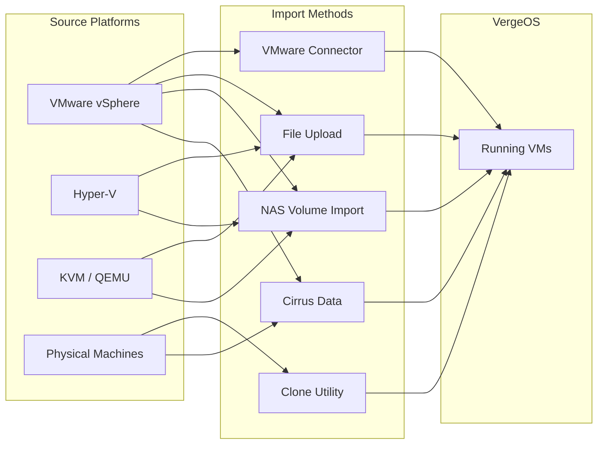

import { Card, CardGrid } from "@astrojs/starlight/components";

## Overview

Migrating existing workloads into VergeOS is one of the most common Day-1 activities for new deployments. Whether you are transitioning from VMware vSphere, Microsoft Hyper-V, KVM/QEMU, or even bare-metal servers, VergeOS provides multiple import paths -- each optimized for different scenarios, VM counts, and downtime tolerances.

This page covers every supported migration method, the file formats VergeOS accepts, pre-migration planning, post-import optimization, and how to export VMs back out of the platform when needed.

## Migration Methods

VergeOS provides five distinct import paths. The right choice depends on your source platform, the number of VMs, and how much downtime you can tolerate.

### VMware Connector (Live Migration)

The **VMware Connector** is the recommended method for production VMware environments. It creates a direct API connection to vSphere and performs full + incremental backups using VMware's **Change Block Tracking (CBT)**.

**How it works:**

1. **Create a VMware Service** in VergeOS -- this establishes a connection to vSphere using admin credentials, DNS/IP, and port 443.
2. **Power on the service** and refresh VMs to discover the source inventory.
3. **Create backup schedules** with tasks for full and differential backups.
4. **Assign schedules to VMs** -- different schedules can apply to different VMs (e.g., production vs. dev/test).
5. **Run initial full backups**, then incremental backups capture only changed blocks via CBT.
6. **Cut over** once incremental backup durations stabilize (indicating minimal data churn), then import VMs from the backup jobs.

**Key capabilities:**

- Live migration from running VMware environments -- source VMs stay operational during transfer
- Incremental backup support via VMware CBT for efficient bandwidth usage
- Batch import of multiple VMs simultaneously
- Configurable concurrent backup count (default: 4)
- Built-in scheduling for ongoing DR/backup of VMware environments
- Imported VMs can be powered on directly in VergeOS from backup data

:::tip[VMware Connector Best Practices]

- Connect to the **vSphere cluster** rather than an individual ESXi host
- Leave "Automatically enable change tracking per VM" **enabled** (the default) to ensure differential backups work correctly
- Include both full and differential backup tasks in your schedule -- full backups weekly, differentials on days in between
- Use full-thick-provisioned backups for long-term retention
  :::

### Import from Uploaded Files

For individual VMs or mixed-platform environments, you can upload VM configuration and disk files directly to the vSAN (VergeFS) and import them.

**Two approaches:**

1. **Full config import** -- Upload both config (VMX, OVF) and disk files (VMDK, VHDX, QCOW2), then select "Import from Files" when creating a new VM. VergeOS reads the config file to auto-populate VM settings.
2. **VM shell + disk import** -- Create a custom VM with the desired specs (CPU, RAM, NICs), then add drives using "Import Disk" and select the uploaded disk files. This is useful when the source config format isn't directly supported (e.g., Hyper-V XML).

**Steps for full config import:**

1. Upload config + disk files to the vSAN via the file manager
2. Navigate to **Virtual Machines → + New VM → Import from Files**
3. Select the configuration file (`.vmx`, `.ovf`) from the available files
4. Optionally customize the VM name and MAC address preservation
5. Select the preferred storage tier
6. Submit -- the VM is created with drives mapped from the disk files

### NAS Volume Import

When VM files are stored on network-accessible storage (NFS or CIFS shares), you can import them directly without uploading to the vSAN first.

**How it works:**

1. Create or use an existing **NAS service** within VergeOS
2. Create a **remote volume** to mount the external NFS/CIFS share
3. Navigate to **Virtual Machines → + New VM → Import from Volume**
4. Select the VM configuration file from the mounted share
5. Monitor progress from the **Import Jobs** dashboard

This method is ideal for batch migrations where VM files are already centralized on a file server or SAN export.

### VergeOS Clone Utility (P2V / V2V)

The Clone Utility provides **block-level migration** for physical-to-virtual (P2V) and virtual-to-virtual (V2V) conversions from any platform.

**How it works:**

1. Download the `vergeOS-clone.iso` from the VergeOS dashboard
2. Boot the source machine (physical or virtual) from the ISO
3. Configure the VM name, MAC address settings, and select disks to include
4. The utility performs a block-level data transfer to the VergeOS environment
5. Once transfer completes, power on the VM in VergeOS

This approach works regardless of the source hypervisor and is particularly useful for physical servers that cannot export to standard VM formats.

### Cirrus Data Integration (Enterprise)

For large-scale enterprise migrations requiring **near-zero downtime**, VergeOS integrates with **Cirrus Data's** Compute Migration and MigrateOps products. This third-party solution supports complex multi-platform migrations with advanced bandwidth management and professional services.

## Supported File Formats

VergeOS supports a wide range of VM disk and configuration formats:

| Format           | Source Platform    | Description                           |
| ---------------- | ------------------ | ------------------------------------- |
| **VMX / VMDK**   | VMware             | Native VMware config and disk files   |
| **OVF / OVA**    | VMware, VirtualBox | Open Virtualization Format (standard) |
| **VHD / VHDX**   | Hyper-V            | Microsoft virtualization formats      |
| **QCOW / QCOW2** | QEMU, KVM          | QEMU copy-on-write disk images        |
| **VDI**          | VirtualBox         | VirtualBox disk images                |
| **IMG / RAW**    | Various            | Raw disk image formats                |

## Choosing the Right Method

<CardGrid>
  <Card title="VMware Connector" icon="rocket">
    Production VMware environments where source VMs must stay running during
    migration. Leverages CBT for efficient incremental transfers.
  </Card>
  <Card title="File Upload" icon="document">
    Individual VMs from any platform. Maximum control over the import process.
    Best when source VMs can be shut down for export.
  </Card>
  <Card title="NAS Volume Import" icon="open-book">
    Batch imports from network storage. VM files already on NFS/CIFS shares. No
    upload step needed.
  </Card>
  <Card title="Clone Utility" icon="setting">
    Physical-to-virtual (P2V) migrations. Cross-platform V2V from any
    hypervisor. Block-level efficiency.
  </Card>
</CardGrid>

## Pre-Migration Planning

### Source Environment Preparation

Before migrating, prepare the source environment:

- **Document VM specifications** -- CPU count, RAM, disk sizes, network settings, VLAN assignments
- **Remove hypervisor-specific tools** -- Uninstall VMware Tools, Hyper-V Integration Services, or equivalent agents
- **Clean shutdown** for offline imports -- ensures filesystem consistency
- **Verify network connectivity** between source and VergeOS environments (especially for VMware Connector and NAS imports)

### VergeOS Environment Preparation

- **Verify storage capacity** across appropriate tiers for incoming VM disks
- **Configure network segments** to match source environment VLANs
- **Plan IP address assignments** and DNS configurations
- **Review guest OS compatibility** -- VergeOS supports Windows, Linux, BSD, and other operating systems via KVM

### Network Remapping

Source VMs are typically connected to VMware vSwitches, Hyper-V virtual switches, or Linux bridges. In VergeOS, these map to **internal networks**:

| Source Concept            | VergeOS Equivalent      |
| ------------------------- | ----------------------- |
| VMware vSwitch / dvSwitch | Internal Network        |
| Hyper-V Virtual Switch    | Internal Network        |
| Linux Bridge              | Internal Network        |
| VLAN-tagged Port Group    | Internal Network + VLAN |

After import, you will connect each VM's NIC(s) to the appropriate VergeOS internal network. If you preserve MAC addresses during import, DHCP reservations carry over automatically.

## Post-Import Optimization

### Install VirtIO Drivers

VirtIO provides the best disk and network performance in VergeOS. After importing a VM:

- **Windows:** Download and install the `virtio-win` guest tools ISO. Attach it as a virtual CD-ROM, then install the drivers.
- **Linux:** Most modern distributions include VirtIO drivers natively -- no additional installation needed.

:::tip[Boot Issue Workaround]
If a VM fails to boot after import, change the disk interface from **VirtIO-SCSI** to **SATA** or **IDE**. Once the OS boots, install VirtIO drivers, then switch back to VirtIO-SCSI for optimal performance.
:::

### Virtual Hardware Mapping

Imported VMs may need adjustments to align with VergeOS virtual hardware:

- **Disk interfaces** -- Switch from IDE/SATA to VirtIO-SCSI after driver installation
- **NIC model** -- VirtIO-net provides the best throughput
- **Display adapter** -- QXL or VGA for console access
- **EFI vs. BIOS** -- Ensure the firmware type matches the source VM configuration
- **Secure Boot** -- Supported for UEFI-based VMs; verify the setting matches source

### Additional Steps

1. **Verify network connectivity** and IP assignments
2. **Update DNS and DHCP** reservations as needed
3. **Install the QEMU Guest Agent** for enhanced monitoring, graceful shutdown, and quiesced snapshots
4. **Configure backup policies** using VergeOS native snapshots
5. **Test application functionality** end-to-end before decommissioning source VMs

## Exporting VMs from VergeOS

VergeOS supports two export mechanisms for portability and third-party backup integration.

### Direct Disk Download

Individual VM disks can be downloaded in **.raw** format directly from the VergeOS UI:

1. Navigate to the VM dashboard → **Drives**
2. Select the drive → **Download**
3. The disk downloads as a `.raw` file, compatible with most hypervisors
4. Convert to the destination format (`.qcow2`, `.vmdk`, etc.) using tools like `qemu-img convert`

### VM Export Volume (NAS-Based)

For scheduled, automated exports of multiple VMs, VergeOS provides a dedicated **VM Export Volume** in the NAS service:

1. **Enable "Allow Export"** on each VM you want to include
2. **Create a NAS volume** with the filesystem type set to **Verge.io VM Export**
3. Choose the export configuration format:
   - **Verge.io Virtual Machine (.ybvm)** -- VergeOS-native JSON-based format
   - **Open Virtualization Format (.ovf)** -- Industry-standard, compatible with third-party platforms
4. **Run the export** manually or schedule it via the task engine
5. **Access exported data** via CIFS or NFS shares, or synchronize to external storage using volume syncs

Each export creates a timestamped folder with VM snapshots. A "current" folder always points to the latest export, providing a stable path for external backup tools.

:::note[Coming from VMware or Nutanix?]
Both migration paths are built into the platform — no separate appliance, no third-party converter.

| Source | Path | Notes |
| --- | --- | --- |
| VMware vSphere | **VMware Connector** — direct API migration with CBT-based incremental backups | vSwitch/dvSwitch port groups → VergeOS internal networks. VMDKs import directly. Replaces vCenter Converter, HCX, V2V. |
| Nutanix AHV | **File upload or NAS volume import** | Export VMs from Prism as QCOW2, upload to vSAN, run "VM shell + disk import." VLAN-based networks → VergeOS internal networks. No Move appliance required. |
| Return path | **VM Export Volume** producing OVF | Stable "current" folder for external backup tools or moving VMs back to vSphere. |
:::

## Troubleshooting Common Issues

| Symptom                            | Likely Cause                   | Resolution                                                                                  |
| ---------------------------------- | ------------------------------ | ------------------------------------------------------------------------------------------- |
| VM won't boot after import         | Missing VirtIO drivers         | Switch disk interface to SATA/IDE, boot, install VirtIO drivers, switch back                |
| Windows "Inaccessible Boot Device" | Disk controller mismatch       | Change from VirtIO-SCSI to SATA, install drivers, then revert                               |
| No network connectivity            | NIC driver or network mapping  | Verify VirtIO-net drivers are installed; check NIC is connected to correct internal network |
| Slow disk performance              | Using IDE/SATA interface       | Install VirtIO drivers and switch to VirtIO-SCSI                                            |
| EFI boot failure                   | Firmware type mismatch         | Ensure VM is set to UEFI if the source used EFI; check Secure Boot settings                 |
| VMware Connector shows "Error"     | Connection or credential issue | Verify vSphere IP/DNS, port 443 access, admin credentials, and SSL certificate settings     |

## Summary

VergeOS makes workload migration straightforward with five distinct import paths covering every source platform and migration scenario. The VMware Connector handles live production migrations with minimal downtime, file uploads provide maximum flexibility for mixed environments, NAS volume imports enable batch operations, the Clone Utility handles P2V conversions, and Cirrus Data integration supports enterprise-scale projects. Combined with broad file format support and the VM Export Volume for outbound portability, VergeOS ensures that workload mobility is never a barrier to adoption.
