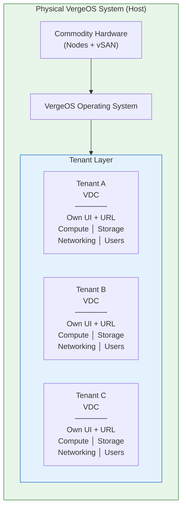
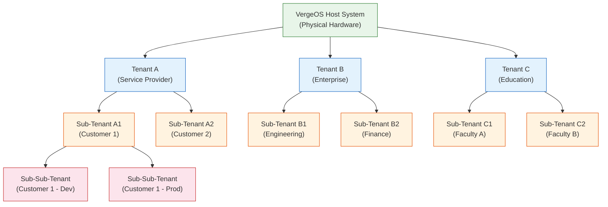

import { Card, CardGrid } from "@astrojs/starlight/components";

## What is a Tenant?

A **tenant** in VergeOS is a complete **Virtual Data Center (VDC)** -- a fully self-contained environment that includes all the functionality of a base VergeOS system, excluding physical hardware management. Each tenant is essentially a "data center within a data center," providing an isolated environment for different users, organizations, or workloads.

Every tenant operates independently with its own:

- **Management UI** accessible via a unique URL
- **Compute resources** (CPU cores and RAM)
- **Storage allocation** from the parent vSAN
- **Network stack** with full L2/L3 isolation
- **User management** with local accounts or federated identity
- **Backup and DR** with individualized snapshot schedules

Unlike traditional multi-tenancy approaches that rely on logical separation (VLANs, resource pools, or RBAC boundaries), VergeOS tenants provide **true architectural isolation** -- each tenant is a fully encapsulated environment with its own networking, storage volumes, and administrative boundary.

:::note[VMware Bridge]
VMware multi-tenancy stitches together **vRealize/Aria Automation**, **NSX micro-segmentation**, and **resource pools** in a shared vCenter — three products, three licenses. In VergeOS, each tenant gets the equivalent of its own vCenter, ESXi cluster, vSAN, and NSX inside a single OS, with no add-on licensing.
:::

:::note[Nutanix Bridge]
Nutanix uses **Prism Self-Service** and **Projects** in Prism Central for RBAC, quotas, and resource isolation, but tenants share the AOS management plane — isolation is logical, not architectural. In VergeOS, each tenant runs as a fully isolated VDC with its own networking stack, storage allocation, and management interface.
:::

## Architectural vs. Logical Isolation

The fundamental difference between VergeOS tenancy and competing approaches is the level of isolation provided. Most platforms offer **logical isolation** -- RBAC policies, network policies, and resource quotas that separate tenants within a shared management plane. VergeOS delivers **architectural isolation** through two key mechanisms:

### Network Encapsulation

Every tenant receives complete **Layer 2/Layer 3 network encapsulation**. When a new tenant is created, VergeOS automatically provisions:

- A **DMZ network** that serves as the connection point for all of the tenant's networks
- A **Core network** for internal management communication
- The ability to create unlimited **internal networks** with their own subnets, DHCP, DNS, firewall rules, and routing

Tenant network traffic is fully encapsulated and isolated from other tenants and from the host system. This is fundamentally different from VLAN-based segmentation, where misconfiguration can expose traffic between tenants.

### Exclusive Storage Volumes

Each tenant receives **dedicated storage volumes** allocated from the parent vSAN. Storage isolation ensures that:

- Tenant data is completely segregated at the volume level
- Encryption can be applied per-tenant
- Storage performance boundaries prevent noisy-neighbor effects
- Per-tenant deduplication statistics enable accurate capacity tracking and billing

Together, network encapsulation and exclusive storage volumes provide **true isolation** -- not just policy-based separation, but architectural boundaries that prevent cross-tenant access by design.

## Tenant Hierarchy

VergeOS supports a **hierarchical tenant model** with two key levels:

### Provider / Host Level

The **host system** (also called the provider or parent) is the physical VergeOS installation that owns the hardware. The host system administrator has full control over:

- Physical hardware management (nodes, drives, NICs)
- Resource allocation to tenants (CPU, RAM, storage tiers)
- Tenant creation, cloning, and lifecycle management
- System-wide snapshots that include all tenants
- Monitoring and oversight of all tenant environments

### Tenant Level

Each **tenant** operates as an independent VDC. Tenant administrators can manage everything within their allocated resources:

- Virtual machines, networks, and storage within their allocation
- Users and permissions (local accounts or federated identity)
- Snapshots and DR within their own environment
- Custom branding and themes (if permitted by the parent)

### Nested Multi-Tenancy (Sub-Tenants)

VergeOS supports **nested multi-tenancy**: each tenant can create **sub-tenants** from its own allocated resources, building a hierarchy that supports complex organizational and service requirements.

For example, a service provider (Tenant A) can create customer tenants (Sub-Tenants A1, A2), and those customers can further subdivide their environments into dev/prod sub-tenants. Each level maintains full isolation and independent management.

## Key Features per Tenant

Every tenant in VergeOS receives the same set of capabilities — each VDC is a fully functional environment:

<CardGrid>
  <Card title="Management UI & URL" icon="laptop">
    Each tenant has its own web-based management interface accessible via a
    unique URL. Tenant admins can manage all resources, VMs, networks, and
    settings through this dedicated interface -- no shared management plane.
  </Card>
  <Card title="User Management" icon="setting">
    Tenants support flexible identity management: local user accounts,
    authentication through the parent system, third-party identity providers
    (OAuth2/OIDC such as Okta, Azure AD/Entra, Google), or a combination. MSPs
    can centralize login across all tenant environments.
  </Card>
  <Card title="Resource Tracking & Billing" icon="document">
    Per-tenant resource tracking includes CPU, RAM, storage consumption, and
    deduplication statistics. Usage reports facilitate billing, auditing, and
    capacity planning -- critical for service providers who bill per-tenant.
  </Card>
  <Card title="Backup & Disaster Recovery" icon="rocket">
    DR protocols can be customized per tenant. Each tenant can control their own
    snapshot and retention schedules, while the host system's snapshots also
    capture all tenants for system-wide recovery.
  </Card>
  <Card title="Portability" icon="open-book">
    Each tenant is a portable, self-contained system. An entire VDC -- including
    all VMs, networks, storage, and configuration -- can be snapshotted,
    replicated via site sync, or moved to a different VergeOS installation as a
    single unit.
  </Card>
  <Card title="Custom Branding & Themes" icon="star">
    Parent systems can permit tenants to brand their UI with custom company
    logos, color schemes, and font selections using VergeOS Themes. This is
    especially valuable for MSPs who want to provide white-label services.
  </Card>
</CardGrid>

| Feature                  | Description                                               |
| ------------------------ | --------------------------------------------------------- |
| **Management UI**        | Dedicated web interface per tenant with unique URL        |
| **User Management**      | Local, parent-delegated, or third-party IdP (OIDC/OAuth2) |
| **Resource Tracking**    | Per-tenant CPU, RAM, storage, and dedup statistics        |
| **Backup/DR**            | Individualized snapshot schedules and retention policies  |
| **Portability**          | Entire VDC can be snapshotted, replicated, or relocated   |
| **Custom Branding**      | Themes with logos, colors, and fonts (parent-controlled)  |
| **Automated Deployment** | Tenant Recipes for rapid, standardized provisioning       |
| **Networking**           | Full SDN stack with firewall, NAT, DHCP, DNS per tenant   |

## Use Cases

VergeOS multi-tenancy serves a wide range of deployment scenarios:

### Service Provider / MSP

Cloud Service Providers (CSPs) and Managed Service Providers (MSPs) use VergeOS tenancy to deliver **multi-tenant IaaS** with:

- **Customer isolation** -- each customer gets a fully isolated VDC with their own UI, users, and resources
- **Per-tenant billing** -- resource tracking and usage reports enable accurate billing per customer
- **Self-service portals** -- customers manage their own VMs, networks, and storage through their dedicated UI
- **Scalability** -- start with 2-node edge clusters and scale out as demand grows, adding nodes and clusters without disruption
- **Nested tenancy** -- customers can create their own sub-tenants for departmental or project-level isolation
- **Tenant Recipes** -- automate standardized VDC provisioning for rapid customer onboarding

### Enterprise

Enterprises use tenants to segment infrastructure while maintaining centralized management:

- **Department/team segmentation** -- Engineering, Finance, HR each get isolated environments
- **Dev/Test/Prod isolation** -- separate environments prevent accidental cross-contamination
- **Regulatory compliance** -- tenant isolation helps meet data residency and access control requirements
- **Resource governance** -- allocate and track resources per business unit

### Education

Educational institutions benefit from tenant isolation for:

- **Faculty/research environments** -- each department or research group gets a dedicated VDC
- **Student lab environments** -- isolated, reproducible lab environments that can be provisioned and torn down rapidly
- **Eliminating infrastructure silos** -- replace standalone lab systems with centrally managed tenants

### Disaster Recovery & Portability

VergeOS tenants are inherently portable, enabling DR patterns such as:

- **Entire VDC replication** -- snapshot and replicate a complete tenant (VMs, networks, storage, config) to a remote site
- **Tenant migration** -- move a tenant between VergeOS installations as a single unit
- **Rapid recovery** -- restore a tenant from a system snapshot to recover from disasters or accidental changes
- **Site sync** -- continuous replication of tenant environments between geographically distributed sites

## How Tenants Differ from Traditional VMs

It is important to understand that a VergeOS tenant is **not** simply a virtual machine. While VMs provide compute isolation, a tenant provides a complete **infrastructure isolation boundary**:

| Aspect          | Virtual Machine          | VergeOS Tenant (VDC)                     |
| --------------- | ------------------------ | ---------------------------------------- |
| **Scope**       | Single workload          | Complete data center                     |
| **Networking**  | NIC(s) on shared network | Full SDN stack (DMZ, internal, external) |
| **Storage**     | Virtual disk(s)          | Dedicated storage volumes from vSAN      |
| **Management**  | Managed by host admin    | Independent admin UI + users             |
| **Nesting**     | N/A                      | Can create sub-tenants                   |
| **Portability** | Single VM migration      | Entire environment as one unit           |
| **Identity**    | Host-level auth only     | Independent IdP / OIDC                   |

## Summary

VergeOS multi-tenancy is built into the platform — not a bolt-on product or configuration overlay. Each tenant is a complete Virtual Data Center with architectural isolation (network encapsulation + exclusive storage volumes), a dedicated management interface, independent user management, and full portability. The hierarchical tenant model supports unlimited nesting, enabling service providers, enterprises, and educational institutions to build multi-tenant environments with true isolation at every level.

In the next section, we will walk through the practical steps of creating and configuring tenants using the VergeOS UI.
