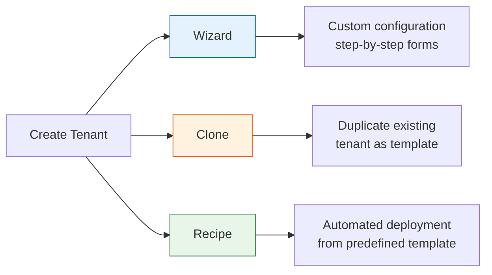
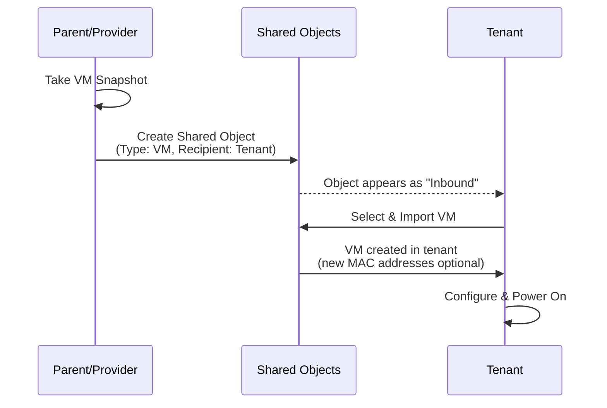

import { Card, CardGrid } from "@astrojs/starlight/components";

## Tenant Creation Methods

VergeOS provides three methods for creating new tenants, each suited to different scenarios:

| Method     | Best For                             | Key Characteristics                                                                   |
| ---------- | ------------------------------------ | ------------------------------------------------------------------------------------- |
| **Wizard** | One-off or unique tenants            | Step-by-step forms for settings, nodes, storage, and UI management                    |
| **Clone**  | Duplicating an existing tenant       | Creates a copy of a running or stopped tenant for testing, dev, or rapid provisioning |
| **Recipe** | Standardized, repeatable deployments | Automated provisioning from a predefined template with customizable input fields      |

All three methods are accessed from the same starting point: **Tenants > + New Tenant** in the VergeOS UI.

## Tenant Wizard Walkthrough

The Tenant Wizard guides you through multiple input forms to create a fully custom tenant. This is the most common method for creating your first tenants or building one-off environments.

### Step 1: Tenant Settings Form

1. Navigate to **Tenants** from the top menu
2. Click **+ New Tenant**
3. Select **From Wizard** at the top left, then click **Next**

The Tenant Settings form presents the following fields:

| Field                       | Description                                                                                                                                                        | Required |
| --------------------------- | ------------------------------------------------------------------------------------------------------------------------------------------------------------------ | -------- |
| **Name**                    | Display name for the tenant                                                                                                                                        | Yes      |
| **URL**                     | Link to the tenant UI -- auto-populated when the first external IP is assigned                                                                                     | No       |
| **Admin User Password**     | Password for the auto-created "admin" root user                                                                                                                    | Yes      |
| **Require Password Change** | Forces the tenant admin to change password on first login                                                                                                          | No       |
| **Description**             | Additional notes or metadata about the tenant                                                                                                                      | No       |
| **Expose System Snapshots** | Allows the tenant to browse parent system snapshots and self-serve download their own tenant snapshot from the provider's snapshot timestamps (enabled by default) | No       |
| **Theme Access**            | Controls whether the tenant can create themes and/or access host themes                                                                                            | No       |
| **Custom Help URL**         | Redirects tenant help links to an alternate documentation site                                                                                                     | No       |
| **OIDC Application**        | Defines an authorization source for the tenant (from parent-defined OIDC apps)                                                                                     | No       |

The **Theme Access** options control branding capabilities:

- **Cannot create new themes, read-only access to all host themes** -- tenant can use but not modify host themes
- **Cannot create new themes, read-only access to specified host themes** -- tenant can only see selected themes
- **Can create new themes, no access to host themes** -- tenant creates their own branding from scratch
- **Can create new themes, read-only access to host themes** -- full flexibility with host themes as reference

### Step 2: New Tenant Node Form

This form configures the initial tenant node. Additional tenant nodes can be added after the wizard completes.

| Field                | Description                                            | Notes                                                    |
| -------------------- | ------------------------------------------------------ | -------------------------------------------------------- |
| **Cores**            | Number of CPU cores allocated to the tenant node       | Size based on expected workloads                         |
| **RAM**              | Amount of memory allocated to the tenant node          | Size based on expected workloads                         |
| **Cluster**          | Physical cluster to run the tenant node                | Leave at --Default-- unless targeting a specific cluster |
| **Failover Cluster** | Cluster to use if the primary is unavailable           | Leave at --Default-- for standard deployments            |
| **Preferred Node**   | Pin the tenant node to a specific physical node        | **Not recommended** -- can adversely affect redundancy   |
| **On Power Loss**    | Behavior when the host system recovers from power loss | **Last State** (default), **Leave Off**, or **Power On** |

:::caution
Setting a **Preferred Node** is an advanced configuration that can break built-in HA redundancy. Consult VergeOS Support before using this option.
:::

### Step 3: New Tenant Storage Form

| Field                | Description                                                    |
| -------------------- | -------------------------------------------------------------- |
| **Tier**             | Which vSAN storage tier to use for the tenant's storage volume |
| **Storage Capacity** | Amount of storage to provision for the tenant                  |

The tenant receives a dedicated storage volume from the selected tier. This volume provides exclusive storage isolation -- tenant data is completely segregated at the volume level.

### Step 4: UI Management Form

The final step optionally assigns an external IP address to the tenant, enabling access to the tenant's management UI.

1. Select an IP from the **Assign External IP** dropdown (lists all unassigned Virtual IPs in the parent)
2. If no suitable IP exists, click **Create a new External IP** to define one:
   - **Network** -- select the appropriate external network
   - **Type** -- Virtual IP
   - **IP Address** -- enter the address or leave blank to auto-assign the next available
   - **Owner** -- name of the new tenant
3. Click **Submit** to complete tenant creation

:::tip
An "external IP" is any address external to the VergeOS system -- it may be a public internet address or a private address on your external LAN/WAN (e.g., `10.10.10.100`).
:::

After creation, the tenant dashboard appears. Click **Power On** from the left menu to start the tenant. If external IPs were assigned, click the orange **Needs Apply Rules** message to apply the necessary network rules.

## Tenant Cloning

Cloning creates a duplicate of an existing tenant, making it useful for testing, development, restores, and rapid provisioning scenarios.

### Clone Walkthrough

1. Navigate to **Tenants > + New Tenant**
2. Select **Clone Existing** at the top left
3. Select the source tenant from the **Selections Available** list, then click **Next**
4. Modify the **Name** as needed (defaults to `<SourceName> clone`)
5. Optionally select **Clone as New Tenant** to strip history, statistics, logs, and expired snapshots from the clone
6. Click **Submit**

The cloned tenant appears on its own dashboard, ready to be powered on.

### Cloning Considerations

:::caution
When cloning tenants, be aware of potential conflicts:

- **MAC addresses** -- cloned VMs receive the same MAC addresses as the original. Running both on the same Layer 2 network causes conflicts
- **IP addresses** -- static IP configurations will be duplicated, causing conflicts if both tenants share the same external network
- **Application instances** -- services like Active Directory, DNS, or DHCP may conflict if both the original and clone are active simultaneously

The **Clone as New Tenant** option is recommended when history and logs from the source tenant are not needed, as it creates a cleaner starting point.
:::

## Tenant Modifications

After a tenant is created, its configuration can be modified from the tenant dashboard:

- **Add tenant nodes** -- scale compute by adding additional tenant nodes with their own core/RAM allocations
- **Adjust storage** -- increase (or decrease) the tenant's storage allocation
- **Modify settings** -- change the tenant name, description, admin password, theme access, OIDC configuration, and other settings
- **Manage networks** -- create additional internal networks, adjust firewall rules, and configure routing within the tenant

All modifications are performed from the parent system's view of the tenant dashboard or from within the tenant's own management UI.

## Assigning External IP Addresses

External IP addresses provide tenants with connectivity to networks outside the VergeOS system -- whether that is the public internet or a private WAN/LAN. When an external IP is assigned, appropriate routing rules are created automatically.

### Assigning a Single IP

**From the host/parent system:**

1. Navigate to **Networks > External** (your root external network)
2. Click **IP Addresses** in the left menu
3. Click **New** and configure:
   - **Type:** Virtual IP
   - **IP Address:** Enter the external address (e.g., `203.0.113.50`)
   - **Owner Type:** Tenant
   - **Owner:** Select the target tenant
4. Click **Submit**
5. Return to the external network dashboard and click **Apply Rules**

**From within the tenant:**

1. Log into the tenant UI
2. Navigate to **Networks > External**
3. The assigned IP appears in the **IP Addresses** list with the description "External IP from service provider"
4. Click **Apply Rules** on the tenant's external network

### Using Network Blocks

For tenants that need multiple external IPs, **Network Blocks** assign a group of IPs as a single unit:

1. Navigate to the root **External** network
2. Click **Network Blocks** from the left menu
3. Click **New** and enter the block in CIDR format (e.g., `203.0.113.48/29`)
4. Set **Owner Type** to Tenant and select the tenant
5. Click **Submit**

:::note
Network Blocks require a minimum of 4 IPs (/30) to deliver 1 usable address, since the block uses network address, gateway, and broadcast address overhead. A /29 block (8 IPs) provides 5 usable addresses.
:::

## Sharing Files to Tenants

Service providers can share files (ISO images, media files, disk images) from the parent system directly into a tenant's **Files** section. This uses an efficient branch operation on the vSAN, making it nearly instantaneous regardless of file size.

### Share a File

1. Navigate to **Tenants > List** and double-click the target tenant
2. Click **Add File** in the left menu
3. Select the **File Type** from the dropdown (or select **ALL** to see every available file, including `.raw` disk images)
4. Choose the specific file from the dropdown
5. Click **Submit**

The file is immediately available within the tenant's **Files** section. Because this operation uses a vSAN branch (similar to a snapshot reference), it does not duplicate the data on disk -- it simply provides the tenant with a reference to the existing blocks.

## Sharing VM Snapshots

The **Shared Objects** feature provides snapshot-based VM sharing between a provider and tenant (or vice versa). Either party can make a specific VM snapshot available to the other to create a new VM within their own system.

### From the Sending System

1. Navigate to the VM dashboard of the VM you want to share
2. Power down the VM gracefully (best practice)
3. Expand **Snapshots** in the left menu and click **Take Snapshot**
4. Provide a **Name** and **Expiration Date**, then click **Submit**
5. Navigate to **System > Shared Objects**
6. Click **New** and configure:
   - **Name** -- identifier for the shared object (becomes the imported VM name)
   - **Type** -- Virtual Machine
   - **Snapshot** -- select the VM snapshot you created
   - **Recipient** -- select the target tenant (or service provider)
7. Click **Submit**

### From the Receiving System

1. Navigate to **System > Shared Objects**
2. Inbound shared objects appear in the list
3. Select the desired VM and click **Import**
4. Optionally uncheck **Preserve MAC Addresses** if the source VM will remain active (prevents MAC conflicts)
5. Optionally select a **Preferred Tier** for the new VM's drives
6. Click **Submit** to complete the import

The imported VM appears in the tenant's VM list, ready to be configured and powered on.

:::note[Coming from VMware or Nutanix?]
VergeOS Shared Objects let provider and tenant exchange VMs by reference — no full disk copies, and the same mechanism works in both directions.

| Platform | How VMs cross resource boundaries |
| --- | --- |
| VMware | OVF/OVA export+import, Content Libraries for cross-vCenter sharing, or Aria Automation catalog items. Usually copies full disks. |
| Nutanix | Image Service in Prism Central + Marketplace via Calm/Self-Service. Cross-cluster sharing needs image replication or Calm blueprints. |
| VergeOS | Snapshot the VM, create a Shared Object scoped to the recipient tenant. Bidirectional, references existing vSAN blocks (no copy). |
:::

## Summary

VergeOS provides flexible tenant creation through three methods -- the **Wizard** for custom one-off tenants, **Cloning** for duplicating existing environments, and **Recipes** for automated standardized deployments. After creation, tenants can be configured with external IP addresses for network connectivity, shared files for media and images, and shared VM snapshots for workload distribution. Each of these operations leverages VergeOS's native vSAN architecture for efficiency, and the tenant's architectural isolation ensures that all shared resources are properly segregated once imported into the tenant's own environment.

In the next section, we will explore **Tenant Recipes** -- the automation framework that enables rapid, standardized VDC provisioning at scale.
