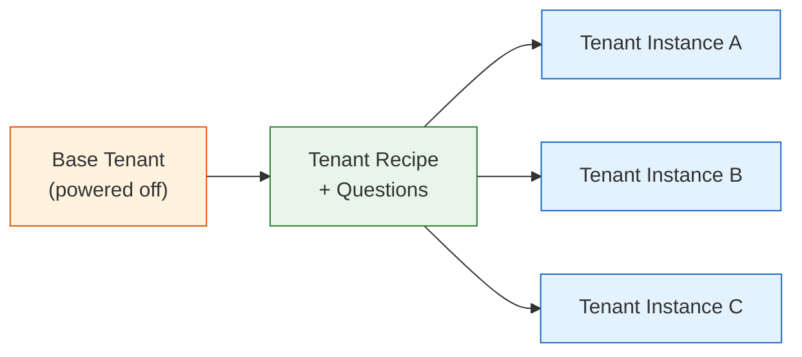
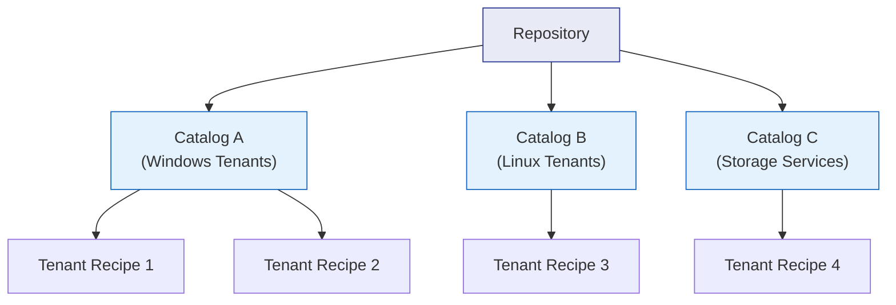

import { Card, CardGrid } from "@astrojs/starlight/components";

## What Are Tenant Recipes?

Tenant recipes transform a manually configured tenant into a **reusable, one-click deployment template**. A single tenant recipe can automate the creation of a complete Virtual Data Center — including tenant settings, networking configuration, firewall rules, included virtual machines, randomized credentials, DNS/DHCP registration, and email notifications — all from a single form submission.

Where the Tenant Wizard (covered in the previous page) guides you through a one-time manual configuration, recipes **codify** that configuration so it can be repeated hundreds of times with per-instance customizations.

### Why Use Tenant Recipes?

<CardGrid>
  <Card title="Rapid Deployment" icon="rocket">
    Reduce tenant provisioning from hours of manual configuration to minutes of
    automated deployment.
  </Card>
  <Card title="Consistency & Compliance" icon="approve-check">
    Every tenant instance follows the same golden-image baseline — networking,
    firewall rules, VMs, and policies are identical.
  </Card>
  <Card title="Reduced Human Error" icon="warning">
    Automation eliminates misconfigurations that creep in during repetitive
    manual setup.
  </Card>
  <Card title="Self-Service Enablement" icon="setting">
    Combined with the API, recipes power customer-facing portals where end users
    provision their own VDCs.
  </Card>
</CardGrid>

## Preparing the Base Tenant

Every tenant recipe starts with a **base tenant** that serves as the template. This tenant must be:

1. **Powered off** — the recipe system captures the tenant's state, so it must not be running
2. **Dedicated to recipe use** — do not use a production tenant as a base. If you want to base a recipe on an existing tenant, clone it first and strip out customer-specific data (passwords, usernames, customer files)
3. **Fully configured** — include all networks, VMs, firewall rules, DHCP/DNS settings, and any other configuration that should appear in every instance

Think of the base tenant as a **golden image** for an entire data center, not just a single VM.

## Creating a Tenant Recipe

### Step-by-Step Process

1. Build and configure the base tenant with all desired settings, networks, and VMs
2. Power off the base tenant
3. Navigate to **Repositories > Tenant Recipes** in the VergeOS UI
4. Click **New** on the left menu
5. Configure the recipe fields (see below)
6. Click **Submit** to save — the recipe dashboard opens for question customization

### Recipe Fields

| Field                    | Description                                         | Notes                                                                                                                 |
| ------------------------ | --------------------------------------------------- | --------------------------------------------------------------------------------------------------------------------- |
| **Name**                 | Descriptive name for the recipe                     | Helps users locate the right recipe when multiple are available                                                       |
| **Description**          | Optional documentation for the recipe               | Good place for usage guidelines, intended purpose, and compliance notes                                               |
| **Icon**                 | Optional Font Awesome icon                          | Visual identifier to distinguish recipe types (e.g., `fa-cloud`, `fa-database`)                                       |
| **Catalog**              | The catalog in which to store the recipe            | Catalogs organize recipes within repositories — see [Recipe Exchange](#recipe-exchange-sharing-between-systems) below |
| **Tenant**               | The base tenant to use as the template              | Must be powered off                                                                                                   |
| **Version**              | Auto-incrementing version number                    | Starts at `1.0.0`, increments to `1.0.0-1`, `1.0.0-2`, etc. Can be manually set to `2.0.0` for major changes          |
| **Preserve SSL Certs**   | Copy SSL certificates from base tenant to instances | Enable when the base tenant has pre-installed certificates                                                            |
| **Version Dependencies** | VergeOS feature requirements                        | Prevents remote systems from using a recipe they cannot accommodate                                                   |

## Recipe Questions

Questions are the heart of a tenant recipe. They capture per-instance input from the operator (or from the VergeOS database) and inject those values into the new tenant during creation.

When you create a tenant recipe, VergeOS **automatically generates system questions** organized into sections. Many system questions are disabled by default and must be explicitly enabled if needed. System questions cannot be deleted — only enabled or disabled.

### Question Fields

Every question — system or custom — is configured with these fields:

| Field                | Purpose                                                                                       |
| -------------------- | --------------------------------------------------------------------------------------------- |
| **Section**          | Groups questions on the input form (some created automatically, custom sections can be added) |
| **Name**             | Variable name referenced in scripts — alphanumeric only, no spaces or special characters      |
| **Type**             | How data is collected — user input field, database lookup, hidden value, etc.                 |
| **Order ID**         | Display order within the section                                                              |
| **Display**          | Label shown on the user input form                                                            |
| **Default Value**    | Pre-populated answer (optional)                                                               |
| **Regex Validation** | Regular expression for input validation (optional)                                            |
| **Placeholder Text** | Greyed hint text showing expected input format (optional)                                     |
| **Tooltip Text**     | Hover popup with help text (optional)                                                         |
| **Note Text**        | Help text displayed directly below the input field (optional)                                 |
| **On Change**        | JavaScript to show/hide other questions based on this field's value (optional)                |

### System Questions Reference

The following tables document the built-in system questions generated for every tenant recipe.

#### Tenant Section

Core tenant identity, admin credentials, and SSL configuration:

| Variable Name               | Display Label           | Type          | Default     | Enabled by Default |
| --------------------------- | ----------------------- | ------------- | ----------- | ------------------ |
| `YB_URL`                    | URL                     | String        | —           | Yes                |
| `YB_DESCRIPTION`            | Description             | Text Area     | —           | Yes                |
| `YB_USER_NAME`              | Admin User              | String        | `admin`     | Yes                |
| `YB_USER_PASSWORD`          | Password                | Password      | —           | Yes                |
| `YB_USER_EMAIL`             | Email                   | String        | —           | No                 |
| `YB_USER_CHANGE_PASSWORD`   | Require Password Change | Boolean       | `false`     | No                 |
| `YB_EXPOSE_CLOUD_SNAPSHOTS` | Expose System Snapshots | Boolean       | `true`      | No                 |
| `YB_HELP_URL`               | Help URL                | String        | `default`   | No                 |
| `YB_THEME_ACCESS`           | Theme Access            | List          | `host_only` | Yes                |
| `YB_SPECIFIED_THEME`        | Theme                   | Row Selection | —           | Yes                |
| `YB_CLUSTER`                | Cluster                 | Cluster       | —           | No                 |
| `YB_CERT_TYPE`              | SSL Certificate Type    | Hidden        | `manual`    | No                 |
| `YB_CERT_DOMAIN`            | SSL Certificate Domain  | String        | —           | No                 |
| `YB_CERT_PUBLIC`            | Public SSL Certificate  | Text Area     | —           | No                 |
| `YB_CERT_PRIVATE`           | Private SSL Certificate | Text Area     | —           | No                 |
| `YB_CERT_CHAIN`             | SSL Certificate Chain   | Text Area     | —           | No                 |

#### Nodes Section

Compute resources allocated to the tenant's virtual node(s):

| Variable Name                | Display Label           | Type    | Default | Enabled by Default |
| ---------------------------- | ----------------------- | ------- | ------- | ------------------ |
| `YB_NODE_1_CPU_CORES`        | Node 1 Cores            | Number  | `8`     | Yes                |
| `YB_NODE_1_RAM`              | Node 1 RAM              | RAM     | `16384` | Yes                |
| `YB_NODE_1_INSTANCES`        | Node 1 Instances        | Number  | `1`     | No                 |
| `YB_NODE_1_CLUSTER`          | Node 1 Cluster          | Cluster | —       | No                 |
| `YB_NODE_1_CLUSTER_FAILOVER` | Node 1 Failover Cluster | Cluster | —       | No                 |

#### Network Section

Network addresses for the tenant's UI and external connectivity:

| Variable Name | Display Label | Type               | Default | Enabled by Default |
| ------------- | ------------- | ------------------ | ------- | ------------------ |
| `YB_NET_1_IP` | UI IP Address | Virtual IP Address | —       | Yes                |
| `YB_NET_2_IP` | IP Address    | Virtual IP Address | —       | Yes                |

:::tip
These are the default system questions as of VergeOS 26.1. You can add custom questions beyond these to capture additional input such as expiration dates, custom hostnames, or other tenant-specific values.
:::

## Custom Questions

Beyond system questions, you can add **custom questions** to capture any additional input your deployment requires. Custom questions support the same field types as system questions, plus several database interaction types (read/write to any VergeOS object).

### Common Question Types

| Type                   | Purpose                        | Example Use                    |
| ---------------------- | ------------------------------ | ------------------------------ |
| **String**             | Single-line text input         | Customer name, hostname        |
| **Text Area**          | Multi-line text input          | Notes, configuration snippets  |
| **Password**           | Masked input with confirmation | Service account passwords      |
| **Number**             | Numeric input                  | Port numbers, instance counts  |
| **Boolean**            | Checkbox (true/false)          | Enable/disable features        |
| **List**               | Dropdown selection             | Choose from predefined options |
| **Hidden**             | Not displayed on form          | Hard-coded values for scripts  |
| **Network**            | Network selector               | Choose target network          |
| **Virtual IP Address** | IP address selector            | Assign specific IPs            |
| **RAM**                | Memory input (in MB)           | Additional resource allocation |
| **Cluster**            | Cluster selector               | Target cluster for placement   |

### Database Interaction Types

These advanced question types allow recipes to **read from and write to the VergeOS database** during tenant creation — enabling automation workflows such as:

| Type                | Purpose                                     | Example Use                                       |
| ------------------- | ------------------------------------------- | ------------------------------------------------- |
| **Database Create** | Create a new record in the VergeOS database | Register a DHCP reservation, create a DNS entry   |
| **Database Edit**   | Modify an existing database record          | Update a network configuration, change a setting  |
| **Database Find**   | Look up values from the database            | Retrieve the next available IP, find a network ID |

Each database question includes a **Database Context** field that determines whether the operation targets the **parent system's database** or the **newly created tenant's database**. This distinction is critical:

- **Parent context:** Register the tenant's IP in the host's DNS, create a DHCP reservation on the host network
- **Tenant context:** Configure settings inside the new tenant itself

:::note
Database interaction questions reference the VergeOS API tables. Consult the [API Tables Description](https://docs.verge.io/knowledge-base/api-tables-description) and [API Guide](https://docs.verge.io/knowledge-base/verge-api-guide) for table names, field names, and filter syntax.
:::

## Modifying and Republishing Recipes

When you modify a recipe (change questions, update the base tenant, adjust defaults), the changes are **not immediately available** to users. You must **republish** the recipe:

1. Make your changes on the recipe dashboard (edit questions, update sections, etc.)
2. A banner appears at the top: _"Recipe must be republished for changes to take effect"_
3. Click **Republish** (from the banner link or the left menu)
4. The version number auto-increments (e.g., `1.0.0-1` → `1.0.0-2`)

When a recipe is republished, **remote systems and tenants with access** receive a notification that an update is available. They must explicitly download the update to use the new version.

### Recipe Instances

An **instance** is a tenant that was created from a recipe and remains associated with it. You can view all instances from the recipe dashboard by clicking **Instances** on the left menu.

Key rules for instances:

- A recipe **cannot be deleted** while it has associated instances
- Instances can be **detached** from their recipe to become standalone tenants
- Detached tenants lose their recipe association but retain all configuration

## Recipe Exchange: Sharing Between Systems

Recipes are organized into **repositories** and **catalogs**, forming a hierarchical structure:

### Repository Types

- **Local repositories:** Catalogs and recipes created and maintained on the local system. Every VergeOS system ships with an empty "Local" repository ready for use.
- **Remote repositories:** Connect to catalogs hosted on a separate VergeOS system. This eliminates maintaining the same recipes in multiple locations.
- **Marketplace:** A VergeOS-provided remote repository pre-installed on host-level systems, containing ready-to-use VM recipes. Marketplace catalogs default to `scope=global`, making them available to all tenants.

### Catalog Publishing Scopes

| Scope       | Availability                                                               |
| ----------- | -------------------------------------------------------------------------- |
| **Private** | Only the local VergeOS system                                              |
| **None**    | Disabled — not available anywhere                                          |
| **Tenant**  | Local system and its direct tenants                                        |
| **Global**  | Local system, tenants, and external VergeOS systems (with API credentials) |

### Sharing with Tenants

1. Set the catalog's publishing scope to **Tenant** or **Global**
2. In the tenant's UI, navigate to the **Service Provider** repository
3. Click **Refresh** to discover available catalogs
4. Download the desired recipes — status shows _Online_ when ready

### Sharing with Remote Systems

1. Create an **API-type user** on the sharing system with List/Read permissions on the target catalog
2. On the receiving system, create a **Remote repository** pointing to the sharing system's URL
3. Authenticate with the API user credentials
4. Refresh the repository to discover and download available catalogs and recipes

When recipes are updated at the source, both tenants and remote systems see a notification that an update is available for download.

## Real-World Example: CSP S3-Compatible Storage Offering

To illustrate the power of tenant recipes, consider this scenario from the [VergeOS CSP Reference Architecture](https://docs.verge.io/reference-architecture/csp/):

**CloudHoster**, a mid-sized cloud provider, wants to offer an S3-compatible storage service called "Cloud Storage" to their customers. Rather than manually configuring each customer's environment, they build a tenant recipe that automates the entire deployment:

### What the Recipe Creates

1. **Tenant** — A new VDC with appropriate compute and storage resources
2. **Internal network** — Isolated network for the storage application VM
3. **Firewall rules** — Configured to allow S3 API traffic while blocking everything else
4. **Storage VM** — The VM hosting the S3-compatible storage application, pre-configured
5. **Storage provisioning** — Dedicated vSAN storage tier allocated to the tenant
6. **DNS/DHCP registration** — Automatic registration on the host network

### Recipe Questions for This Use Case

The recipe prompts the operator (or the customer self-service portal) for:

- **Customer name and URL** (Tenant section)
- **Admin credentials** (auto-generated or manual)
- **Storage capacity** (custom question — how much S3 storage to provision)
- **External IP** (Network section — for S3 API endpoint)
- **Node resources** (Nodes section — CPU/RAM for the storage VM)

With a single form submission, CloudHoster deploys a complete, isolated, S3-compatible storage environment for their customer — in minutes rather than hours.

### Scaling the Offering

CloudHoster deploys this recipe across four of their sites by sharing the catalog via a remote repository. When they update the recipe (e.g., to upgrade the storage application VM), all sites receive a notification and can pull the update.

## Best Practices

### Recipe Design

- **Start simple** — build a minimal base tenant first, add complexity incrementally
- **Use descriptive variable names** — `STORAGE_CAPACITY_GB` is better than `Q1` for script maintenance
- **Document your recipes** — use the Description field and Note Text on questions to guide operators
- **Test with simulation** — validate questions and outputs before publishing to production catalogs

### Base Tenant Maintenance

- **Dedicated base tenants** — never use a recipe's base tenant for production workloads
- **Version control** — manually set major version numbers (e.g., `2.0.0`) when making significant changes to the base tenant
- **Strip sensitive data** — ensure no customer-specific passwords, data, or configurations exist in the base

### Organization

- **Meaningful catalog names** — group recipes by purpose (e.g., "Standard VDC", "GPU Compute", "Storage Services")
- **Use icons** — Font Awesome icons help operators quickly identify recipe types in the UI
- **Scope appropriately** — use Private for internal-only recipes, Tenant for customer-facing ones, Global for multi-site distribution

:::note[Coming from VMware or Nutanix?]
A VergeOS tenant recipe provisions an entire isolated VDC — not just VMs. The closest analogs on each platform stop short of that scope.

| Platform | Closest equivalent | What it provisions |
| --- | --- | --- |
| VMware | Aria Automation blueprints (formerly vRealize) + custom scripts | VMs and per-VM customization; network/firewall via separate scripts |
| Nutanix | Calm blueprints | Applications across VMs (application-level, not infrastructure-level) |
| VergeOS | Tenant recipes | Full VDC: management UI, users, networking stack, firewall rules, storage, DNS/DHCP — one operation |
:::
