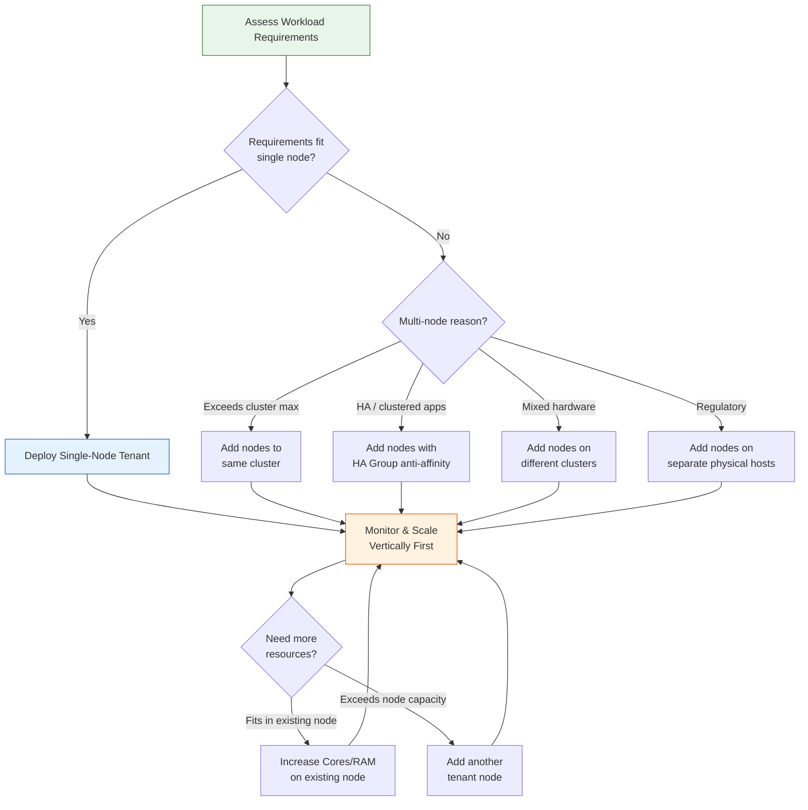

import { Card, CardGrid } from "@astrojs/starlight/components";

## Tenant Nodes: Virtual Hosts for Virtual Data Centers

Every VergeOS tenant runs on one or more **tenant nodes** — virtual servers that simulate physical VergeOS hosts. Each tenant node provides dedicated compute (CPU cores), memory (RAM), and networking to the tenant's workloads, while maintaining full isolation through the tenant's encapsulated network.

Understanding how tenant nodes work is the key to right-sizing tenant deployments and scaling them over time.

### Tenant Node Characteristics

| Characteristic                      | Description                                                                                                              |
| ----------------------------------- | ------------------------------------------------------------------------------------------------------------------------ |
| **Simulated hosts**                 | Tenant nodes replicate the functionality of physical VergeOS nodes inside the tenant's Virtual Data Center               |
| **Secure inter-host communication** | Tenant nodes communicate over the tenant's protected encapsulated network, even when running on different physical hosts |
| **Mobility**                        | Tenant nodes live-migrate between physical hosts for maintenance, load balancing, and automatic failover                 |
| **Matched resource allocation**     | Tenant nodes can target different clusters with different hardware profiles (standard, vGPU, high-memory)                |
| **Non-disruptive scaling**          | Cores and RAM can be increased or decreased on a running tenant node without restarting it                               |

### No Manual Overhead Calculation

Unlike VMware or Nutanix, where you must account for hypervisor overhead, CVM memory, and management plane reservations, VergeOS automatically handles all overhead internally. The memory you assign to a tenant node is **fully available** to that tenant for distributing among its own workloads.

## Single-Node vs Multi-Node Tenants

The first planning decision is whether a tenant needs one node or several.

### Single-Node Tenants (Preferred Default)

A single tenant node is the simplest and most common configuration. It is the recommended starting point whenever a tenant's compute and memory requirements fit within a single node.

Single-node tenants still provide redundancy through VergeOS's built-in **watchdog mechanism**:

- If the physical host running the tenant node fails, the watchdog automatically restarts the tenant node on another physical host
- During planned maintenance, a temporary tenant node is created to live-migrate workloads with no service interruption
- Additional tenant nodes can be added later, non-disruptively, as needs grow

:::tip[Start Simple]
If RAM and core requirements can be met with a single tenant node and there are no network or device needs requiring multiple physical hosts, a single node is preferable for simplicity.
:::

### When Multi-Node Tenants Are Needed

Multiple tenant nodes become necessary in specific scenarios:

1. **Compute exceeds cluster maximums** — The amount of cores and RAM assignable to a single tenant node is limited by cluster settings (_Max RAM per machine_ and _Max cores per machine_). When a tenant needs more than one node's worth, add additional nodes.

2. **Clustered applications** — Web farms, Hadoop clusters, database primary/replica pairs, and other distributed applications that require workloads to run on different physical hosts for HA, load balancing, or parallel processing.

3. **Mixed hardware capabilities** — When a tenant needs both standard compute and specialized hardware (vGPU, PCI passthrough, USB devices), deploy tenant nodes on different clusters with the appropriate hardware.

4. **Regulatory separation** — Compliance requirements may mandate that certain workloads run on physically separate hosts.

## Right-Sizing Strategy

VergeOS tenants support **disturbance-free resource scaling** — you can add cores, RAM, nodes, and storage to a running tenant without affecting workloads. This means you should:

- **Provision for current and near-term needs**, not speculative future growth
- **Scale organically** as actual demand increases
- **Avoid over-provisioning** — unused resources allocated to one tenant cannot serve others

## Example Configurations

The following examples illustrate real-world tenant node planning decisions.

### Example 1: Small Single-Node Tenant

**Scenario:** 3 VMs, no special requirements. Host cluster allows Max RAM 64 GB, Max Cores 16.

| Setting      | Value                                                        |
| ------------ | ------------------------------------------------------------ |
| Tenant Nodes | 1                                                            |
| Cores        | 8                                                            |
| RAM          | 16 GB                                                        |
| Scaling Path | Add cores/RAM up to 64 GB / 16 cores, then add a second node |

**Rationale:** A single node provides sufficient resources. Watchdog failover ensures redundancy without additional complexity.

### Example 2: Mid-Sized HA Web Applications

**Scenario:** Customer-facing web apps requiring multi-instance HA. Host cluster allows Max RAM 128 GB, Max Cores 16.

| Setting      | Value                                                                       |
| ------------ | --------------------------------------------------------------------------- |
| Tenant Nodes | 2                                                                           |
| Node 1       | 64 GB RAM, 12 cores (2 web servers + DB primary)                            |
| Node 2       | 64 GB RAM, 12 cores (2 web servers + DB replica)                            |
| HA Groups    | Anti-affinity rules ensure web/DB instances stay on separate physical hosts |

**Rationale:** Although one node could hold all the resources, two nodes ensure web servers and database components run on different physical hosts for application-level HA.

### Example 3: Mixed Workload with GPU

**Scenario:** Standard compute, high-performance video rendering, and GPU-accelerated processing. Three host clusters available: Standard (64 GB max), vGPU (64 GB max), High-Performance (128 GB max).

| Setting      | Value                                                            |
| ------------ | ---------------------------------------------------------------- |
| Tenant Nodes | 4                                                                |
| Node 1       | 64 GB, 8 cores — Standard Cluster (file servers)                 |
| Node 2       | 64 GB, 8 cores — Standard Cluster (management tools)             |
| Node 3       | 64 GB, 16 cores — vGPU Cluster (video rendering)                 |
| Node 4       | 48 GB, 8 cores — High-Performance Cluster (editing workstations) |

**Rationale:** Multiple nodes allow placement on clusters with matching hardware capabilities. Each tenant node targets the cluster that best fits its workload.

### Example 4: Enterprise Distributed Analytics

**Scenario:** Distributed analytics platform requiring multi-host deployment for load balancing and redundancy. Host cluster allows Max RAM 96 GB, Max Cores 16.

| Setting      | Value                                                           |
| ------------ | --------------------------------------------------------------- |
| Tenant Nodes | 4                                                               |
| Nodes 1–3    | 64 GB, 12 cores each (1 app server + 1 DB server per node)      |
| Node 4       | 32 GB, 8 cores (2 data processing servers)                      |
| HA Groups    | Anti-affinity ensures application instances span physical hosts |

**Rationale:** Four tenant nodes guarantee application instances run across multiple physical hosts while maintaining the ability to run all services within the tenant.

## Increasing Tenant Resources

VergeOS provides three non-disruptive methods for adding resources to a running tenant.

### Add Cores/RAM to an Existing Node

Changes take effect **immediately** on the tenant node — no restart required.

1. Navigate to the **Tenant Dashboard** → **Nodes**
2. Double-click the target node → click **Edit**
3. Modify the **Cores** and/or **RAM** fields
4. Click **Submit**

:::note[Cluster Limits]
The maximum cores and RAM per tenant node are determined by the cluster's _Max RAM per machine_ and _Max cores per machine_ settings. Max out existing nodes before adding new ones, unless workload balance requires otherwise.
:::

### Add a New Tenant Node

1. Navigate to the **Tenant Dashboard** → **Nodes** → **New**
2. Configure **Cores**, **RAM**, **Cluster**, and **Failover Cluster**
3. Select **On Power Loss** behavior (Last State, Leave Off, or Power On)
4. Click **Submit**

:::caution[Preferred Node]
Setting a _Preferred node_ is **not recommended** for tenant nodes. Incorrect configuration can adversely affect built-in redundancy. Consult VergeOS Support if needed.
:::

### Provision Additional Storage

**New storage tier:**

1. Tenant Dashboard → **Add Storage** → select **Tier** → enter **Provisioned** amount → **Submit**

**Expand existing tier:**

1. Tenant Dashboard → scroll to **Storage** section → click **Edit** on the desired tier
2. Enter the new **total** provisioned amount (e.g., change 50 GB to 75 GB to add 25 GB)

## Reducing Tenant Resources

### Reduce Cores/RAM

Cores and RAM can be reduced on a running tenant node without powering it off. However, if those resources are currently in use by tenant VMs, the **actual reclaim is deferred** until the VMs are shut down.

**Example:** You reduce a tenant node's RAM from 32 GB to 28 GB, but VMs are currently using all 32 GB. The setting changes immediately, but the 4 GB difference is not reclaimed until VMs release that memory.

### Delete a Tenant Node

1. Power off or migrate all VMs from the node
2. Power off the tenant node
3. Navigate to **Tenant Dashboard** → **Nodes** → select the node → **Delete**

:::caution[Minimum Node Requirement]
A tenant must always have at least one node. Before deleting any tenant node, ensure at least one other node remains and that all workloads have been migrated off the node being removed.
:::

## Scaling Paths: Vertical First, Then Horizontal

The recommended scaling strategy for tenants follows a clear progression:

<CardGrid>
  <Card title="Step 1: Scale Vertically" icon="up-caret">
    Increase cores and RAM on existing tenant nodes up to the cluster maximum.
    This is the simplest path with zero disruption.
  </Card>
  <Card title="Step 2: Scale Horizontally" icon="right-caret">
    When existing nodes are maxed out, add new tenant nodes. Place them on the
    same cluster for general expansion or on different clusters for specialized
    hardware.
  </Card>
  <Card title="Step 3: Add Storage" icon="document">
    Expand provisioned storage independently of compute. Add capacity to an
    existing tier or provision a new storage tier.
  </Card>
  <Card title="Step 4: Rebalance" icon="setting">
    If resource distribution becomes uneven across nodes, balance RAM/cores
    between nodes rather than maxing one and minimally provisioning another.
  </Card>
</CardGrid>

:::note[Coming from VMware or Nutanix?]
On VMware and Nutanix, "scaling a tenant" usually means resizing a quota and trusting the scheduler. In VergeOS, you size dedicated tenant nodes directly.

| Platform | Isolation model | Scaling action |
| --- | --- | --- |
| VMware | vCloud Director or NSX-T multi-tenancy (separately licensed); resource pools give quotas, not isolation | Resize the resource pool, rely on DRS for placement |
| Nutanix | Prism Central Projects = quotas + RBAC, but workloads share the AHV cluster | True isolation requires separate Prism Element clusters |
| VergeOS | Each tenant is a VDC with dedicated tenant nodes (encapsulated network + isolated storage volumes) | Edit a tenant node's cores/RAM live, or add a node — system accounts for overhead automatically |
:::

## Best Practices

| Practice                        | Guidance                                                                                                           |
| ------------------------------- | ------------------------------------------------------------------------------------------------------------------ |
| **Start with one node**         | Use single-node tenants by default; add nodes only when required                                                   |
| **Right-size for now**          | Provision for current/near-term needs, not speculative future growth                                               |
| **Max out before adding**       | Increase existing node resources before adding new nodes (unless workload balance requires otherwise)              |
| **Balance resources**           | When two nodes are needed, distribute resources evenly rather than maxing one and minimizing the other             |
| **Use HA Groups**               | For multi-node tenants with HA requirements, configure anti-affinity rules so VMs distribute across physical hosts |
| **Match clusters to workloads** | Place tenant nodes on clusters with hardware that matches the workload (GPU, high-memory, standard)                |
| **Monitor and adjust**          | Use tenant dashboards and usage reports to identify when scaling is needed                                         |
