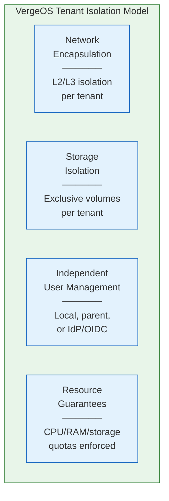
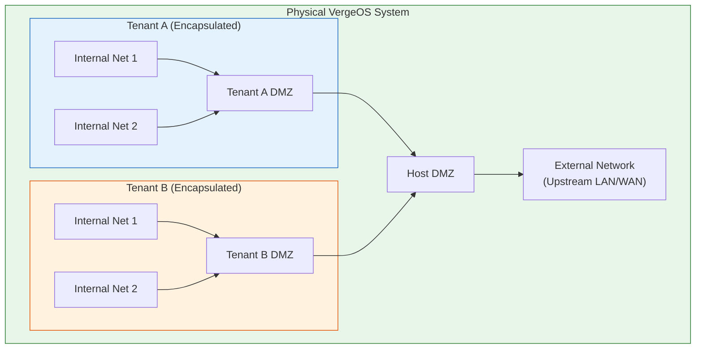

import { Card, CardGrid } from "@astrojs/starlight/components";

## The VergeOS Isolation Model

VergeOS multi-tenancy is built on **architectural isolation** — not just policy-based separation. Every tenant is a fully encapsulated Virtual Data Center (VDC) with its own networking stack, exclusive storage volumes, and independent administrative boundary. This stands in contrast to platforms that rely on VLANs, resource pools, or RBAC rules to separate tenants within a shared management plane.

The isolation model rests on four pillars:

---

## Network Encapsulation

Network encapsulation is the foundation of tenant isolation. When a tenant is created, VergeOS automatically provisions a virtual network that **aggregates and encapsulates all of that tenant's traffic**. From the tenant's perspective, this is their physical network — they cannot see or interact with any other tenant's traffic.

### How It Works

- Each tenant receives its own **DMZ network** that serves as the routing backbone for all networks within the tenant
- Tenant traffic is encapsulated at **Layer 2 and Layer 3**, preventing cross-tenant communication at the network level
- The encapsulated network allows tenant nodes to communicate securely even when running on different physical hosts
- Tenants can create virtually unlimited internal networks within their own environment

### Why This Matters

Unlike VLAN-based segmentation — where a misconfigured VLAN tag or a compromised switch could expose traffic between tenants — VergeOS network encapsulation provides **zero-trust network isolation** by default. A tenant cannot reach another tenant's network even if they share the same physical infrastructure.

---

## Dedicated Storage Volumes

Each tenant receives **exclusive storage volumes** within the vSAN. Tenant storage is tracked independently, including per-tenant deduplication statistics. There is no cross-tenant data access — a tenant's storage is as isolated as a physically separate storage system.

Key characteristics:

- **Per-tenant provisioning** — Storage is provisioned per tier (NVMe, SSD, HDD) with specific capacity allocations
- **Independent deduplication** — Each tenant's dedup stats reflect only its own data. Deduplication operates at the vSAN block level across the entire system; tenant-visible metrics show per-tenant savings only
- **Thin provisioning** — Tenant storage is thin-provisioned. A 4 TB VM drive that contains only 200 GB of data consumes ~200 GB of vSAN capacity (minus dedup savings)
- **Encryption support** — vSAN encryption (AES-256, configured at install) applies to all data including tenant volumes

---

## Independent User Management

Each tenant manages its own user accounts and authentication independently. Three authentication models are available:

| Model                      | Description                                                                                                       | Use Case                                                      |
| -------------------------- | ----------------------------------------------------------------------------------------------------------------- | ------------------------------------------------------------- |
| **Local users**            | Tenant admin creates and manages user accounts directly within the tenant UI                                      | Small tenants, standalone environments                        |
| **Parent-delegated**       | Tenant authenticates users against the parent (host) system's user directory                                      | Managed service providers who control tenant access centrally |
| **Third-party IdP / OIDC** | Tenant integrates with an external identity provider (Okta, Azure AD/Entra, Google Cloud Identity, etc.) via OIDC | Enterprise tenants with existing identity infrastructure      |

The OIDC integration is configured per tenant during creation or modification. When an OIDC application is selected, the tenant uses the external identity provider for authentication while maintaining local authorization (permissions and roles).

---

## Layer 2 Pass-Through to Tenants

In some scenarios, a tenant needs direct Layer 2 access to a physical VLAN — for example, to connect to a dedicated WAN link, a physical storage network, or legacy applications requiring L2 adjacency.

VergeOS provides **Tenant Layer 2 Networks** (v26.0+) for streamlined VLAN pass-through:

### How It Works

1. The host administrator navigates to **Tenants → [Tenant] → Layer2 Networks → New**
2. Selects the external Layer 2 network (VLAN) to pass through
3. Enables the pass-through

VergeOS automatically creates three components inside the tenant:

- A **NIC interface** on the tenant node connected to the VLAN
- A **Physical network** (backend infrastructure)
- An **External network** that tenant VMs can attach to

### Verification Checklist

| Level              | Check                                                                  |
| ------------------ | ---------------------------------------------------------------------- |
| **Host**           | Layer 2 network appears in tenant's Layer2 Networks list, Enabled = ON |
| **Tenant**         | External and Physical networks appear in tenant's Networks list        |
| **Infrastructure** | Physical switch ports carry the VLAN to the correct nodes              |
| **Connectivity**   | Test VM on the tenant's External network can reach devices on the VLAN |

### Important Restrictions

:::caution[Reserved VLANs]
VLANs **1, 100, 101, and 102** are reserved for VergeOS internal traffic and cannot be used for Layer 2 pass-through.
:::

:::caution[Do Not Tag the Tenant External Network]
The External network created inside the tenant is already tagged for the correct VLAN. Do **not** add a VLAN tag to the tenant-side External network — this is a common misconfiguration that will break connectivity.
:::

### Removal Procedure

Removing a Tenant Layer 2 Network requires a specific order:

1. **Disable** the Layer 2 network from the host side
2. **Delete** the Layer 2 network from the host side (NIC is automatically removed)
3. Inside the tenant: delete the **External** network first, then the **Physical** network

:::tip
Always delete the External network before the Physical network inside the tenant. The External network references the Physical network as its interface, so reversing the order will produce an error.
:::

---

## Micro-Segmentation Within Tenants

Each tenant can implement its own micro-segmentation strategy using the same networking tools available at the host level:

- **Internal networks** — Each internal network is a default-secure, isolated segment. No traffic flows in or out until explicit rules are added.
- **Network rules** — Granular firewall rules (Accept, Drop, Reject), NAT/PAT, and static routes per network
- **Network aliases** — Group IP addresses or CIDR ranges for simplified policy management
- **Port mirroring** — Replicate a network's traffic to a VM NIC for analysis

This enables **zero-trust principles** within each tenant — workloads are isolated by default and communicate only through explicitly permitted paths.

---

## Resource Guarantees

Tenant resource allocation is enforced at the platform level:

- **CPU and RAM** — Cores and RAM assigned to tenant nodes are dedicated allocations; the host system accounts for tenant node resources in its scheduling
- **Storage** — Provisioned storage per tier defines the tenant's capacity. While provisioned storage is not a hard limit, log alerts are triggered when a tenant approaches its threshold
- **Network bandwidth** — Rate limiting can be applied per network rule for traffic shaping

---

## Tenant Monitoring from the Parent

The host (parent) system retains full visibility into tenant operations without violating tenant isolation.

### All-Tenants Dashboard

The All-Tenants Dashboard provides an overview of all tenants with:

- **Status indicators** — Count of powered-on tenants and tenant nodes
- **Top usage lists** — CPU, RAM, storage, and network usage ranked by tenant
- **Quick links** — Click any tenant to drill into its individual dashboard

### Individual Tenant Dashboard

Each tenant's dashboard shows:

- **CPU, RAM, and storage usage** in 5-minute interval graphs
- **5-second heartbeat** statistics for real-time monitoring
- **Log entries** with errors highlighted in red
- **Storage metrics** — Used, Provisioned, and Allocated values

### Usage Reports for Billing

VergeOS stores usage statistics per tenant to support **95th percentile billing**:

1. Navigate to the tenant dashboard → **History**
2. Select a filter period (month, custom range)
3. Click **Apply** to generate graphs showing Average, Maximum, and 95th percentile
4. Export to CSV for billing integration

Alternatively, configure a **Subscription** (System → Subscriptions → New) with:

- Target Type: _Tenants Dashboard_
- Type: _Scheduled_
- Profile: _Tenants Usage_

This delivers automated usage reports via email on your configured schedule.

### Snapshot Exposure

When the **Expose System Snapshots** option is enabled on a tenant, the tenant can browse the host's available snapshots and self-serve download their own tenant snapshot from the provider's snapshot timestamps. This gives tenants the ability to restore their own systems without requiring host administrator intervention.

### Audit and Alerting

- **Subscriptions** can trigger email alerts for tenant status errors, warnings, or threshold breaches
- **Scheduled reports** can deliver daily/weekly dashboard summaries to administrators
- The **API** can export tenant usage data to external billing or monitoring systems

---

## Tenant Snapshots and Restores

Each tenant can be independently snapshotted and restored:

- **Per-tenant snapshots** — The host can take snapshots of individual tenants without affecting other tenants
- **Tenant-controlled snapshots** — Tenants can manage their own snapshot schedules and retention policies within their VDC
- **Granular restore** — Restore an entire tenant, individual VMs, or specific data from any snapshot point
- **DR replication** — Tenant snapshots can be replicated to remote sites via site sync, with per-tenant DR policies

---

## Best Practices

<CardGrid>
  <Card title="Default to Encapsulation" icon="shield">
    Use VergeOS's built-in network encapsulation for all tenants. Only configure
    Layer 2 pass-through when there is a specific requirement for direct VLAN
    access.
  </Card>
  <Card title="Document VLAN Assignments" icon="pencil">
    Maintain clear documentation of which VLANs are passed to which tenants,
    including VLAN IDs, purposes, and switch port configurations.
  </Card>
  <Card title="Least-Privilege Networking" icon="approve-check">
    Within each tenant, start with default-secure internal networks and open
    access only through explicit firewall rules. Follow zero-trust principles.
  </Card>
  <Card title="Monitor Storage Thresholds" icon="warning">
    Configure subscriptions to alert on tenant storage approaching provisioned
    limits. Thin provisioning means allocated can far exceed used — monitor
    "used" to track actual consumption.
  </Card>
  <Card title="Use OIDC for Enterprise Tenants" icon="setting">
    For enterprise tenants with existing identity infrastructure, configure OIDC
    integration rather than managing local user accounts within each tenant.
  </Card>
  <Card title="L2 Removal Order" icon="information">
    When removing Layer 2 pass-through, always disable and delete from the host
    first, then clean up External before Physical networks inside the tenant.
  </Card>
</CardGrid>
