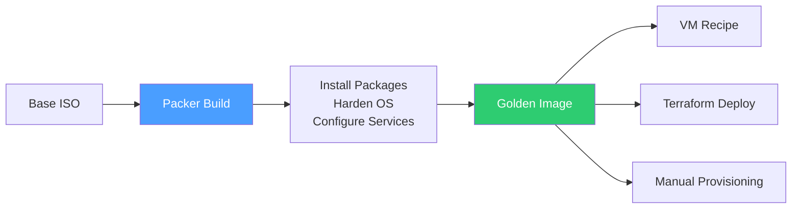
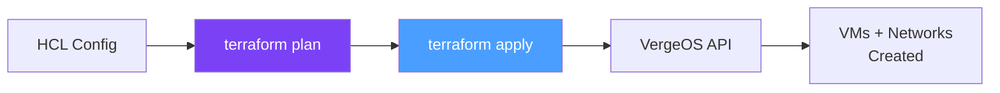
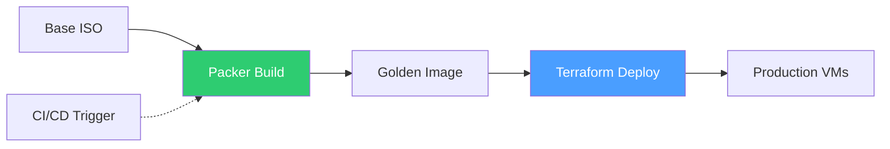

import { Card, CardGrid } from "@astrojs/starlight/components";

Infrastructure-as-Code (IaC) brings the same version control, peer review, and repeatability that software teams rely on to infrastructure provisioning. The **VergeOS Terraform provider** lets you declare VMs, networks, and users in HCL configuration files, while the **Packer plugin** automates golden image creation. Together, they form a declarative pipeline: Packer builds the images, Terraform deploys the infrastructure.

## Terraform Provider

The VergeOS Terraform provider is published on the Terraform Registry and is fully compatible with **OpenTofu** (the open-source Terraform fork). It enables you to manage VergeOS resources through standard `terraform plan` / `terraform apply` workflows.

### Provider Configuration

```hcl
terraform {
  required_providers {
    vergeio = {
      source  = "verge-io/vergeio"
      version = "~> 0.1.0"
    }
  }
}

provider "vergeio" {
  host     = "https://vergeos.example.com"
  username = "admin"
  password = var.vergeos_password
  insecure = true  # Set to true for self-signed SSL certificates
}
```

| Parameter    | Required | Description                                           |
| ------------ | -------- | ----------------------------------------------------- |
| **host**     | Yes      | URL or IP address of the VergeOS system or tenant     |
| **username** | Yes      | VergeOS username with appropriate permissions         |
| **password** | Yes      | Password for the specified user (mark as `sensitive`) |
| **insecure** | No       | Set `true` to accept self-signed SSL certificates     |

:::tip[OpenTofu Compatible]
The provider configuration is identical for OpenTofu. Simply replace `terraform` commands with `tofu` — no code changes required.
:::

### Resources

The provider currently supports four managed resource types for creating and updating VergeOS objects:

| Resource              | Purpose                            | Key Attributes                                                                                                                                                                                  |
| --------------------- | ---------------------------------- | ----------------------------------------------------------------------------------------------------------------------------------------------------------------------------------------------- |
| **`vergeio_vm`**      | Create and manage virtual machines | `cpu_cores`, `ram`, `os_family`, `machine_type`, `ha_group`, `cluster`, `guest_agent`, `uefi`, `secure_boot`, `snapshot_profile`, `powerstate`, inline `vergeio_drive` and `vergeio_nic` blocks |
| **`vergeio_network`** | Configure virtual networks         | `network_address` (CIDR), `dhcp_enabled`, `dhcp_start`, `dhcp_end`, `dns_server_list`, `gateway`, `powerstate`                                                                                  |
| **`vergeio_user`**    | Provision users                    | User account management within VergeOS                                                                                                                                                          |
| **`vergeio_member`**  | Manage group membership            | Associate users with groups for RBAC                                                                                                                                                            |

### Data Sources

Eight read-only data sources let you query existing VergeOS objects for use in your configurations:

| Data Source                  | Returns                                                |
| ---------------------------- | ------------------------------------------------------ |
| **`vergeio_version`**        | Current VergeOS version information                    |
| **`vergeio_clusters`**       | Available compute/storage clusters                     |
| **`vergeio_nodes`**          | Nodes in the environment                               |
| **`vergeio_networks`**       | Existing virtual networks                              |
| **`vergeio_vms`**            | Virtual machines (filterable by name, snapshot status) |
| **`vergeio_groups`**         | User groups for RBAC                                   |
| **`vergeio_mediasources`**   | Uploaded ISOs and media files                          |
| **`vergeio_cloudinitfiles`** | Available cloud-init configuration files               |

### HCL Examples

#### VM with Drive and NIC

This example creates a Linux web server with a 10 GB virtio-scsi drive and a NIC attached to an internal network:

```hcl
resource "vergeio_vm" "web_server" {
  name                 = "my-web-server"
  description          = "Web Server"
  enabled              = true
  os_family            = "linux"
  cpu_cores            = 2
  machine_type         = "q35"
  ram                  = 2048
  powerstate           = false
  guest_agent          = true
  cloudinit_datasource = "nocloud"
  ha_group             = "web"

  # Storage
  vergeio_drive {
    name           = "Web Server OS Disk"
    description    = "Operating System Disk"
    disksize       = 10
    interface      = "virtio-scsi"
    preferred_tier = 3
    orderid        = 0
  }

  # Networking
  vergeio_nic {
    name        = "Web Server Network"
    description = "NIC for Web Server"
    interface   = "virtio"
    enabled     = true
    vnet        = vergeio_network.web_network.id
  }
}
```

#### Internal Network with DHCP

```hcl
resource "vergeio_network" "web_network" {
  name            = "web-internal-network"
  network_address = "192.168.10.0/24"
  dns_server_list = ["8.8.8.8", "8.8.4.4"]
  dhcp_enabled    = true
  dhcp_start      = "192.168.10.100"
  dhcp_end        = "192.168.10.200"
}
```

#### Querying Existing VMs

Use data sources to reference existing infrastructure without managing it:

```hcl
data "vergeio_vms" "production" {
  filter_name = "prod-db"
  is_snapshot  = false
}

output "production_vms" {
  value = data.vergeio_vms.production.vms
}
```

#### Cloud-Init Integration

Combine the VM resource with cloud-init for first-boot automation:

```hcl
resource "vergeio_vm" "app_server" {
  name                 = "app-server-01"
  os_family            = "linux"
  cpu_cores            = 4
  machine_type         = "q35"
  ram                  = 8192
  guest_agent          = true
  cloudinit_datasource = "nocloud"

  cloudinit_files {
    name     = "user-data"
    contents = <<-EOF
      #cloud-config
      packages:
        - nginx
        - python3
      runcmd:
        - systemctl enable nginx
        - systemctl start nginx
    EOF
  }

  vergeio_drive {
    name           = "OS Disk"
    disksize       = 20
    interface      = "virtio-scsi"
    preferred_tier = 2
  }

  vergeio_nic {
    interface = "virtio"
    vnet      = vergeio_network.web_network.id
  }
}
```

### Maturity & Roadmap

:::caution[Early-Stage Provider]
The VergeOS Terraform provider is in **early/alpha stage** (v0.3.0 unreleased). It covers core VM and network provisioning well, but does not yet include resources for:

- **Tenants** — multi-tenancy provisioning
- **Snapshots** — snapshot profile management
- **External networks** — WAN/provider network configuration

The provider is under active development. Check the [GitHub repository](https://github.com/verge-io/terraform-provider-vergeio) for the latest resource coverage and release notes.
:::

## Packer Plugin

The **Packer plugin for VergeOS** (`github.com/verge-io/packer-plugin-vergeio`) automates the creation of VM images directly on the VergeOS platform. Where Terraform manages running infrastructure, Packer focuses on building the **golden images** that serve as the foundation for deployments.

### Why Packer?



Golden images ensure every deployed VM starts from a known, tested, and hardened baseline. Instead of provisioning a bare OS and running configuration scripts on every deployment, Packer pre-bakes the image once:

- **Consistency** — Every VM created from the image is identical
- **Speed** — No first-boot provisioning delay; VMs are ready immediately
- **Compliance** — Security baselines and patches are baked in at build time
- **Pipeline integration** — Trigger image rebuilds from CI/CD on OS patch days

### Plugin Configuration

```hcl
packer {
  required_plugins {
    vergeio = {
      source  = "github.com/verge-io/vergeio"
      version = ">= 0.1.1"
    }
  }
}

source "vergeio" "ubuntu" {
  endpoint    = "https://vergeos.example.com"
  username    = "admin"
  password    = var.vergeos_password
  vm_name     = "packer-ubuntu-base"
  cpu_cores   = 2
  ram         = 4096
  os_family   = "linux"

  disk {
    disksize  = 20
    interface = "virtio-scsi"
    tier      = 2
  }
}

build {
  sources = ["source.vergeio.ubuntu"]

  provisioner "shell" {
    inline = [
      "apt-get update",
      "apt-get install -y nginx qemu-guest-agent",
      "systemctl enable qemu-guest-agent"
    ]
  }
}
```

### Key Features

| Feature                       | Description                                                      |
| ----------------------------- | ---------------------------------------------------------------- |
| **Full VM lifecycle**         | Creates VM, provisions, captures image, cleans up                |
| **Cloud-init support**        | Inline and external file cloud-init configurations               |
| **Dynamic network discovery** | Resolves network IDs by name at build time                       |
| **Graceful shutdown**         | 4-phase shutdown process ensures clean image capture             |
| **Disk import handling**      | Automatically waits for disk imports to complete before power-on |
| **Multi-OS support**          | Linux and Windows image creation                                 |

### Packer → Recipes Pipeline

Packer images integrate naturally with the VergeOS **Recipe** system. A typical workflow:

1. **Packer** builds and hardens the golden image on a schedule (e.g., monthly patch cycle)
2. The image is registered as a **VM Recipe** in the VergeOS Marketplace
3. Users deploy standardized VMs from the recipe — either through the UI or via Terraform
4. Updates flow automatically: rebuild the Packer image, update the recipe, and all new deployments get the latest version

## Terraform Playground

The **Terraform Playground** is a companion repository that provides ready-to-use Terraform configurations for deploying complete VergeOS topologies in lab environments. It supports four deployment scenarios:

<CardGrid>
  <Card title="2-Node HCI" icon="laptop">
    Minimal hyper-converged cluster for testing and development. Both nodes
    serve as controller, compute, and storage.
  </Card>
  <Card title="4-Node HCI" icon="server">
    Production-grade HCI with dedicated controller pair and two additional
    compute/storage nodes.
  </Card>
  <Card title="4-Node Hybrid" icon="random">
    Mixed deployment with HCI foundation nodes and compute-only scale-out nodes.
  </Card>
  <Card title="6-Node UCI" icon="setting">
    Full Ultraconverged Infrastructure with dedicated controller, storage, and
    compute clusters.
  </Card>
</CardGrid>

These playground configurations are used extensively in the **Module 10 labs** for hands-on topology deployment practice. They demonstrate real-world Terraform provider usage while teaching VergeOS architecture concepts.

## IaC Workflow Patterns

### Terraform-Only Workflow

For teams that want declarative infrastructure without image pipelines:



### Full Pipeline (Packer + Terraform)

For production environments with golden image management:



### Combined with Other Tools

Terraform handles provisioning; configuration management tools handle the rest:

| Phase              | Tool                        | Purpose                            |
| ------------------ | --------------------------- | ---------------------------------- |
| **Image creation** | Packer                      | Build hardened golden images       |
| **Provisioning**   | Terraform                   | Deploy VMs, networks, users        |
| **Configuration**  | Ansible / cloud-init        | Post-deploy software configuration |
| **Monitoring**     | Prometheus / VergeOS alerts | Observe deployed infrastructure    |

:::note[VMware Bridge]
On VMware, Terraform's vSphere provider manages ESXi/vCenter/vSAN as separate concerns and Packer uses the `vsphere-iso` builder via vCenter. The single VergeOS `vergeio` provider handles VMs, networks, drives, and users through one API endpoint, and the Packer plugin targets the same API.
:::

:::note[Nutanix Bridge]
The Nutanix Terraform provider (`nutanix/nutanix`) and Packer plugin both target Prism Central's v3 API. The VergeOS provider talks to a single endpoint (the VergeOS system or tenant URL) with no separate management instance, and integrates cloud-init directly into the VM resource via inline `cloudinit_files` blocks.
:::

## Best Practices

### State Management

- **Use remote state backends** (S3, Consul, Terraform Cloud) for team collaboration
- **Never commit** `terraform.tfstate` to version control — it may contain credentials
- **Lock state files** to prevent concurrent modifications in multi-user environments

### Security

- **Use variables** for sensitive values (`var.vergeos_password`) — never hardcode credentials
- **Mark sensitive outputs** with `sensitive = true` to prevent accidental exposure in logs
- **Restrict provider permissions** — create a dedicated VergeOS API user with minimum required access

### Module Organization

- **Separate environments** into workspaces or directories (`dev/`, `staging/`, `prod/`)
- **Create reusable modules** for common patterns (e.g., a "web-server" module with VM + network + firewall rules)
- **Pin provider versions** to avoid unexpected breaking changes during upgrades

## Further Reading

- [Terraform Provider — GitHub](https://github.com/verge-io/terraform-provider-vergeio)
- [Terraform Registry — VergeIO Provider](https://registry.terraform.io/providers/verge-io/vergeio/latest)
- [Packer Plugin — GitHub](https://github.com/verge-io/packer-plugin-vergeio)
- [OpenTofu Registry — VergeIO Provider](https://search.opentofu.org/provider/verge-io/vergeio/latest)
- [VergeOS Docs — Terraform Provider](https://docs.verge.io/product-guide/tools-integrations/terraform-provider/)
