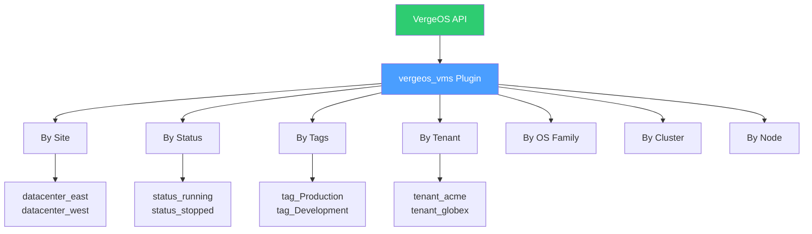
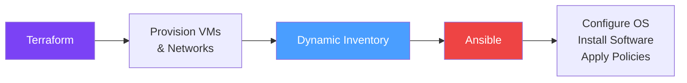

import { Card, CardGrid } from "@astrojs/starlight/components";

Ansible brings agentless, push-based automation to infrastructure management. The **vergeio.vergeos** Ansible collection extends Ansible with purpose-built modules and an inventory plugin for VergeOS, enabling you to manage VM snapshots, organize resources with tags, import VM images, and dynamically discover infrastructure across multiple sites — all through familiar YAML playbooks.

## Collection Overview

The VergeOS Ansible collection is published on Ansible Galaxy and integrates directly with the VergeOS REST API through the **pyvergeos** Python SDK.

| Detail             | Value                                                            |
| ------------------ | ---------------------------------------------------------------- |
| **Namespace**      | `vergeio`                                                        |
| **Collection**     | `vergeos`                                                        |
| **Full Reference** | `vergeio.vergeos`                                                |
| **Python**         | >= 3.9                                                           |
| **Ansible**        | >= 2.14.0                                                        |
| **SDK Dependency** | `pyvergeos` >= 1.0.1                                             |
| **Source**         | [GitHub](https://github.com/verge-io/ansible-collection-vergeos) |

### Installation

Install the collection from Ansible Galaxy:

```bash
# Install from Galaxy (recommended)
ansible-galaxy collection install vergeio.vergeos

# Install the required Python SDK
pip install pyvergeos
```

For development or offline environments, build and install from source:

```bash
git clone https://github.com/verge-io/ansible-collection-vergeos.git
cd ansible-collection-vergeos
ansible-galaxy collection build
ansible-galaxy collection install vergeio-vergeos-*.tar.gz --force
```

### Authentication

The collection uses environment variables for API authentication, keeping credentials out of your playbooks and inventory files:

```bash
export VERGEOS_HOST="https://vergeos.example.com"
export VERGEOS_USERNAME="admin"
export VERGEOS_PASSWORD="your-password"
export VERGEOS_INSECURE="true"   # Set true for self-signed SSL certificates
```

Alternatively, you can use API key authentication for non-interactive scenarios like CI/CD pipelines. API keys are created in **System > Users > [select user] > API Keys** within the VergeOS UI and provide Bearer token authentication without requiring username/password credentials.

## Modules

The collection provides modules for VM lifecycle operations, tagging, and image management. Each module communicates with the VergeOS API through the pyvergeos SDK.

### VM Snapshot Module

The `vergeio.vergeos.vm_snapshot` module creates and manages VM snapshots programmatically — useful for backup automation, pre-change checkpoints, and disaster recovery workflows.

```yaml
- name: Create a snapshot of the database server
  vergeio.vergeos.vm_snapshot:
    vm_name: "db-server-01"
    description: "Pre-upgrade snapshot"
    retention: 86400 # Retain for 24 hours (seconds)
    quiesce: true # Quiesce the guest filesystem
```

### Tag Management Modules

Tags provide a flexible classification system for organizing VergeOS resources. The collection includes two modules for tag management:

| Module                             | Purpose                                                              |
| ---------------------------------- | -------------------------------------------------------------------- |
| **`vergeio.vergeos.tag_category`** | Create and manage tag categories (e.g., "Environment", "Department") |
| **`vergeio.vergeos.tag`**          | Apply and manage individual tags within categories                   |

```yaml
- name: Create environment tag category
  vergeio.vergeos.tag_category:
    name: "Environment"
    description: "Deployment environment classification"

- name: Tag VM as production
  vergeio.vergeos.tag:
    category: "Environment"
    name: "Production"
    resource_type: "vm"
    resource_name: "web-server-01"
```

### VM Import Capabilities

The collection supports importing and deploying VMs from OVA templates, enabling automated image onboarding for both Windows and Linux workloads.

## Dynamic Inventory Plugin

The `vergeos_vms` inventory plugin queries the VergeOS API to dynamically discover VMs and build Ansible inventory — eliminating the need to maintain static host files.

:::caution[API-Only Inventory]
The inventory plugin retrieves VM metadata from the VergeOS API. It does **not** set `ansible_host` and does not support direct SSH connections out of the box. You must configure `ansible_host` through host variables, compose rules, or a separate connection strategy for SSH-based playbook execution.
:::

### Inventory Configuration

Create an inventory file (e.g., `vergeos_inventory.yml`):

```yaml
plugin: vergeio.vergeos.vergeos_vms
sites:
  - name: "datacenter-east"
    host: "https://east.vergeos.example.com"
    username: "ansible-svc"
    password: "{{ lookup('env', 'VERGEOS_PASSWORD') }}"
    verify_ssl: false

  - name: "datacenter-west"
    host: "https://west.vergeos.example.com"
    username: "ansible-svc"
    password: "{{ lookup('env', 'VERGEOS_PASSWORD') }}"
    verify_ssl: false

# Optional filters
filters:
  status: "running"
  name_pattern: "prod-*"

# Enable caching for large environments
cache: true
cache_plugin: jsonfile
cache_connection: /tmp/vergeos_inventory_cache
cache_timeout: 300
```

### Automatic Grouping

The plugin automatically organizes discovered VMs into groups based on multiple dimensions:



| Group Dimension | Example Groups                           | Use Case                               |
| --------------- | ---------------------------------------- | -------------------------------------- |
| **Site**        | `datacenter_east`, `datacenter_west`     | Target playbooks to specific locations |
| **Status**      | `status_running`, `status_stopped`       | Run tasks only on active VMs           |
| **Tags**        | `tag_Production`, `tag_Development`      | Environment-specific configuration     |
| **Tenant**      | `tenant_acme`, `tenant_globex`           | Multi-tenant automation                |
| **OS Family**   | `os_linux`, `os_windows`                 | OS-specific playbooks                  |
| **Cluster**     | `cluster_compute01`, `cluster_compute02` | Cluster-aware maintenance              |
| **Node**        | `node_node1`, `node_node2`               | Node-level operations                  |

### Host Variables

Each discovered VM exposes over 20 host variables including VM ID, name, CPU cores, RAM, OS family, power state, cluster assignment, node placement, network configuration, tags, and the full VM data dictionary for advanced use cases.

## Playbook Patterns

### Multi-Site Snapshot Orchestration

Use tag-based filtering with the dynamic inventory to orchestrate snapshots across sites:

```yaml
---
- name: Snapshot all production databases across sites
  hosts: tag_Production:&os_linux
  gather_facts: false

  tasks:
    - name: Create pre-maintenance snapshot
      vergeio.vergeos.vm_snapshot:
        vm_name: "{{ inventory_hostname }}"
        description: "Scheduled maintenance snapshot - {{ ansible_date_time.date }}"
        retention: 172800 # 48-hour retention
        quiesce: true
      delegate_to: localhost
```

### Tag Infrastructure Setup

Establish a consistent tagging taxonomy across your VergeOS environment:

```yaml
---
- name: Configure tag infrastructure
  hosts: localhost
  connection: local

  tasks:
    - name: Create tag categories
      vergeio.vergeos.tag_category:
        name: "{{ item.name }}"
        description: "{{ item.description }}"
      loop:
        - { name: "Environment", description: "Deployment environment" }
        - { name: "Department", description: "Business unit owner" }
        - { name: "Compliance", description: "Regulatory framework" }
        - { name: "Backup", description: "Backup policy tier" }

    - name: Apply environment tags to VMs
      vergeio.vergeos.tag:
        category: "Environment"
        name: "Production"
        resource_type: "vm"
        resource_name: "{{ item }}"
      loop:
        - "db-server-01"
        - "web-server-01"
        - "app-server-01"
```

### Windows VM Import Workflow

Automate the import of Windows VM templates from OVA files:

```yaml
---
- name: Import Windows Server template
  hosts: localhost
  connection: local

  tasks:
    - name: Import Windows Server 2022 from OVA
      vergeio.vergeos.vm_import:
        name: "win2022-template"
        description: "Windows Server 2022 Standard - Base Template"
        source: "/media/templates/win2022-standard.ova"
        os_family: "windows"
        cpu_cores: 4
        ram: 8192

    - name: Tag the imported template
      vergeio.vergeos.tag:
        category: "Environment"
        name: "Template"
        resource_type: "vm"
        resource_name: "win2022-template"
```

## Integration Patterns

### Terraform + Ansible Pipeline

A common pattern combines Terraform for provisioning with Ansible for configuration: Terraform declares the infrastructure, Ansible configures what runs inside it.



| Phase             | Tool      | Responsibility                                                 |
| ----------------- | --------- | -------------------------------------------------------------- |
| **Provisioning**  | Terraform | Create VMs, networks, users, drives                            |
| **Discovery**     | Inventory | Query VergeOS API for newly created VMs                        |
| **Configuration** | Ansible   | Install packages, configure services, apply security baselines |
| **Validation**    | Ansible   | Run smoke tests, verify connectivity, check compliance         |

### Python SDK + Ansible

For complex workflows that need programmatic logic beyond what YAML playbooks offer, combine the **pyvergeos** Python SDK with Ansible:

```yaml
- name: Custom VergeOS automation with Python
  hosts: localhost
  tasks:
    - name: Run advanced VM operations via pyvergeos
      ansible.builtin.script:
        cmd: scripts/bulk_snapshot.py
      environment:
        VERGEOS_HOST: "{{ vergeos_host }}"
        VERGEOS_USERNAME: "{{ vergeos_user }}"
        VERGEOS_PASSWORD: "{{ vergeos_password }}"
```

### CI/CD Integration

Ansible playbooks integrate naturally into CI/CD pipelines for infrastructure automation:

<CardGrid>
  <Card title="GitLab CI" icon="github">
    Trigger Ansible playbooks from `.gitlab-ci.yml` stages for automated VM
    provisioning and configuration on merge to main.
  </Card>
  <Card title="Jenkins" icon="setting">
    Use the Ansible plugin for Jenkins to run playbooks as build steps, with
    credentials managed through Jenkins Credential Store.
  </Card>
  <Card title="GitHub Actions" icon="rocket">
    Run Ansible playbooks in GitHub Actions workflows using the
    `ansible-playbook` action for pull request-driven infrastructure changes.
  </Card>
  <Card title="AWX / Tower" icon="list-format">
    Deploy Ansible AWX for a web-based UI, RBAC, and scheduled playbook
    execution against VergeOS environments.
  </Card>
</CardGrid>

## Best Practices

### Credential Management

- **Never hardcode credentials** in playbooks or inventory files — use environment variables or Ansible Vault
- **Use API keys** for service accounts in production — they support IP allow-lists and expiration dates
- **Rotate credentials** regularly and audit API key usage through the VergeOS UI

### Inventory Strategy

- **Enable caching** for large environments to reduce API calls and speed up playbook runs
- **Use filters** to scope inventory to relevant VMs — avoid pulling the entire environment
- **Separate inventories** per environment (dev, staging, production) for safety

### Playbook Design

- **Use `delegate_to: localhost`** for VergeOS API calls — the modules talk to the API, not to guest VMs via SSH
- **Leverage tags** for targeting — they provide a flexible, multi-dimensional grouping system
- **Implement idempotency** — design playbooks that can be safely re-run without side effects

:::note[VMware Bridge]
The `community.vmware` collection (`vmware_guest`, `vmware_guest_snapshot`, `vmware_dvswitch`) requires a vCenter connection plus PyVmomi, with `vmware_vm_inventory` as the dynamic inventory plugin. The `vergeio.vergeos` collection talks directly to the VergeOS API and its dynamic inventory plugin supports multi-site queries natively, whereas VMware needs separate vCenter connections or linked-mode.
:::

:::note[Nutanix Bridge]
The `nutanix.ncp` collection manages VMs, subnets, and images through Prism Central's v3 API. The `vergeio.vergeos` collection follows the same shape — API-driven modules plus a dynamic inventory plugin — but targets a single VergeOS endpoint per site (no Prism Central) and supports concurrent multi-site queries in one inventory config.
:::

## Further Reading

- [Ansible Collection — GitHub](https://github.com/verge-io/ansible-collection-vergeos)
- [Ansible Galaxy — vergeio.vergeos](https://galaxy.ansible.com/vergeio/vergeos)
- [pyvergeos Python SDK — PyPI](https://pypi.org/project/pyvergeos/)
- [VergeOS Docs — Python SDK](https://docs.verge.io/product-guide/tools-integrations/python-sdk/)
- [Ansible Documentation](https://docs.ansible.com/)
