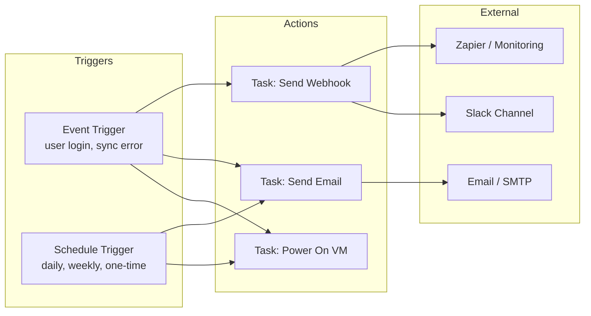

import { Card, CardGrid } from "@astrojs/starlight/components";

The VergeOS **Task Engine** is a built-in automation framework that enables event-driven and schedule-driven operations without external tooling. Rather than writing scripts or relying on cron jobs on separate machines, administrators define tasks, attach triggers, and let the platform execute actions automatically. The Task Engine is the native complement to the API and IaC tools covered earlier in this module — where Terraform and Ansible manage provisioning, the Task Engine handles day-to-day operational automation within the running system.

## Task Engine Components

The Task Engine uses five modular building blocks that can be composed in flexible combinations:

| Component     | Description                                                                  |
| ------------- | ---------------------------------------------------------------------------- |
| **Tasks**     | Define the action to perform (e.g., power off a VM, send a notification)     |
| **Schedules** | Specify when and how often a task should run (e.g., daily, weekly, one-time) |
| **Events**    | Define conditions that trigger a task (e.g., user login, sync failure)       |
| **Webhooks**  | Push data to external systems via HTTP POST in real time                     |
| **Task Logs** | Record task creation and execution history for auditing and troubleshooting  |

All components are accessed from **System → Tasks Dashboard** in the VergeOS UI.



## Modular Automation Architecture

A key strength of the Task Engine is its **many-to-many** relationship model. Components are not locked into one-to-one pairings:

- **Multiple tasks or events → single webhook** — Configure a webhook once and trigger it from several different events (sync failures, login attempts, system alerts). This centralizes external integrations and reduces duplication.
- **Single task → multiple events** — A "Power On VM" task can fire when a specific user logs in _or_ when a scheduled maintenance window begins. Reuse task definitions across scenarios.
- **Single schedule → multiple tasks** — Define a weekly maintenance window once and link it to update, alerting, and shutdown tasks. Consistency without configuration drift.

This composable design means you build a library of reusable tasks, schedules, and webhooks, then wire them together as your operational needs evolve.

## Event-Based Triggers

Event triggers fire tasks automatically when a specific system occurrence is detected. When creating an event, you select:

1. **Type** — The object class (e.g., Users, Virtual Machines, Alarms, Tenants, Outgoing Syncs)
2. **Event** — The specific occurrence (e.g., Login, Logout, Power On, Error, Status Change)
3. **Object Instance or Tag** — Either a specific object (a particular user or VM) or a tag that matches a group of objects

### Common Event Trigger Patterns

| Event Type       | Example Event        | Typical Action                                    |
| ---------------- | -------------------- | ------------------------------------------------- |
| Users            | Login / Logout       | Power on/off GPU VMs for the logged-in user       |
| Outgoing Syncs   | Error                | Send Slack notification + email alert             |
| Virtual Machines | Power On / Power Off | Log to external monitoring system via webhook     |
| Alarms           | Error severity       | Send email notification to ops team               |
| System           | Update Complete      | Send email notification confirming update success |

:::tip[Tag-Based Triggers]
Instead of creating separate events for each VM, assign a shared **tag** (e.g., `gpu-workstation`) to related VMs. Then configure the event trigger to match that tag — any VM with the tag will activate the trigger. This is far more maintainable than per-object events.
:::

## Schedule-Based Triggers

Schedule triggers run tasks at predefined times or intervals. VergeOS includes several default schedules and supports custom schedule creation.

### Schedule Configuration Options

- **Recurring** — Repeat every N days, hours, minutes, weeks, months, or years, with specific day/time selection
- **One-time** — Select "Does Not Repeat" and specify a single start date and time
- **End date** — Recurring schedules are perpetual by default; optionally set an end date

### Common Schedule Patterns

| Schedule             | Use Case                                                    |
| -------------------- | ----------------------------------------------------------- |
| Every Saturday 5 PM  | Check for and download system updates                       |
| Every Friday 6 PM    | Power off resource-intensive VMs at end of business         |
| Specific future date | Disable a temporary employee account 30 days after creation |
| Daily at midnight    | Run tenant backup verification checks                       |
| First of each month  | Generate resource utilization reports                       |

## Webhooks

Webhooks enable push-based messaging to external systems when tasks execute. Instead of external systems polling VergeOS for status, the platform proactively sends HTTP POST requests to predefined URLs when configured conditions are met.

### Webhook Configuration

When creating a webhook, you configure:

| Field                           | Description                                                             |
| ------------------------------- | ----------------------------------------------------------------------- |
| **Name**                        | Descriptive identifier for the webhook                                  |
| **URL**                         | The API endpoint on the external system that accepts HTTP POST requests |
| **Authorization Type**          | Bearer Token, API Key, Basic (username/password), or None               |
| **Headers**                     | Custom HTTP headers (default: `content-type: application/json`)         |
| **Allow Insecure Certificates** | For self-signed certificates in dev/test environments                   |
| **Timeout**                     | Max seconds to wait for a response (minimum 3)                          |
| **Retries**                     | Number of reattempts on failure or no response                          |

### Payload Variables

Webhook task payloads support dynamic variables that are resolved at execution time:

| Variable       | Value                                                                           |
| -------------- | ------------------------------------------------------------------------------- |
| `${DATE}`      | Current date/time in full-string format (e.g., `Thu, 16 Oct 2025 11:38:07 EDT`) |
| `${TIMESTAMP}` | Current date/time as epoch integer (e.g., `1760629087`)                         |
| `${RANDOM}`    | Randomly generated integer                                                      |
| `${NAME}`      | Name of the applicable VergeOS object                                           |

### Webhook Use Cases

- Send a **Slack notification** to an admin channel when a sync job produces an error
- Post to an **accounting system** when a tenant comes online, triggering automatic billing
- Trigger a **Zapier workflow** when a specific VM powers on, initiating cross-application actions

## Worked Example 1: Auto Power On/Off GPU VMs

This example demonstrates how tags, tasks, events, and schedules work together to manage resource-intensive GPU workloads.

**Scenario:** User JThompson uses multiple GPU-powered VMs for 3D modeling. These VMs consume significant compute and memory — leaving them running when idle is wasteful.

**Goal:** Power on the VMs when JThompson logs in, power them off on logout, and enforce a Friday 6 PM shutdown as a safety net.

### Configuration Steps

1. **Create a tag** — Under System → Tags, create a category `VMs` with a tag `JThompson-GPU`. Assign this tag to the target VMs.

2. **Create "Power On" task** — System → Tasks Dashboard → New Task. Set Object Type to `Virtual Machines`, select the tag `JThompson-GPU`, and set Action to `Power On`.

3. **Add login event trigger** — From the task dashboard, add an Event Trigger: Type = `Users`, Event = `Login`, Object = `JThompson`.

4. **Create "Power Off" task** — New Task with same tag selection but Action = `Power Off`.

5. **Add logout event trigger** — Event Trigger on the power-off task: Type = `Users`, Event = `Logout`, Object = `JThompson`.

6. **Create Friday schedule** — New Schedule: Repeat every 1 week on Friday at 6:00 PM.

7. **Add schedule trigger** — Attach the Friday schedule to the "Power Off" task as a Schedule Trigger.

**Result:** VMs power on automatically when JThompson logs in, power off on logout, and are guaranteed to shut down every Friday at 6 PM regardless of login state. This pattern applies to any high-resource workload — ML training rigs, CAD rendering stations, integration test environments, or financial modeling clusters.

## Worked Example 2: Slack + Email Alert on Sync Error

This example shows how webhooks, tasks, and events combine to provide multi-channel alerting for DR/BC operations.

**Scenario:** A service provider needs immediate notification when nightly sync jobs encounter errors, via both Slack and email.

### Configuration Steps

1. **Create a webhook** — System → Tasks Dashboard → New Webhook. Configure the Slack incoming webhook URL, set Authorization Type to `Bearer Token` with the Slack bot token, and set content-type to `application/json`.

2. **Create email task** — New Task: Object Type = `Email`, configure the recipient address and alert message body.

3. **Create webhook task** — New Task: Object Type = `Webhook`, select the Slack webhook, Action = `Send`. Define the JSON payload:

   ```json
   {
     "text": "Sync Error Alert: ${NAME} failed at ${DATE}"
   }
   ```

4. **Add event trigger to webhook task** — Type = `Outgoing Syncs`, Event = `Error`, select the specific sync job (or use a tag for multiple syncs).

5. **Add same event trigger to email task** — Same configuration as step 4, linking to the email task.

**Result:** When any monitored sync job produces an error, both the Slack channel and email inbox receive alerts simultaneously. Administrators can investigate promptly, maximizing the chance of completing the sync within the available window.

:::tip[Scale with Tags]
If you want the same trigger to apply to all outgoing syncs, assign a shared tag (e.g., `critical-sync`) to those sync jobs. Configure the trigger to fire on any sync with that tag — no need to create individual triggers per sync.
:::

## Creating Tasks: Quick Reference

Every task follows the same creation pattern:

1. Navigate to **System → Tasks Dashboard → New Task**
2. Configure: **Name**, **Object Type**, **Object** (specific instance or tag), **Action**, **Settings**
3. Attach one or more **Event Triggers** and/or **Schedule Triggers**
4. Verify in **Task Logs** that the task fires correctly

Tasks are **enabled by default**. You can disable a task temporarily if you need to verify configuration before activating it.

<CardGrid>
  <Card title="Task Fields" icon="document">
    **Name** — Descriptive identifier **Object Type** — Section of the
    application (VMs, Networks, Users, Webhooks, etc.) **Object** — Specific
    target or tag **Action** — Operation to perform **Delete After Running** —
    One-time execution option
  </Card>
  <Card title="Task Logs" icon="list-format">
    Every task execution is recorded with: - Timestamp and duration -
    Success/failure status - Triggering event or schedule - Target object
    details Logs are accessible from the Tasks Dashboard for auditing.
  </Card>
</CardGrid>

## Scripts (Preview)

The **Scripts** feature, introduced in VergeOS 26, lays the foundation for future administrator-defined automation workflows. While currently reserved for internal system operations, it has been designed with extensibility in mind. Future releases will expand Scripts to support custom admin automation directly within the platform — complementing the existing Task Engine with programmable logic.

:::note[Coming from VMware or Nutanix?]
| Platform | Equivalent | Licensing/footprint |
| --- | --- | --- |
| VMware | vRealize Orchestrator (vRO) or vSphere Alarms + Actions | Separately licensed; vRO is its own appliance |
| Nutanix | Prism Central Playbooks (X-Play); advanced flows need Calm | Requires Prism Central; some features behind Calm licensing |
| VergeOS | Task Engine — event triggers, schedules, webhooks | Built-in at every level, including inside tenants |
:::

## Key Takeaways

<CardGrid>
  <Card title="Event-Driven" icon="rocket">
    Trigger automation from system events — user login/logout, sync errors, VM
    state changes, alarm conditions — without polling or external schedulers.
  </Card>
  <Card title="Schedule-Driven" icon="seti:clock">
    Run tasks at specific times using built-in or custom schedules. One-time or
    recurring, with optional end dates.
  </Card>
  <Card title="External Integration" icon="external">
    Push notifications to Slack, email, Zapier, or any HTTP endpoint via
    webhooks with configurable auth, headers, and retry logic.
  </Card>
  <Card title="Modular & Reusable" icon="puzzle">
    Many-to-many relationships between tasks, events, schedules, and webhooks.
    Build once, compose freely.
  </Card>
</CardGrid>
