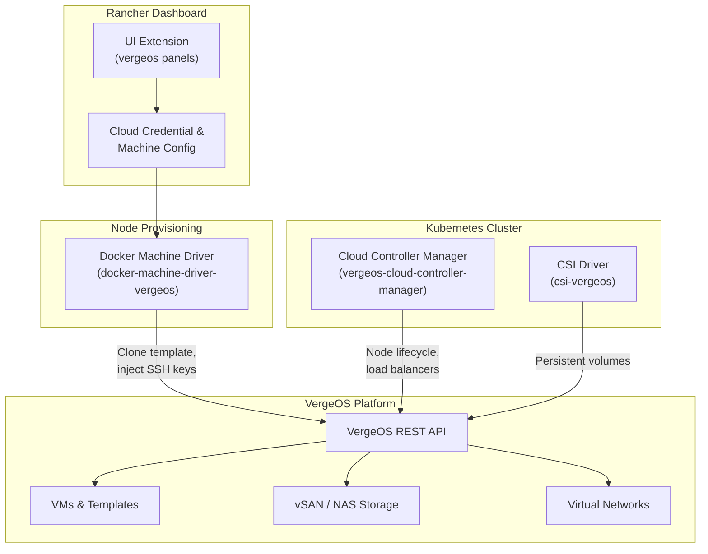
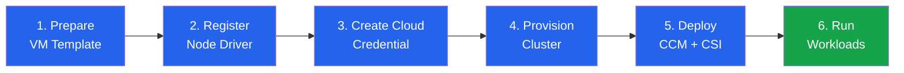

import { Card, CardGrid } from "@astrojs/starlight/components";

Running Kubernetes on VergeOS is not a bolt-on — it is a **first-class integration** built from five purpose-built components that give Rancher (and any RKE2/K3s deployment) full awareness of VergeOS compute, storage, and networking. Instead of treating VergeOS as a dumb VM host, these components let Kubernetes provision nodes, attach persistent storage, and create load balancers through native VergeOS APIs — the same APIs that power the dashboard.

## Stack Overview

The VergeOS Kubernetes integration is delivered as five distinct components, each responsible for one layer of the stack:



<CardGrid>
  <Card title="Docker Machine Driver" icon="rocket">
    Provisions VergeOS VMs as Kubernetes nodes — clones templates, injects SSH
    keys, resizes disks, and attaches networks.
  </Card>
  <Card title="Rancher UI Extension" icon="laptop">
    Surfaces VergeOS-specific Cloud Credential and Machine Config panels
    directly in the Rancher dashboard.
  </Card>
  <Card title="Cloud Controller Manager" icon="cloud">
    Syncs Kubernetes node state with VergeOS VM lifecycle and provisions load
    balancer services on demand.
  </Card>
  <Card title="CSI Driver" icon="seti:db">
    Maps VergeOS vSAN/NAS/block storage to Kubernetes PersistentVolumes for
    stateful workloads.
  </Card>
</CardGrid>

All five components are packaged and deployed through the **VergeOS Helm Charts** repository, ensuring consistent versioning and simplified installation.

## Docker Machine Driver

The `docker-machine-driver-vergeos` is the foundation of the integration. It teaches Docker Machine (and by extension, Rancher) how to create VMs on VergeOS — turning VergeOS into a first-class node provisioner for RKE2 and K3s clusters.

### How It Works

When Rancher (or standalone Docker Machine) requests a new node, the driver executes this sequence:

1. **Clones the template VM** — A pre-built VergeOS VM template (e.g., Ubuntu 24.04 with cloud-init) is cloned to create the new node
2. **Configures compute resources** — CPU cores and RAM are set according to the cluster specification
3. **Injects SSH keys via cloud-init** — The driver generates an SSH keypair and injects the public key through cloud-init for secure, passwordless access
4. **Resizes the primary disk** — If the cluster requires more storage than the template provides, the driver resizes the boot disk
5. **Attaches to the target network** — The VM is connected to the specified VergeOS virtual network
6. **Powers on and awaits IP** — The driver monitors for an IP address via the QEMU guest agent (preferred) or DHCP lease fallback

If any step fails, the driver automatically cleans up partially-created VMs — no orphaned resources left behind.

### Authentication

The driver uses **API key authentication** to communicate with the VergeOS REST API. Generate an API key from the VergeOS UI under **User Settings**, then provide it via the `--vergeos-api-key` flag or the `VERGEOS_API_KEY` environment variable.

### Configuration Flags

| Flag                    | Environment Variable  | Default             | Description                               |
| ----------------------- | --------------------- | ------------------- | ----------------------------------------- |
| `--vergeos-host`        | `VERGEOS_HOST`        | _(required)_        | VergeOS endpoint URL                      |
| `--vergeos-api-key`     | `VERGEOS_API_KEY`     | _(required)_        | API key for authentication                |
| `--vergeos-insecure`    | `VERGEOS_INSECURE`    | `false`             | Skip TLS verification                     |
| `--vergeos-template-vm` | `VERGEOS_TEMPLATE_VM` | _(required)_        | Template VM name to clone                 |
| `--vergeos-network`     | `VERGEOS_NETWORK`     | _(required)_        | Target network for attachment             |
| `--vergeos-cpu-cores`   | `VERGEOS_CPU_CORES`   | `2`                 | CPU cores per node                        |
| `--vergeos-ram`         | `VERGEOS_RAM`         | `2048`              | RAM in MB per node                        |
| `--vergeos-disk-size`   | `VERGEOS_DISK_SIZE`   | `0` (template size) | Disk size override in MB                  |
| `--vergeos-ssh-user`    | `VERGEOS_SSH_USER`    | `root`              | SSH username                              |
| `--vergeos-ssh-port`    | `VERGEOS_SSH_PORT`    | `22`                | SSH port                                  |
| `--vergeos-cloudinit`   | —                     | —                   | Custom cloud-init config (file or inline) |

### Template Requirements

Your VM template must include:

- **Cloud-init** installed and enabled — required for SSH key injection and hostname configuration
- **QEMU guest agent** (recommended) — provides reliable IP address discovery; falls back to NIC DHCP lease if unavailable
- **Docker** (standalone usage only) — Rancher deployments install the container runtime automatically

### Ubuntu 24.04 Support

The driver includes automatic handling for Ubuntu 24.04 specifics:

- **Netplan DHCP configuration** for dynamic `en*` interface naming
- **Machine-ID regeneration** to ensure unique DHCP identifiers per clone
- **Stale DHCP lease cleanup** to prevent IP conflicts from template inheritance

:::tip[Rancher Node Sizing]
Rancher deployments require a **minimum of 4 GB RAM** per node. For production stability, **8 GB RAM** per node is recommended.
:::

### Standalone Usage

You can use the driver outside of Rancher for ad-hoc Docker Machine provisioning:

```bash
docker-machine create --driver vergeos \
  --vergeos-host vergeos.example.com \
  --vergeos-api-key your-api-key \
  --vergeos-template-vm ubuntu-2404 \
  --vergeos-network my-k8s-network \
  --vergeos-cpu-cores 4 \
  --vergeos-ram 8192 \
  k8s-worker-01
```

## Rancher UI Extension

The `ui-extension-vergeos` adds VergeOS-specific panels to the **Rancher dashboard**, providing a native user experience for managing VergeOS-backed Kubernetes clusters without leaving the Rancher UI.

### Cloud Credential Panel

When creating a new Cloud Credential in Rancher, the extension adds a **VergeOS** provider option. Enter your VergeOS host URL, API key, and TLS settings — Rancher stores these securely and uses them for all subsequent node provisioning operations.

### Machine Config Panel

When defining node pools for a new cluster, the extension surfaces VergeOS-specific configuration fields:

- **Template VM** — Select from available VergeOS VM templates
- **Network** — Choose the target virtual network
- **CPU / RAM / Disk** — Set compute resources per node
- **Cloud-init** — Provide custom initialization scripts

The extension is deployed as part of the `vergeos-node-driver` Helm chart, which bundles both the Docker Machine Driver and the UI Extension together.

## Cloud Controller Manager

The `vergeos-cloud-controller-manager` (CCM) bridges Kubernetes cluster operations with the VergeOS control plane, implementing the standard Kubernetes cloud-provider interface.

### Node Lifecycle Sync

The CCM continuously monitors the Kubernetes node list and synchronizes it with VergeOS VM state:

- **Node registration** — When a new node joins the cluster, the CCM annotates it with VergeOS-specific metadata (VM ID, network, zone)
- **Node removal** — When a VergeOS VM is deleted or powered off, the CCM marks the corresponding Kubernetes node as unavailable and triggers pod rescheduling
- **Health monitoring** — Periodic checks ensure Kubernetes node status reflects actual VM health

### Load Balancer Provisioning

When a Kubernetes Service of type `LoadBalancer` is created, the CCM provisions a load balancer through the VergeOS networking layer:

- Allocates a virtual IP from the configured address pool
- Configures traffic distribution across backend node ports
- Updates the Service's `status.loadBalancer.ingress` with the allocated IP

This reduces the need for additional solutions like MetalLB in many cases — VergeOS handles load balancer provisioning natively through the CCM.

:::note[VMware Bridge]
In VMware environments, Kubernetes cloud-provider integration typically requires **vSphere Cloud Provider** (deprecated) or the newer **vSphere CSI/CPI drivers**, plus NSX-ALB (Avi) for load balancing. The VergeOS CCM combines node lifecycle management and load balancer provisioning in a single component, simplifying the stack. Tanzu Kubernetes Grid (TKG) provides a similar integrated experience but requires additional VMware licensing.
:::

:::note[Nutanix Bridge]
Nutanix offers Kubernetes integration through **Nutanix Kubernetes Engine (NKE)**, formerly Karbon. NKE is a certified Kubernetes distribution managed through Prism Central. The VergeOS approach differs by integrating with **Rancher** (or any RKE2/K3s deployment) rather than shipping a proprietary Kubernetes distribution — giving operators freedom to choose their preferred Kubernetes toolchain while still getting native cloud-provider integration.
:::

## CSI Driver

The `csi-vergeos` (Container Storage Interface) driver exposes VergeOS storage to Kubernetes workloads through the standard CSI specification.

### Storage Backends

The CSI driver supports multiple VergeOS storage backends:

| Backend               | Use Case                       | Access Mode   |
| --------------------- | ------------------------------ | ------------- |
| **NAS (NFS)**         | Shared file storage            | ReadWriteMany |
| **NAS (EXT4)**        | Dedicated file volumes         | ReadWriteOnce |
| **Block (VM Drives)** | High-performance block storage | ReadWriteOnce |

### How It Works

1. A developer creates a `PersistentVolumeClaim` (PVC) in Kubernetes
2. The CSI driver communicates with the VergeOS API to provision the requested storage
3. The storage is attached to the node running the pod and mounted at the specified path
4. On pod deletion, the CSI driver handles unmount and (optionally) deletion based on the reclaim policy

### StorageClass Example

```yaml
apiVersion: storage.k8s.io/v1
kind: StorageClass
metadata:
  name: vergeos-block
provisioner: csi.vergeos.com
parameters:
  type: block
reclaimPolicy: Delete
volumeBindingMode: WaitForFirstConsumer
```

Kubernetes administrators define `StorageClass` resources that map to VergeOS storage backends. Developers then reference these classes in their PVCs without needing to understand the underlying infrastructure.

## Helm Charts

The `helm-charts` repository packages all VergeOS Kubernetes components for streamlined deployment. Three charts are available:

### Available Charts

| Chart                              | Components                           | Purpose                                             |
| ---------------------------------- | ------------------------------------ | --------------------------------------------------- |
| `vergeos-node-driver`              | Docker Machine Driver + UI Extension | Node provisioning and Rancher dashboard integration |
| `vergeos-cloud-controller-manager` | CCM                                  | Node lifecycle sync and load balancer provisioning  |
| `vergeos-csi`                      | CSI Driver                           | Persistent storage (NAS + block)                    |

### Installation

Add the VergeOS Helm repository and install the charts:

```bash
# Add the VergeOS Helm repository
helm repo add verge-io https://verge-io.github.io/helm-charts
helm repo update

# Search available charts
helm search repo verge-io

# Install the Cloud Controller Manager
helm install vergeos-ccm verge-io/vergeos-cloud-controller-manager \
  --namespace kube-system

# Install the CSI Driver
helm install vergeos-csi verge-io/vergeos-csi \
  --namespace kube-system

# Install the Node Driver + UI Extension (for Rancher)
helm install vergeos-node-driver verge-io/vergeos-node-driver \
  --namespace cattle-system
```

## End-to-End Deployment Workflow

Bringing all five components together, here is the complete workflow for deploying a Kubernetes cluster on VergeOS with Rancher:



### Step 1: Prepare a VM Template

Create a VergeOS VM with Ubuntu 24.04 (or your preferred OS), install cloud-init and the QEMU guest agent, then save it as a template. This template will be cloned for every Kubernetes node.

### Step 2: Register the Node Driver

Apply the VergeOS NodeDriver manifest to your Rancher management cluster using `kubectl`. This tells Rancher about the VergeOS Docker Machine Driver and enables it as a provisioning option. Restart Rancher after registration to activate the driver schema.

### Step 3: Create a Cloud Credential

In the Rancher UI, create a new **Cloud Credential** using the VergeOS provider (added by the UI Extension). Enter your VergeOS host URL and API key.

### Step 4: Provision the Cluster

Create a new RKE2 or K3s cluster in Rancher, selecting VergeOS as the infrastructure provider. Define your node pools (control plane, etcd, workers) with the desired compute resources. Rancher uses the Docker Machine Driver to clone VMs, inject SSH keys, and bootstrap the Kubernetes cluster.

### Step 5: Deploy CCM and CSI

Install the Cloud Controller Manager and CSI Driver via Helm into the new cluster. The CCM immediately begins syncing node state with VergeOS, and the CSI driver makes VergeOS storage available for PersistentVolumeClaims.

### Step 6: Run Workloads

Deploy your applications with standard Kubernetes manifests. Services of type `LoadBalancer` are handled by the CCM, and PersistentVolumeClaims are fulfilled by the CSI driver — all backed by VergeOS infrastructure.

## Registering the Node Driver in Rancher

The Docker Machine Driver must be registered as a Rancher NodeDriver resource. Apply the following manifest with `kubectl`:

```yaml
apiVersion: management.cattle.io/v3
kind: NodeDriver
metadata:
  name: vergeos
  annotations:
    privateCredentialFields: "apiKey"
    publicCredentialFields: "host,insecure"
spec:
  active: true
  builtin: false
  displayName: vergeos
  uiUrl: ""
  url: "https://github.com/verge-io/docker-machine-driver-vergeos/releases/download/v0.1.0/docker-machine-driver-vergeos-linux-amd64.tar.gz"
```

After applying, restart Rancher to load the new driver schema. The VergeOS option will then appear in the cluster creation wizard.

## Summary

The VergeOS Kubernetes integration transforms VergeOS from a VM platform into a **complete Kubernetes cloud provider**. By implementing the Docker Machine, Cloud Controller Manager, and CSI interfaces, VergeOS provides Kubernetes with the same primitives available from public cloud providers — automated node provisioning, lifecycle management, load balancing, and persistent storage — all running on your own infrastructure with the performance and efficiency of VergeOS vSAN and virtual networking.

<CardGrid>
  <Card title="Automated Node Provisioning" icon="rocket">
    The Docker Machine Driver clones VMs from templates with cloud-init, SSH
    keys, and network attachment — fully automated through Rancher.
  </Card>
  <Card title="Native Cloud Provider" icon="cloud">
    The CCM and CSI driver implement standard Kubernetes interfaces, so
    workloads use `LoadBalancer` services and `PersistentVolumeClaims` without
    modification.
  </Card>
  <Card title="Helm-Managed Deployment" icon="seti:config">
    All components are packaged as Helm charts for consistent,
    version-controlled installation across clusters.
  </Card>
  <Card title="Rancher-Native Experience" icon="laptop">
    The UI Extension brings VergeOS configuration directly into the Rancher
    dashboard — no context switching required.
  </Card>
</CardGrid>
