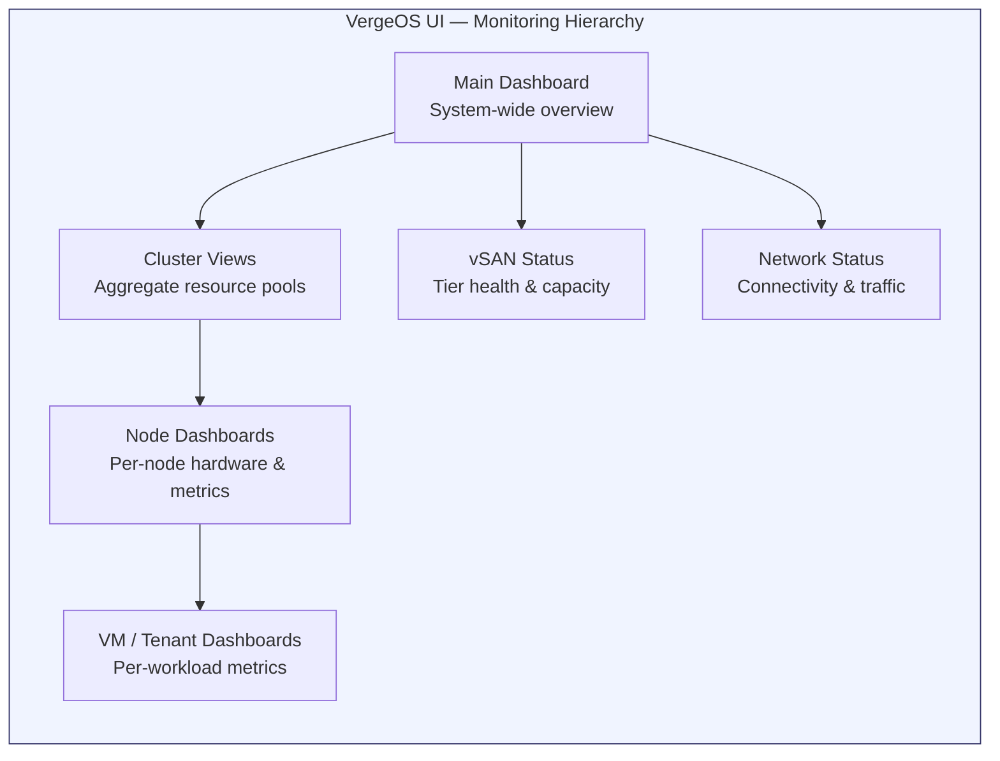

import { Card, CardGrid } from "@astrojs/starlight/components";

## Monitoring Philosophy

VergeOS takes a **single-pane-of-glass** approach to infrastructure monitoring. Every component -- compute, storage, networking, and hardware health -- is visible from the built-in UI without any external monitoring tools. The system provides real-time metrics, historical trends, and event logs at every level: individual nodes, clusters, vSAN tiers, networks, VMs, and tenants.

This page covers the primary monitoring surfaces you will use daily to assess system health and troubleshoot issues.

## Node Dashboard

The **Nodes dashboard** is your primary interface for monitoring individual physical (or virtual) servers in the environment. Navigate to it via **Infrastructure → Nodes**, then select a specific node.

### Node Status Information

At the top of the node dashboard, you will find key status fields:

| Field                    | Description                                                           |
| ------------------------ | --------------------------------------------------------------------- |
| **Status**               | Current operational state -- Running or Offline                       |
| **Maintenance Mode**     | Whether the node is in maintenance state (workloads migrated away)    |
| **Last Powered On**      | Timestamp of the most recent boot                                     |
| **IPMI Status**          | Status of the Intelligent Platform Management Interface               |
| **IPMI Network Address** | BMC/iDRAC/iLO management IP for remote access                         |
| **System Version**       | VergeOS version breakdown -- OS, vSAN, Appserver, and Kernel versions |

### Hardware Configuration

The dashboard also displays the physical hardware profile:

- **CPU** -- Processor model and generation
- **CPU Cores** -- Number of physical cores
- **RAM** -- Total physical memory capacity
- **Failover RAM** -- Memory reserved for failover scenarios
- **Overcommit RAM** -- Memory available for oversubscription
- **Cluster** -- Which cluster this node belongs to
- **Model / Series** -- Hardware platform and product series

### CPU Usage Graph

The CPU usage graph is one of the most frequently consulted metrics. It provides real-time and historical trend visualization with multiple breakdown categories:

| Metric        | What It Shows                                                                 |
| ------------- | ----------------------------------------------------------------------------- |
| **Total CPU** | Aggregate CPU utilization across all cores                                    |
| **Core Peak** | The single highest-utilized core (helps identify single-threaded bottlenecks) |
| **User**      | Time spent in user-space processes                                            |
| **System**    | Time spent in kernel-space operations                                         |
| **IO Wait**   | Time the CPU is idle waiting for I/O operations to complete                   |
| **VM Usage**  | CPU consumed by virtual machines running on this node                         |
| **IRQ**       | Time spent handling hardware and software interrupts                          |

### Node Statistics Cards

Below the CPU graph, the dashboard presents quick-reference metric cards:

- **Physical RAM** -- Current memory utilization percentage and total capacity
- **Virtual RAM** -- Allocated virtual memory (typically 0% when not overcommitted)
- **Temperature** -- Current node temperature with a color-coded indicator (green / yellow / red based on thresholds)
- **Running Machines** -- Count of active VMs, vNet containers, and system services on this node
- **Cores Usage** -- Percentage of CPU cores currently in use
- **RAM Usage** -- Memory consumption across all running machines

## Hardware Resources Panel

The lower section of the node dashboard provides detailed views of every physical hardware component.

### Drives

All physical drives attached to the node are listed with full health data:

| Column                | Purpose                                            |
| --------------------- | -------------------------------------------------- |
| **Status**            | Online / Offline indicator                         |
| **Name**              | Device identifier (e.g., `nvme0n1`, `sda`)         |
| **Model**             | Manufacturer and model number                      |
| **Tier**              | vSAN storage tier assignment (set at install time) |
| **vSAN Drive ID**     | Unique identifier within the vSAN                  |
| **Firmware**          | Current drive firmware version                     |
| **Bus**               | Hardware bus connection type (NVMe, SATA, SAS)     |
| **Usage**             | Capacity utilization with visual progress bar      |
| **Repairing**         | Whether the drive is currently being rebuilt       |
| **Read/Write Errors** | Error counters for proactive health monitoring     |

You can click any drive to access its **S.M.A.R.T.** diagnostics -- reallocated sectors, temperature, power-on hours, wear leveling, and other predictive failure indicators.

### Network Interface Cards (NICs)

Every NIC in the node is displayed with operational and fabric status:

- **Status** -- Up or Down
- **Fabric Status** -- Core fabric connectivity: **Confirmed** (properly integrated) or **Not Confirmed** (issue detected). A globe icon indicates NICs connected to the core fabric
- **Name** -- Interface identifier (e.g., `enp2s0f0`)
- **Model / Vendor / Driver** -- Hardware and software details
- **Speed** -- Negotiated link speed (e.g., 10000 Mb/s, 25000 Mb/s)
- **MAC** -- Hardware MAC address
- **Network** -- Associated VergeOS network
- **RX / TX** -- Total data received and transmitted
- **RX / TX Rate** -- Current transfer rates

### Additional Hardware Sections

| Section                 | What It Shows                                                                           |
| ----------------------- | --------------------------------------------------------------------------------------- |
| **Memory Modules**      | Installed RAM -- module count, capacity, type, and specifications                       |
| **LLDP Neighbors**      | Link Layer Discovery Protocol data -- connected switch, port mappings, network topology |
| **PCI Devices**         | All PCI/PCIe devices with bus assignments and passthrough availability                  |
| **SR-IOV NIC Devices**  | Virtual function count and assignment status for SR-IOV capable NICs                    |
| **NVIDIA vGPU Devices** | GPU model, vGPU profiles available, and allocation status                               |
| **USB Devices**         | Connected USB devices with passthrough capability                                       |

## Fabric Status Monitoring

The **core fabric** is the backbone network connecting all VergeOS nodes. Monitoring fabric health is critical because fabric degradation impacts vSAN replication, VM live migration, and inter-node communication.

On each node's NIC table, look for the **Fabric Status** column:

- **Confirmed** (green globe) -- The NIC is properly integrated into the core fabric and communicating with peer nodes
- **Not Confirmed** (warning indicator) -- The NIC is not successfully participating in the fabric. This may indicate a cable issue, switch misconfiguration, or NIC failure

:::tip[Quick Fabric Health Check]
From the main dashboard, navigate to **Infrastructure → Nodes** and scan the NIC fabric status across all nodes. Every core fabric NIC should show **Confirmed**. Any **Not Confirmed** status warrants immediate investigation -- check physical cabling, switch port configuration, and NIC driver status.
:::

## Event Logs

Every node dashboard includes an **Event Logs** section that displays system events scoped to that node. Events are classified by severity level:

| Level       | Description                                         | Examples                                                         |
| ----------- | --------------------------------------------------- | ---------------------------------------------------------------- |
| **Error**   | Critical issues requiring immediate attention       | Drive failure, node offline, vSAN degraded                       |
| **Warning** | Conditions that may lead to problems if unaddressed | Temperature threshold exceeded, drive errors increasing          |
| **Info**    | Normal operational events                           | Power state changes, maintenance mode transitions, VM migrations |

### Common Log Entries

- **Temperature warnings** -- `"Core has reached warning temperature '96 / 95'"` indicates a CPU core exceeded the configured threshold (default 95°C)
- **Drive status events** -- Notifications when drives go offline, begin repairing, or report new read/write errors
- **Power state changes** -- Records of node reboots, shutdowns, and power-on events
- **Maintenance mode transitions** -- Logs when a node enters or exits maintenance mode

Each log entry includes the **timestamp**, **source** (e.g., `node1`), and a **detailed message**. Click **View More** to access the full log history.

## Node Management Actions

The left-side menu on the node dashboard provides essential management operations:

### Power Control

- **Power On / Off** -- Standard power operations via IPMI
- **Reboot** -- Graceful restart of the node
- **Kill Power** -- Force shutdown (use only when graceful methods fail)

### Maintenance Mode

**Always enable maintenance mode before performing hardware changes or system updates.** When you place a node in maintenance mode, VergeOS automatically live-migrates all running workloads to other nodes in the cluster, ensuring zero downtime for VMs and services.

### Remote Console

Provides direct console access to the node via IPMI/iDRAC/iLO. Use this for troubleshooting scenarios where the VergeOS UI is unreachable or you need BIOS-level access.

### Additional Actions

- **Edit** -- Modify node settings (failover RAM, overcommit, tags)
- **Scale Up** -- Add resources to the cluster from this node
- **Diagnostics** -- Access node-level diagnostic tools (ARP scan, ethtool, IPMI sensors, S.M.A.R.T. tests, and more)
- **Refresh** -- Force an update of all dashboard data

## Cluster-Level Views

While node dashboards show individual server health, **cluster views** provide aggregate resource utilization across all nodes in a cluster.

Navigate to **System → Clusters** to see:

- **Total CPU** -- Combined processing capacity and utilization across all nodes
- **Total RAM** -- Aggregate memory with utilization breakdown
- **Node Count** -- Number of active vs. total nodes in the cluster
- **Workload Distribution** -- How VMs and services are spread across nodes

Cluster views are essential for capacity planning -- they help you identify when a cluster is approaching resource limits and when it is time to scale out with additional nodes.

## vSAN Status Overview

The vSAN status is accessible from the main dashboard by clicking the **vSAN Tiers** count box, or via **System → vSAN**.

Key indicators include:

- **Tier Health** -- Per-tier status showing whether each tier is operating normally (`working=true`) or degraded
- **Capacity per Tier** -- Total, used, and available storage for each tier
- **Redundancy Status** -- Whether data redundancy requirements are met (critical after a drive or node failure)
- **Repair Status** -- Active repair operations and progress (should be all zeros during normal operation)
- **Device Count** -- Number of drives participating in each tier

:::caution[Storage Throttling Thresholds]
VergeOS applies automatic I/O throttling as storage fills up:

- **Below 91%** -- Normal operation, no throttling
- **91–95%** -- Low space throttling begins (10ms latency added)
- **96%+** -- Critical throttling (50ms latency added) with severe performance degradation

Monitor tier capacity proactively and configure alerts before reaching these thresholds.
:::

## Network Status

Network health is monitored from **Networks** in the main navigation. For each network (external, internal, DMZ, tenant networks), you can view:

- **Connectivity status** -- Whether the network is running and reachable
- **Traffic statistics** -- RX/TX volume and rates per network
- **Connected machines** -- Which VMs and services are attached
- **Firewall rule hit counts** -- Activity on configured firewall rules
- **Network-specific logs** -- Events scoped to that particular network

## Running Machines View

Each node dashboard includes a **Running Machines** section showing all active workloads:

| Column           | Description                                        |
| ---------------- | -------------------------------------------------- |
| **Status**       | Running state indicator                            |
| **Type**         | Virtual Machine, vNet Container, or system service |
| **Name**         | Machine identifier                                 |
| **CPU Cores**    | Number of assigned cores                           |
| **CPU Usage**    | Current processor utilization percentage           |
| **RAM**          | Allocated memory with utilization percentage       |
| **Last Started** | Timestamp of when the workload was started         |

Common machine types include VMs, vNet containers (network services), and system services (NAS, DMZ, External network, etc.).

:::note[Coming from VMware or Nutanix?]
| Platform | Where the data lives |
| --- | --- |
| VMware | vCenter for cluster/VM metrics, ESXi host client for per-host hardware, vROps/Aria for trends, BMC/iLO for thermals |
| Nutanix | Prism Element per cluster, Prism Central across clusters, BMC/IPMI for sensor detail, `ncli` for advanced diagnostics |
| VergeOS | One UI: node hardware, cluster resources, storage health, network status, and workload metrics share the same dashboards |
:::

## Best Practices

<CardGrid>
  <Card title="Daily Health Checks" icon="approve-check">
    Review node temperatures, drive error counters, and fabric status across all
    nodes. Address any **Not Confirmed** fabric NICs or increasing drive errors
    immediately.
  </Card>
  <Card title="Use Maintenance Mode" icon="setting">
    Always enable maintenance mode before hardware changes, firmware updates, or
    system updates. This ensures workloads are live-migrated away before you
    touch the node.
  </Card>
  <Card title="Monitor vSAN Capacity" icon="document">
    Keep tier utilization below 85% to maintain performance headroom. Configure
    subscription alerts (covered in the next section) to notify you before
    reaching throttling thresholds.
  </Card>
  <Card title="Review Logs Regularly" icon="list-format">
    Periodically check event logs for temperature warnings, drive errors, and
    unexpected state changes. Catching issues early prevents cascading failures.
  </Card>
</CardGrid>
