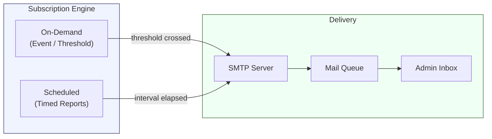

import { Card, CardGrid } from "@astrojs/starlight/components";

## Proactive Monitoring with Subscriptions

Dashboards and logs are reactive -- you see problems when you look. **Subscriptions** make VergeOS monitoring proactive by delivering email notifications when conditions change or on a regular schedule. Every VergeOS environment should have a core set of subscriptions configured from day one so that administrators learn about issues before end users do.

Subscriptions require a working **SMTP configuration** (covered later on this page). Once SMTP is in place, any dashboard, tier, network, VM, tenant, or other VergeOS object can have one or more subscriptions attached to it.

## Subscription Types

VergeOS provides two complementary subscription types. An effectively monitored environment uses **both** types together -- on-demand subscriptions for immediate issue awareness, and scheduled subscriptions for trend tracking and daily oversight.

### On-Demand Subscriptions

On-demand subscriptions are **event-driven or threshold-triggered** alerts. They fire as soon as a condition is met, ensuring administrators are notified of potential issues in near real-time.

Common triggers for on-demand subscriptions include:

| Trigger Category      | Example                                                        |
| --------------------- | -------------------------------------------------------------- |
| **Storage threshold** | vSAN tier reaches a specified percentage of capacity used      |
| **Update available**  | New VergeOS update packages are ready to install               |
| **Errors / Warnings** | Any error or warning event is logged on a monitored object     |
| **Status changes**    | A node goes offline, a VM stops unexpectedly, a network faults |

On-demand subscriptions are the first line of defense -- they tell you something needs attention **right now**.

### Scheduled Subscriptions

Scheduled subscriptions deliver **dashboard or listing information at configured time intervals**. They are designed to provide regular summaries of system health and assist administrators with everyday supervision and trend tracking.

Examples of scheduled subscriptions:

- **System dashboard** sent daily at 7:00 AM -- gives the team a morning health snapshot
- **vSAN tier dashboard** sent weekly -- tracks capacity growth trends over time
- **VM listing** sent weekly -- reviews running workload inventory
- **Tenant dashboard** sent daily -- monitors tenant resource consumption

:::tip[Efficient Monitoring]
A well-monitored VergeOS environment will have **multiple on-demand and scheduled subscriptions** configured. On-demand subscriptions catch acute events; scheduled subscriptions reveal slow-moving trends like gradual capacity consumption.
:::

## Creating a Subscription

Subscriptions are managed from **System > Subscriptions** in the VergeOS UI. The creation workflow walks you through the following fields:

### Step-by-Step Configuration

1. Navigate to **System > Subscriptions** from the Cloud Dashboard
2. Select **New** from the left menu
3. Configure the subscription fields:

| Field           | Description                                                                                       |
| --------------- | ------------------------------------------------------------------------------------------------- |
| **Owner Type**  | **User** (individual recipient) or **Group** (team of recipients)                                 |
| **Owner**       | Select the specific user or group from the dropdown                                               |
| **Target Type** | The category of VergeOS object to monitor (e.g., Cluster, vSAN Tier, Network, VM, Tenant, System) |
| **Target**      | The specific instance of that object type (e.g., "Tier 1 - SSD", "Production Network", "Node 1")  |
| **Type**        | **On-Demand** (triggered) or **Scheduled** (timed)                                                |

### On-Demand Settings

When the subscription type is set to **On-Demand**, additional fields appear:

| Field                 | Description                                                                            |
| --------------------- | -------------------------------------------------------------------------------------- |
| **Trigger**           | The condition that fires the alert (threshold, error, warning, status change)          |
| **Throttle**          | Minimum time between repeated alerts for the same condition -- prevents inbox flooding |
| **Reminder Interval** | How often to re-send the alert while the condition persists (e.g., every 4 hours)      |

The **throttle** setting is critical for noisy environments. Without it, a flapping condition (e.g., a temperature sensor oscillating around a threshold) could generate hundreds of emails. Set the throttle to a reasonable interval -- 15 to 60 minutes is typical for most alerts.

The **reminder interval** ensures that a persistent problem is not forgotten. If a vSAN tier is at 90% capacity and no one acts on the initial alert, the reminder will re-notify at the configured interval until the condition clears.

### Scheduled Settings

When the subscription type is set to **Scheduled**, you configure the delivery timing:

| Field         | Description                                           |
| ------------- | ----------------------------------------------------- |
| **Frequency** | How often the report is sent (e.g., daily, weekly)    |
| **Time**      | The time of day the report is generated and delivered |
| **Day**       | For weekly schedules, which day of the week           |

## Subscription Profiles and Targeting

VergeOS subscriptions are flexible in their targeting — you can create subscriptions against virtually any object in the system:

<CardGrid>
  <Card title="System-Level" icon="laptop">
    Monitor the overall system dashboard, cluster health, or update availability
    across the entire environment.
  </Card>
  <Card title="Storage-Level" icon="document">
    Track individual vSAN tiers for capacity thresholds, drive errors, or
    degraded redundancy states.
  </Card>
  <Card title="Network-Level" icon="random">
    Alert on network faults, connectivity changes, or traffic anomalies on
    specific internal or external networks.
  </Card>
  <Card title="Workload-Level" icon="rocket">
    Monitor individual VMs or tenant environments for status changes, resource
    exhaustion, or error events.
  </Card>
</CardGrid>

This granular targeting means you can build a subscription strategy that matches your operational model -- broad system-level alerts for the infrastructure team, and specific VM or tenant alerts for application owners or MSP customers.

## Common Alert Configurations

The following subscription configurations represent best practices for most VergeOS deployments. Consider these as a **starting template** and customize based on your environment.

### Storage Capacity Alerts

| Setting         | Value                                         |
| --------------- | --------------------------------------------- |
| **Target Type** | vSAN Tier                                     |
| **Target**      | Each tier individually (Tier 1, Tier 2, etc.) |
| **Type**        | On-Demand                                     |
| **Trigger**     | Storage % used threshold (e.g., 80%, 90%)     |
| **Throttle**    | 60 minutes                                    |
| **Reminder**    | 4 hours                                       |

Create separate subscriptions at multiple thresholds (80% warning, 90% critical) to provide escalating urgency.

### Node Offline Detection

| Setting         | Value                              |
| --------------- | ---------------------------------- |
| **Target Type** | Node                               |
| **Target**      | Each node individually             |
| **Type**        | On-Demand                          |
| **Trigger**     | Status change (Running to Offline) |
| **Throttle**    | 15 minutes                         |
| **Reminder**    | 1 hour                             |

### vSAN Degraded State

| Setting         | Value                  |
| --------------- | ---------------------- |
| **Target Type** | vSAN Tier              |
| **Target**      | Each tier individually |
| **Type**        | On-Demand              |
| **Trigger**     | Error / Warning status |
| **Throttle**    | 30 minutes             |
| **Reminder**    | 2 hours                |

### Update Availability

| Setting         | Value                     |
| --------------- | ------------------------- |
| **Target Type** | System                    |
| **Type**        | On-Demand                 |
| **Trigger**     | Update packages available |
| **Throttle**    | 24 hours                  |
| **Reminder**    | 7 days                    |

### Daily System Health Report

| Setting         | Value            |
| --------------- | ---------------- |
| **Target Type** | System Dashboard |
| **Type**        | Scheduled        |
| **Frequency**   | Daily            |
| **Time**        | 7:00 AM          |

## SMTP Configuration Prerequisite

Subscriptions rely entirely on email delivery. Before any subscription can send notifications, **SMTP must be configured** at **System > SMTP** in the VergeOS UI.

VergeOS provides a built-in mail server that can either send email **directly** or route through an **SMTP relay** service.

### SMTP Settings

Navigate to **System > SMTP > Edit Settings** and configure the following:

| Setting            | Description                                                                                    |
| ------------------ | ---------------------------------------------------------------------------------------------- |
| **Use TLS**        | Enable/disable TLS encryption -- always enable when supported by the relay or receiving server |
| **Hostname**       | FQDN of the sending server -- must resolve in DNS with proper SPF, DMARC, and reverse DNS      |
| **From Name**      | Display name that appears in email messages (e.g., "VergeOS Alerts")                           |
| **From Address**   | Source email address for all subscription emails                                               |
| **Relay Host**     | Address of an external SMTP relay server (leave blank for direct sending)                      |
| **Relay Port**     | TCP port for the relay -- 25 (unencrypted), 587 (TLS/STARTTLS), or 465 (legacy SSL)            |
| **Relay User**     | Username for relay authentication (if required)                                                |
| **Relay Password** | Password for relay authentication (if required)                                                |

### Direct Send vs. Relay

| Approach        | Pros                                            | Cons                                                     |
| --------------- | ----------------------------------------------- | -------------------------------------------------------- |
| **Direct Send** | No external dependencies, immediate delivery    | Requires proper DNS/SPF/DMARC/rDNS, may be spam-filtered |
| **SMTP Relay**  | Better deliverability, simpler DNS requirements | Depends on external service, may have rate limits        |

:::tip[Practical Recommendation]
Many customers opt for a commercial SMTP relay service (e.g., SendGrid, Amazon SES, or an internal Exchange relay) because it simplifies DNS configuration, improves deliverability, and avoids spam filtering issues. The relay provider will supply the correct host, port, and credentials for your SMTP configuration.
:::

### DNS and Deliverability Requirements

When using **direct send** (no relay), the following DNS records must be properly configured to avoid email being rejected or marked as spam:

- **SPF record** -- Authorizes the VergeOS server IP to send email for the configured domain
- **DMARC record** -- Defines the domain's email authentication policy
- **Reverse DNS (PTR)** -- The sending IP must have a PTR record that matches the configured hostname
- **MX record** -- While not required for sending, proper MX configuration helps establish domain legitimacy

### SMTP Dashboard and Monitoring

The **SMTP Dashboard** (System > SMTP) provides operational visibility into email delivery:

- **Mail Queue** -- View pending messages, retry status, and delivery failures
- **Mail Log** -- Audit trail of all sent messages with timestamps and delivery status
- **Test Email** -- Send a test message to verify configuration before relying on it for production alerts

Always send a **test email** after configuring SMTP and before creating subscriptions. This validates end-to-end delivery including DNS resolution, TLS negotiation, relay authentication, and inbox placement.

## Subscription Management

### Viewing and Editing Subscriptions

All configured subscriptions are listed at **System > Subscriptions**. From this view you can:

- See the owner, target, type, and status of each subscription
- Edit existing subscriptions to adjust thresholds, throttle intervals, or recipients
- Delete subscriptions that are no longer needed
- Quickly identify which objects have alert coverage and which do not

### Multi-Tenant Considerations

In multi-tenant environments, subscriptions can be configured **at each tenant level independently**. This means:

- The **service provider** configures system-level subscriptions on the host environment
- Each **tenant administrator** can configure their own subscriptions within their tenant scope
- Tenant subscriptions only have visibility into their own resources -- they cannot see or alert on host-level objects

This isolation ensures that MSP customers can self-manage their own alerting without requiring provider intervention.

:::note[Coming from VMware or Nutanix?]
A VergeOS subscription combines "what to monitor", "when to fire", and "who to notify" into one object. Both VMware and Nutanix split those across separate constructs.

| Platform | Condition | Routing | Scheduled reports |
| --- | --- | --- | --- |
| VMware | vCenter Alarm definitions on predefined types | Alarm Actions + SMTP under Mail Sender | Typically vROps/Aria, not native |
| Nutanix | Prism Central Alert Policies | Notification Policies (email/Slack/webhook) | Prism Central Reports with delivery schedules |
| VergeOS | Subscription targets any dashboard or object | Same subscription handles delivery | Scheduled subscriptions for recurring dashboard reports |
:::

## Key Takeaways

<CardGrid>
  <Card title="Two Subscription Types" icon="approve-check">
    **On-Demand** for immediate event/threshold alerts and **Scheduled** for
    recurring dashboard reports. Use both together for full coverage.
  </Card>
  <Card title="SMTP First" icon="warning">
    Configure and test SMTP delivery before creating any subscriptions. Direct
    send or relay -- both work, but relay is often simpler to maintain.
  </Card>
  <Card title="Throttle and Remind" icon="setting">
    Use throttle settings to prevent alert storms and reminder intervals to
    ensure persistent issues are not forgotten.
  </Card>
  <Card title="Target Anything" icon="star">
    Subscriptions can target any VergeOS object -- systems, clusters, tiers,
    networks, VMs, and tenants -- for maximum monitoring flexibility.
  </Card>
</CardGrid>
