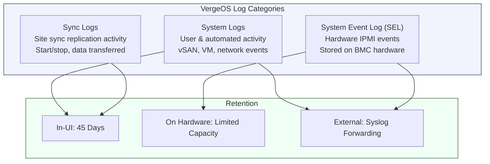

import { Card, CardGrid } from "@astrojs/starlight/components";

## The Role of Logs in VergeOS Operations

Logs are the audit trail and diagnostic backbone of every VergeOS environment. They record user-initiated actions, automated system events, hardware sensor readings, and replication activity -- providing the evidence you need to troubleshoot issues, satisfy compliance requirements, and understand what happened and when.

VergeOS organizes logs into three distinct categories, each serving a different purpose and stored in a different location. Understanding these categories is essential for knowing where to look when diagnosing a problem and how to ensure long-term retention.



## Log Types in Detail

### System Logs

System logs are the primary log category in VergeOS. They capture activities related to **vSAN operations, VM lifecycle events, network changes, user logins, configuration modifications**, and other system-related operations. These logs are essential for understanding the detailed operations and performance of the entire environment.

Examples of system log entries include:

| Event Type              | Example Log Entry                                          |
| ----------------------- | ---------------------------------------------------------- |
| **User authentication** | IP address, username, login timestamp                      |
| **Password changes**    | Which user changed which password, from which environment  |
| **VM operations**       | VM started, stopped, migrated, snapshot created            |
| **Storage events**      | Drive warnings, vSAN tier status changes, SMART alerts     |
| **Network events**      | Network created, firewall rule modified, NIC status change |
| **System operations**   | Update downloaded, node rebooted, maintenance mode enabled |

System logs are accessible from the **Main Dashboard** (at the bottom of the page) or by selecting **Logs** from the top menu. Each log entry includes a **level** (Info, Warning, or Error), a **timestamp**, a **source** (e.g., node1, vSAN, admin), and a **message** describing the event.

### Sync Logs

Sync logs are specific to **site sync (replication)** operations. They are available on both incoming and outgoing sync dashboards and provide detailed statistics for each snapshot synchronization job:

- **Start and stop times** for each sync operation
- **Amount of data checked** -- total data evaluated for changes
- **Amount of data scanned** -- data read during the sync
- **Amount of data sent** -- gross data transmitted
- **Net data sent** -- actual bytes transferred after deduplication
- **Directory and file counts** -- scope of the sync operation

Sync logs are invaluable for monitoring replication health, verifying that disaster recovery jobs are completing on schedule, and diagnosing bandwidth or performance issues with site-to-site synchronization.

### System Event Log (SEL)

The System Event Log (SEL) contains events from the **hardware IPMI interface** (Intelligent Platform Management Interface). Unlike system logs, the SEL is **stored directly on the server's BMC hardware**, which means it has a **limited and fixed capacity**. Once the SEL is full, new events cannot be recorded until it is cleared.

The node dashboard displays a **percentage bar** indicating how much SEL capacity is currently used on each node. Common SEL entries include:

- Temperature threshold crossings
- Fan speed warnings
- Power supply events
- Memory ECC errors
- Processor thermal events
- Hardware initialization events

:::caution[SEL Capacity Is Limited]
The SEL is stored on the server's Baseboard Management Controller (BMC) and has a fixed size -- typically a few hundred entries. If the SEL fills up completely, new hardware events are silently dropped. Monitor the SEL capacity percentage on each node dashboard and clear the SEL proactively.
:::

## In-UI Log Retention

VergeOS retains system logs within the user interface for a maximum of **45 days**. After this period, logs are automatically deleted from the UI. This retention window is sufficient for day-to-day troubleshooting and short-term auditing, but organizations with compliance requirements (HIPAA, SOC 2, PCI-DSS, etc.) will need to configure **remote log forwarding** to retain logs for longer periods.

### Context-Specific Logs

One of the most practical features of VergeOS logging is **context-specific log filtering**. In many areas of the platform -- such as an individual VM dashboard, a network dashboard, or a tenant dashboard -- there is a **Logs** button that displays only the logs relevant to that specific object.

This scoping eliminates the need to manually search through thousands of system-wide log entries. For example:

- **VM dashboard → Logs** shows only events related to that specific VM (start, stop, migrate, snapshot, error)
- **Network dashboard → Logs** shows only network-related events (rule changes, status changes, connectivity events)
- **Tenant dashboard → Logs** shows only events within that tenant's scope

Context-specific logs dramatically accelerate troubleshooting by narrowing the signal-to-noise ratio to exactly the object under investigation.

## Remote Syslog Forwarding

For organizations that require log retention beyond 45 days or need to integrate VergeOS logs into a centralized log management platform (Graylog, Splunk, Elastic Stack, Datadog, etc.), VergeOS supports **remote syslog forwarding** via standard syslog protocols.

### Configuration Steps

Remote syslog forwarding is configured through **Advanced Settings** in the VergeOS UI:

#### Step 1: Configure the Remote Syslog Server

1. Navigate to **System → Settings → Advanced Settings**
2. In the **Setting** column, type `syslog` and press **Enter** to search
3. Select and edit **Remote syslog server (tcp: @@name/ip:port, udp: @name/ip:port)**
4. Enter the syslog destination using the appropriate syntax:

| Protocol | Syntax          | Example             | Notes                                 |
| -------- | --------------- | ------------------- | ------------------------------------- |
| **TCP**  | `@@<ip>:<port>` | `@@10.10.10.10:514` | Reliable delivery, recommended        |
| **UDP**  | `@<ip>:<port>`  | `@10.10.10.10:514`  | Lower overhead, no delivery guarantee |

5. Click **Submit** to save

#### Step 2: Configure the Format Template

1. Search for `syslog` again in the Advanced Settings
2. Select and edit **Template to define for syslog server (See rsyslog for format)**
3. Enter a syslog template format compatible with your remote server

For **Graylog** using RFC 5424 format:

```
GRAYLOGRFC5424,"<%PRI%>%PROTOCOL-VERSION% %TIMESTAMP:::date-rfc3339% %HOSTNAME%.your-hostname-here %APP-NAME% %PROCID% %MSGID% %STRUCTURED-DATA% %msg%\n"
```

:::tip[Template Customization]
Replace `your-hostname-here` with your actual hostname to make log entries easily identifiable in your centralized log platform. The template follows rsyslog syntax -- consult the [rsyslog documentation](https://www.rsyslog.com/doc/master/configuration/examples.html) for additional format options.
:::

4. Click **Submit** to save

#### Step 3: Verify Forwarding

After completing the configuration, logs will begin forwarding to the specified syslog server. Check your remote server's incoming logs to verify that VergeOS entries are being received successfully. Common verification steps:

- Confirm network connectivity between VergeOS and the syslog server (port 514 or custom port)
- Verify firewall rules allow syslog traffic in both directions
- Check the remote server's log ingestion dashboard for incoming entries
- Generate a test event (e.g., log in/out of the VergeOS UI) and confirm it appears on the remote server

### Prerequisites for Syslog Forwarding

Before configuring remote log forwarding, ensure the following:

- **Network connectivity** between the VergeOS system and the remote syslog server
- **Firewall rules** allowing syslog traffic (typically TCP or UDP port 514, or your custom port)
- **Access to VergeOS System Settings** with administrative privileges
- The remote syslog server is configured to **accept incoming connections** from the VergeOS IP range

## SEL Management

Because the SEL has limited hardware capacity, it requires periodic maintenance to ensure new events can always be recorded.

### Monitoring SEL Capacity

The **node dashboard** displays a percentage bar showing the current SEL usage for each node. Monitor this indicator regularly -- especially on older hardware that may generate more IPMI events.

### Clearing the SEL

When the SEL is nearing full capacity, clear it with the following procedure:

1. Navigate to **Infrastructure → Nodes**
2. Double-click the desired node to access the **Node Dashboard**
3. Click **Clear SEL** on the left menu
4. Click **Yes** to confirm

:::tip[Proactive SEL Management]
Consider establishing a regular schedule for clearing the SEL -- for example, monthly or quarterly -- to prevent it from reaching capacity. Before clearing, export the SEL entries to your remote syslog server or document any significant events for your records.
:::

### Filtering False-Positive SEL Entries

Some server hardware generates repetitive or benign IPMI events that clutter the SEL and the system logs. Common false positives include:

- Sensor readings that briefly cross thresholds during boot sequences
- Power supply events during planned maintenance windows
- Temperature spikes during short burst workloads that resolve immediately

For persistent false-positive entries, VergeOS supports filtering via a hex-encoded syslog regex filter configured through the API. After applying the filter, restart the `openipmi` service to activate the change. Work with VergeOS support for guidance on implementing SEL filters specific to your hardware platform.

## SMTP Activity Reports

In addition to system logs and syslog forwarding, VergeOS provides **SMTP delivery reports** through the SMTP Dashboard (covered in the [Subscriptions & Alerts](/training/09-monitoring-troubleshooting/02-alerts/) page). These reports offer visibility into email delivery activity:

- **Mail Queue** -- View pending messages, retry status, and delivery failures
- **Mail Log** -- Audit trail of all sent subscription emails with timestamps and delivery status
- **Daily delivery summaries** -- Track yesterday's and today's SMTP activity to confirm alerts are being delivered

SMTP activity reports complement log management by providing a secondary verification channel -- if you expect to receive an alert but do not, the SMTP log can reveal whether the message was queued, delivered, or rejected.

## Log Management Best Practices

<CardGrid>
  <Card title="Forward Logs Externally" icon="rocket">
    Configure remote syslog forwarding from day one. The 45-day in-UI retention
    is insufficient for most compliance frameworks and limits long-term trend
    analysis.
  </Card>
  <Card title="Monitor SEL Capacity" icon="warning">
    Check the SEL percentage bar on each node dashboard regularly. Clear the SEL
    before it reaches capacity to prevent loss of new hardware events.
  </Card>
  <Card title="Use Context-Specific Logs" icon="magnifier">
    When troubleshooting a specific VM, network, or tenant, use the
    context-specific Logs button on that object's dashboard to filter out
    unrelated noise.
  </Card>
  <Card title="Establish Retention Policies" icon="document">
    Define organizational retention requirements early. Use syslog forwarding to
    a centralized platform for long-term storage, search, and compliance
    auditing.
  </Card>
</CardGrid>

:::note[VMware Bridge]
vCenter splits "Tasks" (operations) from "Events" (status/alerts); VergeOS unifies them into one log stream with Info/Warning/Error filtering. External forwarding on VMware uses the Syslog Collector appliance or per-host `esxcli system syslog config set`, while VergeOS configures it in two Advanced Settings fields. UI log retention is fixed at 45 days in VergeOS; longer retention requires syslog forwarding.
:::

:::note[Nutanix Bridge]
Nutanix splits operational visibility into Prism Central Audit Logs and Prism Element Alerts, with retention scaled to cluster storage rather than a fixed window. External forwarding uses per-CVM `rsyslog` or Prism Central's Log Collector; VergeOS forwards via two system-wide settings. Both platforms expose IPMI/SEL through the UI and recommend proactive SEL clearing plus external retention for compliance.
:::

## Key Takeaways

<CardGrid>
  <Card title="Three Log Types" icon="list-format">
    **System logs** for operational events, **Sync logs** for replication
    activity, and **SEL** for hardware IPMI events. Each serves a distinct
    troubleshooting purpose.
  </Card>
  <Card title="45-Day UI Retention" icon="information">
    VergeOS retains system logs for 45 days in the UI. Configure remote syslog
    forwarding for longer retention and compliance requirements.
  </Card>
  <Card title="Simple Syslog Setup" icon="setting">
    Two Advanced Settings fields -- syslog server address and template format --
    configure log forwarding for the entire environment. TCP (`@@`) for
    reliability, UDP (`@`) for performance.
  </Card>
  <Card title="SEL Requires Maintenance" icon="warning">
    The hardware SEL has fixed capacity. Monitor the percentage bar on each node
    dashboard and clear the SEL proactively to prevent event loss.
  </Card>
</CardGrid>
