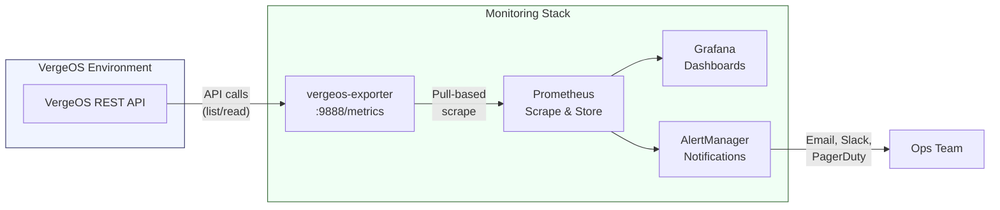

import { Card, CardGrid } from "@astrojs/starlight/components";

## Why External Metrics Matter

The VergeOS dashboard provides real-time health and analytics, but enterprise monitoring strategies typically require a centralized, time-series store that can aggregate metrics across multiple systems, retain data beyond the 45-day in-UI window, and trigger sophisticated alerting rules. The **vergeos-exporter** bridges this gap by exposing VergeOS metrics in Prometheus format -- the de facto standard for cloud-native monitoring.

With the exporter running, you gain long-term trend analysis, cross-system correlation, and integration with existing alerting pipelines -- all without modifying the VergeOS system itself.



## The vergeos-exporter

The **vergeos-exporter** is an open-source tool maintained by Verge in the [verge-io/vergeos-exporter](https://github.com/verge-io/vergeos-exporter) GitHub repository. It connects to the VergeOS REST API, collects infrastructure metrics, and exposes them on an HTTP endpoint that Prometheus scrapes at a configurable interval.

### Metrics Exposed

The exporter collects three categories of metrics:

<CardGrid>
  <Card title="vSAN Tier Metrics" icon="document">
    Capacity, usage, and allocation per tier. Transaction and repair counts.
    Drive state monitoring (online, offline, repairing, initializing, verifying,
    noredundant, outofspace). Drive temperature and health data. Read/write
    operations and IOPS.
  </Card>
  <Card title="Cluster Metrics" icon="rocket">
    Node count per cluster. RAM, CPU, and disk utilization. Synchronization
    status and health.
  </Card>
  <Card title="Node Metrics" icon="setting">
    Per-node CPU and memory usage. Network throughput and latency. Service
    status per node.
  </Card>
</CardGrid>

A complete metric reference is available in the `metrics.md` file in the exporter repository.

### Architecture: Pull-Based Scraping

The vergeos-exporter follows the standard Prometheus pull model. Prometheus initiates the connection by scraping the `/metrics` endpoint on the exporter at a configured interval (typically 15–60 seconds). This approach means:

- **No inbound firewall rules** are required on the VergeOS system itself
- The exporter can run on **any host** with network access to the VergeOS API
- Multiple Prometheus instances can scrape the same exporter for HA
- The exporter is **AlertManager-compatible** -- Prometheus alerting rules work natively with the exposed metrics

## Service Account Configuration

Before deploying the exporter, create a dedicated service account in VergeOS with minimal privileges.

### Step-by-Step: Create the Exporter Service Account

1. Navigate to **System → Users** in the VergeOS UI
2. Click **New** to create a new user
3. Configure the account:
   - **Username:** `prometheus-exporter` (or similar descriptive name)
   - **Permissions:** Grant only **List** and **Read** permissions
   - **MFA:** Leave **disabled** -- the exporter authenticates via API username/password and does not support MFA tokens
4. Click **Submit** to save

:::caution[Security Best Practice]
Never use an admin account for the exporter. The service account needs only list and read access to query metrics. Disabling MFA on this account is acceptable because it is a machine-to-machine credential -- compensate by using a strong, randomly generated password and restricting network access to the exporter host.
:::

## Deployment Options

The vergeos-exporter supports multiple deployment models. Choose the one that best fits your monitoring infrastructure.

### Option 1: Standalone Binary

Pre-built binaries are available for Linux, Windows, and macOS (amd64 and arm64) from the [GitHub Releases](https://github.com/verge-io/vergeos-exporter/releases) page.

```bash
# Download and extract (Linux amd64 example)
wget https://github.com/verge-io/vergeos-exporter/releases/latest/download/vergeos-exporter-linux-amd64.tar.gz
tar xzf vergeos-exporter-linux-amd64.tar.gz

# Run with required flags
./vergeos-exporter \
  -verge.url https://your-vergeos-host \
  -verge.username prometheus-exporter \
  -verge.password 'YourStrongPassword'
```

The exporter listens on port **9888** by default. Override with the `-web.listen-address` flag if needed.

### Option 2: Linux Systemd Service

For production Linux deployments, run the exporter as a managed systemd service:

```ini
# /etc/systemd/system/vergeos-exporter.service
[Unit]
Description=VergeOS Prometheus Exporter
After=network-online.target
Wants=network-online.target

[Service]
Type=simple
User=vergeos_exporter
ExecStart=/usr/local/bin/vergeos-exporter \
  -verge.url https://your-vergeos-host \
  -verge.username prometheus-exporter \
  -verge.password 'YourStrongPassword'
Restart=on-failure
RestartSec=5

[Install]
WantedBy=multi-user.target
```

```bash
# Create the service user, enable, and start
sudo useradd -r -s /usr/sbin/nologin vergeos_exporter
sudo systemctl daemon-reload
sudo systemctl enable --now vergeos-exporter
```

### Option 3: Windows Service (NSSM)

On Windows monitoring hosts, use [NSSM (Non-Sucking Service Manager)](https://nssm.cc/) to run the exporter as a Windows service:

1. Download NSSM and place `nssm.exe` in a permanent location (e.g., `C:\Program Files\nssm\`)
2. Register the service:

```powershell
nssm install vergeos-exporter "C:\monitoring\vergeos-exporter.exe"
nssm set vergeos-exporter AppParameters "-verge.url https://your-vergeos-host -verge.username prometheus-exporter -verge.password YourStrongPassword"
nssm set vergeos-exporter Start SERVICE_AUTO_START
nssm start vergeos-exporter
```

### Option 4: Docker Compose

The repository includes a ready-made Docker Compose example under `examples/docker-compose/` that bundles the exporter, Prometheus, and Grafana into a single stack -- ideal for quick evaluation or lab environments.

```yaml
# Simplified docker-compose.yml structure
services:
  vergeos-exporter:
    image: vergeos-exporter:latest
    ports:
      - "9888:9888"
    environment:
      - VERGE_URL=https://your-vergeos-host
      - VERGE_USERNAME=prometheus-exporter
      - VERGE_PASSWORD=YourStrongPassword

  prometheus:
    image: prom/prometheus:latest
    ports:
      - "9090:9090"
    volumes:
      - ./prometheus.yml:/etc/prometheus/prometheus.yml

  grafana:
    image: grafana/grafana:latest
    ports:
      - "3000:3000"
```

The Docker Compose example automatically retrieves the correct platform-specific binary for your architecture.

## Prometheus Configuration

Add the exporter as a scrape target in your `prometheus.yml`:

```yaml
scrape_configs:
  - job_name: "vergeos"
    scrape_interval: 30s
    scrape_timeout: 30s
    static_configs:
      - targets: ["exporter-host:9888"]
        labels:
          environment: "production"
          cluster: "site-a"
```

For monitoring multiple VergeOS environments, deploy one exporter per environment and add each as a separate target (or use Prometheus relabeling for dynamic discovery).

## Grafana Dashboard

The vergeos-exporter ships with a pre-configured Grafana dashboard (`examples/grafana-dashboard.json`) covering vSAN, cluster, and node metrics out of the box.

### Dashboard Panels Include

| Category             | Panels                                                             |
| -------------------- | ------------------------------------------------------------------ |
| **vSAN Performance** | Tier capacity and usage gauges, IOPS charts, read/write throughput |
| **Cluster Health**   | Node count, sync status, aggregate CPU and RAM utilization         |
| **Node Details**     | Per-node CPU, memory, network throughput, and temperature          |
| **Storage Health**   | Drive states, repair status, error counters                        |

### Importing the Dashboard

1. Open Grafana and navigate to **Dashboards → Import**
2. Click **Upload JSON file** and select the `grafana-dashboard.json` from the exporter repository
3. Select your **Prometheus data source** from the dropdown
4. Click **Import**

The dashboard is immediately functional once Prometheus is receiving exporter metrics.

## Verification

After deployment, verify the exporter is collecting metrics:

```bash
# Test the metrics endpoint directly
curl -s http://localhost:9888/metrics | head -20

# Expected output includes lines like:
# HELP vergeos_vsan_tier_capacity_bytes Total capacity per vSAN tier
# TYPE vergeos_vsan_tier_capacity_bytes gauge
# vergeos_vsan_tier_capacity_bytes{tier="1"} 1.234567e+12
```

If the endpoint returns metrics, Prometheus will scrape them automatically on its next interval. Check the Prometheus **Targets** page (`http://prometheus:9090/targets`) to confirm the `vergeos` job shows a status of **UP**.

### Troubleshooting Checklist

| Symptom                | Check                                                               |
| ---------------------- | ------------------------------------------------------------------- |
| No metrics returned    | Verify the VergeOS URL, username, and password are correct          |
| Connection refused     | Confirm the exporter process is running and listening on 9888       |
| Authentication error   | Ensure MFA is **disabled** on the service account                   |
| Partial metrics        | Verify the service account has **list and read** permissions        |
| Prometheus target DOWN | Check network connectivity between Prometheus and the exporter host |
| Scrape timeout         | Increase `-scrape.timeout` (default 30s) for large environments     |

## Integration with AlertManager

Because the exporter exposes standard Prometheus metrics, you can write alerting rules that fire when thresholds are breached:

```yaml
# Example alerting rules for vergeos metrics
groups:
  - name: vergeos_alerts
    rules:
      - alert: VSANTierNearCapacity
        expr: vergeos_vsan_tier_usage_bytes / vergeos_vsan_tier_capacity_bytes > 0.85
        for: 10m
        labels:
          severity: warning
        annotations:
          summary: "vSAN tier {{ $labels.tier }} is above 85% capacity"

      - alert: DriveOffline
        expr: vergeos_vsan_drive_state{state="offline"} > 0
        for: 2m
        labels:
          severity: critical
        annotations:
          summary: "Drive {{ $labels.drive }} is offline on node {{ $labels.node }}"
```

AlertManager can route these alerts to email, Slack, PagerDuty, OpsGenie, or any webhook endpoint -- integrating VergeOS monitoring into your existing incident management workflow.

## Alternative: Direct API Integration with Zabbix

If your organization uses Zabbix rather than Prometheus, you can query the VergeOS REST API directly using Zabbix HTTP Agent items:

1. Create an API token via **System → API Documentation** (Swagger UI)
2. Use Zabbix HTTP Agent items to poll endpoints like `/api/v4/vms`, `/api/v4/nodes`, `/api/v4/vnets`
3. Authenticate by POSTing to `/api/sys/tokens` and passing the session token in the `x-yottabyte-token` header

The Prometheus exporter remains the recommended approach for most environments due to its richer metric set and pre-built dashboard.

:::note[Coming from VMware or Nutanix?]
The vergeos-exporter slots into the same role as vROps/Aria or the Nutanix Collector, but on standard Prometheus tooling.

| Platform | Equivalent tool | Model |
| --- | --- | --- |
| VMware | vROps / Aria Operations (custom dashboards, threshold alerts) | Built-in time-series + alerting, separately licensed |
| Nutanix | Prism Central analytics + Nutanix Collector for external integrations | Push-based collector |
| VergeOS | vergeos-exporter + Prometheus + Grafana | Pull-based scrape on port 9888; bundled Grafana dashboard |

Custom vROps dashboards rebuild in Grafana against the exporter's metric set.
:::

## Key Takeaways

- The **vergeos-exporter** exposes vSAN, cluster, and node metrics on port **9888** in standard Prometheus format
- Create a **dedicated service account** with only list/read permissions and **MFA disabled**
- Deploy as a standalone binary, systemd service, Windows service (NSSM), or Docker Compose stack
- The bundled **Grafana dashboard** provides immediate visibility into storage, cluster, and node health
- Prometheus **AlertManager** integration enables proactive alerting on capacity, drive health, and performance thresholds
- The exporter uses **pull-based scraping** -- no inbound firewall changes needed on the VergeOS system
