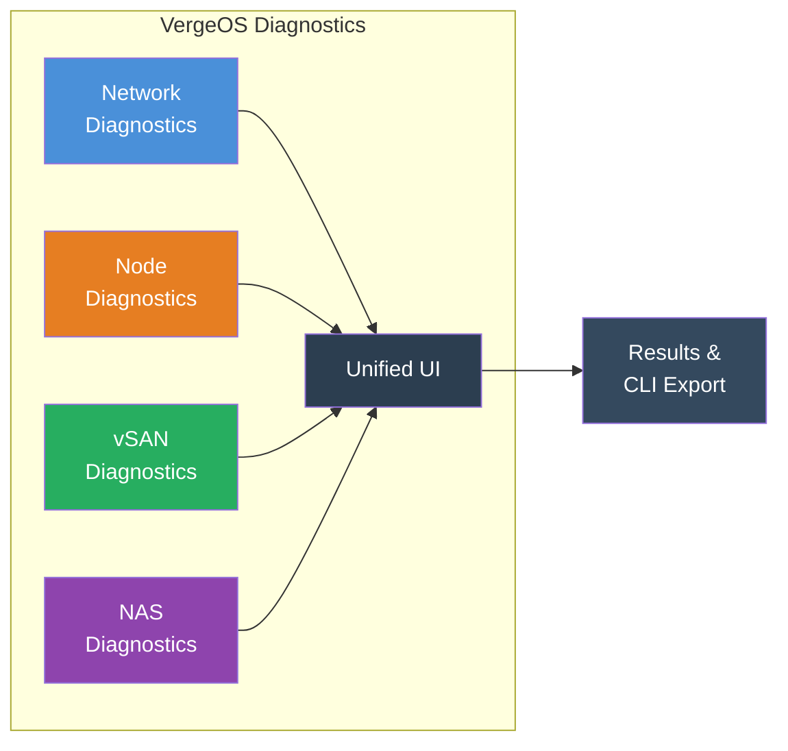
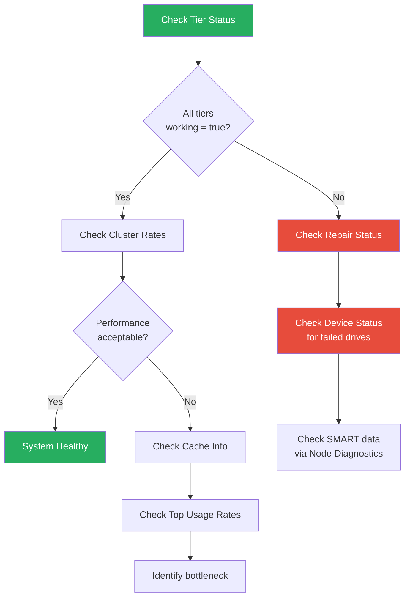
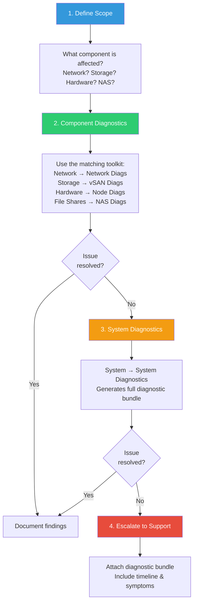

import { Card, CardGrid } from "@astrojs/starlight/components";

## Four Diagnostic Toolkits in One Platform

VergeOS embeds diagnostic tools directly into every major subsystem. Rather than SSH-ing into individual nodes or installing third-party utilities, administrators run diagnostics from the **VergeOS UI** — each scoped to the component being investigated.

Every diagnostic interface follows the same pattern:

1. Navigate to the component (network, node, NAS, or vSAN)
2. Click **Diagnostics** in the left menu
3. Select a command from the **Query** dropdown
4. Configure parameters on the right
5. Click **Send →** to execute

:::tip[Show Command Toggle]
Enable **"Show Command"** on any diagnostic to see the exact CLI syntax being executed. This is invaluable for scripting, automation, or reproducing commands over SSH.
:::

---

## Network Diagnostics

**Access:** Networks → [Select Network] → Diagnostics

Network diagnostics run **per-network** — you select the specific network you want to troubleshoot, and all commands execute within that network's context. This is critical because VergeOS networks are isolated by design.

### Connectivity & Discovery

| Command                 | CLI Equivalent                    | Purpose                                            |
| ----------------------- | --------------------------------- | -------------------------------------------------- |
| **Ping**                | `ping -c [COUNT] [DEST]`          | Basic ICMP connectivity test                       |
| **Trace Route**         | `traceroute` / `mtr`              | Map the network path to a destination              |
| **ARP Scan**            | `nmap -sn [RANGE]`                | Discover active devices on the network             |
| **ARP Table**           | `arp -a`                          | View current IP-to-MAC mappings                    |
| **TCP Connection Test** | `telnet` / `nc -zv [HOST] [PORT]` | Verify a specific TCP port is reachable            |
| **What's My IP**        | `curl ifconfig.me`                | Check the network's external IP (NAT verification) |

### DNS & Name Resolution

| Command        | CLI Equivalent                   | Purpose                            |
| -------------- | -------------------------------- | ---------------------------------- |
| **DNS Lookup** | `nslookup` / `dig [HOST] [TYPE]` | Query A, AAAA, MX, NS, PTR records |

### Firewall & Security

| Command                        | CLI Equivalent            | Purpose                               |
| ------------------------------ | ------------------------- | ------------------------------------- |
| **Show Firewall Rules**        | `nft list ruleset`        | Display the full nftables ruleset     |
| **Trace/Debug Firewall Rules** | `nft add rule ... log`    | Enable per-rule logging for debugging |
| **NMAP**                       | `nmap [OPTIONS] [TARGET]` | Port scanning and service discovery   |

### Traffic Analysis

| Command               | CLI Equivalent                | Purpose                           |
| --------------------- | ----------------------------- | --------------------------------- |
| **TCP Dump**          | `tcpdump -i [IFACE] [FILTER]` | Packet capture with BPF filtering |
| **Top Network Usage** | `iftop` / `nethogs`           | Real-time bandwidth consumers     |
| **Top CPU Usage**     | `top -o %CPU`                 | Processes consuming the most CPU  |

### Service-Specific

| Command                | CLI Equivalent            | Purpose                                         |
| ---------------------- | ------------------------- | ----------------------------------------------- |
| **DHCP Release/Renew** | `dhclient -r && dhclient` | Force DHCP lease refresh (DHCP client networks) |
| **IPsec**              | `ipsec [COMMAND]`         | Monitor and control IPsec VPN tunnels           |
| **FRRouting BGP/OSPF** | `vtysh -c "show ip bgp"`  | Dynamic routing protocol status                 |
| **Logs**               | `journalctl -u [SERVICE]` | Network container system logs                   |

:::note[Tenant Access]
Tenants have access to their own network diagnostics for tenant-specific networks. These tools operate within the tenant's network scope — they cannot see parent-level networks.
:::

---

## Node Diagnostics

**Access:** Infrastructure → Nodes → [Select Node] → Diagnostics

Node diagnostics provide **hardware-level** visibility into individual physical servers. These tools interact directly with the server's BMC, drives, and physical network interfaces.

### IPMI / BMC Tools

These commands use `ipmitool` to communicate with the server's Baseboard Management Controller — the out-of-band management interface (iDRAC on Dell, iLO on HPE, etc.).

| Command                         | CLI Equivalent            | Purpose                               |
| ------------------------------- | ------------------------- | ------------------------------------- |
| **IPMI BMC Info**               | `ipmitool bmc info`       | BMC firmware and configuration        |
| **IPMI Chassis Status**         | `ipmitool chassis status` | Power state, intrusion detection      |
| **IPMI FRU Info**               | `ipmitool fru print`      | Field Replaceable Unit identification |
| **IPMI LAN Info**               | `ipmitool lan print`      | BMC network configuration             |
| **IPMI MC Reset**               | `ipmitool mc reset cold`  | Reset a non-responsive BMC            |
| **IPMI Sensors**                | `ipmitool sensor list`    | Temperature, voltage, fan readings    |
| **IPMI Sensor Data Repository** | `ipmitool sdr list`       | Full sensor data repository           |
| **IPMI System Event Logs**      | `ipmitool sel list`       | Hardware event history (SEL)          |

:::caution[IPMI MC Reset]
Resetting the BMC temporarily disrupts out-of-band management. The host OS continues running — this only affects the management controller.
:::

### Drive & Storage Health

| Command                        | CLI Equivalent               | Purpose                                       |
| ------------------------------ | ---------------------------- | --------------------------------------------- |
| **S.M.A.R.T. Information**     | `smartctl -a [DRIVE]`        | Drive health attributes, wear, temperature    |
| **S.M.A.R.T. Diagnostic Test** | `smartctl -t [TYPE] [DRIVE]` | Run short, long, or conveyance tests          |
| **Show Block Devices**         | `lsblk` / `fdisk -l`         | List all block devices on the node            |
| **LED Control (Drive)**        | `ledctl locate=[DRIVE]`      | Blink a drive LED for physical identification |
| **RAS Query**                  | `ras-mc-ctl --summary`       | Memory ECC error reporting                    |

### Network & Fabric

| Command                  | CLI Equivalent                 | Purpose                                |
| ------------------------ | ------------------------------ | -------------------------------------- |
| **Ethernet Tool**        | `ethtool [IFACE]`              | Link speed, duplex, driver info        |
| **Fabric Configuration** | `verge fabric show`            | Core fabric status for this node       |
| **Network Bonding**      | `cat /proc/net/bonding/[BOND]` | Bond interface health and active slave |
| **Bridge Addresses**     | `brctl showmacs [BRIDGE]`      | Virtual switch MAC address table       |
| **ARP Scan / ARP Table** | `nmap -sn` / `arp -a`          | Node-level network discovery           |
| **Ping / Trace Route**   | `ping` / `traceroute`          | Basic connectivity from node context   |

### System

| Command                      | CLI Equivalent                              | Purpose                                            |
| ---------------------------- | ------------------------------------------- | -------------------------------------------------- |
| **DMI Table**                | `dmidecode`                                 | Full hardware inventory (CPU, RAM, serial numbers) |
| **Logs**                     | `journalctl -n 100` / `dmesg`               | System and kernel logs                             |
| **OpenSSL Speed**            | `openssl speed`                             | CPU crypto performance benchmark                   |
| **Clear Persistent Storage** | `sync && echo 3 > /proc/sys/vm/drop_caches` | Clear filesystem caches (support use only)         |

:::note[Coming from VMware or Nutanix?]
| Platform | Where deep hardware inspection happens |
| --- | --- |
| VMware | SSH/DCUI to the ESXi host for `esxcli`/`vsish`; vCenter exposes some SMART/sensors but deep work leaves the vSphere UI |
| Nutanix | Prism Element Hardware page + `ncli` from the CVM; IPMI/BMC accessed separately for drive LED and detailed sensors |
| VergeOS | Single node diagnostics panel: IPMI, SMART, drive LED control, fabric health, with no SSH or separate BMC credentials. "Show Command" exports the underlying CLI syntax. |
:::

---

## vSAN Diagnostics

**Access:** System → vSAN Diagnostics

vSAN diagnostics operate at the **system level** using `vcmd` — the VergeOS vSAN command-line interface. These commands provide deep visibility into the distributed storage engine.

:::caution[Root / Parent Level Only]
vSAN diagnostics are only available at the root/parent level. **Tenants do not have access** to vSAN diagnostic tools — they interact with storage through their allocated virtual disks.
:::

### Key vcmd Commands

| Command                    | CLI Equivalent            | Purpose                                       |
| -------------------------- | ------------------------- | --------------------------------------------- |
| **Get Tier Status**        | `vcmd tier status`        | Health, redundancy, and capacity per tier     |
| **Get Cluster Rates**      | `vcmd cluster rates`      | Read/write throughput across the cluster      |
| **Get Cluster Usage**      | `vcmd cluster usage`      | Overall storage utilization statistics        |
| **Get Device List**        | `vcmd devices list`       | All storage devices in the vSAN pool          |
| **Get Device Status**      | `vcmd device status [ID]` | Individual device health and error counts     |
| **Get Device Usage**       | `vcmd device usage [ID]`  | Per-device capacity and I/O metrics           |
| **Get Repair Status**      | `vcmd repair status`      | Active rebuild/repair progress                |
| **Get Journal Status**     | `vcmd journal status`     | Write-ahead journal health                    |
| **Get Integ Check Status** | `vcmd integcheck status`  | Data integrity verification progress          |
| **Get Cache Info**         | `vcmd cache info`         | Cache hit/miss ratios and memory usage        |
| **Get File Status**        | `vcmd file status [PATH]` | Replication and integrity for a specific file |
| **Get Top Usage Rates**    | `vcmd usage top-rates`    | Identify top storage consumers                |
| **Get Running Conf**       | `vcmd config show`        | Current vSAN configuration parameters         |
| **Get Sync List**          | `vcmd sync list`          | Active synchronization operations             |
| **Get Node List**          | `vcmd nodes list`         | All nodes participating in the vSAN           |
| **Integ Check**            | `vcmd integcheck start`   | Initiate a full integrity check               |
| **Summarize Disk Usage**   | `vcmd usage summarize`    | Cluster-wide disk usage summary               |

### vSAN Health Check Workflow

A structured approach to investigating storage issues:

### Key Indicators to Monitor

- **`working = false`** on any tier → Critical — tier is not operational
- **`redundant = false`** → Degraded state, no fault tolerance
- **`bad_drives > 0`** → Drive failure detected, auto-repair in progress
- **Repair status all zeros** → No active repairs (healthy state)
- **Write throttle active** → Storage capacity approaching limits (>91% triggers throttling)

### Storage Space Throttling Thresholds

| Utilization | Behavior                                         |
| ----------- | ------------------------------------------------ |
| **< 91%**   | Normal operation, no throttling                  |
| **91–95%**  | Low-space throttling begins (10ms latency added) |
| **96%+**    | Critical throttling (50ms latency added)         |
| **> 96%**   | Severe performance degradation                   |

---

## NAS Diagnostics

**Access:** NAS → [Select NAS Service] → Diagnostics

NAS diagnostics are **per-NAS-service** — each NAS instance has its own diagnostic interface. These tools focus on file-sharing protocols (SMB/CIFS, NFS) and authentication.

### CIFS/SMB Diagnostics

| Command   | CLI Equivalent           | Purpose                                 |
| --------- | ------------------------ | --------------------------------------- |
| **Samba** | `smbstatus`              | Active SMB connections and locked files |
|           | `testparm`               | Validate Samba configuration syntax     |
|           | `smbclient -L localhost` | List available SMB shares               |

### NFS Diagnostics

| Command | CLI Equivalent | Purpose                                 |
| ------- | -------------- | --------------------------------------- |
| **NFS** | `exportfs -v`  | Current NFS export configuration        |
|         | `rpcinfo -p`   | RPC service registration status         |
|         | `showmount -e` | Exported filesystems visible to clients |

### Active Directory / Winbind

| Command     | CLI Equivalent | Purpose                        |
| ----------- | -------------- | ------------------------------ |
| **Winbind** | `wbinfo -t`    | Test domain trust relationship |
|             | `wbinfo -u`    | List domain users              |
|             | `wbinfo -g`    | List domain groups             |

### Standard Network Tools

NAS diagnostics also include the standard connectivity tools: **Ping**, **Trace Route**, **ARP Scan/Table**, **TCP Dump**, **TCP Connection Test**, **DNS Lookup**, **NTP Query**, **Top CPU Usage**, **Top Network Usage**, and **Logs**.

### User & Group Diagnostics

| Command       | CLI Equivalent                        | Purpose                              |
| ------------- | ------------------------------------- | ------------------------------------ |
| **Users**     | `getent passwd` / `who`               | System user accounts                 |
| **Groups**    | `getent group`                        | System groups and membership         |
| **Date/Time** | `date` / `timedatectl`                | Time sync (critical for Kerberos/AD) |
| **Services**  | `systemctl list-units --type=service` | All running services                 |

---

## Best Practice Troubleshooting Workflow

When investigating an issue, follow a structured escalation path from component-specific diagnostics to system-wide analysis:

### Workflow Guidelines

1. **Start simple** — Ping before packet capture. Check tier status before integrity checks.
2. **Scope correctly** — Select the right network, node, or NAS service before running diagnostics. Running commands in the wrong context produces misleading results.
3. **Document as you go** — Use "Show Command" to capture exact commands. Copy output before moving to the next test.
4. **Consider performance impact** — TCP Dump, NMAP scans, and integrity checks can affect production performance. Schedule intensive diagnostics during maintenance windows.
5. **Check logs last** — Logs provide context but can be overwhelming. Use targeted diagnostics first, then correlate with log entries.

### System Diagnostics Bundle

For issues that span multiple components or require support escalation, VergeOS can generate a **full diagnostic bundle**:

- **Access:** System → System Diagnostics
- **Output:** `[SYSTEMNAME]_diags_[YYYYMMDD]_[HHMMSS].tar.gz`
- **Contents:** vSAN status files, SMART reports, network configuration, IPMI data, system logs, and kernel logs — organized per-node
- **Retention:** System logs are retained for 45 days before automatic deletion

:::tip[Before Escalating]
Always generate a fresh System Diagnostics bundle before contacting support. This provides a complete point-in-time snapshot that support engineers can analyze without needing live system access.
:::

---

## Quick Reference: Which Toolkit to Use

<CardGrid>
  <Card title="Network Diagnostics" icon="rocket">
    **Use when:** VM can't reach the internet, DNS not resolving, firewall blocking traffic, DHCP not assigning IPs, VPN tunnel down

    **Access:** Networks → [Network] → Diagnostics

  </Card>
  <Card title="Node Diagnostics" icon="seti:config">
    **Use when:** Hardware alerts, drive failures, temperature warnings, NIC link issues, IPMI unresponsive, fabric connectivity problems

    **Access:** Infrastructure → Nodes → [Node] → Diagnostics

  </Card>
  <Card title="vSAN Diagnostics" icon="seti:db">
    **Use when:** Storage performance degraded, tier unhealthy, capacity warnings, repair stuck, data integrity concerns

    **Access:** System → vSAN Diagnostics

  </Card>
  <Card title="NAS Diagnostics" icon="seti:folder">
    **Use when:** SMB shares inaccessible, NFS mount failures, AD authentication broken, file permission denied, slow CIFS performance

    **Access:** NAS → [NAS Service] → Diagnostics

  </Card>
</CardGrid>
