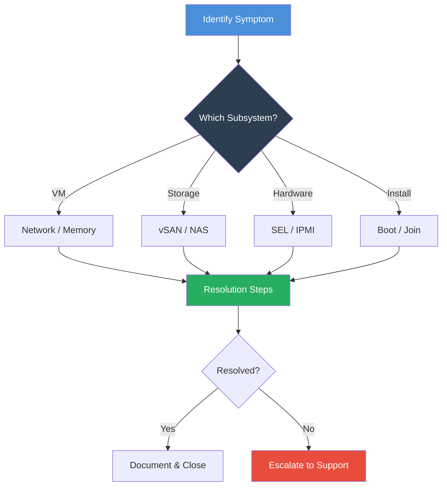

import { Card, CardGrid } from "@astrojs/starlight/components";

## Troubleshooting Quick-Reference

This page compiles the most common issues encountered by VergeOS administrators, organized by subsystem. Each section includes symptoms, root causes, and step-by-step resolution procedures.



---

## VM Network Connectivity

Network connectivity problems are the most common support topic. Before diving in, verify whether **other VMs** in the same environment can reach the internet. If none can, the issue is likely upstream of VergeOS (switch, firewall, ISP). If other VMs work fine, the problem is almost always a configuration miss on the affected VM.

### Missing NIC Configuration

**Symptom:** VM boots but has no network interfaces visible in the guest OS.

**Resolution:**

1. Open the VM dashboard and check the **NICs** section
2. If no NIC is listed, click **Add NIC**
3. Select the correct network and set the interface type to **VirtIO** (recommended) or **E1000** for legacy compatibility
4. Power-cycle the VM for the NIC to appear

### Wrong Network Assignment

**Symptom:** VM has a NIC but cannot reach other VMs or the internet.

**Resolution:**

1. Navigate to the VM dashboard → **NICs**
2. Verify the NIC status is **Up**
3. Confirm the **Network** column shows the correct network — compare against a working VM in the same environment
4. If incorrect, edit the NIC and reassign it to the proper network
5. Power-cycle the VM

### Missing VirtIO Drivers

**Symptom:** Windows VM shows no network adapter in Device Manager, even though a NIC is configured in VergeOS.

**Resolution:**

1. Verify a NIC exists in the VM's **NICs** section within VergeOS
2. Connect to the VM via the **Remote Console**
3. Install the VirtIO drivers from the guest agent ISO — refer to the VergeOS documentation on [VM Guest Agent](https://docs.verge.io/product-guide/virtual-machines/vm-guest-agent/) for download and installation steps
4. After driver installation, Windows will detect the network adapter automatically

### Improper Guest IP Configuration

**Symptom:** NIC is present and drivers are installed, but the VM still cannot reach the network.

**Resolution:**

1. Inside the guest OS, verify the network adapter is detected and enabled
2. For DHCP: ensure the network has a DHCP service running (check **Networks → [Network] → DHCP**)
3. For static IP: confirm the IP address, subnet mask, gateway, and DNS settings match the network design
4. Use the **Network Diagnostics** tool (ping, ARP scan) from the VergeOS network context to verify Layer 2 connectivity

---

## Guest Memory Reporting

Administrators migrating from VMware or Nutanix often notice that VergeOS reports higher memory usage than they expect. This is by design — not a problem.

### Allocated vs. Active Memory

**Symptom:** VergeOS shows a VM using 8 GB of RAM, but the guest OS task manager shows only 2 GB in use.

**Explanation:** VergeOS displays **allocated** memory — the physical RAM reserved on the host for that VM. When you assign 8 GB to a VM, the hypervisor immediately reserves 8 GB of physical memory, regardless of what the guest is actively consuming. This is the real resource commitment on the host.

### No Memory Ballooning

Unlike VMware (which uses balloon drivers to reclaim unused guest memory) or Nutanix AHV (which supports dynamic memory management), **VergeOS intentionally does not use memory ballooning**. This design choice provides:

- **Predictable performance** — no balloon driver overhead or surprise memory pressure
- **Simplified capacity planning** — allocated = committed; no guessing about overcommit ratios
- **Enhanced reliability** — no risk of balloon-induced OOM conditions inside guests
- **Accurate migration sizing** — what you allocate is what you need on the destination host

### Capacity Planning Best Practices

| Metric                       | Where to Check                             | What It Means                         |
| ---------------------------- | ------------------------------------------ | ------------------------------------- |
| **VM Allocated RAM**         | VM Dashboard                               | Physical RAM reserved for this VM     |
| **Guest Active RAM**         | Inside guest OS (Task Manager / `free -h`) | What the guest is actually using      |
| **Node Available RAM**       | Node Dashboard → Memory                    | How much host RAM remains unallocated |
| **Cluster Target Max RAM %** | System → Settings → Advanced               | Threshold for VM placement decisions  |

:::tip[Right-Sizing VMs]
Because VergeOS allocates the full amount, right-sizing VM memory is more important than on platforms with ballooning. Start with conservative allocations and increase only when guest monitoring shows sustained high usage.
:::

---

## SEL Noise (False-Positive IPMI Logs)

Some server hardware generates repetitive, benign IPMI log entries that fill the System Event Log (SEL) and trigger unnecessary alerts. The most common offender is the **"Get SEL Info command failed"** message.

### Understanding the SEL

The System Event Log is stored in hardware (on the BMC/IPMI controller) with limited capacity. Once full, **new events cannot be recorded** until the log is cleared. The node dashboard shows SEL capacity as a percentage bar.

### Filtering SEL Noise via API

To suppress false-positive messages without losing real hardware alerts:

1. Navigate to **System → API Documentation**
2. Find the **settings** table and expand it
3. Click the **POST** option and enter this body:

```json
{
  "key": "syslog_regex_list",
  "value": "2E2A4765742053454C20496E666F20636F6D6D616E64206661696C65642E",
  "default_value": "",
  "description": "Hex encoded lines of regular expressions to filter out of syslog"
}
```

4. Click **Execute**

The value is a hex-encoded regex: `.*Get SEL Info command failed.` — you can encode additional patterns at a hex encoding tool and separate multiple patterns with `|`.

**Example — filtering two patterns:**

The regex `(Get SEL Info command failed|Unable to send command: Device or resource busy)` encodes to:

```
284765742053454C20496E666F20636F6D6D616E64206661696C65647C556E61626C6520746F2073656E6420636F6D6D616E643A20446576696365206F72207265736F75726365206275737929
```

### Restarting the IPMI Service

After applying the filter, restart log capture on each affected node:

**Option A — Via UI:**

1. Navigate to **Infrastructure → Nodes → [Node]**
2. Edit the node, **uncheck** "Capture System Logs", submit
3. Wait 15 seconds
4. Edit the node again, **re-enable** "Capture System Logs"

**Option B — Via SSH:**

```bash
sudo systemctl restart openipmi
```

### Clearing a Full SEL

If the SEL is already full:

1. Navigate to **Infrastructure → Nodes → [Node]**
2. Click **Clear SEL** in the left menu
3. Confirm with **Yes**

---

## NAS Share Issues

### Windows: Unable to Connect to CIFS Shares

**Symptom:** Windows 10/11 clients cannot access CIFS shares, receiving "access denied" or "cannot connect" errors even with correct credentials.

**Root Cause:** Modern Windows defaults to disabling insecure guest logons for SMB connections.

**Resolution — Enable Insecure Guest Logons:**

1. Press `Win + R`, type `gpedit.msc`, press Enter
2. Navigate to: **Computer Configuration → Administrative Templates → Network → Lanman Workstation**
3. Locate **Enable insecure guest logons** → Right-click → **Edit**
4. Select **Enabled** → Click **OK**
5. **Restart** the Windows device

:::caution[Windows Home Edition]
`gpedit.msc` is not available on Windows Home. Use the Registry Editor instead:
Navigate to `HKEY_LOCAL_MACHINE\SYSTEM\CurrentControlSet\Services\LanmanWorkstation\Parameters` and set `AllowInsecureGuestAuth` (DWORD) to `1`.
:::

### macOS: Connection Failures or Poor Performance

**Symptom:** macOS Finder cannot connect to CIFS shares, connections drop intermittently, or performance is unusable.

**Resolution — Force SMB3 via `nsmb.conf`:**

1. Open Terminal and create or edit the SMB configuration:

```bash
sudo nano /etc/nsmb.conf
```

2. Add the following:

```ini
[default]
smb_neg=smb3_only
signing_required=no
```

3. **Clear the macOS SMB cache:**

```bash
rm -rf ~/Library/Caches/com.apple.finder
killall Finder
```

4. Reconnect to the share

**Samba Fruit Module:** For full macOS compatibility (Spotlight indexing, Time Machine support, resource forks), enable the Samba `fruit` VFS module in the NAS volume advanced settings. This enables native Apple SMB extensions.

### Permission Denied Errors

**Symptom:** Users receive "Access Denied" when browsing or opening files on a share, even though they can see the share name.

**Resolution checklist:**

1. **Valid Users list:** Navigate to **NAS → Shares → [Share]** and confirm the user or group is in the valid users list
2. **Browseable setting:** Ensure the share is set to **browseable** if users need to discover it
3. **Force User / Force Group:** If configured, verify the forced user/group has read/write permissions on the underlying volume
4. **NAS service restart:** After permission changes, restart the NAS service to apply

### Slow CIFS Performance

**Symptom:** File transfers over CIFS are significantly slower than expected.

**Resolution:**

1. **SMB protocol version:** Under **NAS → Volumes → [Volume] → Advanced Configuration**, verify the minimum SMB protocol version. Setting it too low (SMB1) forces legacy negotiation
2. **Network path:** Use Network Diagnostics (ping, traceroute) to check latency between the client subnet and the NAS network
3. **Connection load:** Use NAS Diagnostics → **Samba Status** to check active connections and identify overloaded shares
4. **NAS resources:** Check CPU and memory allocation for the NAS service — under-provisioned NAS VMs will bottleneck throughput

---

## Installation Troubleshooting

### Boot Issues

**Symptom:** Node fails to boot from the VergeOS USB installer.

**Resolution:**

- Verify BIOS/UEFI boot settings match the installation media type (UEFI recommended)
- Test the USB media on a known-working system to rule out a bad drive
- Confirm hardware compatibility — check that the CPU supports 64-bit with hardware virtualization (VT-x/AMD-V)
- Disable Secure Boot in BIOS if the installer fails to load

### Network Configuration Mismatches

**Symptom:** Installation completes but the node cannot communicate with other nodes or the network.

**Resolution:**

- During installation, **stop immediately** if any detected IP or interface does not match your network design
- Verify VLAN configurations match the switch port settings
- Check physical cable connections — the installer auto-detects interfaces; mismatched cabling leads to wrong interface assignments
- Confirm IP addressing does not conflict with existing devices on the network

### Storage Controller JBOD Mode

**Symptom:** VergeOS installer does not detect all expected drives.

**Resolution:**

- VergeOS requires drives to be presented as individual disks (JBOD/passthrough mode), **not** as RAID arrays
- Enter the storage controller BIOS (e.g., PERC, MegaRAID) and configure each drive as a JBOD volume or individual RAID-0
- Some controllers require firmware updates to support JBOD mode — consult the hardware vendor documentation

### Secondary Node Join Failures

**Symptom:** Secondary controller or compute node fails to join the existing cluster.

**Resolution:**

1. Verify you selected **"No"** when asked if this is a new install (for secondary nodes)
2. Confirm you entered the **admin credentials from the primary controller** correctly
3. Ensure both nodes are on the same network and can reach each other (check switch port VLAN assignments)
4. Match encryption settings from the primary controller exactly
5. Match drive tier assignments from the primary controller
6. If the secondary boots but is not visible in the primary UI, check the core fabric network configuration and verify switch connectivity between nodes

---

## Storage Issues

### vSAN Degraded State

**Symptom:** Dashboard shows a vSAN tier in "degraded" or "not redundant" status.

**Explanation:** A degraded state means one or more drives in a tier have failed or are unavailable, but the vSAN is still operational. Data remains accessible because VergeOS maintains redundancy across nodes.

**Resolution:**

1. Navigate to **System → vSAN → Drives** to identify the failed drive(s)
2. Check the drive's SMART data via **Node Diagnostics → S.M.A.R.T. Diagnostic Test**
3. If a physical replacement is needed, use **Node Diagnostics → LED Control** to light up the drive bay for identification
4. Contact Verge support for drive replacement guidance — the vSAN will automatically rebuild redundancy once a replacement drive is added

### Drive Rebuild Times

**Understanding expectations:** Rebuild times depend on the amount of data on the tier and the I/O capacity of the remaining drives. During a rebuild:

- The system remains fully operational
- Write performance may be slightly reduced
- Monitor progress via the vSAN dashboard's tier progress indicator (100% = complete)

:::tip[Minimize Rebuild Impact]
Avoid scheduling heavy workload migrations or large data imports during a rebuild. The vSAN prioritizes rebuild operations, but additional I/O extends the rebuild window.
:::

### Capacity Threshold Warnings

**Symptom:** Dashboard alerts warn about storage capacity approaching limits.

**Resolution:**

1. Check tier utilization in **System → vSAN** — each tier shows used vs. total capacity
2. Review drive SMART data via **Infrastructure → Nodes → [Node] → Diagnostics → S.M.A.R.T. Diagnostic Test** to check wear levels and drive health indicators
3. For immediate relief, identify and remove unnecessary snapshots or unused VM drives
4. For long-term resolution, add drives or nodes to expand the tier — refer to the vSAN scale-up procedures

| Utilization Level | Action Required                                             |
| ----------------- | ----------------------------------------------------------- |
| **< 70%**         | Normal operation — no action needed                         |
| **70–85%**        | Plan capacity expansion; review snapshot retention policies |
| **85–90%**        | Actively reduce usage or add capacity                       |
| **> 90%**         | Critical — prioritize expansion; risk of write failures     |

---

## Troubleshooting Decision Tree

When facing an issue that doesn't fit the categories above, follow this general workflow:

<CardGrid>
  <Card title="1. Scope the Problem" icon="magnifier">
    Is the issue affecting one VM, one network, one node, or the entire system?
    Scoping determines which diagnostic tool to start with.
  </Card>
  <Card title="2. Use Component Diagnostics" icon="setting">
    Start with the component-specific diagnostic tool (Network, Node, NAS, or
    vSAN Diagnostics) — they run in the correct context automatically.
  </Card>
  <Card title="3. Check System Logs" icon="list-format">
    Review Dashboard logs and system alerts for correlated events. Look for
    patterns — did multiple alerts fire at the same time?
  </Card>
  <Card title="4. Escalate with Data" icon="rocket">
    If the issue is not resolved, generate a **System Diagnostics** bundle
    (System → System Diagnostics) and submit it with your support request.
  </Card>
</CardGrid>
