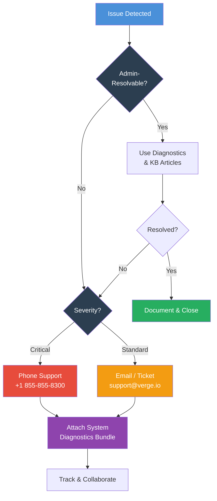

import { Card, CardGrid } from "@astrojs/starlight/components";

## Knowing When to Escalate

Not every issue requires vendor support. As a VergeOS administrator, you should be able to resolve most day-to-day operational issues using the diagnostic tools and troubleshooting patterns covered in this module. However, certain situations warrant direct engagement with the VergeOS support team.



### When to Escalate

Engage VergeOS support when you encounter any of the following scenarios:

- **Issues beyond admin-resolvable scope** — Problems that cannot be diagnosed using the built-in diagnostics tools, Knowledge Base articles, or this training material
- **Hardware failures requiring RMA guidance** — Drive failures, node hardware issues, or component replacements that need vendor coordination
- **vSAN integrity concerns** — Tier status showing degraded or unhealthy states, repair operations that are not progressing, or data integrity warnings
- **Cluster-level outages** — Multiple nodes offline, split-brain scenarios, or fabric connectivity failures affecting the entire cluster
- **Unexpected system behavior after updates** — Regressions or issues that appeared following a VergeOS version upgrade
- **Performance degradation without clear cause** — After exhausting the diagnostic toolkit and common issue resolutions without identifying the root cause

### When NOT to Escalate

Before contacting support, verify that the issue is not covered by:

1. **This training module** — Dashboard monitoring, alert configuration, log analysis, diagnostics toolkit, and common issues pages
2. **VergeOS Knowledge Base** — [docs.verge.io/knowledge-base](https://docs.verge.io/knowledge-base/) contains hundreds of articles on specific topics
3. **Network or upstream issues** — Confirm the problem is within VergeOS and not caused by external switches, firewalls, DNS, or ISP connectivity

---

## System Diagnostics Bundle

The **System Diagnostics** feature is the single most important tool for support engagements. It generates a point-in-time snapshot of your VergeOS environment — unfiltered logs, configuration data, network state, vSAN diagnostics, SMART reports, and performance metrics — packaged into a single compressed file.

:::caution[Always Submit a Diagnostics Bundle]
Every support request should include a fresh System Diagnostics bundle. This gives the support team immediate visibility into your environment without requiring remote access or back-and-forth information gathering.
:::

### What the Bundle Contains

The diagnostics file captures extensive information organized by host node:

| Category                   | Contents                                                                           |
| -------------------------- | ---------------------------------------------------------------------------------- |
| **System Logs**            | Full current system log plus up to 3 archived logs from previous node power cycles |
| **Tenant Node Logs**       | System logs from each tenant node                                                  |
| **VergeOS Configuration**  | Network and vSAN specifications, version, and configuration settings               |
| **SMART Reports**          | S.M.A.R.T. diagnostic report from each physical drive                              |
| **vNet Logs**              | Container logs for DMZ, core, external, maintenance, and tenant networks           |
| **Network Reports**        | Standard network utility outputs (ARP, routing, interface status)                  |
| **vSAN Diagnostics**       | All `vcmd` command outputs (tier status, device list, cluster rates, etc.)         |
| **IPMI/BMC Data**          | Sensor readings, System Event Log, chassis status, FRU information                 |
| **OS-Level Diagnostics**   | Standard Linux diagnostic command outputs                                          |
| **Performance Statistics** | `sysstat` performance monitoring reports                                           |
| **Kernel Logs**            | Typically empty, but critical for system crashes or hardware failures              |

### How to Generate a Diagnostics Bundle

1. **Log in to the parent/root environment** — Diagnostics must be generated at the parent level, not from within a tenant
2. Navigate to **System → System Diagnostics**
3. Click **Build** in the left navigation menu
4. Provide a **Name** and **Description** — Always enter an explanatory description before sending to support. If the name is left blank, the system auto-generates one in the format: `[SYSTEMNAME]_diags_[YYYYMMDD]_[HHMMSS]`
5. Check **"Send diagnostic information to VergeOS support"** if the system has internet connectivity — data is encrypted during transmission
6. Click **Submit** to begin generating the file

The status column shows progress: **Building** → **Sending to Support** → **Sent to Support** (or **Complete** if not sending automatically).

:::tip[Air-Gapped Systems]
For systems without internet access, download the completed diagnostics file after generation and coordinate with your support contact to deliver it via a secure file-sharing method.
:::

### Performance Considerations

Triggering System Diagnostics probes all nodes and hardware, which can temporarily affect system performance. Best practices:

- Run diagnostics during **low-usage periods** when possible
- Once triggered, a build **cannot be cancelled** — it will run to completion
- Avoid running diagnostics repeatedly in quick succession
- Use diagnostics as a **baseline** before significant system changes (installation, scale-out, updates) — generate a second bundle after the change for comparison

:::caution[Sensitive Information]
While System Diagnostics files never contain user data, they do include potentially sensitive items such as IP addressing, network details, tenant names, and VM names. Use care when downloading and transporting diagnostic files to ensure only authorized personnel have access.
:::

---

## Contact Options

VergeOS provides multiple channels for reaching the support team:

<CardGrid>
  <Card title="Phone Support" icon="phone">
    **+1 (855) 855-8300**

    Available Monday–Friday, 9 AM – 5 PM Eastern Time.

    For **urgent issues outside business hours**, call the same number to reach the emergency support line.

    Best for: critical outages, cluster-level issues, time-sensitive problems.

  </Card>
  <Card title="Email Support" icon="email">
    **support@verge.io**

    Send a detailed description of your issue along with the System Diagnostics bundle.

    Best for: non-urgent issues, detailed technical questions, follow-up on existing cases.

  </Card>
  <Card title="Gmail Ticket" icon="document">
    Open a pre-addressed support ticket directly from Gmail:

    [Open in Gmail](https://mail.google.com/mail/?view=cm&fs=1&to=support@verge.io&su=Support%20Request)

    Best for: organizations using Google Workspace.

  </Card>
  <Card title="Office 365 Ticket" icon="document">
    Open a pre-addressed support ticket from Outlook:

    [Open in Office 365](https://outlook.office.com/mail/deeplink/compose?to=support@verge.io&subject=Support%20Request)

    Best for: organizations using Microsoft 365.

  </Card>
</CardGrid>

The support team strives to respond to all inquiries within **24 business hours**. Critical issues reported via phone receive immediate attention.

---

## Support Ticket Best Practices

The quality of your support ticket directly impacts how quickly the team can diagnose and resolve your issue. Follow these guidelines to minimize back-and-forth and accelerate resolution.

### What to Include in Every Ticket

1. **System Diagnostics bundle** — Generate and submit a fresh bundle as close to the time of the issue as possible
2. **Symptom description** — What is happening? Be specific about error messages, affected VMs/networks/tenants, and the scope of impact
3. **Timeline** — When did the issue start? Was it sudden or gradual? Is it intermittent or constant?
4. **Recent changes** — Note any changes made before the issue appeared: VergeOS updates, network reconfiguration, new VMs deployed, hardware additions, firmware updates
5. **Error messages and screenshots** — Copy exact error text from the UI or logs; include screenshots of dashboard status, event logs, or diagnostic output
6. **Steps already taken** — Document what you have already tried so the support team does not duplicate your troubleshooting effort

### Ticket Template

```text
Subject: [Brief description of issue]

Environment:
- VergeOS Version: [e.g., 4.13.2]
- Cluster Size: [e.g., 4 nodes]
- Affected Component: [VM / Network / vSAN / Tenant / Node]

Issue Description:
[Detailed description of symptoms]

Timeline:
- First observed: [date/time]
- Frequency: [constant / intermittent / one-time]
- Last known good state: [date/time]

Recent Changes:
[List any changes made before the issue appeared]

Steps Taken:
[List diagnostic steps and their results]

Attachments:
- System Diagnostics bundle: [filename]
- Screenshots: [if applicable]
```

### Severity Guidelines

| Severity     | Description                                     | Expected Response                          |
| ------------ | ----------------------------------------------- | ------------------------------------------ |
| **Critical** | Production down, cluster outage, data at risk   | Phone call + ticket, immediate response    |
| **High**     | Major functionality impaired, workaround exists | Ticket + follow-up call, same business day |
| **Medium**   | Non-critical feature issue, limited impact      | Ticket, within 24 business hours           |
| **Low**      | Question, enhancement request, cosmetic issue   | Ticket, within 48 business hours           |

---

## SOPs for Escalation-Worthy Operations

Certain operations carry inherent risk and should follow **Standard Operating Procedures (SOPs)** that include proactive support engagement. For these operations, consider generating a System Diagnostics baseline _before_ the change and having a support contact ready.

### Installation

- **New cluster deployment** — Follow the official installation checklist (Module 3). If secondary nodes fail to join the cluster or vSAN does not initialize correctly, escalate immediately with diagnostics from both the controller and the failing node
- **Boot or BIOS issues** — Storage controllers must be in JBOD/HBA mode, not RAID. UEFI boot is required. If the installer does not detect drives, escalate before attempting workarounds

### Scale-Out (Adding Nodes)

- **Node join failures** — If a new node cannot join the existing cluster, verify network fabric connectivity and core network configuration before escalating
- **Post-join verification** — After a successful join, verify vSAN rebalancing and tier health. Escalate if drives on the new node do not appear in the expected tier

### System Updates

- **Pre-update baseline** — Generate a System Diagnostics bundle before applying any VergeOS update
- **Post-update issues** — If VMs, networks, or tenants behave unexpectedly after an update, generate a new diagnostics bundle and escalate with both the pre- and post-update files
- **Rollback guidance** — Contact support before attempting to roll back an update

### vSAN Scale-Up

- **Adding drives to existing tiers** — Follow the documented procedure for adding physical drives. Escalate if the new drives do not appear in `vcmd device list` or if tier status shows unexpected states
- **Tier health monitoring** — After adding drives, monitor repair status and tier health. Escalate if repairs stall or tier status does not return to healthy within the expected timeframe

---

## Admin Responsibilities vs. Vendor Support

Understanding the support boundary helps set expectations for your team:

| Responsibility                 | Admin             | VergeOS Support     |
| ------------------------------ | ----------------- | ------------------- |
| Day-to-day monitoring          | ✅                |                     |
| Alert configuration            | ✅                |                     |
| VM and network troubleshooting | ✅                | Escalation path     |
| Log analysis and diagnostics   | ✅                | Deep analysis       |
| Hardware RMA coordination      | Initial diagnosis | ✅                  |
| vSAN integrity issues          | Monitor & report  | ✅                  |
| Cluster-level outages          | Triage            | ✅                  |
| System updates                 | Execute           | Guidance & rollback |
| Architecture and sizing        | Initial design    | Validation          |

---

## Key Takeaways

- **Always generate a System Diagnostics bundle** before contacting support — it is the single most valuable artifact for troubleshooting
- **Use the right channel** — phone for critical/urgent issues, email/ticket for standard requests
- **Document thoroughly** — include symptoms, timeline, recent changes, and steps already taken
- **Know your boundary** — exhaust admin-level diagnostics before escalating to vendor support
- **Plan ahead for risky operations** — generate baseline diagnostics before installations, updates, and scale-out operations
