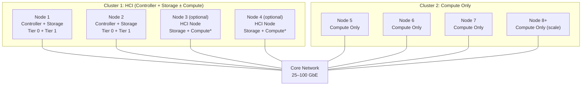

## Objective

Deploy VergeOS in an HCI + Dedicated Compute configuration using the Terraform playground. You will provision a two-cluster topology — an HCI foundation cluster (controller + storage) and a dedicated compute-only cluster — then configure workload placement across clusters, validate independent compute scaling, and compare the operational model to pure HCI deployments.

## Prerequisites

- Completed all prior modules (1–9)
- Completed the HCI Deployment Lab and UCI Deployment Lab
- Access to the vergeos-terraform-playground repository (cloned locally)
- Terraform CLI installed and configured
- A VergeOS environment or lab that supports nested deployments
- Familiarity with Terraform basics (init, plan, apply)

## Difficulty

**Intermediate** — Requires understanding of VergeOS cluster architecture, multi-cluster networking, and basic Terraform usage

## Estimated Time

**1.5 hours**

---

## Background: HCI + Dedicated Compute Architecture

Before starting the lab, review the two-cluster model that defines HCI + Dedicated Compute:

**Key principles:**

- **Cluster 1 (HCI)** always includes Nodes 1 & 2 with controllers and Tier 0 storage. Optional Nodes 3–4 add storage and (optionally) compute capacity.
- **Cluster 2 (Compute Only)** contains nodes dedicated entirely to running workloads — no storage overhead, maximum resources for VMs.
- The **Compute toggle** on the HCI cluster controls whether HCI nodes can also run workloads alongside storage/control functions.
- All compute-node storage I/O traverses the core network to the HCI cluster, making inter-cluster bandwidth critical.

---

## Steps

### Part 1: Review the HCI + Compute Topology

Understand the configuration before deploying.

1. In the terraform playground repository, navigate to the `examples/` directory and identify the HCI + Compute `.tfvars` file (look for files referencing "hci-compute" or "hybrid" topologies)
2. Examine the variables and identify:
   - How many clusters are defined and their roles (HCI vs compute-only)
   - Node count and assignments per cluster
   - The **Compute toggle** setting on the HCI cluster — is it enabled or disabled?
   - Storage tier configuration (Tier 0 for metadata on controller nodes, Tier 1 for workload data)
   - Network configuration for inter-cluster communication
3. Compare this `.tfvars` file with the pure HCI configurations from the previous lab. Note the structural differences:
   - Additional cluster definition for compute-only nodes
   - Storage tier assignment — compute-only nodes have no storage tiers
   - Network bandwidth requirements between clusters
4. Review the deployment scenario documentation (`docs/deployment-scenarios.md`) for the HCI + Compute section

### Part 2: Deploy the HCI + Compute Topology

Provision the two-cluster environment.

1. Run `terraform init` to initialize the provider (if not already done)
2. Run `terraform plan -var-file=<hci-compute>.tfvars` and carefully review the planned resources:
   - Verify two separate clusters will be created
   - Confirm node assignments match the expected topology
   - Check that storage tiers are only assigned to HCI cluster nodes
   - Validate network interfaces are configured for inter-cluster communication
3. Run `terraform apply -var-file=<hci-compute>.tfvars` to deploy
4. Log into the VergeOS UI and verify the deployment:
   - **Clusters:** Both clusters appear — one labeled HCI, one labeled Compute
   - **Nodes:** Each node is assigned to its correct cluster
   - **Storage:** vSAN storage pools exist only on the HCI cluster; compute-only nodes show no storage
   - **Networking:** Core fabric network connects both clusters; inter-cluster connectivity is established
   - **Controllers:** Controller VMs are running on Nodes 1 and 2 in the HCI cluster

### Part 3: Configure Workload Placement

Practice placing workloads across the two-cluster topology.

1. **Create a VM on the compute-only cluster:**
   - In the VergeOS UI, create a new VM and select the compute-only cluster for placement
   - Assign CPU and memory resources
   - Attach a virtual disk — note that the storage is provisioned from the HCI cluster's vSAN even though the VM runs on a compute-only node
   - Start the VM and verify it boots successfully

2. **Create a VM on the HCI cluster** (if Compute is enabled):
   - Create a second VM, this time placing it on the HCI cluster
   - Compare the resource availability between the two clusters
   - Note the difference: HCI nodes share resources between storage/control and compute, while compute-only nodes dedicate all resources to workloads

3. **Test VM migration between clusters:**
   - Attempt to migrate a VM from the compute-only cluster to the HCI cluster (and vice versa)
   - Observe how VergeOS handles cross-cluster migration
   - Document any constraints or considerations for cross-cluster workload movement

4. **Monitor inter-cluster I/O:**
   - Open the VergeOS dashboard and navigate to network monitoring
   - Observe the storage I/O traffic flowing from compute-only nodes to the HCI cluster
   - Note the bandwidth utilization on the core network — this is why inter-cluster bandwidth planning is critical

### Part 4: Validate Independent Compute Scaling

Demonstrate the scaling advantage of the HCI + Compute model.

1. **Review compute-only cluster capacity:**
   - In the VergeOS UI, check the total CPU and memory available on the compute-only cluster
   - Compare this to the HCI cluster's available compute resources (after storage/control overhead)
   - Document the effective compute capacity difference

2. **Simulate a scale-out scenario:**
   - Review the `.tfvars` file and identify how to add additional compute-only nodes
   - Modify the node count for the compute-only cluster (e.g., add 1–2 more nodes)
   - Run `terraform plan` to preview the change — note that only compute nodes are added; storage is unaffected
   - Apply the change and verify the new nodes join the compute-only cluster
   - Confirm that the HCI cluster is completely unchanged — no rebalancing, no storage disruption

3. **Compare scaling models:**

   | Scaling Action         | Pure HCI                              | HCI + Compute                                     |
   | ---------------------- | ------------------------------------- | ------------------------------------------------- |
   | Add compute capacity   | Must add full HCI node (with storage) | Add lightweight compute-only node                 |
   | Add storage capacity   | Add HCI node or expand existing disks | Add node to HCI cluster only                      |
   | Scale independently    | ❌ Compute and storage coupled        | ✅ Compute scales independently                   |
   | Hardware flexibility   | All nodes need storage-class hardware | Compute nodes optimized for workloads             |
   | Operational complexity | Simple — single cluster               | Moderate — two clusters, inter-cluster networking |

### Part 5: Explore the Compute Toggle

Understand the impact of the HCI cluster's Compute setting.

1. **Check the current Compute toggle state:**
   - In the VergeOS UI, navigate to the HCI cluster settings
   - Identify whether the Compute toggle is currently enabled or disabled
   - If enabled, note which workloads (if any) are running on HCI nodes

2. **Understand the two modes:**

   | Setting              | Behavior                                          | Best For                                                                        |
   | -------------------- | ------------------------------------------------- | ------------------------------------------------------------------------------- |
   | **Compute Enabled**  | HCI nodes run workloads alongside storage/control | Smaller deployments where maximizing utilization is preferred                   |
   | **Compute Disabled** | HCI cluster dedicated to storage and control only | Performance-sensitive environments where storage/compute isolation is preferred |

3. **Document your recommendation:**
   - Based on the current deployment size, which Compute toggle setting would you recommend?
   - What factors would cause you to change the setting?
   - Note: Changing the Compute toggle may require a rolling restart of nodes in the HCI cluster — review the impact with VergeOS support before making this change in production

### Part 6: Design Decision Exercise

Apply what you've learned to a real-world scenario.

1. **Scenario:** A customer currently runs a 4-node VergeOS HCI cluster. They need to add 50 new VMs for a development environment but don't need additional storage. Their current storage utilization is only 40%, but CPU is at 75%.

2. **Evaluate the options:**
   - **Option A:** Add 2 more HCI nodes (6-node HCI cluster)
   - **Option B:** Add a 2-node compute-only cluster (4-node HCI + 2-node compute)
   - **Option C:** Migrate to full UCI architecture

3. **For each option, document:**
   - Hardware cost implications
   - Operational complexity change
   - Network requirements
   - Future scalability path
   - Your recommendation with justification

4. **Bonus:** Identify which terraform playground example most closely matches Option B, and list the `.tfvars` modifications needed to match the customer's requirements

---

## Cleanup

When finished with the lab:

1. Remove all test VMs created during the lab
2. Run `terraform destroy` to tear down the entire HCI + Compute deployment
3. Verify all resources have been cleaned up in the VergeOS UI

---

## Verification

Your HCI + Compute deployment lab is complete when you can answer **yes** to all of the following:

- [ ] Successfully deployed a two-cluster HCI + Compute topology via Terraform
- [ ] Verified cluster roles (HCI vs compute-only), storage allocation, and networking in the VergeOS UI
- [ ] Created VMs on the compute-only cluster and confirmed storage was served from the HCI cluster
- [ ] Monitored inter-cluster storage I/O traffic on the core network
- [ ] Successfully scaled the compute-only cluster independently (added nodes without affecting storage)
- [ ] Documented the Compute toggle behavior and your recommendation for the deployment
- [ ] Completed the design decision exercise comparing HCI, HCI+Compute, and UCI options
- [ ] Cleaned up all lab resources with `terraform destroy`
