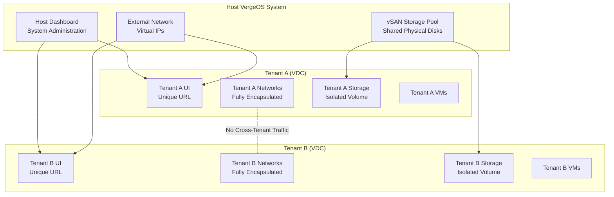

## Objective

Build a multi-tenant Managed Service Provider (MSP) environment on VergeOS. You will create tenants using both the Tenant Wizard and Tenant Recipes, configure resource quotas, set up tenant networking (including Layer 2 pass-through), verify isolation between tenants, and review host-level audit logs and usage reports.

## Prerequisites

- Completed all prior modules (1–9)
- Access to a running VergeOS environment with at least 2 nodes
- Admin-level access to the host VergeOS system
- At least 2 available external IP addresses (Virtual IPs) for tenant UI access
- At least 32 GB RAM and 8 cores available for tenant allocation
- Familiarity with VergeOS networking concepts (internal networks, external networks, VLANs)

## Difficulty

**Intermediate** — Requires understanding of VergeOS tenancy, networking, and resource management

## Estimated Time

**1.5 hours**

---

## Background: VergeOS Multi-Tenancy Architecture

Before starting the lab, review how VergeOS implements multi-tenancy:

**Key principles:**

- Each **tenant** is a complete Virtual Data Center (VDC) with its own UI, networks, storage, and user management
- **Isolation** is enforced through full network encapsulation and exclusive storage volumes — not VLAN-based segmentation
- **Nested multi-tenancy** allows tenants to create sub-tenants from their own allocated resources
- **Resource tracking** provides per-tenant usage statistics including deduplication metrics for billing and capacity planning
- **Tenant recipes** automate deployment of standardized tenant configurations for rapid onboarding

---

## Steps

### Part 1: Create a Tenant via the Wizard

Use the built-in Tenant Wizard to manually create your first tenant.

1. **Navigate to Tenants:**
   - From the host VergeOS UI, click **Tenants** in the top menu
   - Click **+ New Tenant**
   - At the top left, select **From Wizard** and click **Next**

2. **Configure Tenant Settings:**
   - **Name:** Enter `MSP-Tenant-A`
   - **Admin User Password:** Set a strong password (minimum 8 characters) — record this for later use
   - **Require Password Change:** Leave unchecked for lab purposes
   - **Description:** Enter `Lab tenant created via wizard`
   - **Expose System Snapshots:** Leave checked (allows tenant to browse host snapshots)
   - **Theme access:** Select `Cannot create new themes, read-only access to all host themes`
   - Click **Submit** to proceed to the Node configuration

3. **Configure Tenant Node:**
   - **Cores:** Select `4` cores
   - **RAM:** Select `8192 MB` (8 GB)
   - **Cluster:** Leave at `--Default--`
   - **On Power Loss:** Select `Last State`
   - Click **Submit** to proceed to Storage configuration

4. **Configure Tenant Storage:**
   - **Tier:** Select your primary storage tier (typically Tier 1)
   - **Provisioned:** Enter `100 GB`
   - Click **Submit** to proceed to UI Management

5. **Assign External IP:**
   - From the **Assign External IP** dropdown, select an available Virtual IP
   - If no Virtual IPs are available, click **Create a new External IP**:
     - **Network:** Select your external network
     - **Type:** Virtual IP
     - **IP Address:** Enter an available IP or leave blank for auto-assignment
     - **Owner:** Select `MSP-Tenant-A`
   - Click **Submit** to finish

6. **Apply network rules and power on:**
   - On the tenant dashboard, click the orange **Needs Apply Rules** message to apply firewall rules
   - Click **Power On** from the left menu to start the tenant
   - Wait for the tenant to boot — the dashboard should show a running status

7. **Verify tenant access:**
   - Click **Connect to UI** from the tenant dashboard left menu
   - Log in with `admin` and the password you configured
   - Verify the tenant has its own independent dashboard, networking, and storage views

### Part 2: Create a Tenant via Recipe

Use a Tenant Recipe for automated, standardized deployment.

1. **Explore available tenant recipes:**
   - From the host UI, navigate to **Repositories** > **Tenant Recipes**
   - Browse the available catalogs — note the recipes and their descriptions
   - If no tenant recipes exist, you will create one from MSP-Tenant-A

2. **Create a tenant recipe (if needed):**
   - First, **power off** MSP-Tenant-A (it must be stopped to serve as a recipe base)
   - Navigate to **Repositories** > **Tenant Recipes** and click **New**
   - Configure the recipe:
     - **Name:** `MSP-Standard-Tenant`
     - **Description:** `Standard MSP tenant with 4 cores, 8 GB RAM, 100 GB storage`
     - **Catalog:** Select or create a catalog (e.g., `MSP Templates`)
     - **Tenant:** Select `MSP-Tenant-A`
   - Click **Submit**

3. **Review and customize recipe questions:**
   - On the tenant recipe dashboard, click **Questions**
   - Review the automatically generated system questions — note the sections:
     - **Tenant section:** Name, URL, admin credentials, theme access
     - **Nodes section:** Core count, RAM allocation
     - **Network section:** External IP addresses
   - Enable any disabled questions you want to expose (e.g., `YB_USER_EMAIL`)
   - Click **Publish** to make the recipe available

4. **Deploy a tenant from the recipe:**
   - Navigate to **Tenants** > **+ New Tenant**
   - Select the **MSP Templates** catalog on the left
   - Choose the `MSP-Standard-Tenant` recipe and click **Next**
   - Fill in the recipe questions:
     - **Name:** `MSP-Tenant-B`
     - **Admin Password:** Set a password
     - **Node 1 Cores:** `4`
     - **Node 1 RAM:** `8192`
     - Assign an external IP address
   - Click **Submit** to create the tenant
   - Power on MSP-Tenant-B and verify it starts successfully

5. **Compare the two creation methods:**

   | Aspect                | Wizard                            | Recipe                                   |
   | --------------------- | --------------------------------- | ---------------------------------------- |
   | Speed                 | 5–10 minutes manual configuration | 1–2 minutes with pre-filled defaults     |
   | Consistency           | Depends on operator accuracy      | Guaranteed identical base configuration  |
   | Customization         | Full flexibility at creation time | Controlled via recipe questions          |
   | Best for              | One-off or unique tenants         | Standardized, repeatable deployments     |
   | Includes VMs/networks | Only base tenant infrastructure   | Can include pre-configured VMs, networks |

### Part 3: Configure Resource Quotas

Practice managing tenant resource allocation from the host.

1. **Review current resource allocation:**
   - From the host dashboard, navigate to **Tenants**
   - Click on **MSP-Tenant-A** to open its dashboard
   - Note the allocated resources: cores, RAM, and storage provisioned
   - Scroll down to the **Storage** section and observe the tier allocation

2. **Modify tenant resources:**
   - With MSP-Tenant-A selected, click **Nodes** on the left menu
   - Double-click the tenant node, then click **Edit**
   - Increase **Cores** to `6` and **RAM** to `12288 MB` (12 GB)
   - Click **Submit**
   - Note: The tenant node may need a restart for changes to take effect

3. **Add storage to a tenant:**
   - From the MSP-Tenant-A dashboard, click **Add Storage** on the left menu
   - If a second tier is available, provision `50 GB` on a different tier
   - Otherwise, edit the existing tier and increase the provisioned amount to `150 GB`
   - Note: Storage quotas in VergeOS are **soft limits** — the system logs alerts when a tenant approaches its provisioned threshold, but does not hard-block writes at the exact boundary
   - Verify the storage change is reflected in the tenant dashboard

4. **Understand resource boundaries:**
   - Note that the host system allows over-provisioning of resources — you can allocate more cores and RAM to tenants than physically available
   - However, all provisioned resources must be physically available to **power on** a tenant node
   - Document the total resources allocated across both tenants vs. the host's total available resources

### Part 4: Set Up Tenant Networking

Configure advanced networking including Layer 2 pass-through.

1. **Review default tenant networking:**
   - Log into MSP-Tenant-A's UI
   - Navigate to **Networks** — observe the automatically created networks:
     - An **Internal Network** for tenant workloads
     - An **External Network** providing connectivity to the host
   - Note how the tenant's network stack is fully encapsulated and independent

2. **Configure a Layer 2 network pass-through:**
   - Return to the **host** VergeOS UI
   - Navigate to **Tenants** > select `MSP-Tenant-A` > **Layer2 Networks** > **New**
   - Configure the Layer 2 pass-through:
     - **Physical Network:** Select the physical network containing the VLAN to pass through
     - **VLAN ID:** Enter the VLAN tag to pass to the tenant
     - **Enabled:** Set to `Yes`
   - Click **Submit**
   - VergeOS automatically creates corresponding **External** and **Physical** networks inside the tenant

3. **Verify Layer 2 connectivity inside the tenant:**
   - Log into MSP-Tenant-A's UI
   - Navigate to **Networks** — confirm the new External and Physical networks were created automatically
   - Create a test VM inside the tenant and attach its NIC to the passed-through network
   - Verify the VM can obtain an IP address from the VLAN (if DHCP is available) or configure a static IP and test connectivity

4. **Document the networking architecture:**

   | Network Type         | Purpose                                              | Managed By  |
   | -------------------- | ---------------------------------------------------- | ----------- |
   | Internal Network     | Tenant workload communication (fully encapsulated)   | Tenant      |
   | External Network     | Connectivity to host / outside world via Virtual IPs | Host        |
   | Layer 2 Pass-through | Direct VLAN access from physical infrastructure      | Host + Auto |

### Part 5: Verify Tenant Isolation

Confirm that tenants are truly isolated from each other.

1. **Test network isolation:**
   - Log into **MSP-Tenant-A** and create a simple VM (e.g., a lightweight Linux VM)
   - Assign it an internal IP address (e.g., `10.0.0.10/24`)
   - Log into **MSP-Tenant-B** and create a similar VM
   - Assign it the **same** internal IP address (`10.0.0.10/24`)
   - Verify that both VMs boot without conflict — because each tenant has a completely encapsulated network, identical IP addressing is allowed
   - From Tenant A's VM, attempt to ping Tenant B's external IP — traffic should be blocked by default (no cross-tenant routing exists)

2. **Verify storage isolation:**
   - From the host dashboard, review each tenant's storage allocation
   - Confirm that each tenant has its own dedicated storage volume
   - Verify that Tenant A cannot see or access Tenant B's storage
   - Log into each tenant and verify the storage dashboards show only their own provisioned capacity

3. **Test administrative isolation:**
   - Log into MSP-Tenant-A as admin — verify you cannot see MSP-Tenant-B in any menu
   - Log into MSP-Tenant-B as admin — verify you cannot see MSP-Tenant-A
   - From the **host**, verify you can see and manage both tenants
   - Document the three-layer isolation model:
     - **Network:** Full Layer 2/3 encapsulation — no shared broadcast domains
     - **Storage:** Exclusive storage volumes per tenant
     - **Administrative:** Independent user management and UI per tenant

4. **Test quota enforcement:**
   - In MSP-Tenant-A, attempt to create a VM that exceeds the provisioned resources (e.g., request more RAM than allocated)
   - Observe how VergeOS enforces resource boundaries — the VM should fail to power on if resources are insufficient
   - Document the error message and behavior

### Part 6: Review Audit Logs and Usage Reports

Use host-level monitoring to track tenant activity.

1. **Review host audit logs:**
   - From the host dashboard, navigate to **System** > **Logs**
   - Filter for tenant-related events — look for:
     - Tenant creation events
     - Tenant power on/off events
     - Resource modification events
   - Note the timestamps, users, and actions recorded
   - Verify that administrative actions performed within a tenant (e.g., VM creation) are visible at the host level

2. **Generate tenant usage reports:**
   - Navigate to **Tenants** and select a tenant
   - Click **Usage Reports** (or navigate to the reporting section)
   - Review the available metrics:
     - CPU utilization over time
     - RAM consumption
     - Storage utilization and deduplication statistics
     - Network throughput
   - Compare usage between MSP-Tenant-A and MSP-Tenant-B
   - Consider how these reports would support billing in a real MSP environment

3. **Monitor tenant health from the host:**
   - From the host dashboard, review the tenant status indicators
   - Check each tenant's node health, storage health, and network status
   - Navigate to **Tenants** > **Monitoring** to see aggregate tenant health
   - Document which metrics are most important for MSP operations

---

## Cleanup

When finished with the lab:

1. Power off all VMs inside each tenant
2. Power off both tenants (MSP-Tenant-A and MSP-Tenant-B)
3. Remove the Layer 2 network pass-through from the host
4. Delete both tenants from the host (Tenants > select tenant > Delete)
5. Remove the tenant recipe if created (Repositories > Tenant Recipes > delete)
6. Release any Virtual IPs that were assigned to the tenants
7. Apply rules on the external network to clean up firewall entries

---

## Verification

Your Multi-Tenancy / MSP lab is complete when you can answer **yes** to all of the following:

- [ ] Successfully created a tenant using the Tenant Wizard (MSP-Tenant-A)
- [ ] Successfully created or deployed a tenant using a Tenant Recipe (MSP-Tenant-B)
- [ ] Configured and modified resource quotas (cores, RAM, storage) for a tenant
- [ ] Set up a Layer 2 network pass-through to a tenant and verified connectivity
- [ ] Verified network isolation — identical IPs in different tenants coexist without conflict
- [ ] Verified storage isolation — tenants cannot access each other's storage volumes
- [ ] Verified administrative isolation — tenants cannot see each other's resources
- [ ] Tested resource quota enforcement — VMs fail to power on when exceeding allocation
- [ ] Reviewed host audit logs for tenant-related events
- [ ] Generated and reviewed tenant usage reports for billing metrics
- [ ] Cleaned up all lab resources (tenants, recipes, Virtual IPs, Layer 2 networks)
