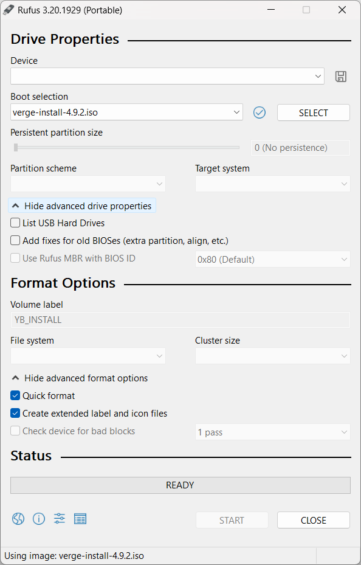

## Windows:
***

1.  Download the latest version of the VergeIO installation ISO.
 [_https://updates.verge.io/download_](https://updates.verge.io/download)

2.  Insert a USB disk into the computer. 
!!! warning "This USB drive **will be overwritten**"

3.  Launch Rufus. [_https://rufus.ie/en/_](https://rufus.ie/en/)

1. Once Rufus is loaded, select the **USB device** to write to for the area labeled **Device**.
2. Click the **Select button** to select the VergeIO installation ISO image.
3. Click **Start**
4. Rufus will prompt you to choose an ISO Mode. Choose DD. Rufus will begin building the bootable USB device.
 

 

## Apple MacOS:
***

1.  Download the latest version of the VergeIO installation ISO. [_https://updates.verge.io/download_](https://updates.verge.io/download)
> **NOTE:** This may not be the most recent version. Please talk to your account representative to make sure you have the latest version.
{.is-info}

2.  Insert a USB disk into the computer. 
!!! warning "This USB drive **will be overwritten**"

3.  Download and install the BalenaEtcher image flasher for the macOS.
    1.  [_https://www.balena.io/etcher/_](https://www.balena.io/etcher/)
4.  Startup the BalenaEtcher app.
5.  Click on Flash from file.

6.  Pick the VergeOS ISO file that you downloaded.
7.  Select your target USB disk, but NOT the hidden drives
8.  Click on Flash!

9.  This will build your bootable flash drive on your USB stick using the VergeOS ISO installer. This process usually takes a few minutes to complete and then you can “eject” your USB flash drive to boot and start the installation on your servers.

 

## Linux Mint:
***

1.  Download the latest version of the VergeIO installation ISO
    1.  [_https://updates.verge.io/download_](https://updates.verge.io/download)
!!! note "This may not be the most recent version. Please talk to your account representative to make sure you have the latest version."

2.  Insert a USB disk into the computer. 
!!! warning "This USB drive **will be overwritten**."

1.  Using Mint’s file browser, navigate to the location **of the downloaded ISO**
2.  **Right-click** on the ISO and choose ‘**Make bootable USB stick**’

3.  As USB Image Writer loads, select the **USB media to write the installation file to.**

4.  As a security measure, Linux will prompt you to supply an admin password
5.  Click **Authenticate** to begin writing the installation to USB
6.  Wait while the installation is written to USB.
7.  When finished this message will appear.

 
[Request Trial](https://www.verge.io/test-drive){ .md-button .md-button--primary }