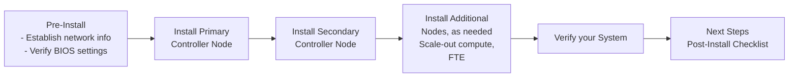

# Installation Guide

## Introduction

The VergeOS installation is a single [bootable ISO image](install-media.md) containing all packages needed for the complete system.

This document provides general instructions for installing a VergeOS system.
For production systems, use datacenter-quality hardware and follow our reference architectures located in the [Implementation Guide](/implementation-guide/intro).

### Installation Process

## Pre-Installation Steps

Before you proceed with the installation please make sure you've reviewed the following documents:
  
* [Pre-Install Checklist](/implementation-guide/pre-installation)
* [Bootable Media](/implementation-guide/install-media)
  
---

## Install the Primary Controller Node

!!! warning "VergeOS is installed as a complete operating system on each node. Selected drives are formatted and existing data on those drives will be lost."

1. Boot the first node with the install ISO. The full installer will load into memory with loading progress indicated on the screen. Loading times will vary depending on the medium used to install.
2. Select **Standard Install** (default).  This is the default selection; the installation will automatically continue with a standard install.  Non-standard install options should only be selected when you are working closely with VergeIO Support.

3. Select **Controller** (default selection). The first two nodes of the system will be controller nodes.
4. Select **Yes** to indicate this is a **New Install**.
5. Select **time zone and NTP server settings**.  

    !!! tip "Time zone selection is generally based on the geographical location of the servers, but can alternately be configured based on administration preference.  Windows VMs will, by default, inherit the system time zone; a registry change is required to configure a Windows VM to UTC time."

6. Select appropriate **date/time**.
    !!! warning "Correct date/time are very important for vSAN operation.  Be sure that during installation, date is set correctly and time is set reasonably close to the accurate time, to avoid potential problems."

7. Enter a **System Name**. This is also known as your Cloud name and will identify your system in: your dashboard, alerts/reports coming from this system, and site syncs. This name can be changed post-install, within System Settings.

8. Enter **admin user credentials**.  The password must be at least 8 characters. These credentials can be changed post-install, however it is important to have username/password available for initial login to the system.

9. Enter **admin email address**.  This address is used for admin account password resets and receiving subscription alerts/reports directed to the admin user.  An admin mail address must be entered during installation and is also configurable in the UI post-install.

### Configuring Physical Networks

**The following steps are used to define each of the physical networks for the node.**

10. A list of all detected NICs is displayed.
  **Select a NIC (or multiple NICs, for port-bonded)**, to configure the associated physical network.  
  
    !!! note "Port bonding (LAG) should not be used for Core Fabric networks as it will interfere with the built-in redundancy based on multiple physical Core Fabric networks."

11. **Specify Physical Network Settings:**

    !!! tip "**Keyboard Hints:** [Tab] does not move field-to-field, but rather between action items (Finish/Edit/Cancel).  [Enter] toggles edit mode. When edit mode is OFF, an entry field is highlighted in blue, and you can move between fields with the up/down arrow keys.  When edit mode is ON, you can modify the field with the cursor."

* **Name** - This name will be used in the User interface to identify this network. Enter a name that will help to identify where the NIC(s) is plugged in, such as the switch hostname or organizational naming convention. This can be changed after installation.

* **Description** (optional) - Text can be entered here to provide any additional administrative information.

* **MTU** - The MTU setting must always be a value supported by the physical switching hardware.  For Core Fabric networks, the MTU should be large enough to support the levels of tenancy that will be provided; the default is 9192.

    !!! tip "When configuring an external network MTU: The Internet standard MTU for most Ethernet networks is 1500.  The standard for VPN connections is 1400 bytes (will vary depending on the service)."

* **Core-Network:** -If a core network will reside here, the value needs to be "yes".  Otherwise, change the value to blank or "no".

* **VLAN** - PVID port is always preferred (0 or blank for none), but a VLAN tag can be accommodated by entering the correct VLAN ID here.

12. **Repeat the above steps to configure all of your physical networks** until every NIC has been assigned.  If there is a NIC that is not plugged in, it should still be configured here during installation; it can be given a name such as "unplugged" or "unused".

    !!! note "You can select [Done] when you have finished configuring all of your physical networks."

13. Select a **physical external network that will provide UI/LAN/WAN access**.

14. Enter appropriate **VLAN ID for the External/UI network** Use PVID ports when possible (0 or blank), otherwise enter the appropriate VLAN ID.  

15. Specify a **network address** for the external/UI network:
    * **Static:** Enter the address in CIDR format (for example 10.0.0.2/24).  You will also be prompted for the default gateway and DNS server address(es).

    **-OR-**

    * **DHCP:** An entry of blank or "dhcp" allows the network to receive an external DHCP address.  Using DHCP will limit the network to a single IP address; this is typically only appropriate for test/evaluation systems or storage-only systems. If DHCP is selected, you will also be prompted for the name/domain to be used by this DHCP client.

16. Select the type of license you will be using for this system. This is also configurable in the UI post-install.

17. Enter **license server settings** (username and password).  License server credentials are provided by your VergeOS sales or Implementation representative. These settings can be left blank during installation and added post-install within the VergeOS UI.  

    !!! note "Although license key credentials are not needed to complete the installation, they must be in place in order to run workloads or syncs on your system."

18. Configure **Encryption settings**. (optional, at-rest encryption).  

* If encryption is selected, you will be prompted for an **AES256 encryption key passphrase**.
Passphrase must be between 8 and 64 characters.

* Optionally, you can **write the generated encryption key to a USB drive/dedicated device**.  Before selecting "Yes" to this option you must make sure the USB drive/dedicated storage device is plugged in.  On the next screen, verify the intended device is selected before hitting < OK >.

    !!! warning "Encryption selection is not reversible post-install; changing from encrypted to unencrypted or vice-versa would require a system reinstall."

19. **Select drives that will be used in the vSAN**.  All detected drives are displayed and selected by default. **Deselect any drives that should be excluded.  Make sure to deselect any removable devices or any drives that will be used to store an optional encryption key.**
The system will display an automatically-selected tier for each drive.  Take notice of these tier assignments; they can be modified in a subsequent dialog, if needed.

    !!! warning "Selected drives display an asterisk; make sure any drives that you want to deselect do not have the asterisk on the far left before hitting < OK >. "

20. **Manually Set Drive Tier Assignments (optional)**:

If you verified all drive tiers were selected as desired (previous screen), simply press [Enter] to proceed.  Otherwise, select **< Yes >**
 and **[Enter]** to view all drives and optionally change any tier assignments.  When finished manually selecting tier assignments, select "Done" and [Enter].

21. Configure Linux **Swap** (optional):

There are multiple factors to consider in planning swap, including: availability of storage, system use, disk type, etc. Consult with the VergeIO implementation team for further information. Swap is configurable in the UI, post-install, for new and reformatted drives.

* Select storage **tier** to use for swap. 

    !!! note "Selecting Swap Tier"
        - Typically, tier 0 drives are not preferred; select the next fastest-drive tier, when possible.
        - Do not select HDD drives for swap unless the node only contains this type of storage.
    
* Enter the amount of swap to be established **per drive (in MB)**; e.g. if there are 8 drives in the selected tier, you can enter 2048 to give you 16,384MB (16GB) of swap.

    !!! warning
        - Generally, no more than 16GB of swap should be configured per node.  
        - Large amounts of swap can degrade performance.
         

22. Select **drives to format for boot**.  This prompt will only appear if any drives were not selected to be included in the vSAN.  Older hardware (e.g. legacy Chassis, BOSS card) may require you to specify drives to format for boot.  In most cases, you can press [Enter] to continue with the installation without selecting boot drives.

23. **UEFI partitions** - Some UEFI systems do not auto-detect EFI partitions.  If prompted to register UEFI boot options, it is recommended to select "yes".

When installation selections are finalized, the vSAN will be initialized and packages installed.  Each selected drive is formatted one by one (large drives may take several minutes to format) and added to the vSAN.

24. The install will indicate when it is complete.  **Remove the install media and hit [Enter] to reboot.**

### After Reboot

25. When the vSAN is successfully mounted and the system is started, the user menu will appear. Press **[Enter]** to select **User Interface** and enter admin login credentials.
The main dashboard for your new system will display.  Status indicators should all be green.  

---

## Install the Secondary Controller Node

!!! note "The primary controller node needs to be fully installed and booted before installing the secondary controller node."  

1. **Boot** the second node with the install ISO.  

2. Select **Standard Install** (default).  This is the default selection; the installation process will automatically continue with this selection.  Non-standard install options should only be selected when you are working closely with VergeIO Support.

3. Select **Controller** (default selection).

4. Select **No** to indicate this is NOT a new system. (You will be connecting to the system already created above.)  
!!! warning "If you do not select "No" here, the install program will create a new separate system rather than joining the installed primary node controller."

5. You will be prompted to enter the **admin (root) password for the system you are joining.** Enter the **admin credentials** created during the primary controller node install.  

6. Select **Yes** to attempt **automatic detection of network** configuration.  This is recommended as it will try to detect the existing networks and automatically configure the new node accordingly, avoiding manual network misconfigurations.  Network detection may take a few minutes.

7. Both core networks should be detected. Upon successful detection of each network, **verify** the information displayed and hit [Enter] to continue.

8. Select **Encryption settings**; these settings must match those entered during the primary controller installation.

9. Select **drives that will be used in the vSAN** and **(optionally) change Drive Tier assignments**; these selections should be made to coincide with the drive/tier configurations made on the primary controller node install.

10. The installation program will indicate when it has finished.  Remove the install media and hit [Enter] to reboot.

### After Reboot (secondary controller)

11. Wait for the system to load and show the user menu.  Select **User Interface**, and enter admin login credentials.

12. Verify green status indicators before proceeding with a subsequent node install.  

## Install Additional Nodes (as needed)

Additional nodes can be installed as needed. These nodes can be:

* [**Scale-out**](/implementation-guide/scale-out-nodes)
* [**Compute-only**](/implementation-guide/compute-nodes)
* [**Storage-only**](/implementation-guide/storage-nodes)

## Post-Installation Steps

When node installations are complete, see [**Post Installation**](/implementation-guide/post-installation) for next steps.

---

## Troubleshooting & Support

If issues arise during installation:

* Press `Esc` to cancel and get a command prompt
* Type `yb-install` to resume or `yb-install --restart` to start over.
  