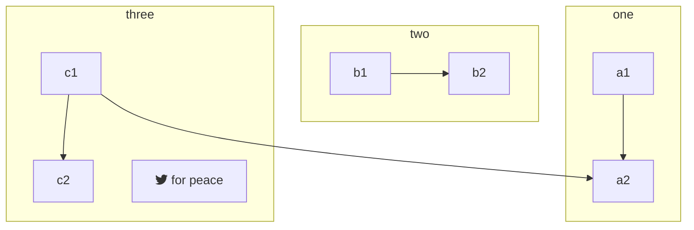

<!--- Delete between this line and the next commented out line

```
<script>
    var removeTocCard = false;    // Enable or disable Table of Contents Card
    var sideColumnPosition     = 'right';
</script>
```
Delete commented out lines when done --->

<br>

> Need more Help? Email <a href="mailto:support@verge.io?subject=Support Inquiry" target="_blank" rel="noopener noreferrer">support@verge.io</a> or call us at <a href="tel:+855-855-8300">(855) 855-8300</a>
{.is-info}