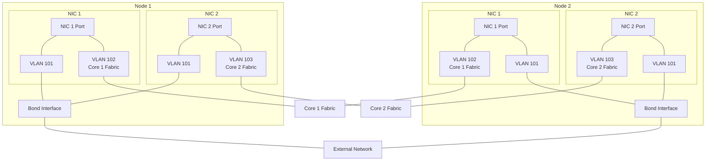

# Change External Network to bonded with tagged VLAN

## Overview

!!! info "Key Points"
    - This procedure creates an active-backup bond across vlanned physical networks.
    - It is recommended for bare-metal installations limited to 2 NICs per node.
    - System downtime is not required to make this change.

This guide outlines the process to create a bond across vlanned physical networks for an external network.  The outlined method provides optimal redundancy for bare-metal installations that are limited to two NICs per node, allowing each physical network to provide an independent core fabric network and external access vlan tag, bonded across NICs.

## Prerequisites

!!! warning
    - This process should be performed with local server access because external network changes can affect remote UI access. This will also allow you to test the bond configuration by removing one of the network cables to verify expected bond failover.
    - Before making any significant system changes confirm you have the name/password for the "admin" user(user ID #1) in case command-line operations become needed.

## Steps

1. Navigate to the **external network dashboard** (Main Dashboard > Networks > Externals > double-click external network) and click **Edit** on the left menu.  
2. Change **Layer 2 Type** to ***vLAN*** and enter appropriate **Layer 2 ID** (vLAN number).
   !!! warning "Be certain NOT to enter a VLAN ID that is used by one of the core networks."
3. **Select** the checkbox option for **both physical networks**.
4. Click **Submit** to save the change.
  
## Post Configuration

1. Verify inbound/outbound traffic through the external
   1. 
  
2. Test external bond failover
   1. 

## Troubleshooting

!!! warning "Common Issues"
    - Problem: Loss of remote access
      - Solution:
        - Check correct vlan selected in external network config
        - Verify physical switches/external networking are configured to accomodate the vlan tag.

## Additional Resources

- [Network Design Models](/implementation-guide/network-design)

## Feedback

!!! question "Need Help?"
    If you need further assistance or have any questions about this article, please don't hesitate to reach out to our support team.

---

!!! note "Document Information"
    - Last Updated: [2024-11-26]
    - vergeOS Version: [4.13.1]
