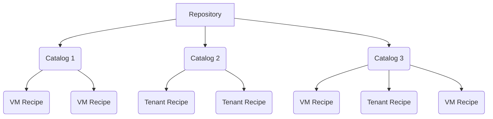

# Recipe Organization

This page discusses repositories and catalogs, the containers used to organize tenant and VM recipes.  Instructions for sharing recipes are also included.  

## Repositories

### What is a Repository?

A repository is a site collection of recipes.  A repository can contain multiple catalogs of recipes.  

* **Local Repositories**: catalogs/recipes are created and maintained on the local system.

* **Remote Repositories**: catalogs of recipes, created and maintained on a separate VergeOS system, are retrieved for use on the local system. Sharing via remote repositories eliminates the need to administer the same recipes in multiple locations.

### Auto-Installed Repositories

***"MarketPlace"***  
Host-level systems are installed with ***Marketplace***, a special, remote, VergeOS-provided repository which includes a wide variety of Linux and Windows VM recipes ready for use. By default, the recipe catalogs contained in Marketplace are set to scope="global", which allows them to also be used by all the system's tenants as well.  

***"Local"***  
By default, your new VergeOS system will have an empty local repository named ***"Local"*** that is ready in which to create new catalogs/recipes.  

## Catalogs

### What is a Catalog?

Catalogs allow you to group your related recipes within a repository.  For example, one catalog may contain various Windows VM recipes, while another contains all the Linux-based VM recipes. Administrators can use catalogs to organize in whatever way makes sense for their organization. Catalogs be configured to be private or shared with your tenants or other external VergeOS systems.

### Create a New Catalog

1. Navigate to **Repositories** > **List** from the top menu, and **double-click the repository** where the catalog should reside.  This will need to be a local Repository; remote repositories are maintained at the remote system. (The default *"Local"* repository created in every new VergeOS system/tenant would typically be used.)
2. Click **Catalogs** on the left menu and then click **New**.
3. Provide a descriptive **Name** for the catalog.  Optionally, additional administrative information can be added to the description field.
4. Select a **Publishing Scope** to define the accessibility of the catalog:  

    * **Private** - only available to this particular VergeOS Cloud.
    * **None** - disabled, not available anywhere
    * **Tenant** - available to this particular Cloud and its own tenants
    * **Global** - available to this particular system and its tenants and external VergeOS systems(user credentials necessary)

## Sharing Recipes

### Share Catalogs with Your Tenants

1. Set the Catalog's **Publishing Scope =** ***'Tenants'*** (or 'Global', which will also allow access to external systems using proper credentials).
2. **Switch to the tenant's UI** for the rest of the steps.
3. Navigate to the ***Service Provider*** repository and click **Refresh**.
4. **Double-click the desired catalog** to see the recipes contained within.
5. Click **VM Recipes** -or- **Tenant Recipes** to see the respective listing.
6. **Select the desired recipe(s).**
7. Click **Download/Update** on the left menu to download into the tenant environment.
When a recipe displays a status of *Online* it is available for use.

!!! note "When a recipe is updated at the source it will show a message in the tenant UI indicating that an update is available for download."

### Share Catalogs to a Remote System

**Give Access to a Catalog (sharing side)**  

1. Create a **new User, with Type: API** to be used for authentication by the remote system/tenant.  Note the username and password.
2. Navigate to the **Catalog dashboard** (Repositories > Catalogs > double-click the intended catalog).
3. Click **Permissions** on the left menu.
4. Click **Add User** on the left menu.
5. Set the following fields for the new permission:
    * **Grantee**: the API user created above
    * **Permissions:** List and Read
    * **Type:** Catalogs
    * **Name:** name of the catalog that is being shared
6. Click **Submit** to save the new permission.

**Connect to a Remote Catalog (receiving side):**  

1. Navigate to **Repositories** > **+ New Repository**.
2. Complete **fields** for the new repository:

   * **Name**: a descriptive name that helps distinguish this repository.
   * **Description**: (optional) additional information entered here can be helpful for future administration.
   * **Type**: Remote
   * **URL**: the IP or DNS entry of the hosting system, e.g. `https://VergeOS.example.com`
   * **User/Password**: use credentials of API user created on the host system (above).
   * **Allow Insecure Certificates**: this option is provided to accommodate a self-signed certificate within the same private network; using a public URL without secure SSL can be risky and is not recommended.  
   * **Max Fastest Tier**: allows you to specify the best tier to use for recipe drives (e.g. recipe has a drive on tier 2 on the remote system, if this setting is set to tier 4, the drive will be moved to tier 4 when downloaded.)

3. Click **Submit** to save the new repository.
4. Once created, navigate to the **repository dashboard** and click **Refresh** to reload its catalogs.  Recipes can be downloaded locally and then will be available to use when creating a new VM/tenant.

!!! note "When the remote system creates the repository that connects to your system, they will have access to any of your catalogs for which the given API user has permissions."

!!! note "When a recipe is updated at the source it will show a message in the remote system's UI indicating that an update is available for download."
