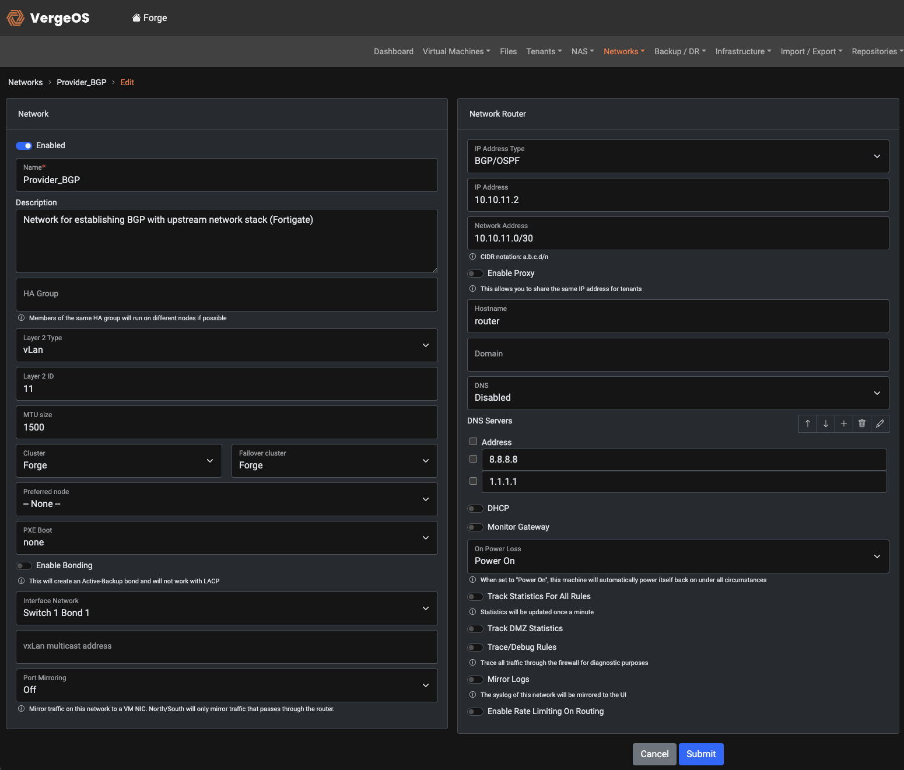
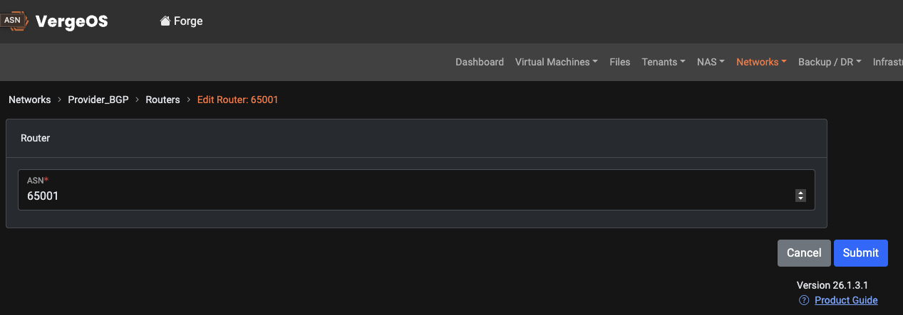
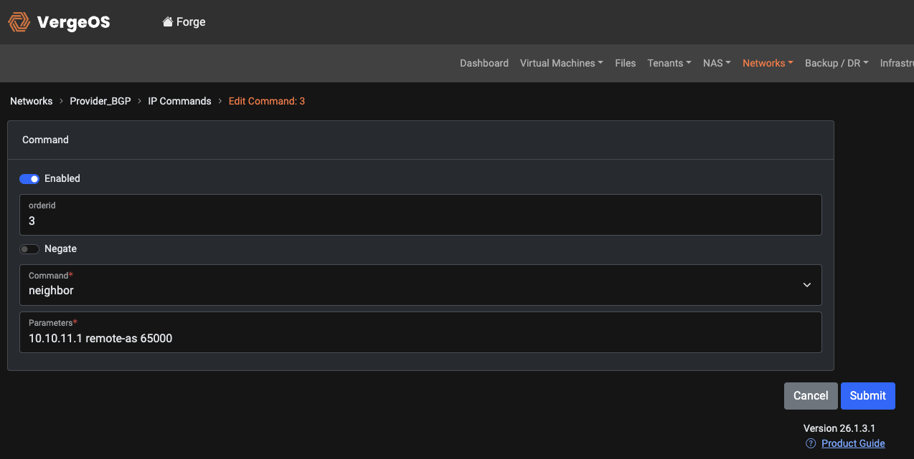
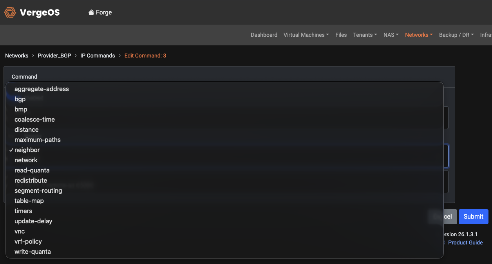
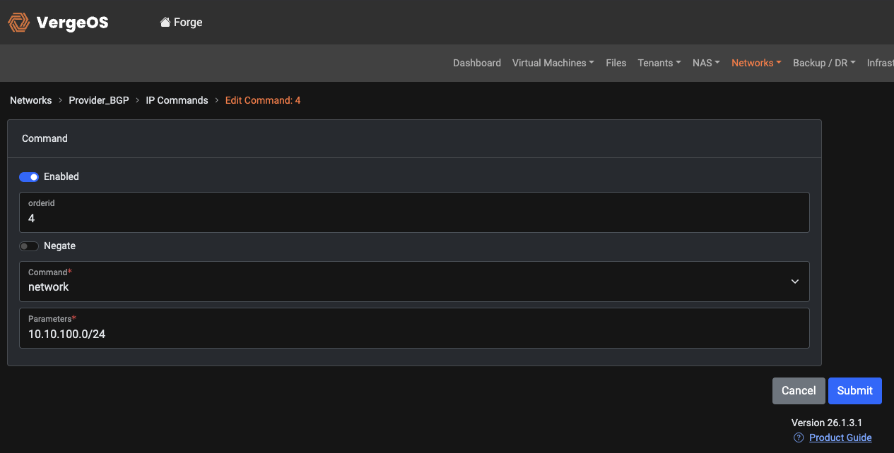
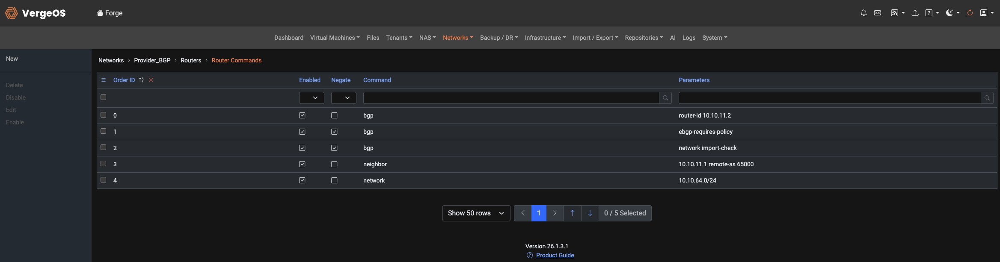
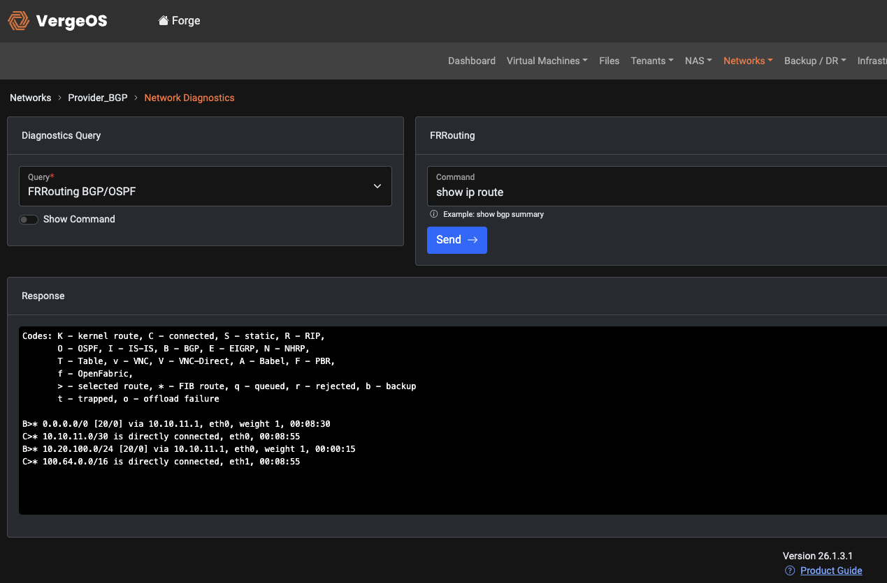
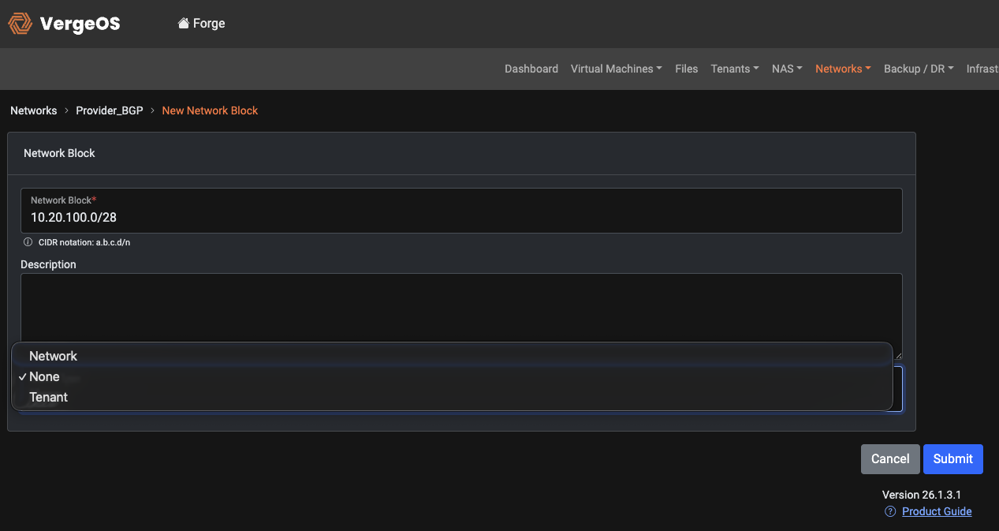
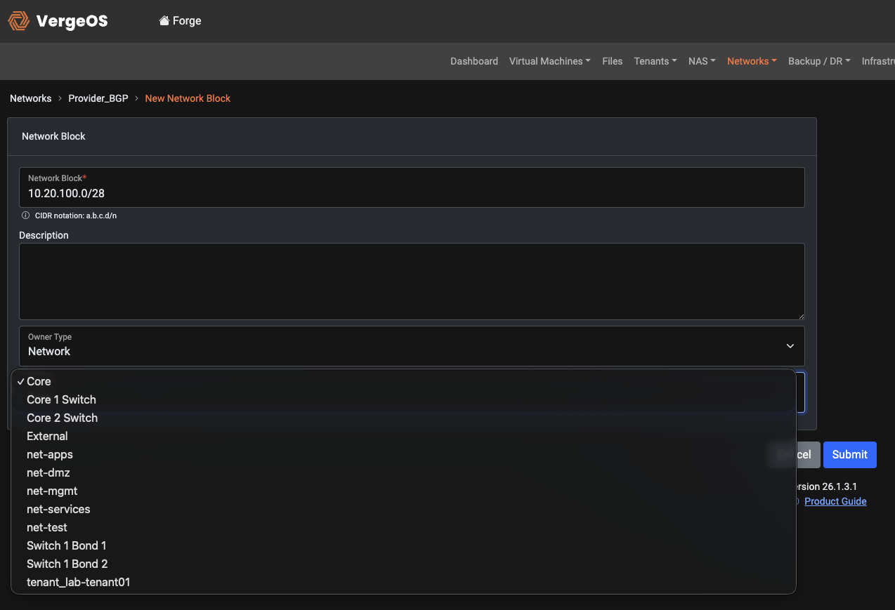
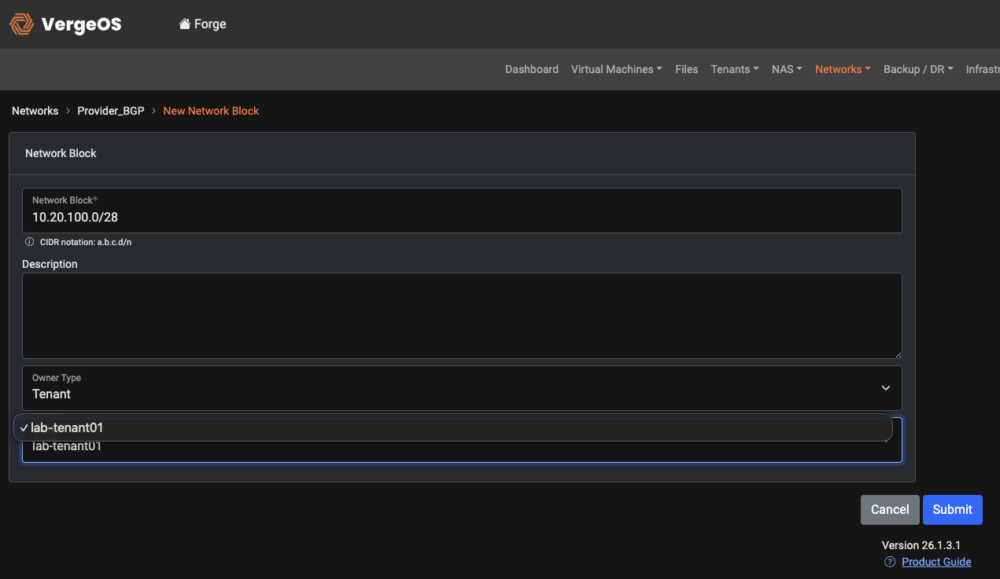

# Configuring BGP in VergeOS

## Overview

This article covers establishing a BGP peering session between VergeOS and an external router or firewall, advertising prefixes in both directions, and using **Network Blocks** to delegate routed address space to an internal network or tenant.

VergeOS runs **FRRouting (FRR)** under the hood. A working BGP setup is made of four pieces:

1. An **External network** that carries the peering (holds the transit IP and VLAN).
2. A **Router** that defines your local ASN.
3. **Router Commands** — the FRR statements (`neighbor`, `network`, etc.).
4. A **network restart** to load the configuration into FRR.

Because the external peer could be any vendor (FortiGate, Cisco, Juniper, MikroTik, etc.), this guide keeps the far side generic and focuses on the VergeOS configuration.

!!! note
    Tested on VergeOS 26.1.3.1 / FRR 8.4.4. Menu paths may differ slightly on other releases.

---

## Prerequisites

- A physical or bonded interface in VergeOS that can host an External network (e.g., `Switch 1 Bond 1`).
- A small point-to-point transit subnet between VergeOS and the peer — a `/30` is typical.
- The peer device's **transit IP** and **AS number**.
- The **AS number** you'll use for VergeOS. For private/internal use, pick from the private range **64512–65534**.
- Layer 2 details if the link is tagged (VLAN ID).

---

## Reference Topology

These values are used throughout the guide. Substitute your own.

| Item | Value |
|---|---|
| Transit subnet | `10.10.11.0/30` |
| VergeOS transit IP | `10.10.11.2` |
| Peer transit IP | `10.10.11.1` |
| VLAN (Layer 2 ID) | `11` |
| VergeOS ASN | `65001` |
| Peer ASN | `65000` (this makes the session **eBGP**) |
| Prefix the peer advertises **into** VergeOS | `10.20.100.0/24` |
| Prefix VergeOS advertises **out** to the peer | `10.10.64.0/24` |
| Block delegated to a tenant/network inside VergeOS | `10.20.100.0/28` → `net-test` |

---

## The External Device (Generic)

Whatever the vendor, the far side needs the same four things. No route maps or prefix lists are required for a basic bring-up.

1. **An interface on the transit subnet** with the peer IP (`10.10.11.1/30`), tagged for the VLAN (`11`) if applicable, and configured to allow ping during testing.
2. **A BGP process** with the device's local AS (`65000`) and a unique router-id.
3. **A neighbor** pointing at the VergeOS transit IP (`10.10.11.2`) with VergeOS's AS (`65001`).
4. **Network advertisements** for any prefixes you want VergeOS to learn (`10.20.100.0/24`).

Keep both sides' ASNs and neighbor IPs consistent — each device's `remote-as` must match the *other* device's local AS, or the session will open and then drop on a mismatch.

---

## Part 1 — Get BGP Connected

### Step 1 — Create the External network

Navigate to **Networks → New External** and configure:

| Field | Value |
|---|---|
| Name | `Provider_BGP` |
| Layer 2 Type | `vLan` |
| Layer 2 ID | `11` |
| MTU size | `1500` |
| Interface Network | your physical/bond interface (e.g., `Switch 1 Bond 1`) |
| IP Address Type | **BGP/OSPF** |
| IP Address | `10.10.11.2` |
| Network Address | `10.10.11.0/30` |

Leave DHCP off. Click **Submit**.



### Step 2 — Verify Layer 2 / Layer 3 first

Before touching BGP, confirm the transit link works:

- Ping the **peer** (`10.10.11.1`) from VergeOS.
- Ping the **VergeOS** IP (`10.10.11.2`) from the peer.

If ping fails, stop and fix VLAN tagging, switch ports, or IP/mask before continuing. Ping working both ways proves the problem is *not* cabling, VLAN, or addressing — which makes any later BGP issue much faster to isolate.

### Step 3 — Create the Router (your ASN)

Open the `Provider_BGP` network → **Routers → New**. The Router has a single field:

| Field | Value |
|---|---|
| ASN | `65001` |

Click **Submit**.



### Step 4 — Add the Router Commands

Open the ASN (`65001`) → **Router Commands**. VergeOS **pre-populates three baseline commands** when the Router is created:

| Order | Command | Parameters | Negate | Resulting FRR line |
|---|---|---|---|---|
| 0 | `bgp` | `router-id 10.10.11.2` | off | `bgp router-id 10.10.11.2` |
| 1 | `bgp` | `ebgp-requires-policy` | **on** | `no bgp ebgp-requires-policy` |
| 2 | `bgp` | `network import-check` | **on** | `no bgp network import-check` |

What these do:

- **`router-id`** — the BGP identifier for this router. Set it to the transit IP.
- **`no bgp ebgp-requires-policy`** — modern FRR refuses to exchange routes over eBGP until an inbound/outbound policy exists. Negating it allows the basic, policy-free session to pass routes. (See Part 3 if you'd rather enforce policy in production.)
- **`no bgp network import-check`** — lets you advertise a prefix even if it isn't currently in the routing table.

Now add the two commands that actually bring up the session and advertise your prefix. Use **New** for each:

**Neighbor (the peer):**

| Field | Value |
|---|---|
| Enabled | on |
| Negate | off |
| Command | `neighbor` |
| Parameters | `10.10.11.1 remote-as 65000` |





**Network advertisement (one row per prefix you want VergeOS to advertise out):**

| Field | Value |
|---|---|
| Enabled | on |
| Negate | off |
| Command | `network` |
| Parameters | `10.10.64.0/24` |





**Notes:**

- **Command order does not matter** for this set — every row renders inside the same `router bgp 65001` block and FRR assembles it regardless of Order ID. The only ordering rule in FRR is that a `neighbor … remote-as` line must precede any other line that references that neighbor (route-maps, passwords, timers). With no dependent neighbor sub-commands, this never bites you.
- Use the US spelling **`neighbor`** — FRR rejects `neighbour`.
- **eBGP vs iBGP:** if the peer's ASN differs from yours (as here, 65000 vs 65001) the session is eBGP. If it's the *same* ASN on both sides, it's iBGP — use `remote-as 65001` and the `no bgp ebgp-requires-policy` line is unnecessary.

### Step 5 — Restart the network

Routing changes are **not live until the network restarts**. VergeOS flags this with a **Needs Restart** indicator. Open the `Provider_BGP` network and click **Restart**.

!!! tip
    This is the single most common "I configured everything and nothing happened" cause. Always restart after editing Router Commands.

### Step 6 — Verify the session

Open the `Provider_BGP` network → **Network Diagnostics**:

- **Query:** `FRRouting BGP/OSPF`
- **Command:** `show ip bgp summary` *(`show bgp summary` also works)*
- Click **Send**.

In the neighbor row for `10.10.11.1`:

- A **number or uptime** in the State/PfxRcd column = the session is **Established** and exchanging routes.
- **`Active`, `Connect`, or `Idle`** = the session is **not** up (see Troubleshooting).

Other useful commands in the same box:

| Command | Shows |
|---|---|
| `show ip bgp summary` | Neighbor states and prefix counts |
| `show ip bgp neighbors 10.10.11.1` | Detailed per-neighbor status and last reset reason |
| `show ip route bgp` | Routes learned via BGP |
| `show running-config` | The full FRR config VergeOS generated — confirms your commands landed |

**What a healthy session looks like.** In `show ip bgp summary`, the neighbor row shows an uptime and a prefix count rather than a state word:

```
Neighbor    V    AS    MsgRcvd  MsgSent  ...  Up/Down    State/PfxRcd  PfxSnt
10.10.11.1   4    65000      49       44   ...  00:40:36          1        2
```

And `show ip route bgp` shows the peer's advertised prefix installed, flagged `B>*` (BGP, best, FIB-installed):

```
B>* 10.20.100.0/24 [20/0] via 10.10.11.1, eth0, weight 1, 00:41:20
```



At this point you have a working BGP session.

### iBGP variation (same ASN on both sides)

The guide above builds **eBGP** — VergeOS (AS 65001) peering with a device in a *different* AS (65000). If your peer is in the **same** AS as VergeOS, you're running **iBGP** instead, and three things change:

- **Matching `remote-as`.** The neighbor command points at the peer with *your own* ASN. If VergeOS is AS 65001 and the peer is also 65001:

  | Command | Parameters |
  |---|---|
  | `neighbor` | `10.10.11.1 remote-as 65001` |

- **The `no bgp ebgp-requires-policy` line is irrelevant.** That guard only applies to eBGP, so on a pure-iBGP router it has no effect. It's harmless to leave in place (the auto-generated baseline includes it), so no action is needed.
- **iBGP doesn't re-advertise learned routes by default.** A route learned from one iBGP peer is *not* passed on to other iBGP peers — this is BGP's loop-prevention rule, not a misconfiguration. In a multi-router internal design this means you need a full mesh of iBGP sessions, or a route reflector. For a single VergeOS-to-peer link it doesn't matter; for anything larger, plan the topology accordingly.

Everything else — the External network, the Router/ASN, the `router-id` and `network` commands, the restart, and the verification steps — is identical.

---

## Part 2 — Delegating Routed Address Space with Network Blocks

BGP carries *reachability* for a block of addresses to and from the peer. A **Network Block** is what makes that routed space usable **inside** VergeOS by assigning ownership of it (or a slice of it) to an internal network or a tenant. On save, VergeOS automatically creates the internal routes that direct traffic for those addresses to the owner.

**Typical provider/tenant pattern:** the upstream peer routes a block (e.g., `10.20.100.0/24`) down to VergeOS over BGP. VergeOS then carves that block into smaller pieces (`/28`s, `/25`s, etc.) and assigns each piece to a tenant or internal network, so workloads can use those addresses **directly — without NAT or double-NAT** on outbound traffic.

### Create a Network Block

Open the External (BGP) network → **Network Blocks → New**:

| Field | Value |
|---|---|
| Network Block | `10.20.100.0/28` (CIDR) |
| Description | optional |
| Owner Type | `None`, `Network`, or `Tenant` |
| Owner | (appears after choosing Network or Tenant) |

- **Owner Type → Network:** select an internal VergeOS network (e.g., `net-test`). Use this for non-tenantized environments.
- **Owner Type → Tenant:** a second **Owner** dropdown appears listing tenants. Use this to hand public/routed space straight to a tenant.
- **Owner Type → None:** the block is reserved/owned by nothing yet.







### Worked example

1. The peer advertises `10.20.100.0/24` into VergeOS over the BGP session built in Part 1.
2. In VergeOS, create a Network Block `10.20.100.0/28` owned by `net-test` (or assign `/25`s to individual tenants).
3. Hosts in `net-test` (or the tenant) can now use those addresses directly.

!!! tip "Confirming the covering route arrived"
    Run `show ip route bgp` in Network Diagnostics. The peer's advertised prefix should appear flagged `B>*` (e.g., `B>* 10.20.100.0/24 [20/0] via 10.10.11.1`). If a delegated block isn't reachable end to end, check this first: no `B>*` route means upstream isn't actually sending the covering prefix toward the VergeOS transit IP. If the route is present but traffic still doesn't flow, verify the block has an Owner set and that firewall rules permit the traffic.

---

## Part 3 — Advanced Options

All advanced features are added the same way as the basic config: as **Router Commands** in FRR syntax, followed by a **network restart**. Each `neighbor`-specific line must come *after* that neighbor's `remote-as` line.

### Enforcing policy (instead of disabling it)

The basic guide negates `ebgp-requires-policy` so routes flow without filters. In production you may prefer to leave it enforced and define explicit policy. Remove the negate on the `ebgp-requires-policy` command and attach inbound/outbound route-maps to the neighbor (below).

### Prefix lists

Filter which prefixes you accept or advertise. Define the list, then reference it on the neighbor.

| Command | Parameters (example) |
|---|---|
| `ip prefix-list` | `ALLOW-IN seq 10 permit 10.20.100.0/24` |
| `neighbor` | `10.10.11.1 prefix-list ALLOW-IN in` |
| `neighbor` | `10.10.11.1 prefix-list ALLOW-OUT out` |

### Route maps

Apply policy — set local-preference, MED, communities, or match prefixes — in a direction.

| Command | Parameters (example) |
|---|---|
| `route-map` | `SET-LP permit 10` |
| (within that map) | `set local-preference 200` |
| `neighbor` | `10.10.11.1 route-map SET-LP in` |

### BGP timers

Tighten failure detection. The FRR form is `timers bgp <keepalive> <hold>`. For example, a 5-second keepalive and 15-second hold:

| Command | Parameters |
|---|---|
| `timers` | `bgp 5 15` |

After applying, confirm via Network Diagnostics → `show running-config`.

### Multipath / maximum-paths

Allow multiple equal-cost BGP paths to be installed:

| Command | Parameters |
|---|---|
| `maximum-paths` | `4` |

!!! note
    For full FRR command syntax, refer to the FRRouting BGP documentation. The Network Diagnostics console runs against the live FRR instance, so anything valid in FRR can be verified there with `show running-config`.

---

## Troubleshooting

| Symptom | Likely cause | Check / fix |
|---|---|---|
| Ping works, BGP stuck in `Active`/`Connect` | No `neighbor` line on one side, AS mismatch, TCP 179 blocked, or the network wasn't restarted | Confirm both sides have a matching neighbor + remote-as; restart the VergeOS network; verify nothing blocks TCP 179 between the two transit IPs |
| Session reaches `Established` then drops | AS number mismatch (each side disagrees on the other's AS) | Compare local AS and the `remote-as` each side expects |
| Established but **no routes** exchanged | Missing `network` statements, or eBGP policy holding routes | Add `network <prefix>` rows; ensure `no bgp ebgp-requires-policy` is set (or define policy) |
| Advertised prefix never appears | Prefix not in the routing table | Either originate the route or keep `no bgp network import-check` set |
| Config edits seem ignored | Network not restarted | Restart the network; recheck `show running-config` |
| Delegated Network Block unreachable | Covering route not present, or owner not set | `show ip route bgp`; confirm the block has an Owner |

!!! tip "Fastest diagnosis path"
    Confirm ping both ways (isolates L2/L3), then `show running-config` in Network Diagnostics to confirm VergeOS built the config you expect, then `show ip bgp summary` for live state. On the peer side, a packet capture on TCP 179 will show whether the issue is connectivity (no handshake) or a BGP parameter rejection (handshake then reset).

---

## Quick Reference

**Minimum VergeOS config for a working eBGP session:**

```
External network:  IP Address Type = BGP/OSPF, IP 10.10.11.2, Network 10.10.11.0/30, VLAN 11
Router:            ASN 65001
Router Commands:
  bgp       router-id 10.10.11.2
  bgp       ebgp-requires-policy        (Negate)
  bgp       network import-check        (Negate)
  neighbor  10.10.11.1 remote-as 65000
  network   10.10.64.0/24
→ Restart the network
→ Verify: Network Diagnostics → FRRouting BGP/OSPF → show ip bgp summary
```

**Resulting FRR running-config:**

```
router bgp 65001
 bgp router-id 10.10.11.2
 no bgp ebgp-requires-policy
 no bgp network import-check
 neighbor 10.10.11.1 remote-as 65000
 !
 address-family ipv4 unicast
  network 10.10.64.0/24
 exit-address-family
exit
```
