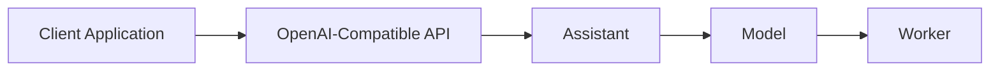

# Private AI Overview

VergeOS Private AI enables you to deploy and run large language models (LLMs) locally within your VergeOS environment. Models run entirely on your infrastructure with no external API calls or data transmission.

## Architecture

Private AI consists of five core components:

### Models

Models are the LLM files that provide AI capabilities. VergeOS supports:

- **Curated models**: Pre-configured models available for one-click installation (Llama, Gemma, Phi, Qwen, and others)
- **Custom models**: Any GGUF-format model from Hugging Face or other sources

Models define resource requirements (CPU cores, RAM, GPU allocation) and inference parameters (context size, parallel requests).

### Assistants

Assistants are configured instances that define how users and applications interact with a model. Each assistant specifies:

- Which model to use
- System prompt (behavioral instructions)
- Temperature and other generation parameters
- Context scoring for RAG scenarios
- Workspace files for document context

Multiple assistants can use the same underlying model with different configurations.

### Workers

Workers are the inference engines that run models. The system manages two types:

- **AI-Helper Worker**: Handles API requests and routing (starts automatically)
- **Model Workers**: Execute inference for each running model (scale automatically based on Min/Max Workers settings)

### Chat Sessions

Chat sessions maintain conversation history and context. Sessions can be:

- Created through the VergeOS UI for interactive testing
- Managed programmatically via the API for application integration

### OpenAI-Compatible API

The API provides standard OpenAI endpoints at `https://<your-vergeos-url>/v1`, enabling integration with:

- Any OpenAI client library (Python, JavaScript, Go, etc.)
- IDEs and development tools
- Existing applications built for OpenAI/Ollama

See [OpenAI-Compatible API](open-ai-router.md) for endpoint documentation.

## Prerequisites

- VergeOS 26.0 or later
- Sufficient RAM for model files (varies by model, typically 5-50GB)
- Storage for model downloads

### GPU Support

GPU acceleration is recommended for production workloads. VergeOS supports GPUs from any vendor (NVIDIA, AMD, Intel) through Resource Groups. Models can also run on CPU-only systems, though inference will be slower.

## Quick Start

1. Navigate to **AI → Models**
2. Click **Click to Install** on a curated model, or click **New Model** for custom models
3. Configure resource allocation (cores, RAM, GPU)
4. An assistant is created automatically with the new model
5. Test via **AI → Assistants → [Your Assistant] → Chat**

For detailed setup instructions, see the [Configuration Guide](configuration.md).

## Related Documentation

- [Configuration](configuration.md) - Model and assistant setup
- [OpenAI-Compatible API](open-ai-router.md) - API endpoints and integration
- [Chat Sessions](chat-sessions.md) - Interactive UI usage
